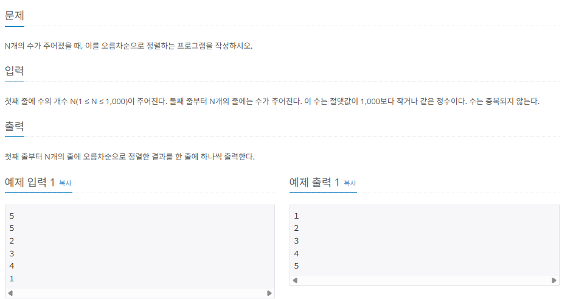

## 시간 복잡도 활용하기

### 알고리즘 선택의 기준으로 사용하기

우리가 이 책에서 정렬 부분의 학습을 완료했고, 버블 정렬과 병합 정렬의 시간 복잡도를 각각 $O(n^2)$, O(nlogn)이라고 알고 있다고 가정하고 다음 문제를 예로 들어 설명하겠습니다.

## $[수$ $정렬하기]$ 백준 온라인 저지 2750번



시간제한이 2초이므로 이 조건을 만족하려면 2억 번 이하의 연산 횟수로 문제를 해결해야 합니다. 따라서 문제에서 주어진 시간 제한과 데이터 크기를 바탕으로 어떤 정렬 알고리즘을 사용해야 할 것인지를 판단할 수 있습니다.

### 연산 횟수 계산방법

연산 횟수 = 알고리즘 시간 복잡도 n값에 데이터의 최대 크기를 대입하여 도출

### 알고리즘 적합성 평가

1. 버블 정렬 = $(1,000,000)^2 = 1,000,000,000,000 > 200,000,000$ = 부적합 알고리즘
2. 병합 정렬 = $1,000,000log_2(1,000,000) = 약 20,000,000 > 200,000,000$ = 적합 알고리즘

문제에서 주어진 시간 제한이 2초이므로 연산 횟수 2억번 안에 원하는 답을 구해야 합니다. 버블 정렬은 약 1조번의 연산횟수가 필요하므로 이 문제를 풀기에 적합한 알고리즘이 아니라고 판단할 수 있습니다. 병합 정렬은 약 2,000만 법의 연산 횟수로 답을 구할 수 있으므로 문제를 풀기에 적합한 알고리즘이라고 판단할 수 있습니다.

이와 같이 시간 복잡도 분석으로 문제에서 사용할 수 있는 알고리즘을 선택할 수 있고, 이 범위를 바탕으로 문제의 실마리를 찾을 수 있습니다. 즉, 데이터의 크기(N)를 단서로 사용해야 하는 알고리즘을 추측해 볼 수 있습니다.

## 시간 복잡도를 바탕으로 코드 로직 개선하기

시간 복잡도는 작성한 코드의 비효율적인 로직을 개선하는 바탕으로도 사용할 수 있습니다. 이 부분을 활용하려면 가장 먼저 코드의 시간 복잡도를 도출할 수 있어야 합니다. 시간 복잡도를 도출하려면 다음 2가지 기준을 고려해야 합니다.

### 시간 복잡도 도출 기준

1. 상수는 시간 복잡도 계산에서 제외한다.
2. 가장 많이 중첩된 반복문의 수행 횟수가 시간 복잡도의 기준이 된다.

코드를 예로 들어 설명해보겠습니다.

#### 예제 1: 연산 횟수 = N

```c
#include <iostream>
#include <cstdlib>

using namespace std;

int main(int argc, char *argv[]) {

    int N = 1000;
    int cnt = 1;

    for (int i = 0; i < N; i++) {
        cout << "연산 횟수 : " << cnt++ << "\n";
    }

    return EXIT_SUCCESS;
}
```

#### 예제 2: 연산 횟수 = 3N

```c
#include <iostream>
#include <cstdlib>

using namespace std;

int main(int argc, char *argv[]) {
    int N = 1000;
    int cnt = 1;

    for (int i = 0; i < N; i++) {
        cout << "연산 횟수 : " << cnt++ << "\n";
    }
    for (int i = 0; i < N; i++) {
        cout << "연산 횟수 : " << cnt++ << "\n";
    }
    for (int i = 0; i < N; i++) {
        cout << "연산 횟수 : " << cnt++ << "\n";
    }

    return EXIT_SUCCESS;
}
```

두 예제 코드의 연산 횟수는 3배 차이가 납니다. 언뜻 생각하면 큰 차이인것 같지만 코딩 테스트에서는 일반적으로 상수를 무시하므로 두 코드 모두 시간 복잡도는 O(n)으로 같습니다.

다음 예제 코드를 확인해 보겠습니다.

#### 예제 3: 연산횟수 = $N^2$

```c
#include <iostream>
#include <cstdlib>

using namespace std;

int main(int argc, char *argv[]) {

    int N = 1000;
    int cnt = 1;

    for (int i = 0; i < N; i++) {
        for (int j = 0; j < N; j++) {
            cout << "연산 횟수 : " << cnt++ << "\n";
        }
    }

    return EXIT_SUCCESS;
}
```

시간 복잡도는 가장 많이 중첩된 반복문을 기준으로 도출하므로 이 코드에서는 이중 for문이 전체 코드의 시간 복잡도 기준이 됩니다. 만약 일반 for 문이 10개 더 있다 하더라도 도출 기준에 따라 시간 복잡도는 변화 없이 $N^2$로 유지됩니다.

이와 같이 자신이 작성한 코드의 시간 복잡도를 도출할 수 있다면 실제 코딩 테스트에서 시간초과가 발생했을 때 이 원리를 바탕으로 문제가 되는 코드 부분을 도출할 수 있고, 이 부분을 연산에 더욱 효율적인 구조로 수정하는 작업으로 문제를 해결할 수 있습니다.
