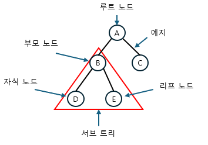
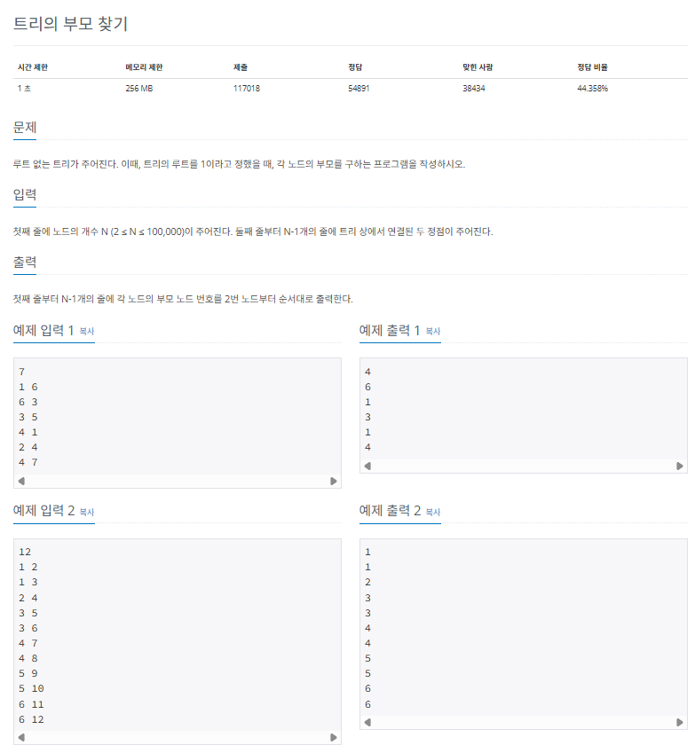
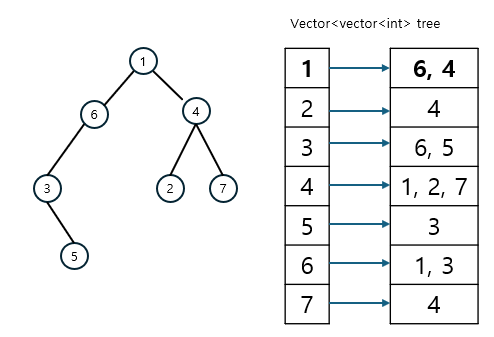
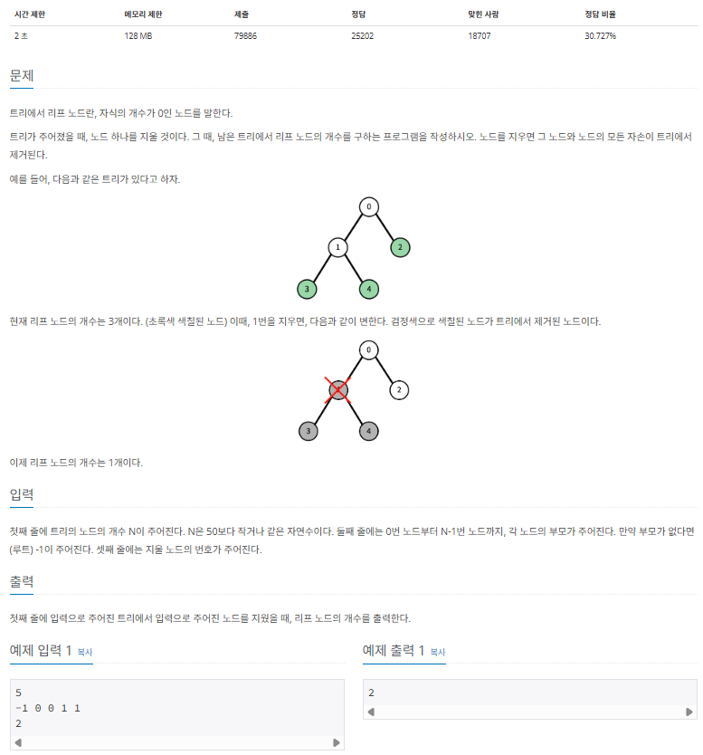

## 트리 알아보기

트리 (tree)는 노드와 에지로 연결된 그래프의 특수한 형태로, 주요 특징은 다음과 같습니다.

> 트리의 특징

- 순환 구조(cycle)ㅇ르 지니고 있지 않고, 1개의 루트 노드가 존재합니다.
- 루트 노드를 제외한 노드는 단 1개의 부모 노드를 갖습니다.
- 트리의 부분 트리 (subtree)역시 트리의 모든 특징을 따릅니다.

### 트리의 핵심 이론

트리 관련 문제를 해결하려면 먼저 트리의 구성요소에 관해 간단하게 알아볼 필요가 있습니다.



| 구성요소  |                           설명                            |
| :-------: | :-------------------------------------------------------: |
|   노드    |          데이터의 index와 value를 표현하는 요소           |
|   에지    |           노드와 노드의 연결 관계를 나타내는 선           |
| 루트 노드 |            트리에서 가장 상위에 존재하는 노드             |
| 부모 노드 |     두 노드 사이의 관계에서 상위 노드에 해당하는 노드     |
| 자식 노드 |     두 노드 사이의 관계에서 하위 노드에 해당하는 노드     |
| 리프 노드 | 트리에서 가장 하위에 존재하는 노드(자식 노드가 없는 노드) |
| 서브 트리 |                전체 트리에 속한 작은 트리                 |

---

### $[문제070]$ 트리의 부모 찾기



### $[01단계]$ 문제 분석하기

주어지는 데이터가 단순하게 연결된 두 노드를 알려 주는 것이므로 데이털르 저장할 때 양방향 에지로 간주하고 저장합니다. 인접 리스트 자료 구조를 사용하면 간편하게 데이터를 저장할 수 있습니다. 트리의 루트가 1이라고 지정되어 있기 때문에 1번 노드부터 DFS로 탐색하면서 부모 노드를 찾아 주면 문제를 쉽게 해결할 수 있습니다.

### $[02단계]$ 손으로 풀어보기

1. 인접 리스트로 트리 데이터를 구현합니다.



2. DFS 탐색을 수행합니다. 수행할 대는 부모 노드의 값을 정답 배열에 저장합니다.

```
DFS 실행

----
실행 : [1]

방문 배열 :
[1][2][3][4][5][6][7]
[T][F][F][F][F][F][F]

정답 배열 :
[1][2][3][4][5][6][7]
[0][0][0][0][0][0][0]

----
실행 : [6], [4] -> [6]만 실행

방문 배열 :
[1][2][3][4][5][6][7]
[T][F][F][F][F][T][F]

정답 배열 :
[1][2][3][4][5][6][7]
[0][0][0][0][0][1][0]

----
실행 : [3], [1] -> [3]만 실행

방문 배열 :
[1][2][3][4][5][6][7]
[T][F][T][F][F][T][F]

정답 배열 :
[1][2][3][4][5][6][7]
[0][0][6][0][0][1][0]

...
```

3. 정답 배열의 2번 인덱스부터 값을 차례대로 출력합니다.

```
[1][2][3][4][5][6][7]
[0][4][6][1][3][1][4]
```

### $[04단계]$ 슈도코드 작성하기

```
n (노드 개수)
visited (방문 기록 저장 배열)
answer (부모 노드 저장 정답 배열)
tree (그래프 데이터 저장 인접 리스트)

각 자료구조 크기 resize // N + 1 크기로 변경

for (N 만큼 반복) {
  인접 리스트 A에 그래프 데이터 저장
}

DFS 실행 -> 루트 노드에서 실행

for (2 ~ N 반복) {
  answer 배열 출력
}

---

DFS {
  visited 배열에 현재 노드 방문 기록
  for (트리 노드들)
  if (현재 노드의 연결 노드 중 방문하지 않은 노드에 대해)
    정답 배열에 현재 노드(부모 노드) 저장
    DFS(연결된 미방문 노드) -> 재귀함수
}
```

### $[04단계]$ 코드 구현하기

```c
#include <iostream>
#include <vector>
using namespace std;

static int N;
static vector<int> answer;
static vector<bool> visited;
static vector<vector<int> > tree;

void DFS(int number);

int main(int argc, char *argv[]) {
    cin >> N;
    visited.resize(N + 1);
    tree.resize(N + 1);
    answer.resize(N + 1);

    for (int i = 1; i < N; i++) {
        int n1, n2;
        cin >> n1 >> n2;
        tree[n1].push_back(n2);
        tree[n2].push_back(n1);
    }

    DFS(1); // 루트 노드에서 DFS 실행

    for (int i = 2; i <= N; i++)
        cout << answer[i] << "\n";
}

void DFS(int number) {
    visited[number] = true;

    for (int i: tree[number]) {
        if (!visited[i]) {
            answer[i] = number;
            DFS(i);
        }
    }
}
```

---

### $[문제071]$ 리프 노드의 개수 구하기



### $[01단계]$ 문제 분석하기

이 문제의 핵심은 '리프 노드를 어떻게 제거하는가?' 입니다. 리프 노드를 탐색하는 탐색 알고리즘을 수행하면서 제거하는 노드가 나왔을 때 탐색을 종료하는 아이디어를 적용하면 실제 리프 노드를 제거하는 효과를 낼 수 있습니다. 이러한 아이디어를 접목해 문제에 접근해 보겠습니다.

### $[02단계]$ 손으로 풀어보기

1. 인접 리스트로 트리 데이터를 구현합니다.
2. DFS 또는 BFS 탐색을 수행하면서 리프 노드의 개수를 셉니다. 단, 제거 대상 노드를 만났을 때는 그 아래 자식 노들과 관련된 탐색은 중지합니다. 이는 제거한 노드 범위에 딸린 리프 노드를 제거하는 효과가 있습니다.

### $[04단계]$ 코드 구현하기

```c
#include <iostream>
#include <vector>
using namespace std;

static int N;
static vector<vector<int> > tree;
static int answer = 0;
static int deleteNode = 0;
static vector<bool> visited;

void DFS(int number);

int main(int argc, char *argv[]) {
    cin >> N;
    visited.resize(N);
    tree.resize(N);
    int root = 0;

    for (int i = 0; i < N; i++) {
        int p;
        cin >> p;
        if (p != -1) {
            tree[i].push_back(p);
            tree[p].push_back(i);
        } else {
            root = i;
        }
    }

    cin >> deleteNode;

    if (deleteNode == root)
        cout << 0 << "\n";
    else {
        DFS(root);
        cout << answer << "\n";
    }

    return 0;
}

void DFS(int number) {
    visited[number] = true;
    int cNode = 0;

    for (int i: tree[number]) {
        // 삭제노드면 탐색 중지
        if (visited[i] == false && i != deleteNode) {
            cNode++;
            DFS(i);
        }
    }
    // 자식 노드 수가 0이면 리프 노드로 간주하고 정답값 증가
    if (cNode == 0)
        answer++;
}
```
