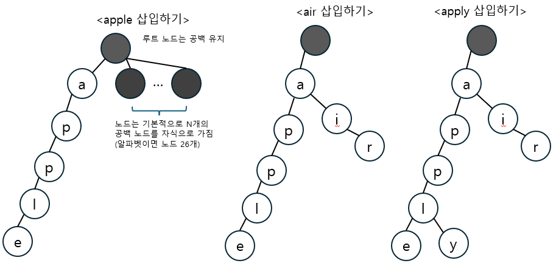
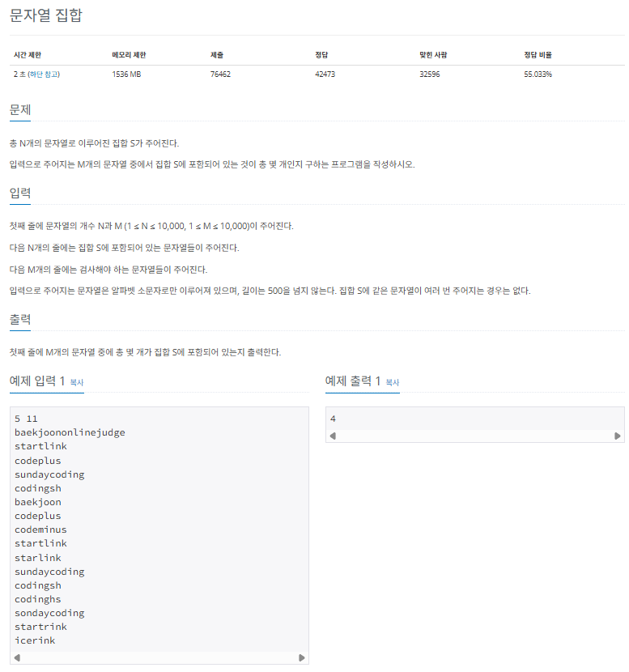
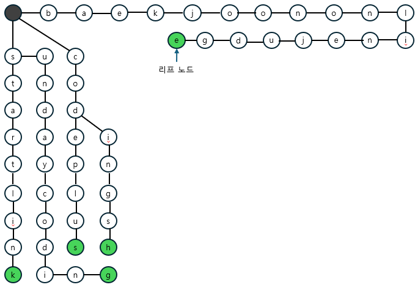

## 트라이

트라이 (trie)는 문자열 검색을 빠르게 실행할 수 있도록 설계한 트리 형태의 자료 구조입니다.

### 트라이의 핵심 이론

트라이는 일반적으로 단어들을 사전 형태로 생성한 후 트리의 부모 자식 노드 관계를 이용해 검색을 수행합니다. 트라이 자료구조의 특징은 다음과 같스비낟.

> 트라이의 특징

- N진 트리
  - 문자 종류의 개수에 따라 N이 결정된다. 예를 들어 알파벳은 26개의 문자로 이뤄져 있으므로 26진 트리로 구성된다
- 루트 노드는 항상 빈 문자열을 뜻하는 공백 상태를 유지한다.

다음은 영단어 apple,air,apply를 순서대로 트라이 자료구조에 삽입하는 모습입니다.



먼저 루트 노드는 공백으로 유지하고 apple의 각 알파벳에 해당하는 노드를 생성합니다. 그 다음으로 air를 삽입할 대는 루트 노드에서부터 검색합니다. a 노드는 공백 상태가 아니므로 이동하고, i와 r은 공백 상태이므로 신규 노드를 생성합니다. apply를 삽입할 때도 검색 노드가 공백 상태이면 신규 노드를 생성하고, 아니면 이동하는 원리로 트라이 자료구조를 구현합니다.

이제 문제를 이용해 실제 코드로는 어떻게 구현하는지 연습해 보겠습니다.

---

### $[문제072]$ 문자열 찾기



### $[01단계]$ 문제 분석하기

집합 S에 속해 있는 단어들을 이용해 트라이 구조를 생성하고, 트라이 검색을 이용해 문자열 M개의 포함 여부를 카운트하는 문제로, 사실 이 문제는 C++에서 제공하는 set자료구조로 쉽게 풀 수 있습니다. 다만, 트라이 자료구조를 학습하고 있으므로 앞서 공부한 자료구조를 이용하여 문제를 풀어보도록 하겠습니다.

### $[02단계]$ 손으로 풀어보기

1. 트라이 자료구조를 새성합니다. 현재 문자열을 가리키는 위치의 노드가 공백 상태라면 신규 노드를 생성하고, 아니라면 이동합니다. 문자열의 마지막에 도달하면 리프 노드라고 표시합니다.



2. 트라이 자료구조 검색으로 집합 S에 포함된 문자열을 셉니다. 부모-자식 관계 구조를 이용해 대상 문자열을 검색했을 때 문자열이 끝날 때까지 공백 상태가 없고, 현재 문자의 마지막 노드가 트라이의 리프 노드라면 이 문자를 집합 S에 포함된 문자열로 셉니다.

### $[03단계]$ 슈도코드 작성하기

```
// 트라이 자료 구조 저장용 클래스
class Node {
  next (다음 노드 배열) // 크기 26인 배열로 선언
  isEnd (마지막 문자열 여부 표시)

  // 문자열 삽입 함수 eky -> 문자열 포인터
  insert (key) {
    if (key가 문자열의 마지막이면)
    isEnd 변수 true 설정
  }
  else {
    if (key 변수에 해당하는 노드가 nullptr) {
      신규 노드 생성
    }
    insert(key + 1) // key 다음 문자열로 insert 호출 -> 재귀 형태 구현
  }

  // 문자열 찾기 함수 key -> 문자열 포인터
  find (key) {
    if (마지막 문자열 노드이면)
      해당 문자 반환
    if (다음 문자열이 없으면)
      nullptr 반환
    else
      find (key + 1) // key 다음 문자열로 find 호출 -> 재귀 형태 구현
  }
}

n (집합 S의 문자열 개수), m (검사할 문자열 개수)

// 트라이 자료구조 구축하기
while (n만큼 반복) {
  text (집합 S의 문자열)
  insert (text) // 문자열을 트라이 자료 구조에 삽입
}

count (정답 변수)

while (m만큼 반복) {
  text (검색 문자열)
  find(next) // 문자열 검색 함수 호출

  // 마지막 노드가 존재하고 isEnd 값이 true 이면
  if (find 함수 결과가 성공일 경우) {
    count 값 1 증가
  }
}

count 출력하기
```

### $[04단계]$ 코드 구현하기

```c
#include <iostream>
using namespace std;

// 트라이 자료 구조 저장용 클래스
class Node {
public:
    Node *next[26];
    bool isEnd;

    Node() : isEnd(false) {
        fill(next, next + 26, nullptr);
    }

    ~Node() {
        for (auto &child: next)
            delete child;
    }

    // 문자열 삽입 함수
    void insert(const char *key) {
        if (*key == 0) {
            isEnd = true;
        } else {
            int next_index = *key - 'a';
            if (next[next_index] == nullptr) {
                next[next_index] = new Node();
            }
            next[next_index]->insert(key + 1);
        }
    }

    // 문자열 찾기 함수
    Node *find(const char *key) {
        if (*key == 0) {
            return this;
        }
        int next_index = *key - 'a';
        if (next[next_index] == nullptr)
            return nullptr;
        return next[next_index]->find(key + 1);
    }
};

int main(int argc, char *argv[]) {
    int n, m;
    cin >> n >> m;
    Node *root = new Node();

    // 트라이 자료구조 구축하기
    while (n > 0) {
        char text[501];
        cin >> text;
        root->insert(text);
        n--;
    }

    int count = 0;

    // 트라이 자료구조 검색하기
    while (m > 0) {
        char text[501];
        cin >> text;
        Node *result = root->find(text);
        if (result && result->isEnd) {
            count++;
        }
        m--;
    }

    cout << count << "\n";
    return 0;
}
```
