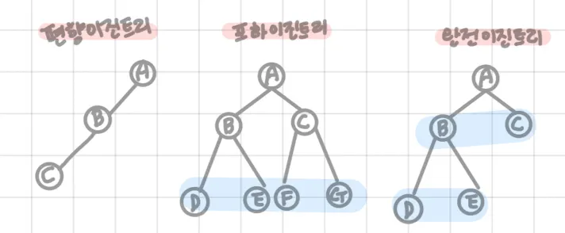
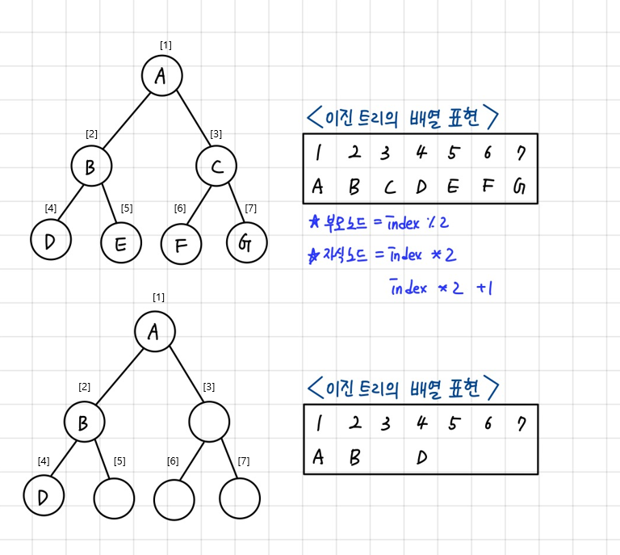
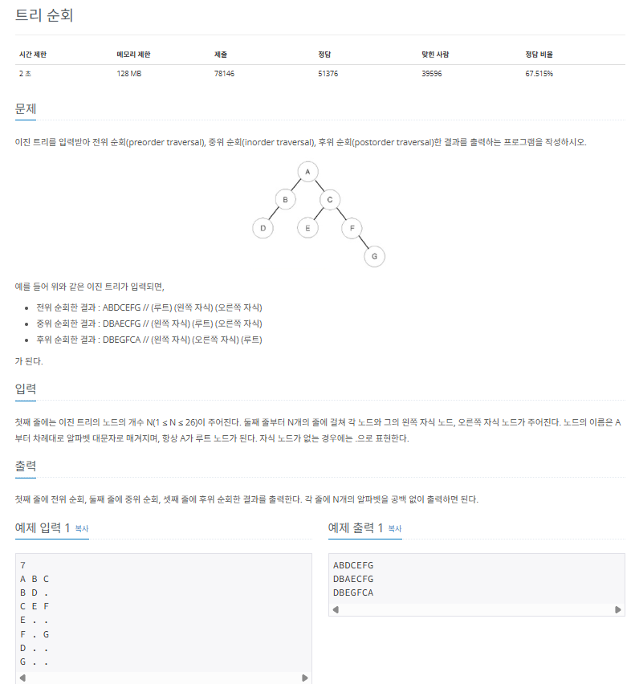
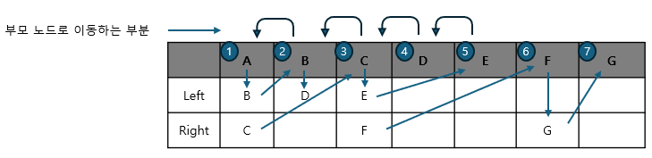

## 이진 트리

이진 트리(bianry tree)는 각 노드의 자식 노드(차수)의 개수가 2 이하로 구성된 트리를 말한니다. 트리 영역에서 가장 많이 사용되는 형태입니다.

### 이진 트리의 핵심 이론

이진 트리에는 편향 이진 트리, 포화 이진 트리, 완전 이진 트리가 있습니다. 편향 이진 트리는 노드들이 한쪽으로 편향돼 생성된 이진 트리, 포화 이진 트리는 트리의 높이가 모두 일정하며 리프 노드가 꽉 찬 이진 트리, 완전 이진 트리는 마지막 레벨을 제외하고 완전하게 노드들이 채워져 있고, 마지막 레벨은 왼쪽부터 채워진 트리입니다.



데이터를 트리 자료 구조에 저장할 때 편향 이진 트리의 형태로 저장하면 탐색 속도가 저하되고 공간이 많이 낭비되는 단점이 있습니다. 일반적으로 코딩 테스트에서 데이터를 트리에 담는다고 하면 완전 이진 트리 형태를 떠올리면 됩니다.

### 이진 트리의 순차 표현

가장 직관적이면서 편리한 트리 자료구조 형태는 바로 배열입니다.

> 코딩 테스트에서 트리 문제가 나오면 그래프 표현 방식보다 다음에서 설명하는 방식으로 데이터를 담는 것이 일반적입니다. 트리에서 매우 중요한 부분으로 꼭 왁변하게 이해할 때까지 학습하세요.



이진 트리는 위와 같이 1차원 배열의 형태로 표현할 수 있습니다. 그렇다면 이렇게 1차원 배열의 형태로 표현할 때 트리의 노드와 배열의 인덱스 간의 상관관계는 어떻게 될까요? 다음 표로 확인해 보세요.

|  이동 목표 노드  |      인덱스 연산       |  제약 조건 (N = 노드 개수)   |
| :--------------: | :--------------------: | :--------------------------: |
|    루트 노드     |       index = 1        |                              |
|    부모 노드     |   index = index / 2    | 현재 노드가 루트 노드가 아님 |
|  왼쪽 자식 노드  |   index = index \* 2   |       index \* 2 <= N        |
| 오른쪽 자식 노드 | index = index \* 2 + 1 |     index \* 2 + 1 <= N      |

위의 인덱스 연산 방식은 향후 세그먼트 트리(segment tree)나 LCA (lowest common ancestor) 알고리즘에서도 기본이 되는 연산이므로 꼭 숙지해 두세요

---

### $[문제073]$ 트리 순회하기



### $[01단계]$ 문제 분석하기

특별한 아이디어를 떠올릴 필요 없이 문제가 요구하는 자료구조 형태만 충실히 구현하면 되는 문제입니다. 문제에서 주어진 입력값을 트리 혀앹의 자료구조에 적절하게 저장하고, 그 안에서 탐색을 수행하는 로직을 구현해 봅시다. 여기에서는 2차원 배열을 이용해 트리 데이터를 저장하여 문제를 풀어보도록 하겠습니다.

### $[02단계]$ 손으로 풀어보기

1. 2차원 배열에 트리 데이터를 저장합니다.


2. 전위 순회 함수를 구현해 실행합니다.

> 전위 순회 순서

- 현재 노드 -> 왼쪽 노드 -> 오른쪽 노드 순서로 탐색



```
=> A B D C E F G 출력
```

3. 중위 순회, 후위 순회 함수도 과정 2와 같은 방식으로 구현해 실행합니다.

> 중위 순회 순서

- 왼쪽 노드 -> 현재 노드 -> 오른쪽 노드 순서로 탐색

> 후위 순회 순서

- 왼쪽 노드 -> 오른쪽 노드 -> 현재 노드 순서로 탐색

### $[03단계]$ 슈도코드 작성하기

```
n (노드의 개수)
tree (트리 데이터 저장 이차원 배열)

// 트리 구조 저장하기
for (N의 개수만큼 반복) {

  //  왼쪽 노드 (left)
  if (왼쪽 자식 노드가 없는 경우)
    tree 배열에 -1 저장
  else
    tree 배열에 왼쪽 자식 노드 인덱스 저장

  // 오른쪽 노드 (right)
  if (오른쪽 자식 노드가 없는 경우)
    tree 배열에 -1 저장
  else
    tree 배열에 오른쪽 자식 노드 인덱스 저장

}

preOrder 실행 -> inOrder 실행 -> postOrder 실행

---

// preOrder 구현 (전위 순회)
preOrder {
  현재값이 -1이면 반환 (자식 노드가 없으면)
  1. 현재 노드 출력
  2. 왼쪽 자식 노드 탐색
  3. 오른쪽 자식 노드 탐색
}

// inOrder 구현 (중위 순회)
inOrder {
  현재값이 -1이면 반환 (자식 노드가 없으면)
  1. 왼쪽 자식 노드 탐색
  2. 현재 노드 출력
  3. 오른쪽 자식 노드 탐색
}

// postOrder 구현 (후위 순회)
postOrder {
  현재값이 -1이면 반환 (자식 노드가 없으면)
  1. 왼쪽 자식 노드 탐색
  2. 오른쪽 자식 노드 탐색
  3. 현재 노드 출력
}
```

### $[04단계]$ 코드 구현하기

```c
#include <iostream>
using namespace std;

static int n;
static int tree[26][2];

void preOrder(int now); // 전위 순회
void inOrder(int now); // 중위 순회
void postOrder(int now); // 후위 순회

int main(int argc, char *argv[]) {
    cin >> n;

    for (int i = 0; i < n; i++) {
        char node_char, left, right;
        cin >> node_char >> left >> right;
        int node = node_char - 'A';

        // 왼쪽 노드 저장
        // 자식 노드가 없을 경우 -1 을 저장
        if (left == '.')
            tree[node][0] = -1;
        else
            tree[node][0] = left - 'A';

        // 오른쪽 노드 저장
        // 자식 노드가 없을 경우 -1 을 저장
        if (right == '.')
            tree[node][1] = -1;
        else
            tree[node][1] = right - 'A';
    }

    preOrder(0);
    cout << "\n";
    inOrder(0);
    cout << "\n";
    postOrder(0);
    cout << "\n";

    return 0;
}

// 전위 순회
void preOrder(int now) {
    if (now == -1) return;

    cout << (char)(now + 'A'); // 1. 현재 노드 출력
    preOrder(tree[now][0]);    // 2. 왼쪽 탐색
    preOrder(tree[now][1]);    // 3. 오른쪽 탐색
}

// 중위 순회
void inOrder(int now) {
    if (now == -1) return;

    inOrder(tree[now][0]);    // 1. 왼쪽 탐색
    cout << (char)(now + 'A');// 2. 현재 노드 출력
    inOrder(tree[now][1]);    // 3. 오른쪽 탐색
}

// 후위 순회
void postOrder(int now) {
    if (now == -1) return;

    postOrder(tree[now][0]);    // 1. 왼쪽 탐색
    postOrder(tree[now][1]);    // 2. 오른쪽 탐색
    cout << (char)(now + 'A');  // 3. 현재 노드 출력
}
```
