## 세그먼트 트리

주어진 데이터의 구간 함과 데이터 업데이트를 빠르게 수행하기 위해 고안해 낸 자료구조 형태가 바로 세그먼트 트리입니다. 더 큰 범위는 '인덱스 트리'라고 불리는데, 코딩 테스트 영역에서는 큰 차이가 없다고 생각해도 됩니다.

### 세그먼트 트리의 핵심 이론

세그먼트 트리의 종류는 구간 합, 최대 및 최소 구하기로 나눌 수 있고, 구현 단계는 트리 초기화하기, 질의값 구하기 (구간 합 또는 최대 및 최소), 데이터 업데이트하기로 나눌 수 있습니다. 단계별로 좀 더 자세하게 설명하겠습니다.

### 1. 트리 초기화하기

리프 노드의 개수가 데이터의 개수(N)이상이 되도록 트리 배열을 만듭니다. 트리 배열의 크기를 구하는 방법은 $2^k$ >= N 을 만족하는 k의 최솟값을 구한 후 $2^k$ \* 2를 트리 배열의 크기로 정의하면 됩니다. 예를 들어 다음과 같은 샘플 데이터가 있다면 N = 8이고 $2^3$ >= 8 이므로 배열의 크기를 $2^3$ \* 2 = 16 으로 정의합니다.

> 샘플 데이터

- {5, 8, 4, 3, 7, 2, 1, 6}

리프 노드에 원본 데이터를 입력합니다. 이때 리프 노드의 시작 위치를 트리 배열의 인덱스로 구해야 하는데, 구하는 방식은 $2^k$를 시작 인덱스로 취하면 됩니다. 예를 들어 k의 값이 3이면 start_index = 8이 됩니다.

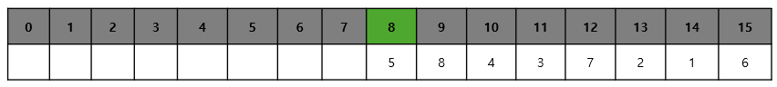

리프 노드를 제외한 나머지 노드의 값을 채웁니다. ($2^k - 1$부터 1번쪽으로 채웁니다.). 채워야 하는 인덱스가 N이라고 가정하면 자신의 자식 노드를 이용해 해당 값을 채울 수 있습니다. 자식노드의 인덱스는 이진 트리 형식이기 때문에 $2N, 2N + 1$이 됩니다. 케이스 별로 적절하게 계산합니다.

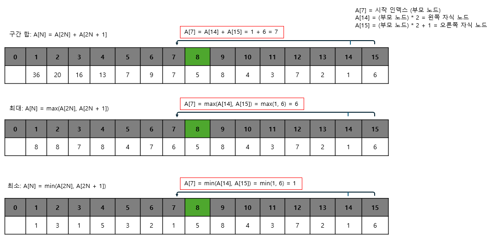

샘플을 이용해 3개의 케이스와 관련된 세그먼트 트리를 구성해 봤습니다. 구성한 트리 배열을 실제 트리 모양으로 구조화하면 다음과 같이 표현할 수 있습니다.

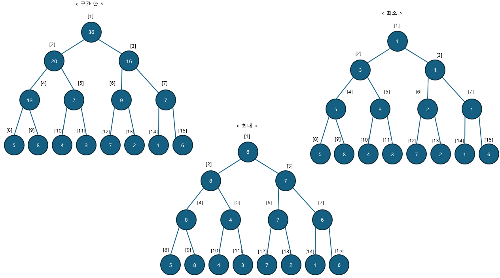

이렇게 세그먼트 트리를 구성해 놓으면 그 이후 질의와 관련된 결괏값이나 데이터 업데이트 요구 사항에 관해 좀 더 빠른 시간 복잡도 아넹서 해결할 수 있게 됩니다.

### 2. 질의값 구하기

주어진 질의 인덱스를 세그먼트 트리의 리프 노드에 해당하는 인덱스로 변경합니다. 기존 샘플을 기준으로 한 인덱스값과 세그먼트 트리 배열에서의 인덱스값이 다르기 때문에 인덱스를 변경해야 합니다. 인덱스 변경 방법은 다음과 같습니다.

> 질의 인덱스를 세그먼트 트리 인덱스로 변경하는 방법

- 세그먼트 트리 index = 주어진 질의 index + $2^k$ - 1 // 샘플에서는 k = 3

질의에서의 시작 인덱스와 종료 인덱스에 관해 부모 노드로 이동하면서 주어진 질의해 해당하는 값을 다음과 같이 구합니다.

> 질의에 해당하는 노드 선택 과정

1. start_index % 2 == 1 일 때 해당 노드를 선택한다.
2. end_index % 2 == 0 일 때 해당 노드를 선택한다.
3. start_index depth 변경
   1. start_index = (start_index + 1) / 2 연산을 실행
4. end_index depth 변경
   1. end_index = (end_index - 1) / 2 연산을 실행
5. 과정 1 ~ 4를 반복하다가 end_index < start_index 되면 종료한다.

과정 1 ~ 2에서 해당 노드를 선택했다는 것은 해당 노드의 부모가 나타내는 범위가 질의 범위를 넘어가기 때문에 해당 노드를 질의값에 영향을 미치는 독립 노드로 선택하고, 해당 노드의 부모 노드는 대상 범위에서 제외한다는 뜻입니다.

부모 노드를 대상 범위에서 제거하는 방법은 바로 과정 3 ~ 4에서 질의 범위에 해당하는 부모 노드로 이동하기 위해 인덱스 연산을 index / 2 가 아닌 (index + 1) / 2, (index - 1) / 2 로 수행하는 것입니다.

질의에 해당하는 노드를 선택하는 방법은 구간 합, 최댓값 구하기, 최솟값 구하기 모두 동일하며 선택된 노드들에 관해 마지막에 연산하는 방식만 다릅니다.

> 질의에 해당하는 노드 연산 방법

- 구간 합 : 선택된 노드를 모두 더하여 출력
- 최댓값 구하기 : 선택된 노드 중 MAX값을 선택해 출력
- 최솟값 구하기 : 선택된 노드 중 MIN값을 선택해 출력

트리 초기화하기에서 나온 구간 합 샘플을 이용해 2 ~ 6번째 구간 합을 구하는 간단한 예제를 살펴보겠습니다.

#### 2 ~ 6번 구간 합 구하기 예제

> 먼저 리프 노드의 인덱스로 변경합니다.

```
7 = 2^3 - 1

start_index = 2 + 7 = 9
end_index = 6 + 7 = 13
```

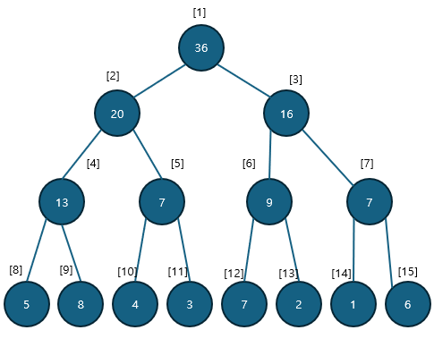

> 부모 노드로 이동합니다.

```
start_index % 2 = 9 % 2 = 1   // 노드 선택   (구간 합 계산에 적용)
end_index % 2 = 13 % 2 = 1    // 노드 미선택
start_index = (start_index + 1) / 2  = 10 / 2  = 5
end_index = (end_index - 1) / 2      = 12 / 2  = 6
```

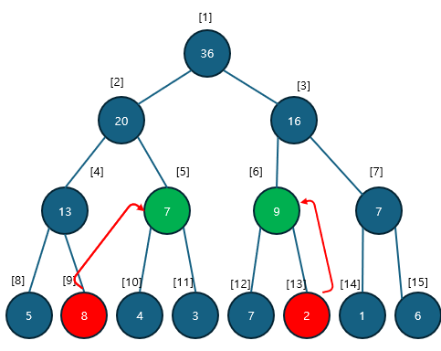

> 한번 더 부모 노드로 이동합니다.

```
start_index % 2 = 5 % 2 = 1   // 노드 선택   (구간 합 계산에 적용)
end_index % 2 = 6 % 2 = 0    // 노드 선택    (구간 합 계산에 적용)
start_index = (start_index + 1) / 2  = 6 / 2  = 3
end_index = (end_index - 1) / 2      = 5 / 2  = 2

// end_index < start_index 이므로 종료
```

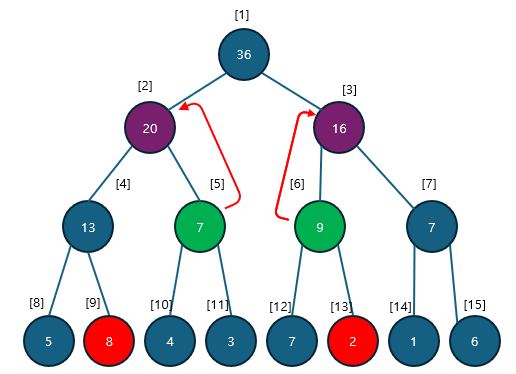

end_index < start_index 이므로 종료하고 값을 구합니다. 2 ~ 6번 구간의 합의 값은 선택된 노드의 합인 8 + 7 + 9 = 24가 됩니다. (구간 합은 : 선택된 노드를 모두 더하여 출력한다.)

### 3. 데이터 업데이트하기

업데이트 방식은 자신의 부모 노드로 이동하면서 업데이트한다는 것은 동일하지만, 어떤 값으로 업데이트할 것인지에 관해서는 트리 타입별로 조금 다릅니다.

> 부모 노드로 이동하는 방식은 세그먼트 트리가 이진 트리이므로 index = index / 2 로 변경하면 됩니다.

구간 합에서는 원래 데이터와 변경 데이터의 차이만큼 부모 노드로 올라가면서 변경합니다.

최댓값 찾기에서는 변경 데이터와 자신과 같은 부모를 지니고 있는 다른 자식 노드와 비교해 더 큰 값으로 업데이트합니다. 업데이트가 일어나지 않으면 종료합니다.

마지막으로 최솟값 찾기에서는 변경 데이터와 자신과 같은 부모를 지니고 있는 다른 자식 노드와 비교해 더 작은 값으로 업데이트합니다. 업데이트 일어나지 않으면 종료합니다.

다음은 5번 데이터의 값은 7에서 10으로 업데이트하는 예시입니다. 5번 데이터의 인덱스를 리프 노드 인덱스로 변경하면 5 + 7 = 12 이므로 12번 노드의 값이 업데이트 됩니다.

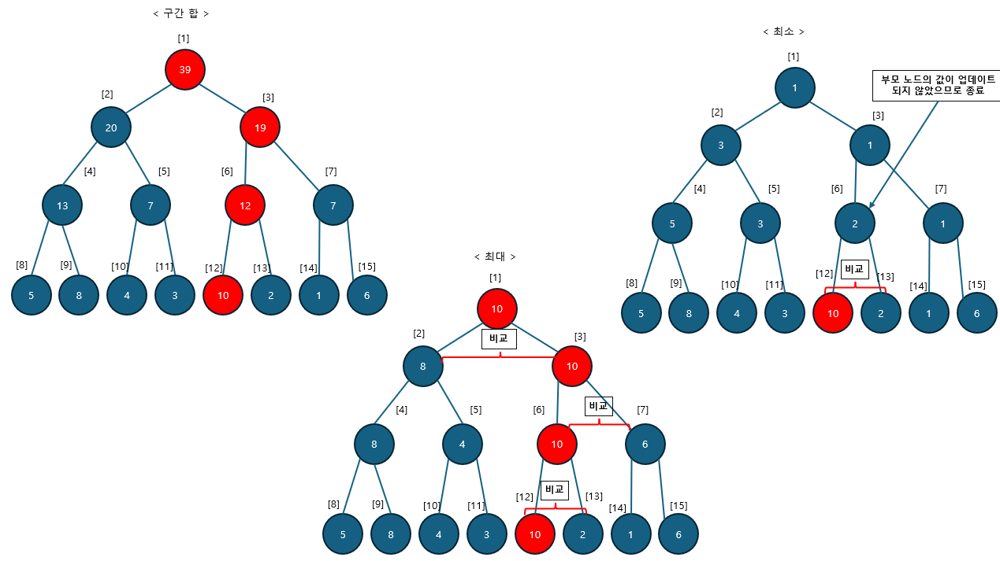

---

### $[문제074]$ 구간 합 구하기 3


### $[01단계]$ 문제 분석하기

단순하게 구간 합을 구하는 문제라면 앞에서 배운 합 배열 자료구조를 이용해 쉽게 해결할 수 있습니다. 하지만 이 문제를 합 배열로 풀지 못하는 이유는 중간에 수의 변경이 빈번히 일어나는 상황이 존재하기 때문입니다. 합 배열은 자료구조의 특성상 데이터 변경에 시간이 오래걸리는 단점이 있습니다. 따라서 이 문제는 데이터 변경에도 시간이 비교적 적게 걸리는 세그먼트 트리 자료구조를 이용해 해결하겠습니다.

### $[02단계]$ 손으로 풀어보기

1. 1차원 배열을 이용해 트리의 값을 초기화합니다. 트리 배열 크기가 N = 5이므로 $2^k$ >= N을 만족하는 k의 값은 3 이고, 배열의 크기는 $2^3$ \* 2 = 16 이 됩니다. 시작 인덱스는 $2^3$ = start_index = 8 입니다.

- k = $2^k$ >= N = 3
- 배열의 크기 = $2^3$ \* 2 = 16
- 시작 인덱스 = $2^3$ = 8

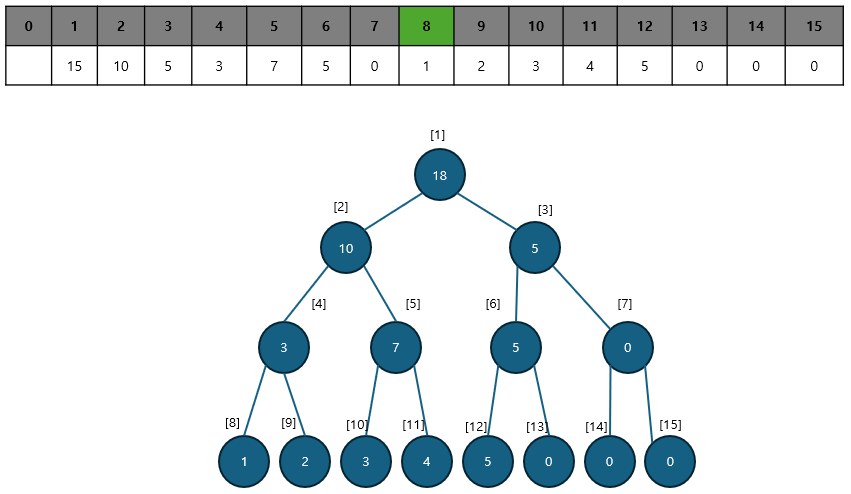

1. 질의값 연산 함수와 데이터 업데이트 함수를 수행하고, 질의와 관련된 결과값을 출력합니다.

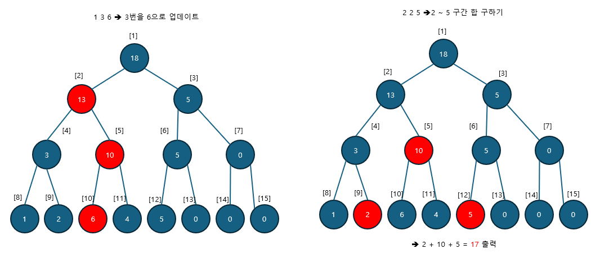

### $[03단계]$ 슈도코드 작성하기

```
tree (세그먼트 트리 배열)
N (수의 개수), M (변경이 일어나는 횟수),  K (구간 합을 구하는 횟수)

treeSize 구하기 -> pow(2 , 트리높이 + 1)
leftNodeStartIndex 구하기 -> treeSize / 2 - 1 // 리프 노드 시작 인덱스
tree 배열의 리프 노드영역에 데이터 입력받기
setTree(트리의 크기) // 초기 트리를 생성하는 함수

for (M + K만큼 반복하기) {
  a (질의 유형) , s (시작 인덱스), e (변경 값 또는 종료 인덱스)
  // 데이터 변경 함수
  a가 1일 때 -> changeVal (tree에서 시작 인덱스, e (변경 값))
  // 구간 합 함수 호출 및 출력
  a가 2일 때 -> getsum (tree에서 시작 인덱스, e (tree 에서 종료 인덱스))
}

---
// 구간 합을 구하는 함수
getsum (시작 인덱스, 종료 인덱스) {
  while (시작 인덱스와 종료 인덱스가 교차할 때까지) {
    if (시작 인덱스 % 2 == 1) 해당 노드의 값을 구간 합에 추가하고 시작 인덱스 증가
    if (종료 인덱스 % 2 == 1) 해당 노드의 값을 구간 합에 추가하고 종료 인덱스 감소
    시작 인덱스 = 시작 인덱스 / 2
    종료 인덱스 = 종료 인덱스 / 2
  }
  구간 합 결과 반환
}

// 값 변경 함수 구현
changeVal (시작 인덱스, 종료 인덱스) {
  diff (현재 노드의 값과 변경된 값의 차이)
  while (시작 인덱스가 0보다 크다) {
    시작 인덱스의 트리값에 diff 값을 더함
    시작 인덱스 = 시작 인덱스 / 2 (부모 노드 구하기)
  }
}

// 초기 트리 생성 함수 구현하기
setTree (트리의 마지막 인덱스) {
  while (인덱스가 루트가 아닐 때까지 반복하기) {
    트리의 인덱스 / 2부분 (부모 노드에 현재 index 의 트리값 더하기)
    index -= 1
  }
}
```

### $[04단계]$ 코드 구현하기

```c
#include <iostream>
#include <vector>
#include <cmath>
using namespace std;

static vector<long> tree;

long getSum(int s, int e);

void changeVal(int index, long val);

void setTree(int i);

int main(int argc, char *argv[]) {
    int N, M, K;
    cin >> N >> M >> K;
    int treeHeight = 0;
    int Lenght = N;

    // 트리 높이 구하기
    while (Lenght != 0) {
        Lenght /= 2;
        treeHeight++;
    }

    // 트리 사이즈 및 시작 인덱스 구하기
    int treeSize = (int) pow(2, treeHeight + 1);
    int leftNodeStartIndex = treeSize / 2 - 1;
    tree.resize(treeSize);

    // 데이터를 리프 노드에 입력 받기 후 tree 부모 만들기
    for (int i = leftNodeStartIndex + 1; i <= leftNodeStartIndex + N; i++) {
        cin >> tree[i];
    }
    setTree(treeSize - 1);

    for (int i = 0; i < M + K; i++) {
        long a, s, e;
        cin >> a >> s >> e;

        if (a == 1) {
            changeVal(leftNodeStartIndex + s, e);
        } else if (a == 2) {
            s = s + leftNodeStartIndex;
            e = e + leftNodeStartIndex;
            cout << getSum(s, e) << "\n";
        }
    }
    return 0;
}

// 구간 합 연산 함수
long getSum(int s, int e) {
    long partSum = 0;
    while (s <= e) {
        if (s % 2 == 1) {
            partSum += tree[s];
            s++;
        }
        if (e % 2 == 0) {
            partSum += tree[e];
            e--;
        }
        s = s / 2;
        e = e / 2;
    }
    return partSum;
}

// 트리값 변경 함수
void changeVal(int index, long val) {
    long diff = val - tree[index];

    while (index > 0) {
        tree[index] = tree[index] + diff;
        index = index / 2;
    }
}

// 초기 트리 생성 함수
void setTree(int i) {
    while (i != 1) {
        tree[i / 2] += tree[i];
        i--;
    }
}
```

---

### $[문제075]$ 최솟값 찾기 2

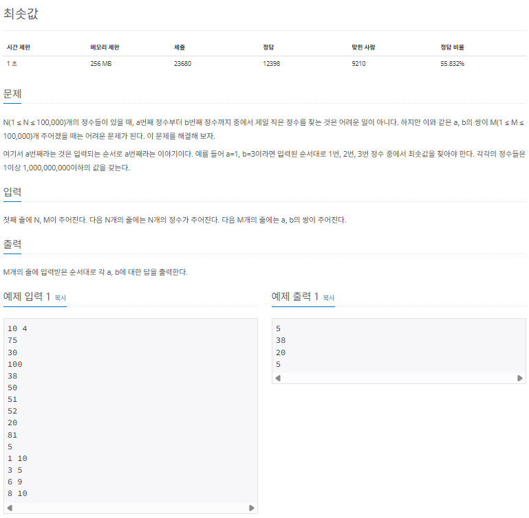

### $[01단계]$ 문제 분석하기

전형적인 세그먼트 트리 문제입니다. 데이터를 변경하는 부분이 없기 때문에 1차원 배열에서 최솟값 기준으로 트리 데이터를 저장하고 질의를 수행하는 함수까지만 구현합니다.

### $[02단계]$ 손으로 풀어보기

1. 1차원 배열로 트리의 값을 최솟값 기준으로 초기화합니다. 트리 배열 크기가 N = 10이므로 $2^k$ >= N을 만족하는 k의 값은 4이고, 배열의 크기는 $2^4$ \* 2 = 32가 됩니다. 시작 인덱스는 $2^4$ = start_index = 16 입니다.

- k = $2^k$ >= N = 4
- 배열의 크기 = $2^k$ \* 2 = 32
- 시작 인덱스 = $2^k$ = 16

2. 질의값 연산 함수를 수행하고, 결괏값을 출력합니다.

### $[03단계]$ 슈도코드 작성하기

```
tree (세그먼트 트리 배열)
N (수의 개수), M (최솟값을 구하는 함수)

treeSize 구하기 -> pow(2 , 트리높이 + 1)
leftNodeStartIndex 구하기 -> treeSize / 2 - 1 // 리프 노드 시작 인덱스
트리 초기화하기 (모든 값을 Max값으로 초기화)
tree 배열의 리프 노드 영역에 데이터 입력받기
setTree(트리의 크기) // 초기 트리를 생성하는 함수

// 최솟값을 구하는 함수 호출 및 출력하기
for (M만큼 반복하기) {
  getMin(tree 에서 시작 인덱스 , tree 에서 종료 인덱스)
}

---

// 범위의 최솟값을 구하는 함수
getMin (시작 인덱스, 종료 인덱스) {
  Min (범위의 최솟값을 나타내는 변수, MAX_VALUE로 초기화)

  while (시작 인덱스와 종료 인덱스가 교차할 때까지) {
    if (시작 인덱스 % 2 == 1)
      Min = min(tree[시작 인덱스] , tree[종료 인덱스])
    if (종료 인덱스 % 2 == 0)
     Min = min(tree[시작 인덱스] , tree[종료 인덱스])

    시작 인덱스 = 시작 인덱스 / 2
    종료 인덱스 = 종료 인덱스 / 2
  }
  return Min;
}

// 초기 트리 생성 함수 구현하기
setTree (트리의 마지막 인덱스) {
  while (인덱스가 루트가 아닐 때까지 반복하기) {

    트리의 인덱스 / 2 부분(부모노드)의 값과 현재 값을 비교해 현재 값이 더 작을때
    해당 값을 트리의 인덱스 / 2 부분(부모 노드에 저장)

    index--;
  }
}
```

### $[04단계]$ 코드 구현하기

```c
#include <iostream>
#include <vector>
#include <cmath>
#include <limits>
using namespace std;

static vector<long> tree;

long getMin(int s, int e);

void setTree(int i);

int main(int argc, char *argv[]) {
    int N, M;
    cin >> N >> M;
    int treeHeight = 0;
    int Lenght = N;

    // 트리 높이 구하기
    while (Lenght != 0) {
        Lenght /= 2;
        treeHeight++;
    }

    // 트리 사이즈 및 시작 인덱스 구하기
    int treeSize = (int) pow(2, treeHeight + 1);
    int leftNodeStartIndex = treeSize / 2 - 1;

    // 트리 초기화하기
    tree.resize(treeSize);
    fill(tree.begin(), tree.end(), LONG_MAX);

    // 데이터를 리프 노드에 입력 받기 후 tree 부모 만들기
    for (int i = leftNodeStartIndex + 1; i <= leftNodeStartIndex + N; i++) {
        cin >> tree[i];
    }
    setTree(treeSize - 1);

    // 연산
    for (int i = 0; i < M; i++) {
        long s, e;
        cin >> s >> e;
        s = s + leftNodeStartIndex;
        e = e + leftNodeStartIndex;
        cout << getMin(s, e) << "\n";
    }

    return 0;
}

// 구간 합 연산 함수
long getMin(int s, int e) {
    long Min = LONG_MAX;

    while (s <= e) {
        if (s % 2 == 1) {
            Min = min(Min, tree[s]);
            s++;
        }
        if (e % 2 == 0) {
            Min = min(Min, tree[e]);
            e--;
        }
        s = s / 2;
        e = e / 2;
    }
    return Min;
}


// 초기 트리 생성 함수
void setTree(int i) {
    while (i != 1) {
        if (tree[i / 2] > tree[i]) {
            tree[i / 2] = tree[i];
        }
        i--;
    }
}
```

---

### $[문제076]$ 구간 곱 구하기

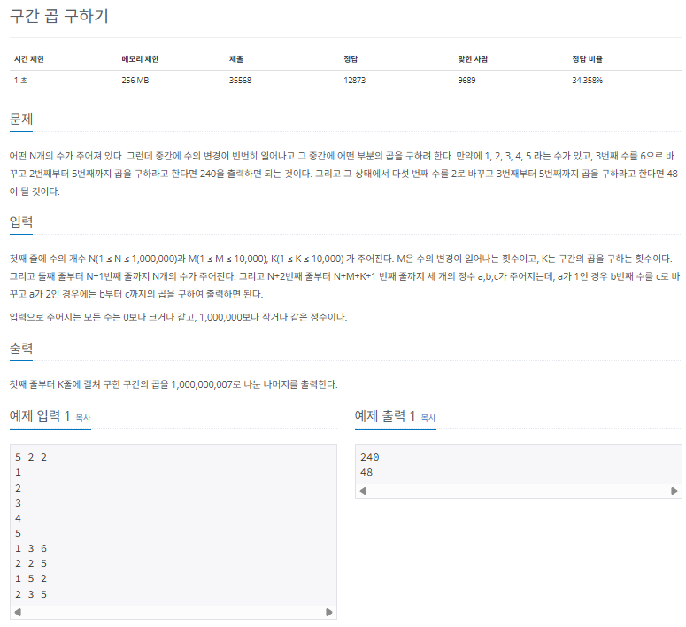

### $[01단계]$ 문제 분석하기

대부분의 세그먼트 트리는 구간 합, 최댓값, 최솟값에 관해 많은 문제가 출제됩니다. 이 문제는 조금은 색다른 구간 곱과 관련된 문제입니다. 기본 틀은 세그먼트 트리의 다른 문제와 동일합니다. 이 문제에서 조건에 따라 자유자재로 기존의 알고리즘 코드를 수정할 수 있는 훈련을 하고자 합니다. 곱셈의 성질을 염두에 두고 문제를 풀어봅시다.

### $[02단계]$ 손으로 풀어보기

1. 1차원 배열로 트리의 값을 초기화 합니다.

- k = $2^k$ >= N = 3
- 배열의 크기 = $2^k$ \* 2 = 16
- 시작 인덱스 = $2^k$ = 8

곱셈이기 때문에 초깃값을 1로 저장해주고, 부모 노드를 양쪽 자식 노드의 곱으로 표현합니다. 이때 MOD 연산을 지속적으로 수행해 값의 범위가 1,000,000,007이 넘지 않도록 구현합니다.

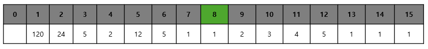

2. 질의값 연산 함수와 데이터 업데이트 함수를 수행하고 결괏값을 출력합니다. 이때 값을 업데이트하거나 구간 곱을 구하는 곱셈마다 모두 MOD 연산을 수행합니다.

곱셈의 성질에 따라 세부 코드를 변경해야 하며 MOD 연산 로직을 추가해야합니다.

> 곱셈과 관련된 % 연산의 성질

```
(A * B) % C = (A % C) * (B % C) % C

// 따라서 두 값을 곱셈한 후 % 연산한 겨로가는 각각 % 연산한 값을 곱해 다시 % 연산한 것과 동일함
```

### $[04단계]$ 코드 구현하기

```c
#include <iostream>
#include <vector>
#include <cmath>
using namespace std;

static vector<long> tree;
static int MOD = 1000000007;

long getMul(int s, int e);

void changeVal(int index, long val);

void setTree(int i);


int main(int argc, char *argv[]) {
    int N, M, K;
    cin >> N >> M >> K;
    int treeHeight = 0;
    int Length = N;

    // 트리 높이 구하기
    while (Length != 0) {
        Length /= 2;
        treeHeight++;
    }

    // 트리 사이즈 및 시작 인덱스 구하기
    int treeSize = (int) pow(2, treeHeight + 1);
    int leftNodeStartIndex = treeSize / 2 - 1;

    // 트리 초기화하기 (구간 곱이기 때문에 초깃값을 1로 설정)
    tree.resize(treeSize);
    fill(tree.begin(), tree.end(), 1);

    // 데이터를 리프 노드에 입력 받기 후 tree 부모 만들기
    for (int i = leftNodeStartIndex + 1; i <= leftNodeStartIndex + N; i++) {
        cin >> tree[i];
    }
    setTree(treeSize - 1);

    for (int i = 0; i < M + K; i++) {
        long a, s, e;
        cin >> a >> s >> e;
        if (a == 1) {
            changeVal(leftNodeStartIndex + s, e);
        } else if (a == 2) {
            s = s + leftNodeStartIndex;
            e = e + leftNodeStartIndex;
            cout << getMul(s, e) << "\n";
        }
    }
}

// 구간 곱 연산
long getMul(int s, int e) {
    long partMul = 1;
    while (s <= e) {
        if (s % 2 == 1) {
            partMul = partMul * tree[s] % MOD;
            s++;
        }
        if (e % 2 == 0) {
            partMul = partMul * tree[e] % MOD;
            e--;
        }
        s /= 2;
        e /= 2;
    }
    return partMul;
}

// 트리값 변경 함수
void changeVal(int index, long val) {
    tree[index] = val;

    // 현재 노드의 양쪽 자식 노드를 찾아 곱하는 로직
    while (index > 1) {
        index = index / 2;
        tree[index] = tree[index * 2] % MOD * tree[index * 2 + 1] % MOD;
    }
}

// 초기 트리 생성 함수
void setTree(int i) {
    while (i != 1) {
        tree[i / 2] = tree[i / 2] * tree[i] % MOD;
        i--;
    }
}
```
