## 최소 공통 조상

트리 그래프에서 임의의 두 노드를 선택했을 때 두 노드가 각각 자신을 포함해 거슬러 올라가면서 부모 노드를 탐색할 때 처음 공통으로 만나게 되는 부모 노드를 '최소 공통 조상 (LCA : lowest common ancestor)' 이라고 합니다.

### 최소 공통 조상의 핵심 이론

### 일반적인 최소 공통 조상 구하기

먼저 트리의 높이가 크지 않을 때 최소 공통 조상을 구하는 방법을 예시와 함께 알아보겠습니다. 다음과 같은 트리에서 4번, 15번 노드의 최소 공통 조상을 구해 보겠습니다. 먼저 루트 노드에서 탐색을 시작해 각 노드의 부모 노드와 깊이를 저장합니다.

> 이때 탐색은 DFS 또는 BFS를 이용해 수행합니다.

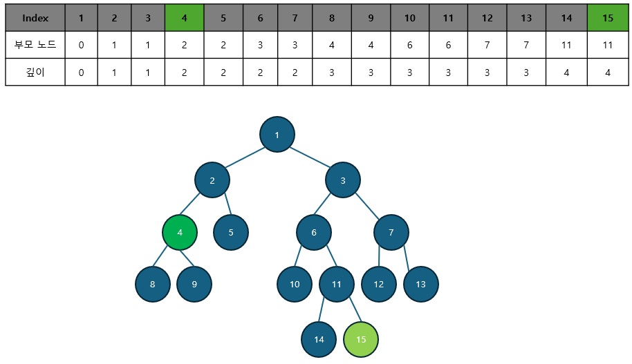

선택된 두 노드의 깊이가 다른 경우, 더 깊은 노드를 부모 노드로 1개씩 올려 주면서 같은 깊이로 맞춥니다. 이때 두 노드가 같으면 해당 노드가 최소 공통 조상이므로 탐색을 종료합니다.

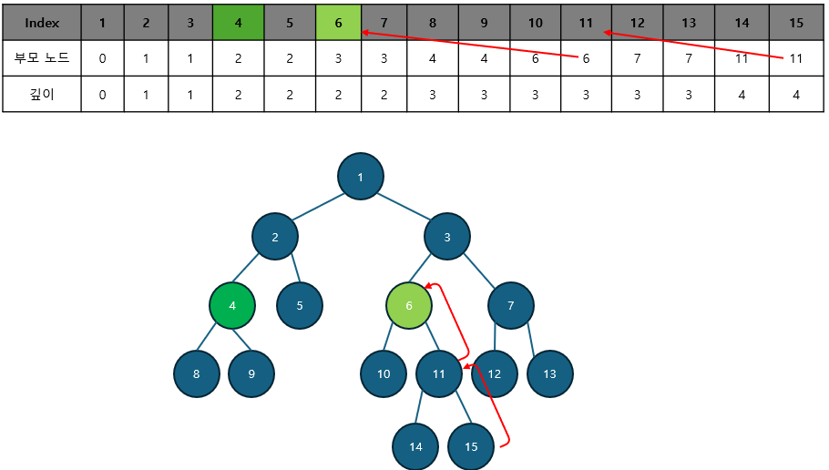

깊이가 같은 상태에서는 동시에 부모 노드로 올라가면서 두 노드가 같은 노드가 될 때까지 바놉ㄱ합니다. 이때 처음 만나는 노드가 최소 공통 조상이 됩니다. 이러한 원리로 다음 트리에서 4번, 15번 노드의 최소 공통 조상은 1이 됩니다.

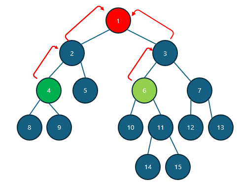

위와 같은 방식을 이용하면 최소 공통 조상을 구할 수 있지만, 트리의 높이가 커질 경우 시간 제약 문제에 직면할 수 있습니다. 이러한 문제를 해결하기 위해 새롭게 제안된 방식이 바로 다음에 설명할 '최소 공통 조상 빠르게 구하기' 입니다. '최소 공통 조상 빠르게 구하기'는 일반적인 최소 공통 조상 구하기 알고리즘을 약간 변형한 형태이므로 '일반적인 구하기' 원리를 정확하게 익힌 후 '빠르게 구하기' 부분을 학습하세요.

### 최소 공통 조상 빠르게 구하기

'최소 공통 조상 빠르게 구하기'의 핵심은 서로의 깊이를 마주처 주거나 같아지는 노드를 찾을 때 기존에 한 단계씩 올려주는 방식에서 $2^k$씩 올라가 비교하는 방식입니다. 따라서 기존에 자신의 부모 노드만 저장해 놓던 방식에서 $2^k$번째 위치의 부모 노드까지 저장해 둬야 합니다. 다음 3단꼐를 이용해 좀 더 자세히 알아보겠습니다.

#### 1. 부모 노드 저장 배열 만들기

부모 노드 배열을 만들기 위해서는 이 배열의 정의와 점화식을 알아야 합니다.

> 부모 노드 배열의 정의

- P[K][N] = N번 노드의 $2^k$번째 부모의 노드 번호

> 부모 노드 배열의 점화식

- P[K][N] = P[K - 1] [P[K - 1][N]]

점화식에서 N의 $2^k$번째 부모 노드는 N의 $2^k$$^-$$^1$번째 부모 노드라는 의미입니다. 즉, K = 4라고 가정하면 N의 16번째 부모 노드는 N의 8번째 부모 노드의 8번째 부모 노드라는 의미입니다. 이 점화식을 사용해 배열을 채워보겠습니다.

배열에서 K는 '트리의 깊이 > $2^k$' 을 만족하는 최댓값입니다. 다음 트리에서 최대 깊이는 5이기 때문에 K = 2가 됩니다. 즉, 이 트리의 모든 노드는 $2^3$번째 부모 노드를 지닌 경우가 없습니다.

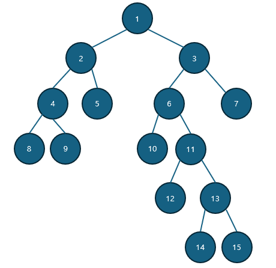

부모 노드 배열의 점화식을 이용해 배열의 값을 채워보겠습니다.

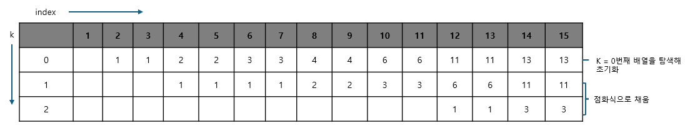

초기화된 배열을 바탕으로 K를 1개씩 증가시키면서 나머지 배열을 채움니다. 이해를 돕기 위해 14의 $2^2$번째, 즉 4번째 부모 노드 (P[2][14])를 예시로 구해보겠습니다.

```
P[2][14] = P[1][P[1][14]]
=> P[1][14] = P[0][P[0][14]] = P[0][13] = 11
=> P[2][14] = P[1][11]
=> P[1][11] = P[0][P[0][11]] = P[0][6] = 3

=> P[2][14] = 3
```

#### 2. 선택된 두 노드의 깊이 맞추기

P 배열을 이용해 기존에 한단계씩 맞췄던 깊이를 $2^k$단위로 넘어가면서 맞춥니다. 예를 들어 노드 2와 노드 15의 깊이를 맞춰 보겠습니다. 노드 2의 깊이는 1, 노드 15의 깊이는 5로 두 노드의 깊이 차이는 4입니다.

깊이를 맞추기 위해 더 깊이 있는 노드 15의 4번째 부모 노드를 P배열을 이용해 찾습니다. 4 = $2^2$이므로 K = 2이고, P[2][15] = 3이므로 노드 3으로 이동하면 노드 2와 높이를 맞추게 됩니다.

만약 높이 차이가 20이라고 가정하면 $2^k$ <= 20 을 만족하면서 k가 최대가 되는 만큼 이동하면서 높이 차이가 0이 될 때까지 반복합니다. 즉, 높이 차이가 20일 경우에는 $2^4(16)$ -> $2^2(4)$와 같이 두번 이동 하면 됩니다.

#### 3. 최소 공통 조상 찾기

공통 조상을 찾는 작업 역시 한 단계씩이 아닌 $2^K$단위로 점프하면서 맞춥니다. K값을 1씩 감소하면서 P 배열을 이용해 최초로 두 노드의 부모가 달라지는 값을 찾습니다.

```
P[2][14] =  3 == P[2][15] = 3
P[1][14] = 10 != P[1][15] = 11
```

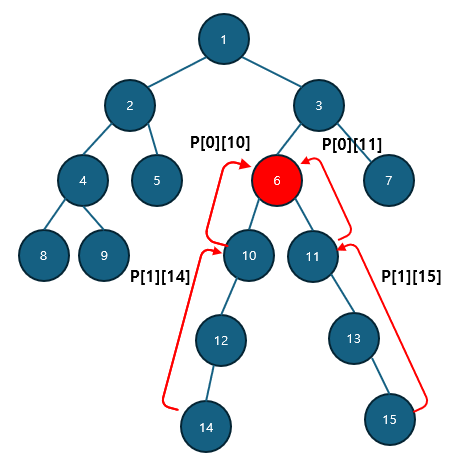

최초로 달라지는 K에 대한 두 노드의 부모 노드를 찾아 이동합니다. 즉, 노드 10, 노드 11로 이동합니다. 이를 K가 0이 될때까지 반복합니다. 반복문이 종료된 후 이동한 2개의 노드가 같은 노드라면 해당 노드가, 다른 노드라면 바로 위의 부모 노드가 최소 공통 조상이 됩니다.

여기에서 노드 10, 11이 다른 노드이기 때문에 바로 위 노드를 뜻하는 P[0][10] 또는 P[0][11], 즉 노드 6이 최소 공통 조상이 됩니다.

```
P[0][10] = 6
==
P[0][11] = 6

=> LCA(14,15) = 6
```

---

### $[문제077]$ 최소 공통 조상 구하기 1

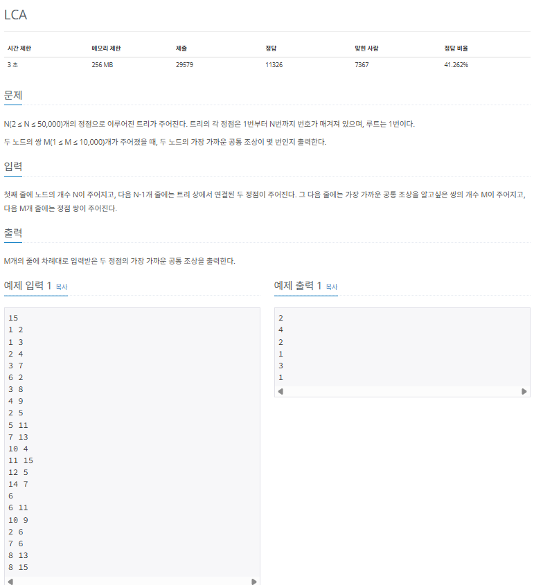

### $[01단계]$ 문제 분석하기

질의 개수가 10,000개이며 노드 개수가 50,000개로 비교적 데이터가 크지 않아 일반적인 방식의 lca 알고리즘으로 구현하면 되는 문제입니다. 기존에 공부했던 '일반적인 최소 공통 조상 구하기' 이론을 복습해보고, 이 문제를 이용해 실제로 구현해 보겠습니다.

### $[02단계]$ 손으로 풀어보기

1. 인접 리스트로 트리 데이터를 구현합니다.

2. 탐색 알고리즘 (DFS,BFS)를 이용해 각 노드의 깊이를 구합니다. 여기서는 LCA(6,11)에 해당하는 두 노드만 살펴보겠습니다.

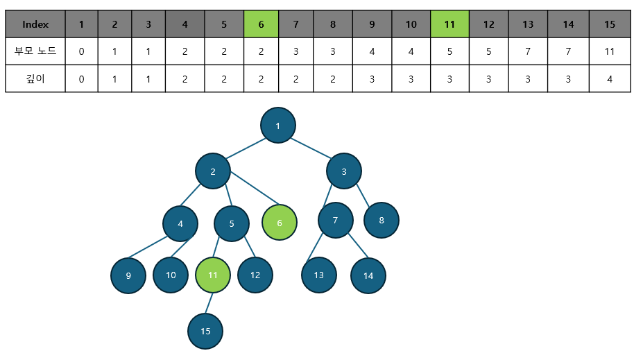

3. 깊이를 맞추기 위해 더 깊은 노드를 같은 깊이가 될 때까지 부모 노드로 이동합니다. 깊이가 1만큼 차이가 나므로 깊이가 3인 11번 노드를 부모 노드인 5번 노드로 이동합니다.

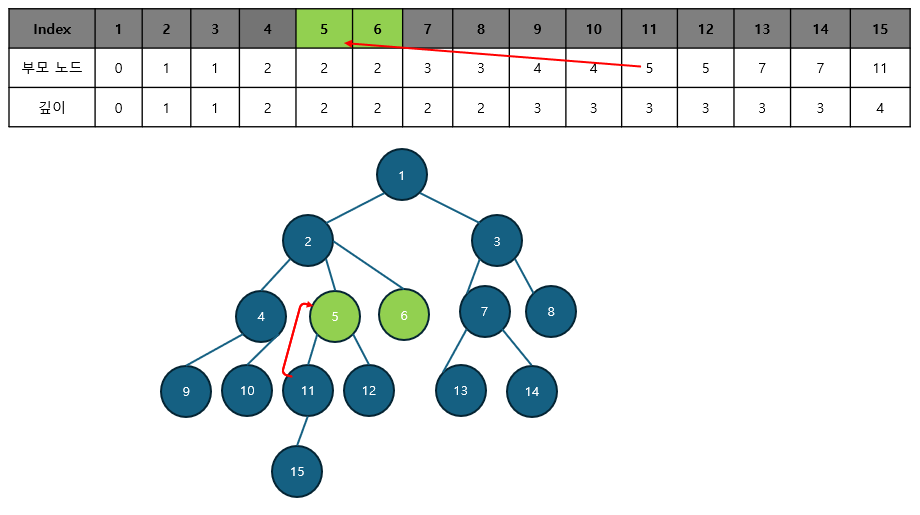

4. 부모 노드로 계속 올라가면서 최소 공통 조상을 찾습니다. 한번 더 이동하면 부모 노드가 2로 같아지므로 노드 6과 11의 최소 공통 조상은 2번 노드입니다.

### $[03단계]$ 슈도코드 작성하기

```
tree (인접 리스트 자료 구조)
N (수의 개수), M (질의 수)
depth (노드 깊이 배열), parent (노드 조상 배열)
visited (방문 여부 저장 배열)

for (N - 1 만큼 반복) {
  인접 리스트 tree 에 그래프 데이터 저장
}

BFS(1) // 깊이와 부모 노드를 BFS를 통하여 구하기

for (M의 개수만큼 반복) {
  a (1번 노드), b(2번 노드)
  executeLCA(a와 b의 LCA를 구하는 함수 호출 및 결괏값 출력)
}

---

// LCA를 구하는 함수 구현
executeLCA(1번 노드, 2번 노드) {
  1번 노드 (a) 깊이가 더 깊으면 1번 노드 (a)와 2번 노드 (b) SWAP
  // a 를 부모 노드로 변경하는 작업을 두 노드 깊이가 같아질 때까지 반복
  두 노드의 깊이를 동일하게 맞추기
  두 노드의 조상이 같을 때까지 두 노드를 각 노드의 부모 노드로 변경하는 작업 반복
  최소 공통 조상 반환
}

// BFS 구현
BFS {
  큐 자료구조에 시작 노드 넣기
  visited 배열에 시작 노드 방문 기록
  while (큐가 빌 때까지) {
    큐에서 노드 데이터를 가져오기
    for (현재 노드의 연결 노드 중 방문하지 않은 노드에 대해 반복) {
      큐에 데이터 삽입하고 visited 배열에 방문 기록
      부모 배열에 자신의 부모 노드 저장
      깊이 배열에 현재 깊이 저장
    }
    if (이번 깊이에 해당하는 모든 노드를 방문했을 때) {
      현재 트리의 방문 수를 0으로 초기화
      깊이 크기를 현재 큐의 크기로 초기화
      트리의 깊이를 1증가
    }
  }
}
```

### $[04단계]$ 코드 구현하기

```c
#include <iostream>
#include <vector>
#include <queue>
using namespace std;

static int N, M;
static vector<vector<int> > tree;
static vector<int> depth;
static vector<int> parent;
static vector<bool> visited;

int executeLCA(int a, int b);

void BFS(int node);

int main(int argc, char *argv[]) {
    cin >> N;

    tree.resize(N + 1);
    depth.resize(N + 1);
    parent.resize(N + 1);
    visited.resize(N + 1);

    // 인접 리스트에 그래프 데이터 저장
    for (int i = 0; i < N - 1; i++) {
        int s, e;
        cin >> s >> e;
        tree[s].push_back(e);
        tree[e].push_back(s);
    }

    // BFS를 이용하여 깊이 구하기
    BFS(1);

    cin >> M; // 질문 수
    for (int i = 0; i < M; i++) {
        // 공통 조상을 구할 두 노드
        int a, b;
        cin >> a >> b;

        int LCA = executeLCA(a, b);
        cout << LCA << "\n";
    }
    return 0;
}

// LCA 구현
int executeLCA(int a, int b) {
    if (depth[a] < depth[b]) {
        int temp = a;
        a = b;
        b = temp;
    }
    // 두 노드의 깊이 맞추기
    while (depth[a] != depth[b]) {
        a = parent[a];
    }

    // 같은 조상이 나올때까지 한칸씩 올리기
    while (a != b) {
        a = parent[a];
        b = parent[b];
    }
    return a;
}

void BFS(int node) {
    queue<int> myqueue;
    myqueue.push(node);
    visited[node] = true;
    int level = 1;
    int now_size = 1;
    int count = 0;

    while (!myqueue.empty()) {
        int now_node = myqueue.front();
        myqueue.pop();
        for (int next: tree[now_node]) {
            if (!visited[next]) {
                visited[next] = true;
                myqueue.push(next);
                parent[next] = now_node; // 부모 노드 저장
                depth[next] = level; // 노드 깊이 저장
            }
        }

        count++;
        if (count == now_size) {
            count = 0;
            now_size = myqueue.size();
            level++;
        }
    }
}
```

---

### $[문제078]$ 최소 공통 조상 구하기 2

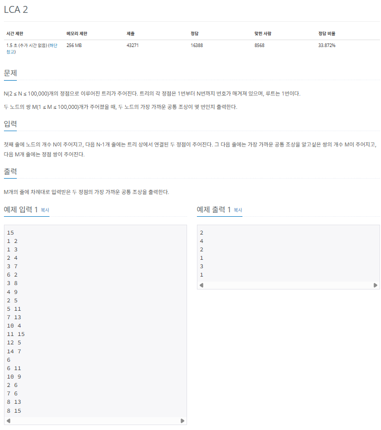

### $[01단계]$ 문제 분석하기

기존 LCA 문제보다 노드의 개수와 질의(M)의 개수가 매우 커진것을 확인할 수 있습니다. 그렇기 때문에 '일반적인 최소 공통 조상 구하기' 방식으로 이 문제를 구현하면 시간 초과가 발생합니다. '거듭제곱 형태를 이용한 최소 공통 조상 구하기'방식으로 이 문제를 해결해 봅시다.

### $[02단계]$ 손으로 풀어보기

1. 인접 리스트로 트리 데이터를 구현합니다.

2. 탐색 알고리즘 (DFS,BFS)을 이용해 각 노드의 깊이와 $2^0$번째 부모 노드를 구합니다.

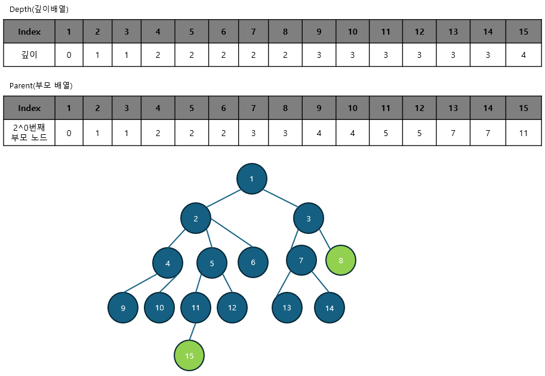

3. 점화식을 이용해 Parent 배열(부모 노드 배열)을 구합니다.

> 부모 노드 배열의 점화식

- P[K][N] = P[K - 1] [P[K - 1][N]]

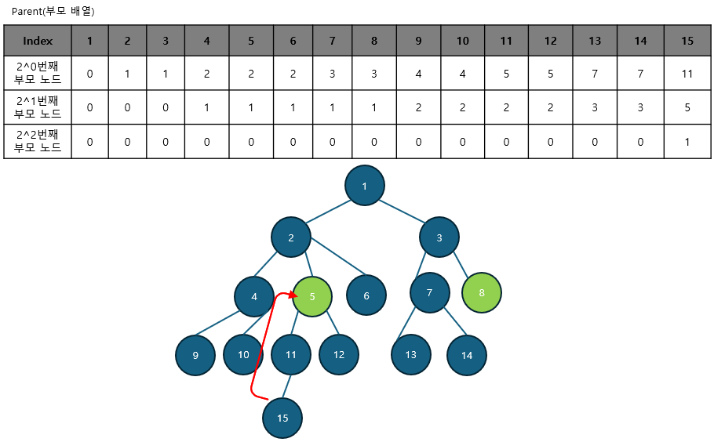

4. 여기에서는 예로 15와 8을 최소 공통 조상을 찾아보겠습니다. 깊이가 깊은 노드는 Parent 배열을 이용해 $2^k$만큼 빠르게 이동시켜 깊이를 맞추빈다. 깊이가 2만큼 차이 $(2^1)$가 나므로 15번 노드를 15의 $2^1$번째 부모 노드인 5로 변경해 깊이를 맞춥니다. 한 칸씩 오르는 것이 아닌 2의 거듭 제곱으로 빠르게 올라갑니다.

5. 부모 노드로 올라가면서 최소 공통 조상을 찾습니다. Parent 배열을 이용해 $2^k$만큼 넘어가면서 찾는게 핵심입니다. k는 depth 의 최댓값에서 1씩 감소합니다.

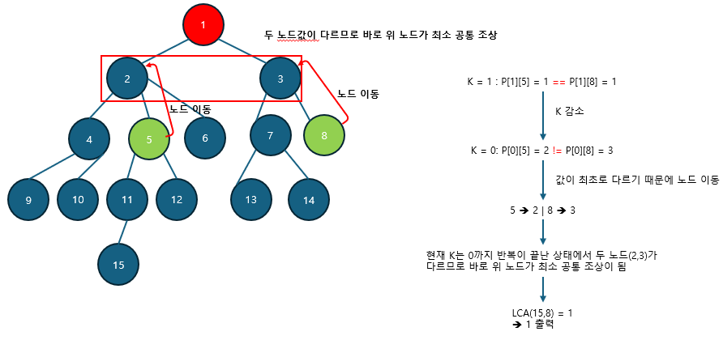

### $[03단계]$ 슈도코드 작성하기

```
tree (인접 리스트 자료구조)
N (수의 개수), M (질의 개수)
depth (노드 깊이 배열), parent (노드 조상 배열)
visited (방문 여부 저장 배열)

for (N - 1의 개수만큼 반복) {
  인접 리스트 tree 에 그래프 데이터 저장
}

kmax(최대 가능 깊이) 구하기

BFS(1) // 깊이와 부모 노드를 BFS를 통하여 구하여

for (kmax 만큼 반복) {
  for (노드 개수만큼 반복) {
    점화식으로 부모 구성하기 => parent[k][n] = parent[k - 1][parent[k - 1][n]]
  }
}

for (M의 개수만큼 반복) {
  a (1번 노드), b (2번 노드)
  executeLCA (a와 b의 LCA를 구하는 함수 호출 및 결괏값 출력)
}

---

// LCA를 구하는 함수 구현
executeLCA (1번 노드, 2번 노드) {
  1번 노드(a)가 깊이가 더 깊으면 1번 노드 (a)와 2번 노드 (b) SWAP
  // parent 배열을 이용하여 깊이를 맞추거나 조상 찾기를 빠르게 수행
  두 노드의 깊를 동일하게 맞추기
  두 노드의 같은 조상이 나올 때까지 각 노드를 각 노드의 부모 노드로 변경하는 작업 반복
  최소 공통 조상 반환
}

// BFS 구현
BFS {
  큐 자료구조에 시작 노드 넣기
  vsited 배열에 현재 노드 방문 기록

  while (큐가 빌 때가지) {
    큐에서 노드 데이터를 가져오기
    for (현재 연결 노드 중 반문하지 않은 노드에 대해 반복) {
      큐에 데이터 삽입하고 visited 배열에 방문 기록
      부모 배열에 자신의 부모 노드 저장
      깊이 배열에 현재 깊이 저장
    }
    if (이번 깊이에 해당하는 모든 노드를 방문했을 때) {
      현재 트리의 방문 수를 0으로 초기화
      깊이 크기를 현재 큐의 크기로 초기화
      트리의 깊이를 1증가
    }
  }
}
```

### $[04단계]$ 코드 구현하기

```c
#include <iostream>
#include <queue>
#include <vector>
#include <cmath>
#include <complex.h>
using namespace std;

static int N, M;
static vector<vector<int> > tree;
static vector<int> depth;
static int kmax;
static int parent[21][100001];
static vector<bool> visited;

int executeLCA(int a, int b);

void BFS(int node);

int main(int argc, char *argv[]) {
    cin >> N;
    tree.resize(N + 1);
    depth.resize(N + 1);
    visited.resize(N + 1);

    // 인접 리스트에 그래프 데이터 저장
    for (int i = 0; i < N; i++) {
        int s, e;
        cin >> s >> e;
        tree[s].push_back(e);
        tree[e].push_back(s);
    }

    int temp = 1;
    kmax = 0;

    // 최대 가능 깊이 구하기
    while (temp <= N) {
        temp <<= 1;
        kmax++;
    }

    // BFS로 깊이 배열 채우기
    BFS(1);

    // 점화식을 이용한 부모 배열 채우기
    for (int k = 1; k <= kmax; k++) {
        for (int n = 1; n <= N; n++) {
            parent[k][n] = parent[k - 1][parent[k - 1][n]];
        }
    }

    cin >> M;

    for (int i = 0; i < M; i++) {
        int a, b;
        cin >> a >> b;
        cout << executeLCA(a, b) << "\n";
    }
}

int executeLCA(int a, int b) {
    if (depth[a] > depth[b]) {
        swap(a, b);
    }

    // 깊이 빠르게 맞추기
    for (int k = kmax; k >= 0; k--) {
        if (pow(2, k) <= depth[b] - depth[a]) {
            if (depth[a] <= depth[parent[k][b]]) {
                b = parent[k][b];
            }
        }
    }

    // 조상 빠르게 찾기
    for (int k = kmax; k >= 0 && a != b; k--) {
        if (parent[k][a] != parent[k][b]) {
            a = parent[k][a];
            b = parent[k][b];
        }
    }

    int LCA = a;

    if (a != b) {
        LCA = parent[0][LCA];
    }
    return LCA;
}

void BFS(int node) {
    queue<int> myqueue;
    myqueue.push(node);
    visited[node] = true;
    int level = 1;
    int now_size = 1;
    int count = 0;

    while (!myqueue.empty()) {
        int now_node = myqueue.front();
        myqueue.pop();

        for (int next: tree[now_node]) {
            if (!visited[next]) {
                visited[next] = true;
                myqueue.push(next);
                parent[0][next] = now_node; // 부모 노드 저장
                depth[next] = level; // 노드 깊이 저장
            }
        }

        count++;
        if (count == now_size) {
            count = 0;
            now_size = myqueue.size();
            level++;
        }
    }
}
```
