## 조합 알아보기

조합(combination)은 $_n$$C_1$로 표현하고, 이는 n개의 숫자에서 r개를 뽑는 경우의 수를 뜻합니다. 조합과 비교되는 순열은 $_n$$P_1$로 표현하고, n개의 숫자 중 r개를 봅아 순서를 고려해 나열할 경우의 수를 이야기합니다. 순열과 조합의 차이는 선서의 고려 여부입니다. 즉, 조합에서는 데이터 1,2,3과 3,2,1을 같은 경우로 판단하고, 순열은 다른 경우로 판단합니다.

### 순열과 조합의 핵심 이론

이번 장의 제목이 조합인 이유는 실제 알고리즘 코딩 테스트에서는 순열보다 조합의 출제 빈도가 높고, 응용할 수 있는 문제도 많기 때문입니다. 문저 순열과 관련된 개념부터 간단하게 알아보고, 이후 조합을 자세하게 설명하겠습니다.

#### 순열

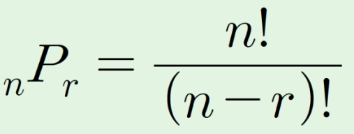

순열의 수학 공식은 위와 같습니다. 언뜻 보면 복잡한 것 같지만 어렵지 않습니다.예를 들어 5개 중 2개를 순서대로 선택하는 경우의 수를 구한다고 가정해보겠습니다.

1번째 선택은 5개 데이터를 선택할 수 있으므로 5가지를 선택할 수 있고, 2번째 선택은 1번째에서 선택한 데이터를 제외한 4가지를 선택할 수 있습니다. 따라서 5개 중 2개를 순서대로 고르는 경우의 수는 총 5 \* 4 = 20 가지가 됩니다. 위 수식은 이 내용을 공식화한 것입니다.

순열 개념을 간단하게 설명했으므로 이제 복격적으로 조합과 관련된 이야기를 해보겠습니다, 조합의 수학 공식은 다음과 같습니다.

#### 조합

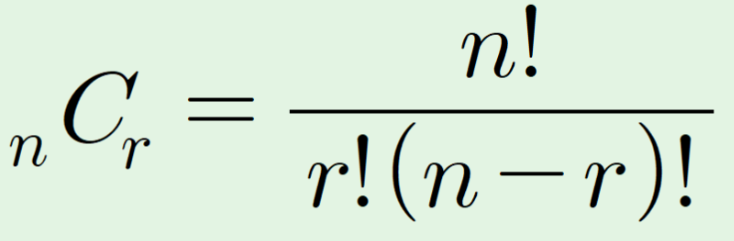

순열과 매우 비슷하며 분모에 r!만 추가된것을 확인할 수 있습니다. r!은 무엇을 의미할까요? 바로 순서가 다른 경우의 수를 제거하는 역할을 합니다.

예를 들어 5개 중 2개를 선택하는 경우의 수를 구한다고 가정하면 기존 순열의 경우의 수에 2!로 나눠 5 \* 4 / 2 = 10 가지 경우의 수를 도출합니다. 즉, 1과 2를 선택할 대와 2와 1을 선택할 때를 1가지 경우의 수로 만들기 위해 2로 나누는 것입니다.

지금부터 알고리즘을 위한 핵심사항을 설명하겠습니다. 일반적으로 조합은 12장에서 배우는 '동적 계획법'의 시작이라고 볼 수 있습니다. 따라서 알고리즘에서 조합을 구현할 때는 위의 수학 공식을 코드화하지 않고 점화식을 사용해 표현합니다. 조합의 점화식은 어떻게 될까요? 3단계로 점화식을 세워보겠습니다.

#### 1. 특정 문제를 가정하기

먼저 적당한 조합 문제를 가정해 봅니다. 5개의 데이터에서 3개를 선택하는 조합의 경우의 수를 푸는 문제로 가정해보겠습니다.

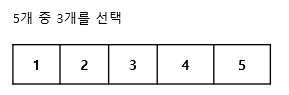

#### 2. 모든 부분 문제가 해결된 상황이라고 가정하고 지금 문제 생각하기

모든 부분 문제가 해결된 상황이라고 가정해보겠습니다. 먼저 5개의 데이터 중 4개가 이미 선택 여부가 결정된 데이터라고 가정합니다. 그리고 5번째 데이터의 선택 여부에 따른 경우의 수를 계산합니다. 만약 5번째 데이터를 포함해 총 3개의 데이터를 선택하려면 선택이 완료됐다고 가정한 4개의 데이터에서 2개가 선택되어있어야 합니다. 5번째 데이터를 포함하지 않고 총 3개의 데이터를 선택하려면 이전 데이터 4개 중 3개가 선택되어있어야 합니다. 이 2가지 경우의 수를 합치면 데이터 5개 중 3개를 선택하는 경우의 수가 나옵니다.

> 모든 부분 문제가 해결된 상황이라고 가정하는 방법은 조합뿐 아니라 동적 계획법에서도 곡 필요하므로 확실하게 이해하고 넘어가세요.

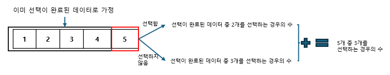

앞 그림을 점화식으로 표현한면 다음과 같습니다.

> 5개 중 3개를 선택하는 경우의 수 점화식

```
D[5][3] = D[4][2] + D[4][3]
```

이 내용을 도출할 때 고민하는 부분이 '4개중 2개를 선택하는 경우의 수와 4개 중 3개를 선택하는 경우의 수를 구해야 하는 거 아닌가?' 입니다. 하지만 앞에서도 언급했듯이 모든 부분 문제가 해결됐다고 가정해야 합니다. 지금은 5개 중 3개의 경우의 수를 구하는 것이 아니라 궁극적으로 조합과 관련된 점화식을 도출하는 것이기 때문이죠. 점화식을 정확하게 도출하면 부분 문제는 프로그램 로직을 이용해 자연스럽게 구할 수 있습니다.

#### 3. 특정 문제를 해결한 내용을 바탕으로 일반 점화식 도출하기

다음 일반화된 점화식을 이용하면 조합과 관련된 모든 경우의 수를 쉽게 구할 수 있습니다.

> 조합 점화식

```
D[i][j] = D[i - 1][j] + D[i - 1][j - 1]
```

점화식이 간단하므로 외울 수도 있겠지만, 앞에서 설명한 원리를 정확하게 이해하는 것이 문제에 응용하기 유리합니다.

---

### $[문제079]$ 이항계수 구하기 1

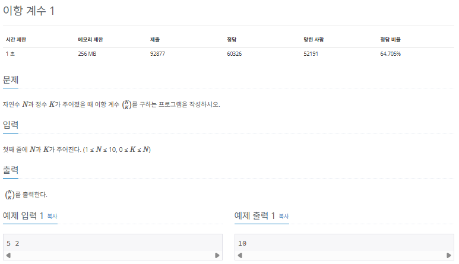

### $[01단계]$ 문제 분석하기

조합에서 가장 기본이 되는 문제입니다. 앞에서 배운 핵심 이론의 일반 점화식을 이용하면 이 문제를 쉽게 해결할 수 있습니다.

### $[02단계]$ 손으로 풀어보기

1. N과 K의 값을 입력받고 DP 테이블 (D[N + 1][N + 1]) 을 선언합니다. 그리고 DP 테이블의 값을 다음과 같이 초기화 합니다.

> DP 테이블 초기화

```
D[i][1] = i // i개 중 1개를 선택하는 경우의 수는 i개
D[i][0] = 1 // i개 중 0개를 선택하는 경우의 수는 1개
D[i][i] = 1 // i개 중 i개를 선택하는 경우의 수는 1개
```

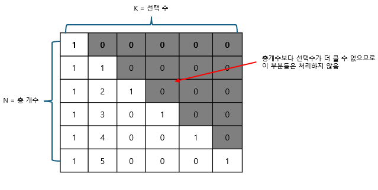

2. 점화식으로 DP 테이블의 값을 채웁니다.

> 조합 점화식

```
D[i][j] = D[i - 1][j] + D[i - 1][j - 1]
```

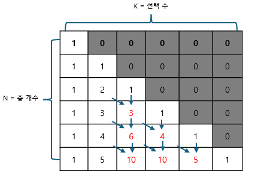

3. D[N][K]의 값을 출력합니다.

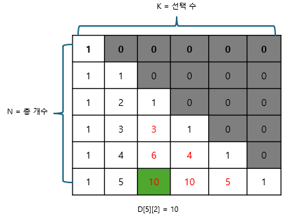

### $[03단계]$ 슈도코드 작성하기

```
N (전체 수), K (고르는 수)
D (DP 테이블)

// DP 테이블 초기화하기
for (i -> N 만큼 반복) {
  D[i][1] = i // i개 중 1개를 선택하는 경우의 수는 i개
  D[i][0] = 1 // i개 중 0개를 선택하는 경우의 수는 1개
  D[i][i] = 1 // i개 중 i개를 선택하는 경우의 수는 1개
}

for (i -> N 만큼 반복) {
  // 고르는 수의 개수가 전체 개수를 넘을 수 없음
  for (j -> i 만큼 반복) {
    // 조합 점화식
    D[i][j] = D[i - 1][j] + D[i - 1][j - 1]
  }
}
```

### $[04단계]$ 코드 구현하기

```c
#include <iostream>
using namespace std;

static int N, K;
static int D[11][11];

int main(int argc, char *argv[]) {
    cin >> N >> K;

    // DP 테이블 초기화하기
    for (int i = 0; i <= N; i++) {
        D[i][1] = i; // i개 중 1개를 선택하는 경우의 수는 i개
        D[i][0] = 1; // i개 중 0개를 선택하는 경우의 수는 1개
        D[i][i] = 1; // i개 중 i개를 선택하는 경우의 수는 1개
    }

    for (int i = 2; i <= N; i++) {
        for (int j = 1; j < i; j++) {
            // 조합 점화식
            D[i][j] = D[i - 1][j] + D[i - 1][j - 1];
        }
    }

    cout << D[N][K] << endl;
}
```

---

### $[문제080]$ 이항계수 구하기 2

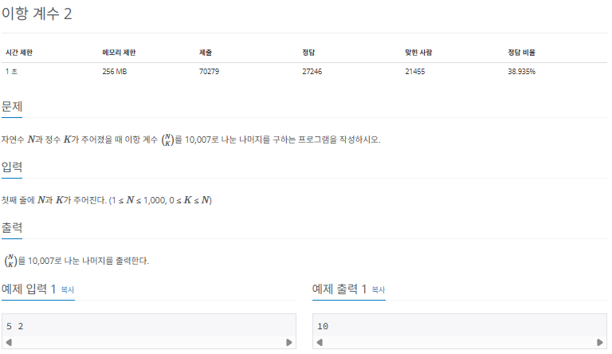

### $[01단계]$ 문제 분석하기

바로 앞의 이항계수 문제와 동일하지만, 단지 N의 범위가 커진 상태이고, 결괏값을 10,007로 나눈 나머지를 출력하는 요구사항이 있습니다. 다음과 같은 모듈러 연산의 특성을 이용해 이 문제를 해결할 수 있습니다.

> 모듈러 연산의 ㅌ특징

```
(A mod N + B mod N) mod N = (A + B) mod N
```

모듈러 연산은 덧셈에 관해 위와 같이 각각 묘듈러 연산하여 더한 값이 다시 모듈러 연산을 수행한 것과 두 수를 더한 후 수행한 것의 값이 동일하므로, 이 문제에서 DP 테이블에 결괏값이 나올 때마다 모듈러 연산을 수행하는 로직을 추가하면 문제를 해결할 수 있습니다.

### $[02단계]$ 손으로 풀어보기

1. N과 K의 값을 입력받고 DP 테이블 (D[N + 1][N + 1]) 을 선언합니다. 그리고 DP 테이블의 값을 다음과 같이 초기화 합니다.

> DP 테이블 초기화

```
D[i][1] = i // i개 중 1개를 선택하는 경우의 수는 i개
D[i][0] = 1 // i개 중 0개를 선택하는 경우의 수는 1개
D[i][i] = 1 // i개 중 i개를 선택하는 경우의 수는 1개
```

2. 점화식으로 DP 테이블의 값을 채웁니다. 이때 점화식의 결괏값이 나올 때마다 MOD 연산을 수행합니다.

> 조합 점화식

```
D[i][j] = D[i - 1][j] + D[i - 1][j - 1]
D[i][j] = D[i][j] % MOD
```

3. D[N][K]의 값을 출력합니다.

### $[03단계]$ 슈도코드 작성하기

```
N (전체 수), K (고르는 수)
D (DP 테이블)

// DP 테이블 초기화하기
for (i -> N 만큼 반복) {
  D[i][1] = i // i개 중 1개를 선택하는 경우의 수는 i개
  D[i][0] = 1 // i개 중 0개를 선택하는 경우의 수는 1개
  D[i][i] = 1 // i개 중 i개를 선택하는 경우의 수는 1개
}

for (i -> N 만큼 반복) {
  // 고르는 수의 개수가 전체 개수를 넘을 수 없음
  for (j -> i 만큼 반복) {
    // 조합 점화식
    D[i][j] = D[i - 1][j] + D[i - 1][j - 1]
    D[i][j] 값을 10007로 MOD 연산한 값으로 업데이트
  }
}
```

### $[04단계]$ 코드 구현하기

```c
#include <iostream>
using namespace std;

static int N, K;
static int D[11][11];

int main(int argc, char *argv[]) {
    cin >> N >> K;

    // DP 테이블 초기화하기
    for (int i = 0; i <= N; i++) {
        D[i][1] = i; // i개 중 1개를 선택하는 경우의 수는 i개
        D[i][0] = 1; // i개 중 0개를 선택하는 경우의 수는 1개
        D[i][i] = 1; // i개 중 i개를 선택하는 경우의 수는 1개
    }

    for (int i = 2; i <= N; i++) {
        for (int j = 1; j < i; j++) {
            // 조합 점화식
            D[i][j] = D[i - 1][j] + D[i - 1][j - 1];
            D[i][j] %= 10007;
        }
    }

    cout << D[N][K] << endl;
}
```

---

### $[문제081]$ 부녀회장이 될테야

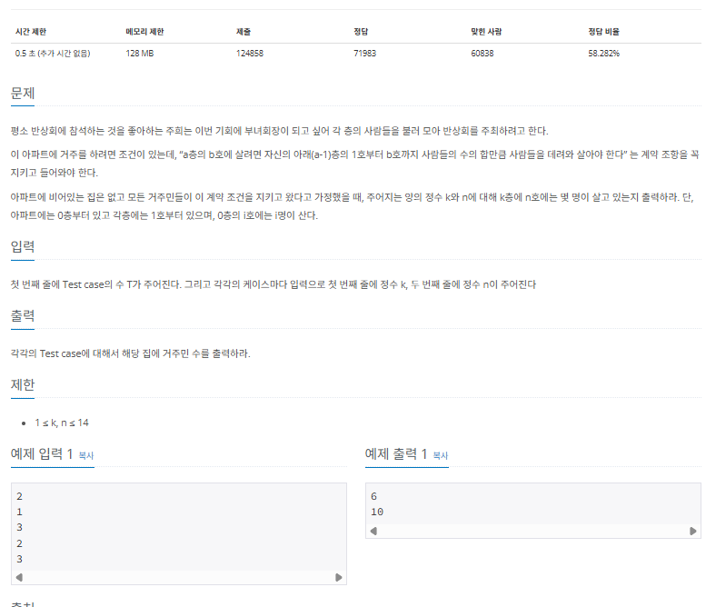

### $[01단계]$ 문제 분석하기

핵심 이론에서 구하고자 하는 값에 관해 일반화된 점화식을 도출하는 훈련을 해 봤습니다. 이 문제는 조합의 점화식을 도출하는 방법을 응용해 이 문제에서 사용할 점화식을 도출하면 쉽게 해결할 수 있습니다.

문제의 내용을 살펴보겠습니다. 'a층의 b호에 살려면 자신의 아래층 (a-1)의 1호부터 b호까지 사람들 수의 합만큼 사람들을 데려와 살아야한다.' 라는 내용은 다음 표 처럼 표현할 수 있습니다.

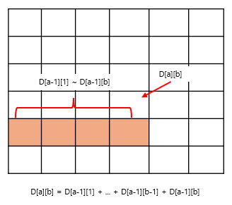

위 내용을 좀 더 응용하면 다음과 같이 점화식을 변경할 수 있습니다. a층 b호는 a층 b - 1호의 값에 자기 아래층(a - 1층 b호)의 사람 수만 더하면 된다는 것을 알 수 있습니다. 이 내용을 적용해 일반화된 점화식을 도출하면 다음과 같습니다.

```
D[a][b] = D[a-1][1] + ... D[a-1][b-1] + D[a-1][b]

==> D[a][b] = D[a][b-1] + D[a-1][b]
```

이렇게 도출된 점화식을 이용해 문제를 출어 보겠습니다. 층의 수가 매우 적은 편이므로 먼저 모든 아파트 층수에 관해 값을 구해 놓고 테스트 케이스를 실행하는 방향으로 구조를 잡겠습니다.

### $[02단계]$ 손으로 풀어보기

1. DP 테이블을 다음과 같이 초기화 합니다.

> DP 테이블 초기화

```
D[i][1] = 1 // 1호실에는 항상 값을 1로 초기화
D[0][i] = i // 0층 i호의 수는 i로 초기화
```

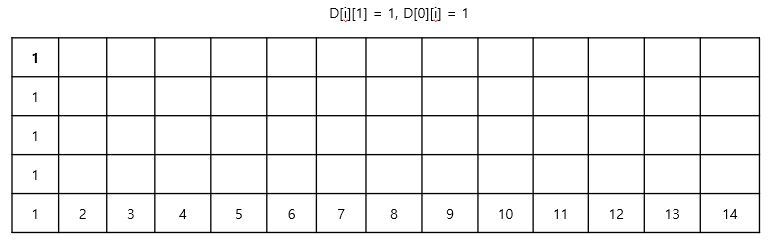

2. DP 테이블을 다음 점화식을 활용해 채웁니다.

> 점화식

```
D[i][j] = D[i][j - 1] + D[i - 1][j]
```

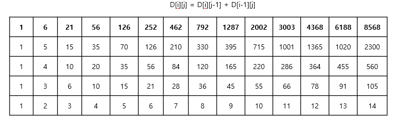

3. 질의와 관련된 D[K][N]값을 출력합니다.

### $[03단계]$ 코드 구현하기

```c
#include <iostream>
using namespace std;

static int T, N, K;
static int D[15][15];

int main(int argc, char *argv[]) {
    // DP 테이블 초기화하기
    for (int i = 0; i < 15; i++) {
        D[i][1] = 1;
        D[0][i] = i;
    }

    for (int i = 1; i < 15; i++) {
        for (int j = 2; j < 15; j++) {
            // 조함 점화식
            D[i][j] = D[i][j - 1] + D[i - 1][j];
        }
    }

    cin >> T;

    for (int i = 0; i < T; i++) {
        cin >> K >> N;
        cout << D[K][N] << endl;
    }
}
```

---

### $[문제081]$ 다리 놓기

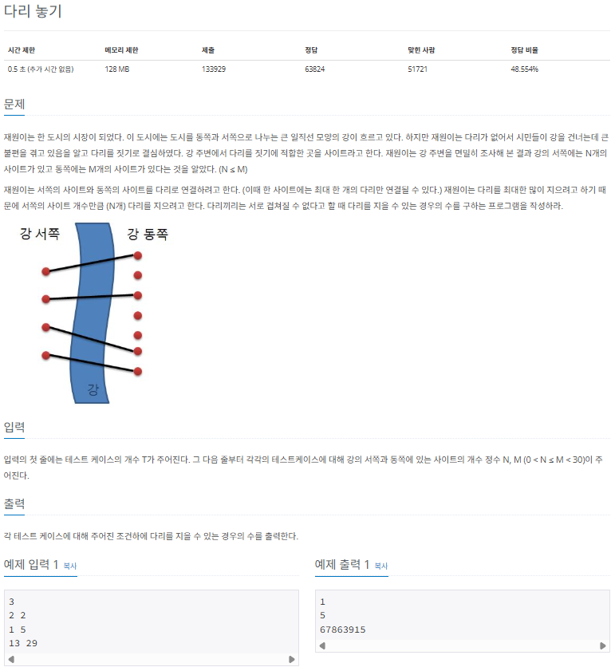

### $[01단계]$ 문제 분석하기

이 문제의 핵심은 '문제의 내용을 읽고 조합 문제로 생각할 수 있는가?' 입니다. 트깋 다리끼리는 서로 겹쳐질 수 없다는 조건이 이 문제를 쉽게 만들고 있습니다. 이 조건 때문에 이 문제를 M개의 사이트에서 N를 선택하는 문제로 변경할 수 있습니다. 겹치지 않게 하려면 동쪽에서 N개를 선택한 후 서쪽과 동쪽의 가장 위쪽 사이트에서부터 차례대로 연결할 수 밖에 없기 때문입니다. 결국 이 문제는 M개에서 N개를 뽑는 경우의 수를 구하는 조합 문제로 변형해 풀수 있습니다. 조합 점화식은 많은 문제에서 응용되기 때문에 앞에서 다룬 문제를 복습한다는 느낌입니다.

### $[02단계]$ 손으로 풀어보기

1. DP 테이블 (D[31][31]) 을 선언합니다. 그리고 DP 테이블의 값을 다음과 같이 초기화 합니다.

> DP 테이블 초기화

```
D[i][1] = i // i개 중 1개를 선택하는 경우의 수는 i개
D[i][0] = 1 // i개 중 0개를 선택하는 경우의 수는 1개
D[i][i] = 1 // i개 중 i개를 선택하는 경우의 수는 1개
```

2. 점화식을 이용해 DP 테이블을 채웁니다. 이때 N과 M의 최댓값이 30보다 작으므로 미리 DP 테이블의 값을 30까지 구합니다.

> 조합 점화식

```
D[i][j] = D[i - 1][j] + D[i - 1][j - 1]
```

3. 테스트 케이스를 실행해 출력합니다.

### $[03단계]$ 코드 구현하기

```c
#include <iostream>
using namespace std;

static int T, N, M;
static int D[31][31];

int main(int argc, char *argv[]) {
    // DP 테이블 초기화하기
    for (int i = 0; i <= 30; i++) {
        D[i][1] = i; // i개 중 1개를 선택하는 경우의 수는 i개
        D[i][0] = 1; // i개 중 0개를 선택하는 경우의 수는 1개
        D[i][i] = 1; // i개 중 i개를 선택하는 경우의 수는 1개
    }

    for (int i = 2; i <= 30; i++) {
        for (int j = 1; j < i; j++) {
            // 조함 점화식
            D[i][j] = D[i - 1][j] + D[i - 1][j - 1];
        }
    }

    cin >> T;

    for (int i = 0; i < T; i++) {
        cin >> N >> M;
        cout << D[M][N] << endl;
    }

}
```

---

### $[문제082]$ 조약돌 꺼내기

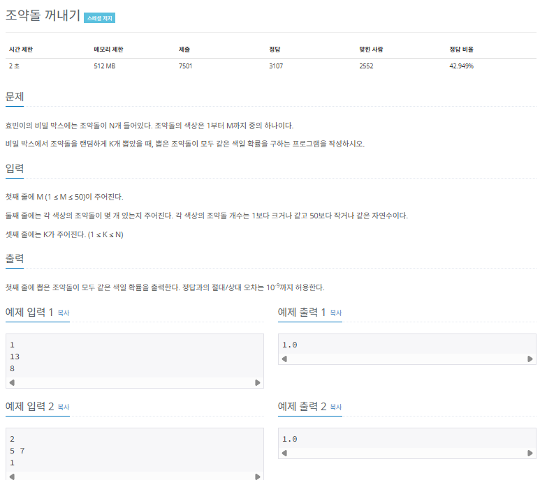

### $[01단계]$ 문제 분석하기

그동안 공부한 조합을 이용하려면 색깔별 조약돌의 개수에서 K개를 뽑을 수 있는 경우의 수를 구한후, 전체 돌에 대해 K개를 봅는 경우의 수를 나누면 이 문제를 쉽게 해결할 수 있습니다. 하지만 단순하게 확률식을 세워서 계산해도 풀 수 있습니다. 이 문제는 알고 있는 알고리즘에 문제를 맞추려 하지 말고 좀 더 다양하게 문제를 분석하는 습관을 길러 보는 것이 좋을 것 같아 선정했습니다.

### $[02단계]$ 손으로 풀어보기

1. 색깔별 조약돌의 개수를 D 배열에 저장하고, 전체 조약돌 개수를 변수 T에 저장합니다.

```
D 배열 (색깔별 개수 저장)
[5][6][7]

T (전체 조약돌 개수)
= 5 + 6 + 7
= 18
```

2. 한 색깔의 조약돌만 뽑을 확률을 색깔별로 모두 구합니다. 입력에서 K = 2이므로 2번 뽑을 동안 같은 색이 나올 확률을 구하면 됩니다.

```
5개의 조약돌이 있는 색깔만 뽑을 확률 : 5/18 * 4/17 = 0.065...
6개의 조약돌이 있는 색깔만 뽑을 확률 : 6/18 * 5/17 = 0.098...
7개의 조약돌이 있는 색깔만 뽑을 확률 : 7/18 * 6/17 = 0.137...
```

3. 각각의 확률을 더해 정답으로 출력합니다.

```
0.065... + 0.098... + 0.137...
= 0.300...
```

### $[03단계]$ 코드 구현하기

```c
#include <iostream>
using namespace std;

static int M, K, T;
static int D[51];
static double probability[51];
static double ans = 0.0;

int main(int argc, char *argv[]) {
    cin >> M;

    for (int i = 0; i < M; i++) {
        cin >> D[i];
        T += D[i];
    }

    cin >> K;

    for (int i = 0; i < M; i++) {
        if (D[i] >= K) {
            probability[i] = 1.0;
            for (int k = 0; k < K; k++) {
                probability[i] *= (double) (D[i] - k) / (T - k);
            }
        }
        ans += probability[i];
    }

    cout << fixed;
    cout.precision(9);
    cout << ans;

    return 0;
}
```

---

### $[문제084]$ 순열의 순서 구하기

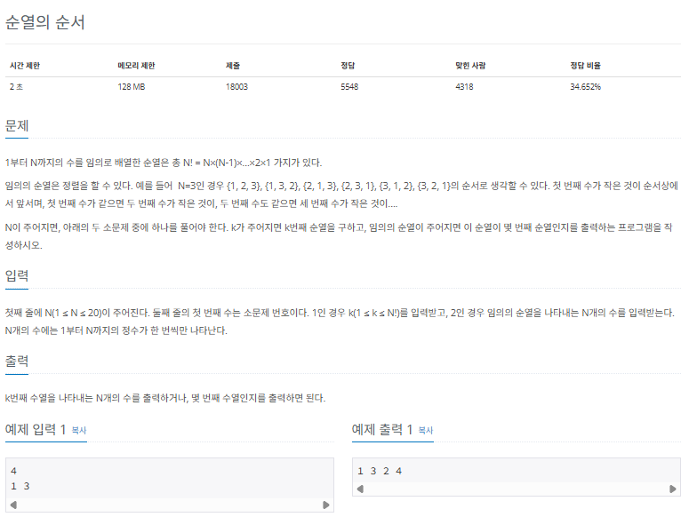

### $[01단계]$ 문제 분석하기

이 문제는 조합 문제와 다르게 순열의 개념을 알아야 풀 수 있습니다. 순열은 순서가 다르면 다른 경우의 수로 인정됩니다. N자리로 만들수 있는 순열의 경우의 수를 구해야한다는 것이 이 문제의 핵심입니다. 4자리로 표현되는 모든 경우의 수를 구하는 예제를 살펴보면서 좀 더 자세하게 설명하겠습니다. 가장 먼저 각 자리에서 사용할 수 있는 경우의 수를 구합니다.

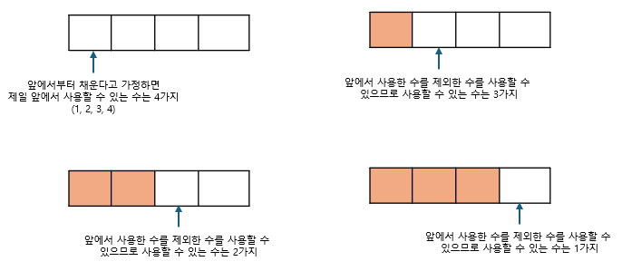

각 자리에서 구한 경우의 수를 모두 곱하면 모든 경우의 수가 나옵니다. 4자리로 표현되는 모든 경우의 수는 4 _ 3 _ 2 \* 1 = 4! = 24입니다. 이를 일반화하면 N 자리로 만들 수 있는 순열의 모든 경우의 수는 N!이라는 것을 알 수 있습니다.

### $[02단계]$ 손으로 풀어보기

1. 자릿수에 따른 순열의 경우의 수를 1부터 N자리까지 미리 계산합니다.

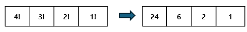

2. 소문제 1을 풀어보겠습니다. 예제 1을 이용해 K번째 순열을 출력합니다.

> K번째 순열 출력하기

1. 주어진 값(K)과 현재 자리(N) - 1에서 만들 수 있는 경우의 수를 비교한다.
2. 과정 1에서 K가 더 작아질 때까지 경우의 수를 배수(cnt)로 증가시킨다. (순열의 순서를 1씩 늘림).
3. K가 더 작아지면 순열에 값을 저장하고 K를 K - (경우의 수 \* (cnt - 1))로 업데이트 한다.
4. 순열이 완서오딜 때까지 과정 1 ~ 3을 반복하고 완료된 순열을 출력한다.

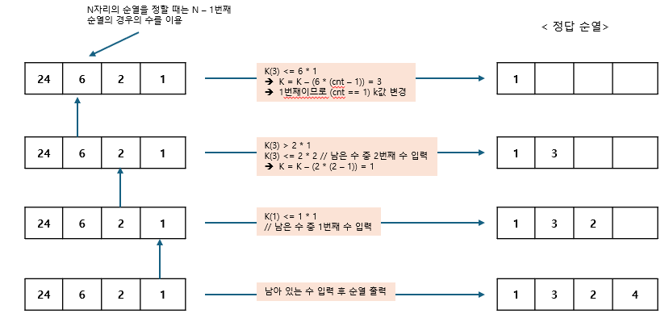

3. 소문제 2를 풀어보겠습니다. 예제 2를 이용해 입력된 순열의 순서 K를 구합니다.

> 입력된 순열의 순서 구하기

1. 현재 자릿수의 숫자를 확인하고 해당 숫자보다 앞 숫자 중 미사용 숫자를 카운트한다.
2. 미사용 숫자 개수 \* (현재 자리 - 1에서 만들 수 있는 순열의 개수)를 K에 더한다.
3. 모든 자릿수에 관해 과정 1 ~ 3을 반복한 후 K값을 출력한다.

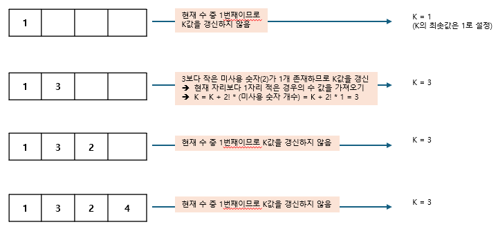

### $[03단계]$ 슈도코드 작성하기

```
F (자리별 만들 수 있는 경우의 수 저장 -> 팩토리얼 형태)
s (순열을 담는 배열)
visited (숫자 사용 여부 저장 배열)
N (순열의 길이)
Q (문제의 종류 -> 1이면 순열 출력, 2이면 순서 출력)
N , Q 입력받기

if (Q == 1 ->  순열을 출력하는 문제) {
  K (몇번째 순열을 출력할지 입력받기)
  -> 길이가 N인 순열의 K번째 순서의 순열을 출력해야 하는 문제

  for (i -> N만큼 반복) {
    cnt = 1 (해당 자리에서 몇번째 숫자를 사용해야 할지 정하는 변수)
    for (j -> N만큼 반복) {
        이미 사용한 숫자는 계산하지 않음
        if (현재 순서 < 해당 자리 순열 수 * cnt) {
          현재 순서 = 현재 순서 - (해당 자리 순열 수 * (cnt - 1))
          현재 자리에 j값 저장, 숫자 j를 사용 숫자로 체크
          반복문 종료
        }
      cnt++;
    }
  }
  배열 출력
}
// 순열의 순서를 출력하는 문제
else {
  K (순열의 순서 저장 변수)
  S (순열 배열 저장)

  for (i -> N 만큼 반복) {
    for (j -> S[i] 수만큼 반복) {
      if (visit[j] == false) {
        cnt++; // 미사용 숫자 개수만큼 카운트
      }
    }
    K = K + cnt * 현재 자릿수에서 만들 수 있는 경우의 수
    S[i]번째 숫자를 사용 숫자로 변경
  }
  K 출력
}
```

### $[04단계]$ 코드 구현하기

```c
#include <iostream>
#include <math.h>
using namespace std;

static int N, Q;
static long F[21], S[21];
static bool visited[21] = {false};

int main(int argc, char *argv[]) {
    cin >> N >> Q;
    F[0] = 1;

    // 팩토리얼 초기화 -> 각 자릿수에서 만들 수 있는 경우의 수
    for (int i = 1; i <= N; i++) {
        F[i] = F[i - 1] * 1;
    }

    if (Q == 1) {
        long K;
        cin >> K;

        for (int i = 1; i <= N; i++) {
            for (int j = 1, cnt = 1; j <= N; j++) {
                // 이미 사용한 숫자는 사용할 수 없음
                if (visited[j]) {
                    continue;
                }

                // 주어진 K에 따라 각 자리에 들어갈 수 있는 수 찾기
                if (K <= cnt * F[N - i]) {
                    K -= ((cnt - 1) * F[N - i]);
                    S[i] = j;
                    visited[j] = true;
                    break;
                }
                cnt++;
            }
        }
        for (int i = 1; i<= N; i++) {
            cout << S[i] << " ";
        }
    } else {
        long K = 1;

        for (int i = 1; i <= N; i++) {
            cin >> S[i];
            long cnt = 0;

            for (int j = 1; j < S[i]; j++) {
                // 미사용 숫자 개수만큼 카운트
                if (visited[j] == false) cnt++;
            }

            K += cnt * F[N - i]; // 자릿수 개수에 따라 순서 더하기
            visited[S[i]] = true;
        }
        cout << K << "\n";
    }
}
```

---

### $[문제085]$ 사전 찾기


### $[01단계]$ 문제 분석하기

사전에서 다루는 문자열이 a와 z밖에 없다는 점에 착안해 접근해보겠습니다. 핵심 아이디어는 a와 z의 개수가 각각 N,M개일 때 이 문자로 만들 수 있는 모든 경우의 수는 N + M개여서 N개를 뽑는 경우의 수 또는 N + M개에서 M를 뽑는 경우의 수와 동일하다는 것입니다.

### $[02단계]$ 손으로 풀어보기

1. 조합의 경우의 수를 나타내는 DP테이블을 초기화하고, 점화식으로 값을 계산해 저장합니다.

> 조합 점화식

```
D[i][j] = D[i - 1][j] + D[i - 1][j - 1]
```

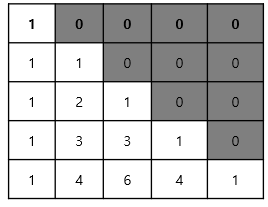

2. 몇번째 문자열을 표현해야 하는지를 나타내는 변수를 K라고 합시다. 현재 자릿수에서 a를 선택했을 때 남은 문자로 만들 수 있는 모든 경우의 수를 T라고 지정합니다. T와 K를 비교해 문자를 선택합니다.

> 문자 선택 기준

- T >= K : 현재 자리 문자를 a로 선택
- T < K : 현재 자리 문자를 z로 선택하고, K = K - T로 업데이트

```

a=2, z=2이고, a를 선택했을 때 나머지 문자열로 만들 수 있는 경우의 수는 D[3][2] (D[남은 문자 총 개수][남은 z 개수])
D[3][2] = 3 >= K(2)이므로 a 확정 => z는 2개남음
D[2][2] =  1 < K(2)이므로 z 확정 => z는 1개남음 => K = K - T = 1로 업데이트
D[1][1] = 1 >= K(1)이므로 a 확정 => z는 1개남음
D[0][1] =  0 < K(1)이므로 z 확정
```

3. 과정 2를 a와 z의 문자 수를 합친 만큼 반복해 정답 문자열을 출력합니다.

```
확정된 문자를 차례대로 출력
=> azaz
```

### $[03단계]$ 슈도코드 작성하기

```
N (a 문자 개수), M (z 문자 개수), K (순번)

// 조합 테이블 미리 만들기
for (i -> 0 ~ 200) {
  for (j -> 0 ~ i) {
    D[i][j] = D[i - 1][j] + D[i - 1][j - 1]; // 조합 점화식
    D[i][j] 값이 K의 범위를 벗어났을 때 K 범위의 최댓값으로 D[i][j] 저장하기
  }
}

if (불가능한 K이면) -1 출력

while (모든 문자를 사용할 때까지) {
  if (a 문자를 선택했을 때 남은 문자로 만들수 잇는 모든 경우의 수 >= K) {
    a 출력하기, a 문자 개수 감수 (N--)
  }
  else {
    z 출력하기, z 문자 개수 감수 M--
    k의 값을 계산된 모든 경우의 수를 뺀 값으로 저장하기
  }
}
```

### $[04단계]$ 코드 구현하기

```c
#include <inttypes.h>
#include <iostream>
using namespace std;

static int N, M, K;
static long D[202][202];

int main(int argc, char *argv[]) {
    cin >> N >> M >> K;

    // 조합 테이블 초기화
    for (int i = 0; i <= 200; i++) {
        for (int j = 0; j <= i; j++) {
            if (j == 0 || j == i) {
                D[i][j] = 1;
            } else {
                D[i][j] = D[i - 1][j] + D[i - 1][j - 1];
                // K 범위를 넘어가면 범위 최댓값 저장
                if (D[i][j] > 1000000000) {
                    D[i][j] = 1000000001;
                }
            }
        }
    }

    if (D[N + M][M] < K) {
        cout << "-1";
    } else {
        while (!(N == 0 && M == 0)) {
            if (D[N - 1 + M][M] >= K) {
                cout << "a";
                N--;
            } else {
                cout << "z";
                K = K - D[N - 1 + M][M];
                M--;
            }
        }
    }
}
```

---

### $[문제085]$ 사전 찾기

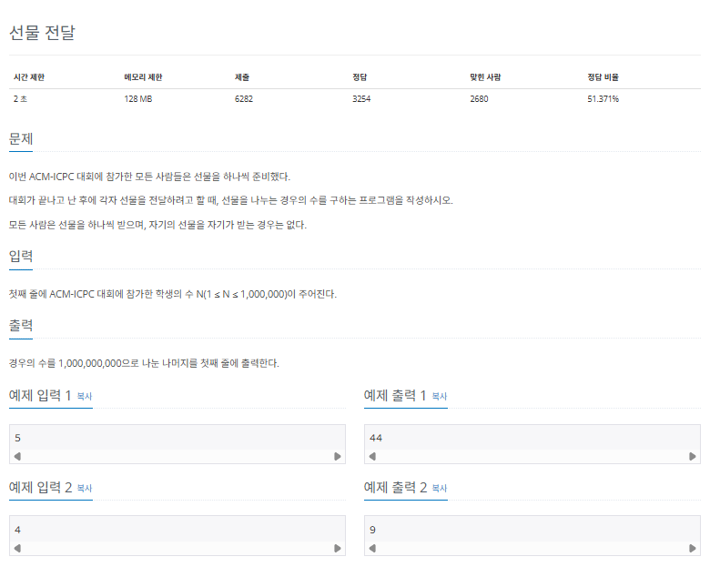

### $[01단계]$ 문제 분석하기

조합에서 다루기는 하지만 완전 순열이라는 개념의 문제입니다. 완전 순열의 개념은 n개의 원소 집합에서 원소들을 재배열할 때 이전과 같은 위치에 배치되는 원소가 1개도 없을 때를 말합니다.

하지만 이 문제에서 필요한 것은 완전 순열의 개념이 아니라 문제에 주어진 조건에 따라 적절한 점화식을 도출해 내는 역량입니다. 물론 완전 순열의 점화식은 쉽게 찾아볼 수 있습니다. 하지만 이 책에서는 스스로 점화식을 논리적으로 도출하는 훈련을 해보겠습니다.

### $[02단계]$ 손으로 풀어보기

1. D[N]테이블의 의미를 N명일 때 선물을 교환할 수 있는 모든 경우의 수로 정합니다. N명이 존재한다고 가정하고 A가 B라는 학생에게 선물을 줬다고 가정해 보겠습니다. 이때 교환 방식은 다음 2가지 방식만이 존재합니다.

> 선물을 교환하는 2가지 방식

- B도 A에게 선물을 줬을때 (양방향 교환)
  - N명 중 2명이 교환을 완료했으므로 남은 경우의 수는 D[N - 2]
- B는 A가 아닌 다른 친구에게 선물을 전달할 때 (단방향 교환)
  - N명 중 B만 받은 선물이 정해진 상태이므로 남은 학생은 N - 1이며 경우의 수는 D[N - 1]

이는 A가 B라는 학생에게 선물을 준 것으로 가정하고 경우의 수를 생각한 것이지만 실제로는 A는 자기 자신이 아닌 N - 1에게 선물을 전달할 수 있습니다.

이 내용을 이용해 도출해 낸 완전 순열의 경우의 수를 구하는 점화식은 다음과 같습니다.

> 완전 순열 점화식

```
D[N] = (N - 1) * (D[N - 2] + D[N - 1])
```

도출해 낸 점화식을 이용하면 이 문제는 쉽게 풀 수 있습니다.

2. DP 테이블을 초기화합니다.

```
D[1] = 0 // 한명은 다른 사람에게 선물할 수 없음
D[2] = 1 // 두명의 경우 서로 교환하는 경우의 수만 존재
```

3. 완전 순열 점화식으로 정답을 구합니다.

```
D[3] = (3 - 1) * (D[2] + D[1]) = 2
D[4] = (4 - 1) * (D[3] + D[2]) = 9
D[5] = (5 - 1) * (D[4] + D[3]) = 44
```

### $[03단계]$ 슈도코드 작성하기

```
D (N명일 때 선물을 교환할 수 있는 모든 경우의 수)
D[1] = 0 // 혼자서는 선물을 교환할 수 없음
D[2] = 1 // 2명일 경우에는 서로 교환하는 경우의 수만 존재

for (i -> 3 ~ N) {
  i 명이 교환할 수 있는 모든 경우의 수 = (i - 1) * (D[i - 2] + D[i - 1]) % mod
  // 값에 넣기 전에 항상 % 수행
}

D[N] 값 출력
```

### $[04단계]$ 코드 구현하기

```c
#include <iostream>
using namespace std;

static int N;
static int mod = 1000000000;
static long D[1000001];

int main(int argc, char *argv[]) {

    cin >> N;
    D[1] = 0;
    D[2] = 1;

    for (int i = 3; i <= N; i++) {
        D[i] =  (i - 1) * (D[i - 2] + D[i - 1]) % mod; // 완전 순열 점화식
    }

    cout << D[N];

    return 0;
}
```
