## 동적 계획법 알아보기

동적 계획법 (dynamic programming)은 복잡한 문제를 여러개의 간단한 문제로 분리하여 부분의 문제들을 해결함으로써 최종적으로 복잡하 문제의 답을 구하는 방법을 뜻합니다.

### 동적 계획법의 핵심 이론

동적 계획법의 원리와 구현 방식은 다음과 같습니다.

> 동적 계획법의 원리와 구현 방식

1. 큰 문제를 작은 문제로 나눌 수 있어야 한다.
2. 작은 문제들이 반복돼 나타나고 사용되며 이 장은 문제들의 결괏값은 항상 같아야한다.
3. 모든 작은 문제들은 한번만 계산해 DP 테이블에 저장하며 추후 사용할 때는 이 DP 테이블을 이용한다. 이를 메모이제이션(memoization)기법이라고 한다.
4. 동적 계획법은 톱-다운(top-down) 방식과 바텀-업(bottom-up)방식으로 구현할 수 있다.

동적 계획법의 가장 대표적인 문제인 피보나치 수열을 예로 들어 설명하겠습니다.

> 피보나치 수열 공식

```
D[N] = D[N - 1] + D[N - 2]  // N번째 수열 = N - 1번째 수열 + N - 2번째 수열
```

### 1. 동적 계획법으로 풀수 있는지 확인하기

6번째 피보나치 수열은 5번째 피보나치 수열과 4번째 피보나치 수열의 합입니다. 즉, 6번째 피보나치 수열을 구하는 문제는 5번째 피보나치 수열과 4번째 피보나치 수열을 구하는 작은 문제로 나눌 수 있고, 수열의 값은 항상 같기 때문에 동적 계획법으로 풀 수 있습니다.

### 2. 점화식 세우기

점화식을 세울 때는 논리적으로 전체 문제를 나누고, 전체 문제와 부분 문제간의 인과관계를 파악하는 훈련이 필요합니다. 이 부분은 다양한 실전 문제를 풀면서 자연스럽게 훈련되므로 걱정하지 마세요. 이 예제는 피보나치 수열의 공식 자체가 점화식이므로 공식을 점화식으로 사용하겠습니다.

즉, 피보나치 수열의 점화식은 D[i] = D[i - 1] + D[i - 2] 가 됩니다.

### 3. 메모이제이션 원리 이해하기

메모이제이션은 부분 문제를 풀었을 때 이 문제를 DP 테이블에 저장해 놓고 다음에 같은 문제가 나왔을 때 재계산하지 않고 DP 테이블의 값을 이용하는 것을 말합니다. 다음 그림을 보면 위에서 2번째와 3번째 피보나치 수열은 맨 왼쪽 탐색 부분에서 최초로 값이 구해지고, 이때 DP 테이블에 값이 저장됩니다. 이에 따라 나중에 2번째와 3번째 피보나치 수열의 값이 필요할 때 재연산을 이용해 구하지 않고, DP 테이블에서 바로 값을 추출합니다. 이러한 방식을 사용하면 불필요한 연산과 탐색이 줄어 들어 시간 복잡도 측명에서 많은 이점을 얻을 수 있습니다.

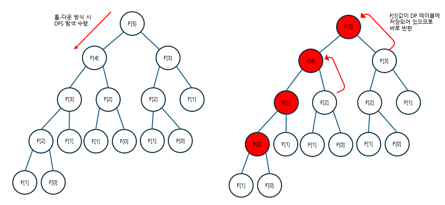

```
위 그림은 메모이제이션으로 5번째 피보나치 수열의 수 구하기
```

### 4. 톱-다운 구현 방식 이해하기

톱-다운 구현 방식은 말 그대로 위에서부터 문제를 파악해 내려오는 방식으로, 주로 재귀함수 형태로 코드를 구현합니다. 코드의 가독성이 좋고, 이해하기 편하다는 장점이 있습니다.

```c
#include <iostream>
#include <vector>
using namespace std;

static int N;
static vector<int> D;
int fibo(int n);

int main(int argc, char* argv[])
{
    cin >> N;
    D.resize(N + 1);

    for (int i = 0; i <= N; i++)
        D[i] = -1;

    D[0] = 0;
    D[1] = 1;
    fibo(N);
    cout << D[N];

    return 0;
}

// 피보나치 수열 - 톱-다운 형식
int fibo(int n)
{
    // 기존에 계산한 적이 잇는 부분 문제는 다시 계산하지 않고 반환
    if (D[n] != -1) return D[n];
    // 메모이제이션 : 구한 값을 바로 반환하지 않고 테이블에 저장 후 반환하도록 구현
    return D[n] = fibo(n - 2) + fibo(n - 1);
}
```

### 5. 바텀-업 구현 방식 이해하기

가장 작은 부분 문제부터 문제를 해결하면서 점점 큰 문제로 확장해 나가는 방식입니다. 주로 반복문의 형태로 구현합니다.

```c
#include <iostream>
#include <vector>
using namespace std;

static int N;
static vector<int> D;

int main(int argc, char* argv[])
{
    cin >> N;
    D.resize(N + 1);

    for (int i = 0; i <= N; i++)
        D[i] = -1;

    D[0] = 0;
    D[1] = 1;

    // 피보나치 수열 - 바텀-업 형식
    for (int i = 2; i <= N; i++)
    {
        D[i] = D[i - 1] + D[i - 2];
    }

    cout << D[N];

    return 0;
}
```

두 방식 중 좀 더 안전한 방식은 바텀-업 입니다. 톱-다운 방식은 재귀 함수의 형태로 구현돼 있기 때문에 재귀의 깊이가 매우 깊어질 경우 런타임 에러가 발생할 수 있습니다. 하지만 실제 코딩 테스트에서 이 부분까지 고려해야 하는 문제는 잘 나오지 않습니다. 오히려 자신이 구현한 함수에 버그가 있을 확률이 더 높을 것입니다. 이 부분을 제외하면 두 방식의 차이점은 거의 없다고 할 수 있습니다. 자신에게 좀 더 편한 방식이나 문제에 따라 두 방식 중 1개를 선택해 사용하면 됩니다.

동적 계획법은 매우 중요하므로 가장 만흥ㄴ 문제를 다룰 예정입니다.

---

### $[문제087]$ 정수를 1로 만들기

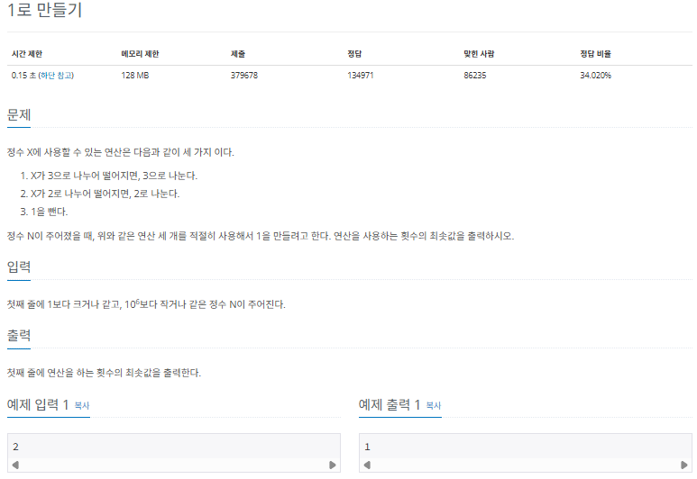

### $[01단계]$ 문제 분석하기

사용할 수 있는 3가지 연산을 바텀-업 방식으로 구현할 수 있을지를 연습해보는 문제입니다. 본격적인 동적 꼐획법 학습에 앞서 주어진 조건을 점화식으로 변형해 코드화하는 훈련을 해보겠습니다.

### $[02단계]$ 손으로 풀어보기

1. 예제를 풀어보겠습니다. 먼저 점화식의 형태와 의미를 도출합니다.

```
D[i] : i에서 1로 만드는 데 걸리는 최소 연산 횟수
```

2. 점화식을 구현합니다.

```
D[i] = D[i - 1] + 1                             // 1을 빼는 연산이 가능합니다.
if (i % 2 == 0) D[i] = min(D[i] , D[i / 2] + 1) // 2로 나누는 연산이 가능합니다.
if (i % 3 == 0) D[i] = min(D[i] , D[i / 3] + 1) // 3로 나누는 연산이 가능합니다.
```

3. 점화식을 이용해 DP 테이블을 채웁니다. 또한 D[N]을 출력합니다.

### $[03단계]$ 슈도코드 작성하기

```
N (구하고자 하는 수)
D[1] = 0 초기화 // 1일때 연산 불필요

for (i -> 2 ~ N) {
  D[i] = D[i - 1] + 1     // -1 연산 표현
  if (2의배수) D[i] = min(D[i] , D[i / 2] + 1) // 나누기 2 연산
  if (3의배수) D[i] = min(D[i] , D[i / 3] + 1) // 나누기 3 연산
}

D[N] 출력하기
```

### $[04단계]$ 코드 구현하기

```c
#include <iostream>
#include <vector>
#include <cmath>
using namespace std;

static int N;
static vector<int> D;

int main(int argc, char* argv[])
{
    cin >> N;
    D.resize(N + 1);
    D[1] = 0;

    // 피보나치 수열 - 바텀-업 형식
    for (int i = 2; i <= N; i++)
    {
        D[i] = D[i - 1] + 1;                                 // 1을 빼는 연산이 가능합니다.
        if (i % 2 == 0) D[i] = min(D[i] , D[i / 2] + 1); // 2로 나누는 연산이 가능합니다.
        if (i % 3 == 0) D[i] = min(D[i] , D[i / 3] + 1); // 3로 나누는 연산이 가능합니다.
    }

    cout << D[N];

    return 0;
}
```

---

### $[문제088]$ 퇴사 준비하기

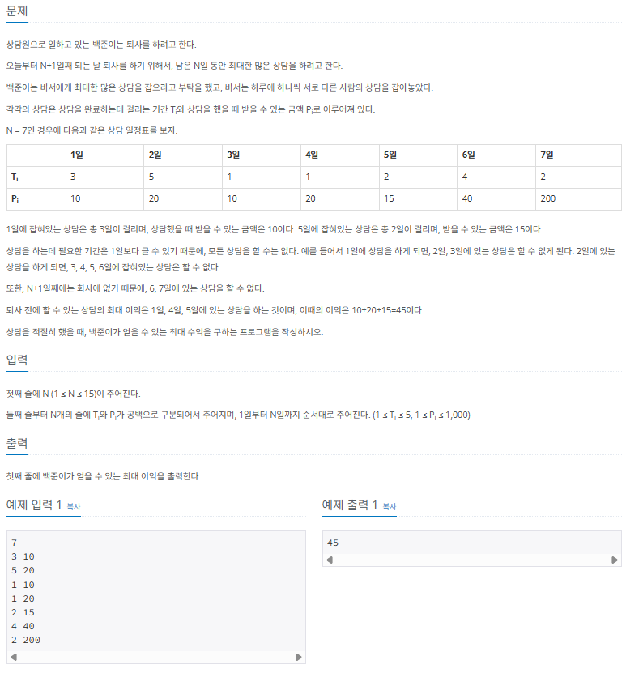

### $[01단계]$ 문제 분석하기

동적 계획법에서 점화식은 유일하지 않습니다. 다양한 자신만의 아이디어로 적절한 점화식을 찾는 훈련을 반복하는 것이 동적 계획법 실력을 늘리는 지름길입니다. 먼저 점화식의 형태를 정의해보는 것부터 시작하겠습니다. 문제의 주요 요소가 날짜 1개 정도라고 판단되 1차원 형태의 점화식 (D[i])을 세워보려고 합니다. 그 다음에 D[i]의 의미를 정해야 합니다. D[i]의 의미를 i 번째 날부터 퇴사일까지 벌 수 있는 최대 수입으로 정의해 문제에 접근해 보겠습니다.

### $[02단계]$ 손으로 풀어보기

1. 점화식의 형태와 의미를 도출합니다.

```
D[i] : i번째 날부터 퇴사일까지 벌 수 있는 최대 수입
```

2. 점화식을 도출합니다.

```
D[i] = D[i + 1]                            // 오늘 시작되는 상담을 했을 때 퇴사일까지 끝나지 않는 경우
D[i] = MAX(D[i + 1] , D[i + T[i]] + P[i])  // 오늘 시작되는 상담을 했을 때 퇴사일 안에 끝나는 경우
```

3. 점화식을 이용해 DP 테이블을 채웁니다. 후 D[1] 값을 출력합니다.

### $[03단계]$ 슈도코드 작성하기

```
N (퇴사까지 남은 일수)
D (점화식 배열 -> I ~ 퇴사일가지 벌 수 있는 최대 수입을 저장)
T (상담에 필요한 일수 저장 배열)
P (상담 완료 시 받는 수입 저장 배열)

for (N만큼 반복) {
  T와 P 배열 입력 받기
}

for (i -> N ~ 1까지 반복) {

  // i 번째 상담을 퇴사일까지 끝낼 수 없는 경우
  if (i + T[i] > N + 1) {
    D[i] = i + 1일 ~ 퇴사일에 벌 수 있는 최대 수입
  }
  // i 번째 상담을 퇴사일까지 끝낼 수 있는 경우
  else {
    D[i] = MAX(
                i + 1일 ~ 퇴사일에 벌 수 있는 최대 수입 ,
                i 번째 상담 비용 + i 번째 상담이 끝난 다음 날부터 퇴사일까지 최대 수입
              )
  }
}

// 1일부터 퇴사일까지 벌 수 있는 최대 수입 출력
D[1] 출력
```

### $[04단계]$ 코드 구현하기

```c
#include <iostream>
#include <vector>
#include <cmath>
using namespace std;

static int N;
static vector<int> D, T, P;

int main(int argc, char* argv[])
{
    cin >> N;
    D.resize(N + 2);
    T.resize(N + 1);
    P.resize(N + 1);

    for (int i = 1; i <= N; i++)
    {
        cin >> T[i] >> P[i];
    }

    for (int i = N; i > 0; i--)
    {
        // i 번째 상담을 퇴사일까지 끝낼 수 없는 경우
        if (i + T[i] > N + 1)
        {
            D[i] = D[i + 1];
        }
        // i 번째 상담을 퇴사일까지 끝낼 수 있는 경우
        else
        {
            D[i] = max(D[i + 1], P[i] + D[i + T[i]]);
        }
    }

    cout << D[1];
    return 0;
}
```

---

### $[문제089]$ 이친수 구하기

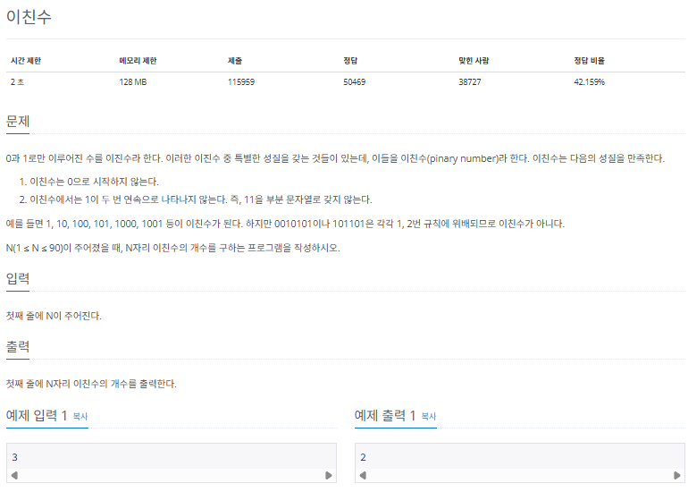

### $[01단계]$ 문제 분석하기

이친수의 개수와 관련된 요소를 먼저 찾아보면 가장 먼저 자릿수가 중요하다고 판단했습니다. 더 나아가 0으로 끝나는 이친수와 1로 끝나는 이친수를 구분해서 생각하면 좋겠다는 아이디어를 도출해봤습니다. 이 문제에서 점화식은 유일하지 않고 다양할 수 있습니다. 2자추언 배열 점화식 선언 (D[N][2])하고, 문제에 접근햅 보겠습니다.

### $[02단계]$ 손으로 풀어보기

1. 점화식의 형태와 의미를 도출합니다.

```
D[i][0] : i 길이에서 끝이 0으로 끝나는 이친수의 개수
D[i][1] : i 길이에서 끝이 1으로 끝나는 이친수의 개수
```

2. 점화식을 구합니다. 1은 두번 연속으로 나오지 않는다는 조건이 이 점화식을 구하는 핵심입니다.

```
💕 [i - 1번째가 XXXX... 0 즉, X[i-1] = 0 일때]

==> [i번째가 XXXX... 00, 즉, X[i] = 0 일때]
: 0은 이전 단계의 0과 1로 끝나는 모든 경우에 붙일 수 있음
: D[i][0] = D[i - 1][0] + D[i - 1][1]

==> [i번째가 XXXX... 00, 즉, X[i] = 1 일때] :
: 1은 이전 단계의 0으로 끝나는 경우에만 붙일 수 있음
: D[i][1] = D[i - 1][0]


💕 [i - 1번째가 XXXX... 1 즉, X[i-1] = 1 일때]

==> [i번째가 XXXX... 10, 즉, X[i] = 0 일때]
: 0은 이전 단계의 0과 1로 끝나는 모든 경우에 붙일 수 있음
: D[i][0] = D[i - 1][0] + D[i - 1][1]
```

4. 점화식을 이용해 DP 테이블을 채운 후 D[N][0] + D[N][1]의 값을 출력합니다.

### $[03단계]$ 슈도코드 작성하기

```
D (점화식 배열)
D[i][0] : 길이 i에서 끝이 0으로 끝나는 이친수의 개수
D[i][1] : 길이 i에서 끝이 1으로 끝나는 이친수의 개수

N (자릿수)
D (배열 초기화)
D[1][1] = 1 // 1은 이친수
D[1][0] = 0 // 이친수는 0으로 시작하지 않으므로 1자리 0으로 끝나는 이친수는 없음

for (i -> 2 ~ N) {
  i번째 0으로 끝나는 개수 = (i - 1에서 0으로 끝나는 개수) + (i - 1에서 1로 끝나는 개수)
  i번째 1으로 끝나는 개수 = (i - 1에서 0으로 끝나는 개수)
}

N번째에서 0으로 끝나느 개수 + N번째에서 1으로 끝나는 개수 출력
```

### $[04단계]$ 코드 구현하기

```c
#include <iostream>
#include <vector>
#include <cmath>
using namespace std;

static int N;
static long D[91][2];


int main(int argc, char* argv[])
{
    cin >> N;
    D[1][1] = 1;
    D[1][0] = 0;

    for (int i = 2; i <= N; i++)
    {
        D[i][0] = D[i - 1][0] + D[i - 1][1];
        D[i][1] = D[i - 1][0];
    }

    cout << D[N][0] + D[N][1];
    return 0;
}
```

---

### $[문제090]$ 2 \* N 타일 채우기

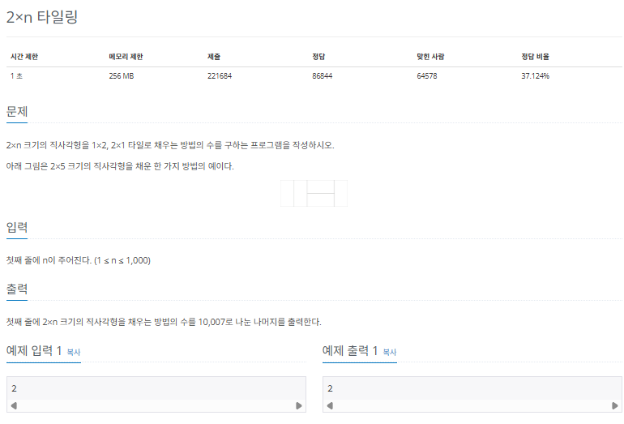

### $[01단계]$ 문제 분석하기

문제의 내용에 따라 2 _ N 크기의 직사각형을 1 _ 2 또는 2 \* 1 크기의 타일로 채우는 경우의 수를 구하는 점화식 D[N]을 정의합니다. 점화식을 정의할 때는 문제가 단순화되도록 가정하는 것이 중요합니다. 1 부터 N - 1크기의 직사각형과 관련된 경우의 수를 모두 구해놓았다고 가정하고 문제에 접근해 보겠습니다.

먼저 N보다 짧은 길이의 모든 경우의 수가 구해져 있다고 가정했으므로 N 바로 직전에 구해야 하는 N - 1, N- 2에서 N의 길이를 만들기 위한 경우의 수를 생각해 보겠습니다.

```
N - 1까지 타일이 채워져 있는 경우
: 세로로 타일 1개를 채워 N의 길이를 만듦

N - 2까지 타일이 채워져 있는 경우
: 가로로 타일 2개를 채워 N의 길이를 만듦
: 세로로 타일 2개를 채워 N의 길이를 만듦 (해당 방식은 N - 1경우에서 이미 사용된 방식이므로 제외)

==> N - 1과 N - 2에서 만들 수 있는 타일의 경우의 수를 더하면 N길이에서의 경우의 수를 구할 수 있음
```

이와 같이 생각할 수 있다면 다음과 같이 점화식을 도출할 수 있습니다.

> 점화식

```
D[N] = D[N - 1] + D[N - 2]
```

### $[02단계]$ 손으로 풀어보기

1. 점화식의 형태와 의미를 도출합니다.

```
D[N] : 길이 N으로 만들 수 있는 타일의 경우의 수
```

2. 점화식을 구합니다.

```
D[N] = D[N - 1] + D[N - 2]   // D[N - 1]과 D[N - 2]의 경우의 수 합이 D[N]
```

3. 점화식으로 DP 테이블을 채운 후 D[N]의 값을 출력하는데 DP테이블을 채울때 (10,007)로 % MOD 연산 하는 것도 잊지 말아야한다.

### $[03단계]$ 슈도코드 작성하기

```
D[N] (길이가 2 * N 직사각형에 2 * 1, 1 * 2 타일을 붙일 수 있는 경우의 수)
D[1] = 1 // 길이가 2 * 1일때 타일의 경우의 수
D[2] = 2 // 길이가 2 * 2일때 타일의 경우의 수

for (i -> 3 ~ N) {
  // N - 1길이일 때 경우의 수 + N - 2길이일 때 경우의 수
  D[i] = D[i - 1] + D[i -2]
  D[i] = D[i] % 10,007
}

D[N] 결과 출력
```

### $[04단계]$ 코드 구현하기

```c
#include <iostream>
#include <vector>
#include <cmath>
using namespace std;

static int N;
static long D[1001];
static long mod = 10007;


int main(int argc, char* argv[])
{
    cin >> N;
    D[1] = 1;
    D[2] = 2;

    for (int i = 3; i <= N; i++)
    {
        D[i] = D[i - 1] + D[i - 2];
        D[i] = D[i] % mod;
    }

    cout << D[N];
    return 0;
}
```

---

### $[문제091]$ 계단 수 구하기

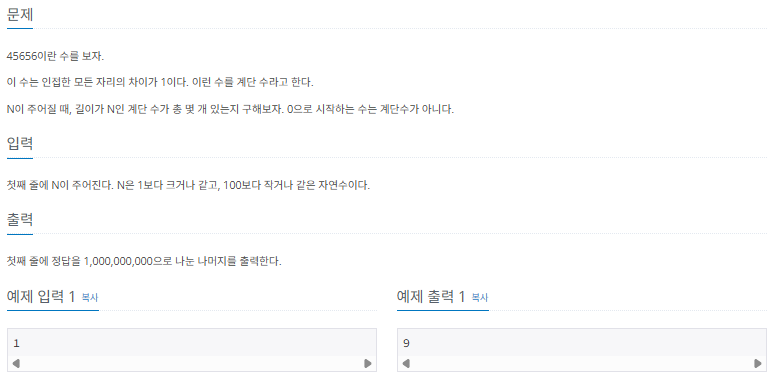

### $[01단계]$ 문제 분석하기

만약 N번째의 길이에서 5로 끝나는 계단수가 있었을 때 이 계단 수의 N - 1의 자리에 올 수 있는 수는 무엇일 까요? 바로 5와 1차이가 나는 4와 6입니다. 이러한 계단수의 특성을 이용해 다음과 같이 정의해 보겠습니다.

> DP 배열의 정의

```
D[N][H] : 길이가 N일때 H높이로 종료되는 계단 수를 만들 수 있는 경우의 수
```

### $[02단계]$ 손으로 풀어보기

1. 각 자릿수에 0 ~ 9 사이의 값이 들어오므로 높이에 따라 다른 점화식을 도출합니다. 먼저 N에서 계단 높이가 0일때 계단수가 되려면 N - 1에서는 높이가 1이어야합니다. N에서 계단 높이가 9일 때 계단수가 되려면 N - 1에서는 높이가 8이어야 합니다. 나머지는 가운데 계단이므로 H + 1, H - 1 양쪽에서 계단 수를 만들 수 있습니다.

> 높이에 따른 점화식

```
D[i][H] = D[i - 1][H + 1] // H = 0
D[i][H] = D[i - 1][H - 1] // H = 9
D[i][H] = D[i - 1][H - 1] + D[i - 1][H + 1] // 1 ~ 8
```

2. DP 테이블의 값을 초기화합니다. 각 높이에서 길이가 1인 계단 수는 모두 1가지이므로 1로 초기화합니다. 단, 0으로 시작할 수 없으므로 이때는 0으로 초기화합니다. DP테이블을 채울 때마다 1,000,000,000으로 % 연산을 수행하는 것도 있습니다.

### $[03단계]$ 슈도코드 작성하기

```
D[N][H] (길이가 N일때 높이 H로 끝나느 계단 수의 모든 경우의 수)

for (i -> 1 ~ 9) {
  // 길이가 1일때 만드는 높이 H로 끝나느 계단 수의 모든 경우의 수는 1
  // 단, 0으로 시작하는 숫자는 없으므로 D[1][0]은 0으로 초기화
  D[1][i] = 1
}
for (i -> 2 ~ N) {
  // N에서 높이가 0이면 N - 1에서는 높이가 1이어야 계단 수가 가능
  D[i][0] = D[i - 1][1]

  // N에서 높이가 9이면 N - 1에서는 높이가 8이어야 계단 수가 가능
  D[i][9] = D[i - 1][8]

  // 높이가 1 ~ 8 이면 N - 1에서 자신보다 한단계 위 또는 한단계 아래 높이에서 올 수 있음
  for (j -> 1 ~ 8) {
    D[i][j] = D[i - 1][j - 1] + D[i - 1][j + 1]
    D[i][j] = D[i][j] % mod
  }
}

sum (결괏값)
for (i -> 0 ~ 9) {
  sum 에 D[N][i]의 값을 모두 더하기
}
sum 출력
```

### $[04단계]$ 코드 구현하기

```c
#include <iostream>
#include <vector>
#include <cmath>
using namespace std;

static int N;
static long D[101][11];
static long mod = 1000000000;


int main(int argc, char* argv[])
{
    cin >> N;

    for (int i = 1; i <= 9; i++)
    {
        D[1][i] = 1;
    }
    for (int i = 2; i <= N; i++)
    {
        D[i][0] = D[i - 1][1];
        D[i][9] = D[i - 1][8];
        for (int j = 1; j <= 8; j++)
        {
            D[i][j] = D[i - 1][j - 1] + D[i - 1][j + 1];
            D[i][j] = D[i][j] % mod;
        }
    }

    long sum = 0;
    for (int i = 0; i < 10; i++)
    {
        sum = sum + D[N][i] % mod;
    }
    cout << sum;
    return 0;
}
```

---

### $[문제092]$ 연속된 정수의 합 구하기

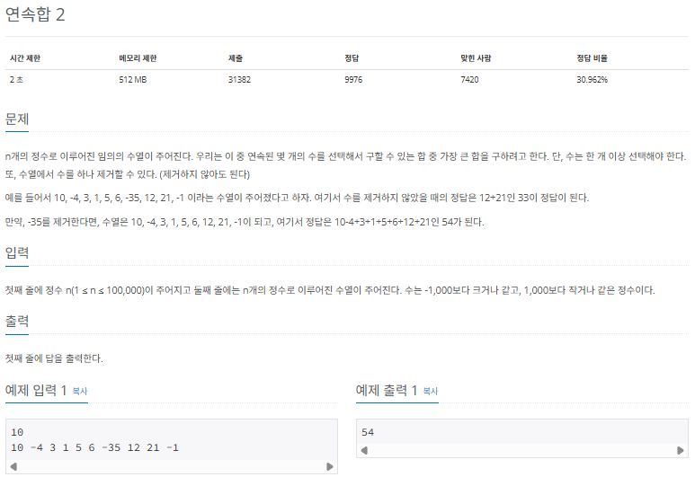

### $[01단계]$ 문제 분석하기

동적 계획점에서 점화식을 정의할 때 가장 흔하게 하는 실수를 하나 살펴보겠습니다. 동적 계획법에서는 큰 문제를 작은 문제로 나눌 수 있고, 이러한 작은 문제들을 해결해 궁극적으로 문제에서 요구하는 큰 문제를 해결합니다. 위 문제에서는 수열에서 가장 큰 합을 구하려고 할 때 수열에서 수를 1개 제거할 수 있다고 했습니다. 이에 따라 점화식을 정의해보겠습니다.

> 잘못된 점화식 정의

```
D[N] : 0에서 N까지 길이에서 연속으로 수를 선택하여 구할 수 있는 최대 합
```

위의 점화식 정의가 잘못된 이유가 무엇일까요? 바로 큰 문제를 부분 문제로 나눳을때 부분 문제는 큰 문제를 해결하기 위한 1개의 부분이 돼야 한다는 것에 위배되기 때문입니다. 좀더 풀어서 이야기 하면 이 정의에서는 N값의 의미가 명확하지 않습니다.

만약 잘못된 점화식의 정의를 이용해 D[3]을 구하면 값이 10이 됩니다. 맵 앞의 수 10을 선택한 후 아무것도 선택하지 않는게 가장 크기 때문입니다. 그런데 여기에서 잘 생각해보면 D[0],D[1],D[2]의 값이 모두 10이라는 것을 알 수 있습니다. 즉, D[N]에서 N값이 문제를 부분 문제로 나누는 데 적절치 못한 정의라는 것을 깨달을 수 있습니다. 그럼 어떻게 해야 N값이 문제를 적절하게 나눌 수 있게 정의할 수 있을 까요?

> 적절한 점화식 정의

```
D[N] : 0에서 N까지 길이에서 N을 포함하며 연속으로 수를 선택하여 구할 수 있는 최대 합
```

위와 같이 점화식을 정의하면 좀 더 쉽게 부분 문제를 이용해 전체 문제를 해결할 수 있습니다. 따라서 항상 동적 계획법에서 점화식을 정의할 때는 배열에서 인덱스가 큰 문제를 적절하게 작은 문제로 분리할 수 있는지를 고려해야 합니다.

### $[02단계]$ 손으로 풀어보기

1개의 수를 삭제할 수 있기 때문에 왼쪽에서부터 인덱스를 포함한 최대 연속 합을 구하고, 오른쪽에서부터 인덱스를 포함한 최대 연속 합을 한번 더 구하겠습니다. 양쪽으로 구한후 L[N - 1] + R[N + 1]을 하면 N을 1개 제거한 최댓값을 구하는 효과가 있기 때문입니다.

1. 주어진 수열을 저장합니다.

```
index 값
[0] [10]
[1] [-4]
[2] [3]
[3] [1]
[4] [5]
[5] [6]
[6] [-35]
[7] [12]
[8] [21]
[9] [-1]
```

2. 점화식을 이용해 왼쪽, 오른쪽과 관련된 인덱스를 포함한 최대 연속 합 배열을 채웁니다.

> 점화식의 의미

```
L[N] : 왼쪽에서부터 N을 포함한 최대 연속 합을 나타냄. A[i]는 i자리의 수열의 수
R[N] : 오른쪽에서부터 N을 포함한 최대 연속 합을 나타냄
```

> 점화식 정의

```
L[i] = max(A[i], L[i - 1] + A[i])
R[i] = max(A[i], R[i - 1] + A[i])
```

3. 계산된 두 배열을 이용해 최댓값을 찾습니다. i번째 수를 삭제했을 때 최댓값은 L[i - 1] + R[i + 1]이 됩니다. 이에 따라 이 배열에서 최댓값은 7번째 수를 삭제할 때입니다.

```
L 배열 : [10][6 ][9 ][10][15][21][-14][12][33][32]
R 배열 : [21][11][15][12][11][ 6][ -2][33][21][-1]

> Result = max(result, L[i - 1] + R[i + 1])
> L[5] + R[7] = 21 + 33 = 54
```

### $[03단계]$ 슈도코드 작성하기

```
N (배열 크기), A (수열 데이터 저장 배열)
L (왼쪽에서 오른쪽으로 index를 포함한 최대 연속 합을 나타내는 배열)
R (오른쪽에서 왼쪽으로 index를 포함한 최대 연속 합을 나타내는 배열)

for (i -> 0 ~ N) {
  배열 A 저장
}
for (i -> 1 ~ N) {
  L[i] = max(A[i], L[i - 1] + A[i])      // 왼쪽 합 배열(L) 저장하기
  L 배열의 최댓값을 정답 변수에 저장하기 // 1개도 삭제하지 않을 때 최댓값
}
for (i -> N - 2 ~ 0) {
  R[i] = max(A[i], R[i + 1] + A[i])      // 오른쪽 합 배열(R) 저장하기
}
for (i -> 1 ~ N - 1) {
  기존 정답 변숫값과 L[i - 1] + R[i + 1]로 계산한 값 중 최댓값
  // L[i - 1] + R[i + 1]은 수열 A에서 i번째 수를 삭제했을 때 구할 수 잇는 최대 연속 합
}

최댓값 출력하기
```

### $[04단계]$ 코드 구현하기

```c
#include <iostream>
#include <vector>
#include <cmath>
using namespace std;

static int N;
static vector<int> A, L, R;

int main(int argc, char* argv[])
{
    cin >> N;
    A.resize(N);

    for (int i = 0; i < N; i++)
    {
        cin >> A[i];
    }

    L.resize(N);
    L[0] = A[0];
    int result = L[0];

    for (int i = 1; i < N; i++)
    {
        L[i] = max(A[i], L[i - 1] + A[i]);
        result = max(result, L[i]);
    }

    R.resize(N);
    R[N - 1] = A[N - 1];
    for (int i = N - 2; i >= 0; i--)
    {
        R[i] = max(A[i], R[i + 1] + A[i]);
    }

    for (int i = 1; i < N - 1; i++)
    {
        int temp = L[i - 1] + R[i + 1];
        result = max(result, temp);
    }
    cout << result;
}
```

---

### $[문제093]$ 최장 공통 부분 수열 찾기

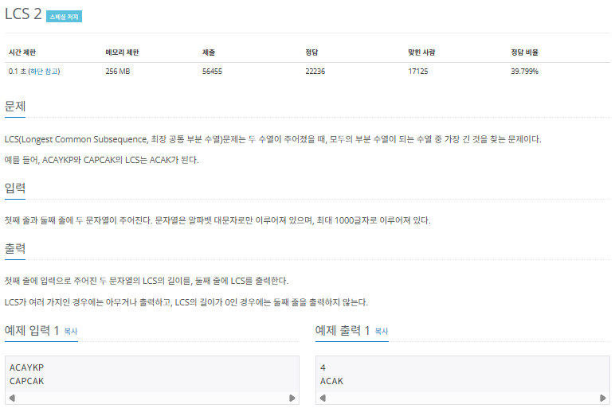

### $[01단계]$ 문제 분석하기

LCS는 문자열을 이용한 대표적인 동적 계획법 문제입니다. 이러한 종류의 문제를 풀기 위해서는 다음과 같이 각 문자열을 축으로 하는 2차원 배열을 생성해야 합니다.

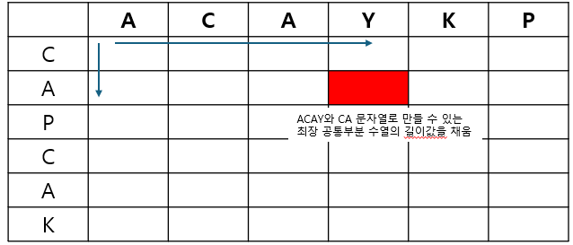

이렇게 구성한 2차원 배열이 바로 점화식 테이블이 됩니다. 위의 설명과 같이 테이블에 저장하는 값은 각 위치 인덱스를 마지막 문자로 하는 두 문자열의 최장 공통 수열의 길이입니다.

### $[02단계]$ 손으로 풀어보기

1. LCS 점화식을 이용해 값을 채웁니다. 특정 자리가 가리키는 행과 열의 문자열값을 비교해 값이 같으면 테이블의 대각선 왼쪽 위의 값에 1을 더한 값을 저장합니다.

```
DP[i][j] = DP[i - 1][j - 1] + 1
```

비교한 값이 다르면 테이블의 왼쪽과 위쪽 값 중 큰 값을 선택해 저장합니다.

```
DP[i][j] = max(DP[i - 1][j] , DP[i][j - 1])
```

위에서 세운 점화식을 이용해 테이블을 채우면 다음과 같이 나타낼 수 있고, 두 문자열의 최장 공통 부분 수열의 길이는 4라는 것을 알 수 있습니다.

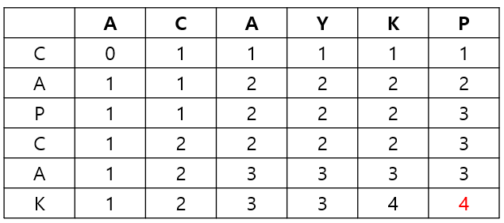

2. LCS 정답을 출력합니다. 먼저 마지막부터 탐색을 수행하고, 해당 자리에 있는 인덱스 문자열값을 비교해 값이 같으면 최장 공통 부분 수열에 해당하는 문자로 기록하고, 왼쪽 대각선으로 이동합니다. 비교한 값이 다르면 테이블의 왼쪽과 위쪽 값 중 큰 값으로 이동합니다.

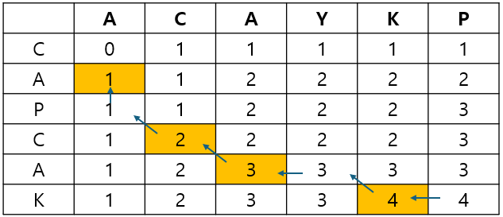

> 문자열과 관련된 동적 계획법은 이 문제와 비슷한 방법으로 풀이할 수 있는 경우가 많기 때문에 문제를 꼼꼼하게 숙지하고 실제 코드로 연습해야 합니다,

### $[03단계]$ 슈도코드 작성하기

```
DP (이차원 점화식 테이블), A(첫번째 문자열), B (두번째 문자열)
Path (LCS 저장 벡터)

for (i -> 1 ~ A 문자열 길이) {
  for (j -> 1 ~ B 문자열 길이) {
    A[i]와 B[i]가 같으면 DP[i][j]의 값을 왼쪽 대각선 값 + 1로 저장하기
    다른 경우에는 왼쪽의 값과 위의 값 중 큰 값으로 DP[i][j] 채우기
  }
}

DP의 마지막 값을 출력하기 (LCS 길이)
getTex() 함수를 이용해 LCS 문자열 출력하기

---
// LCS 문자열을 구하는 함수
getTex (row , column) {
  A[row] 와 B[column]이 같으면 LCS에 기록, 대각선 왼쪽 위로 이동
  // get(row - 1, column - 1)
  다른경우 왼족 같과 위쪽 값 중 값이 더 큰 쪽으로 이동하기
  // get(row - 1, column) 또는 get(row, column - 1)
}
```

### $[04단계]$ 코드 구현하기

```c
#include <iostream>
#include <vector>
#include <cmath>
using namespace std;

static int N;
static int DP[1001][1001];
static string A, B;
static vector<char> Path;
void getText(int r, int c);

int main(int argc, char* argv[])
{
    cin >> A >> B;

    for (int i = 1; i <= A.size(); i++)
    {
        for (int j = 1; j <= B.size(); j++)
        {
            // 같은 문자열일 경우 왼쪽 대각선 값 + 1
            if (A[i - 1] == B[j - 1])
            {
                DP[i][j] = DP[i - 1][j - 1] + 1;
            }
            // 다르면 왼쪽과 위쪽 값 중 큰 수
            else
            {
                DP[i][j] = max(DP[i - 1][j], DP[i][j - 1]);
            }
        }
    }

    cout << DP[A.size()][B.size()] << "\n";
    getText(A.size(), B.size());

    for (int i = Path.size() - 1; i >= 0; i--)
    {
        cout << Path[i];
    }
    cout << "\n";
}

// LCS 출력함수
void getText(int r, int c)
{
    if (r == 0 || c == 0) return;

    // 같으면 LCS에 기록하고 왼쪽 위로 이동
    if (A[r - 1] == B[c - 1])
    {
        Path.push_back(A[r - 1]);
        getText(r - 1, c - 1);
    }
    // 다르면 왼쪽과 위쪽 중 큰 수로 이동
    else
    {
        if (DP[r - 1][c] > DP[r][c - 1])
        {
            getText(r - 1, c);
        }
        else
        {
            getText(r, c - 1);
        }
    }
}
```

---

### $[문제094]$ 가장 큰 정사각형 찾기

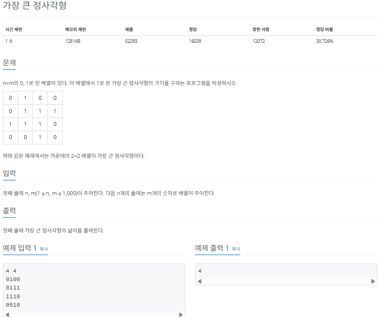

### $[01단계]$ 문제 분석하기

가장 큰 정사각형의 넓이를 구하는 것은 가장 큰 정사각형의 한 변의 길이를 구한다는 것과 동일한 이야기입니다. 따라서 변의 길이를 다음과 같이 D[i][j]로 정의한 후 구해보겠습니다.

> 점화식 정의

```
D[i][j] : i,j의 위치를 오른쪽 아래 꼭짓점으로 정하고, 해당 자리에서 그릴 수 있는 가장 큰 정사각형의 변의 길이
```

이렇게 정의하면 다음과 같이 DP 테이블을 채우는 방식, 즉, 점화식 아이디어를 생각할 수 있습니다. 다음 그림에서 물음표 위치의 원래 값이 1일 경우, 이 위치에서 위,왼쪽,대각선 왼쪽 위에 있는 값 중 가장 작은 값에 1을 더한 값으로 변경합니다. 원래 값이 0일 경우 그대로 둡니다.

이 아이디어를 이용해 문제를 풀어보겠습니다.

### $[02단계]$ 손으로 풀어보기

1. DP 테이블의 값을 초기화합니다.

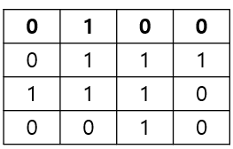

2. 점화식을 이용해 DP 테이블의 값을 새롭게 채웁니다.

```
// 현재 자리의 원래 값이 1
D[i][j] = MIN(D[i - 1][j - 1] , D[i][j - 1], D[i - 1][j] + 1)

// 현재 자리의 원래 값이 0
D[i][j] = 0
```

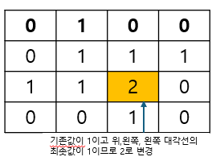

3. DP 테이블 중 가장 큰 값의 제곱이 최대 정사각형의 넓이 입니다. DP 테이블의 최댓값을 제곱해 출력합니다.

### $[03단계]$ 슈도코드 작성하기

```
D[i][j] (i,j 위치에서 왼쪽 위로 만들 수 있는 최대 정사각형 길이를 저장하는 배열)
N (배열의 세로)
M (배열의 가로)
max (최댓값 저장)

for (i -> ~N) {
  for (j -> 0 ~ M) {
    D[i][j]의 값이 1일때 자신 위, 왼쪽 대각선 위의 값 중 최솟값 + 1을 저장
    만약 D[i][j]의 값이 최댓값보다 크다면 최댓값 갱신
  }
}

// 정사각형의 넓이를 출력해야 하므로 최댓값 * 최댓값 출력
```

### $[04단계]$ 코드 구현하기

```c
#include <iostream>
#include <cmath>
using namespace std;

static int N, M;
static int D[1001][1001];

int main(int argc, char* argv[])
{
    cin >> N >> M;
    long max = 0;

    for (int i = 0; i < N; i++)
    {
        string mline;
        cin >> mline;

        for (int j = 0; j < M; j++)
        {
            D[i][j] = mline[j] - '0';

            if (D[i][j] == 1 && j > 0 && i > 0)
            {
                D[i][j] = min(D[i - 1][j - 1], min(D[i - 1][j], D[i][j - 1])) + D[i][j];
            }
            if (max < D[i][j])
            {
                max = D[i][j];
            }
        }
    }

    cout << max * max;
    return 0;
}
```

---

### $[문제095]$ 빌딩 순서 구하기

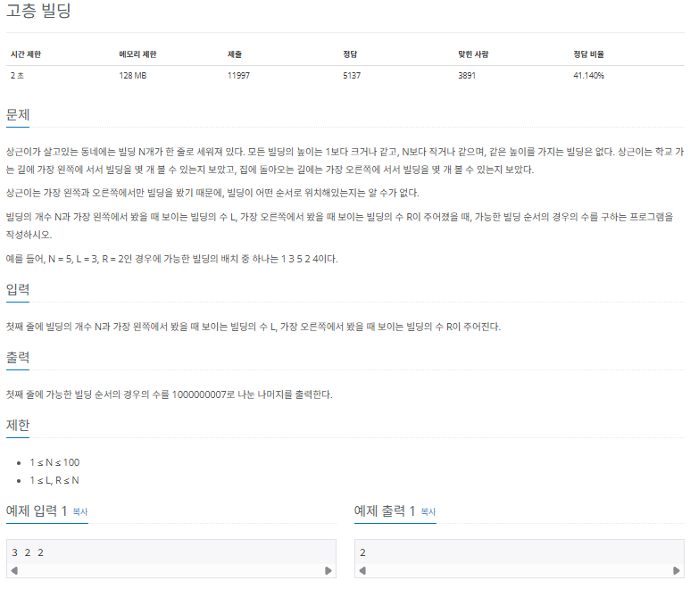

### $[01단계]$ 문제 분석하기

먼저 점화식의 의미를 정의해보겠습니다.

> 점화식 정의

```
D[N][L][R] : N개의 빌딩이 있고 왼쪽에서 L개, 오른쪽에서 R개가 보일 때 가능한 경우의 수
```

점화식을 적절하게 정의하고 난 후 이 문제를 어떻게 하면 단순화 할 수 있을지 생각해야 합니다. 먼저 N - 1개 빌딩과 관련된 모든 경우의 수를 알고있다고 가정해 보겠습니다. 그러면 이후 1개의 빌딩을 어느 곳에 배치할 것인지를 결정하는 것이 관건인데요. 이때 배치하는 빌딩이 가장 크다면 가장 왼쪽이나 오른쪽에 배치할 때 보이는 빌딩의 수는 1개가 될 것입니다. 하지만 중간에 배치하면 어떤 수가 나올지 예상하기 어렵습니다.

이 시점에 1가지 관점을 다르게 생각해 볼 수 있습니다. '높이가 애매한 빌딩을 마지막에 배치하는 것이 아니라 일정한 규칙에 따라 배치해 단순화해 볼 수 있지 않을까?' 라는 가정을 더해 봅시다.

앞서 가장 큰 빌딩을 마지막에 배치하면 중간에 배치했을 때의 경우가 복잡하므로 이와 반대로 가장 작은 빌딩을 N번째로 배치한다고 가정해 보겠습니다. 그러면 명확하게 다음과 같이 3가지 경우의 수가 발생합니다.

```
왼쪽에 배치한경우
: 왼쪽에서 보는 빌딩의 수 1증가

오른쪽에 배치한 경우
: 오른쪽에서 보는 빌딩의 수 1증가

가운데 배치한 경우
: 양쪽에서 보는 빌딩의 수가 증가하지 않음
```

### $[02단계]$ 손으로 풀어보기

1. 상황에 따른 점화식을 구합니다. 먼저 N개의 빌딩이 왼쪽에 L개, 오른쪽에 R개가 보인다고 가정하면 N - 1개의 빌딩에서 왼족에 빌딩을 추가할 때 왼쪽 빌딩이 1개 증가하므로 이전 경우의 수는 다음과 같습니다.

```
D[N - 1][L - 1][R]
```

N - 1개의 빌딩에서 오른족에 빌딩을 추가할 때 오른쪽 빌딩이 1개 증가하므로 이전 경우의 수는 다음과 같습니다.

```
D[N - 1][L][R - 1]
```

N - 1개의 빌딩에서 가운데 빌딩을 추가할 때는 증가 수가 없지만, N - 2개의 위치에 배치할 수 있으므로 N - 2을 곱합니다.

```
D[N - 1][L][R] * (N - 2)
```

3가지 경우의 수를 모두 더하면 다음과 같은 점화식이 나옴니다.

```
D[N][L][R] = D[N - 1][L - 1][R]
           + D[N - 1][L][R - 1]
           + D[N - 1][L][R] * (N - 2)

```

2. DP 테이블을 초기화합니다. 건물이 1개면 경우의 수는 1개일 수 밖에 없습니다.

```
D[1][1][1] = 1
```

3. 점화식을 이용해 정답을 구합니다.

### $[03단계]$ 슈도코드 작성하기

```
D[N][L][R] (빌딩 N개를 왼쪽에서 L개, 오른쪽에서 R개가 보이도록 배치할 수 있는 모든 경우의 수)
D[1][1][1] = 1 // 건물이 1개일때 배치될 수 있는 경우의 수는 1개

for (i -> 2 ~ N) {
  for (j -> 1 ~ L) {
    for (k -> 1 ~ R) {
      D[i][j][k] = D[i - 1][j - 1][k]        // 가장 작은 빌딩을 왼쪽에 놓는 경우
                 + D[i - 1][j][k - 1]        // 가장 작은 빌딩을 오른쪽에 놓는 경우
                 + D[i - 1][j][k] * (i - 2)  // 가장 작은 빌딩을 가운데 놓는 경우

      // mod 연산
      D[i][j][k] = D[i][j][k] % mod
    }
  }
}

D[N][L][R] 값 출력
```

### $[04단계]$ 코드 구현하기

```c
#include <iostream>
#include <cmath>
using namespace std;

static int N, L, R;
static long mod = 1000000007;
static long D[101][101][101];

int main(int argc, char* argv[])
{
    cin >> N >> L >> R;
    D[1][1][1] = 1;

    for (int i = 2; i <= N; i++)
    {
        for (int j = 1; j <= L; j++)
        {
            for (int k = 1; k <= R; k++)
            {
                D[i][j][k] = D[i - 1][j - 1][k] // 가장 작은 빌딩을 왼쪽에 놓는 경우
                           + D[i - 1][j][k - 1] // 가장 작은 빌딩을 오른쪽에 놓는 경우
                           + D[i - 1][j][k] * (i - 2); // 가장 작은 빌딩을 가운데 놓는 경우

                D[i][j][k] = D[i][j][k] % mod;
            }
        }
    }

    cout << D[N][L][R];
    return 0;
}
```

---

### $[문제096]$ DDR을 해보자

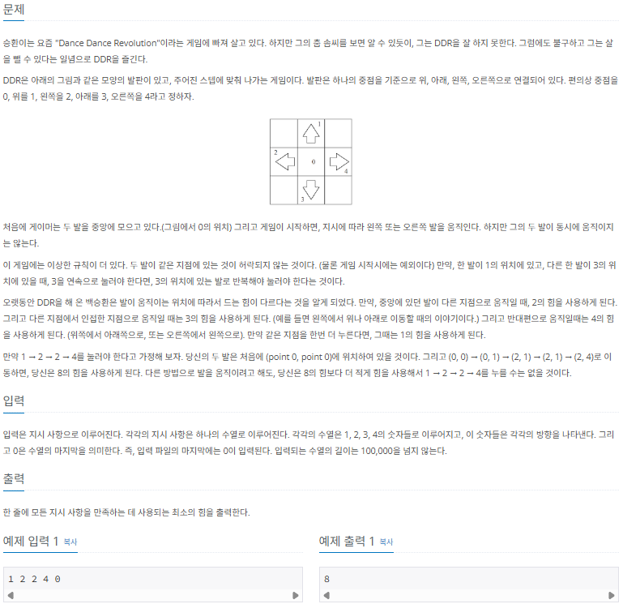

### $[01단계]$ 문제 분석하기

매우 복잡해보이지만 주어진 내용에 충실한 점화식을 구현할 수 있는지를 알아보는 문제입니다. 아이디어는 수열의 최대 길이가 10만이므로 모든 경우의 수를 점화식으로 표현해 구해보는 것입니다. 이를 바탕으로 점화식을 정의하면 다음과 같습니다.

> 점화식 정의

```
D[N][L][R] : N개의 수열을 수행한 후 왼발의 위치가 L, 오른발의 위치가 R일때 최소 누적 힘
```

위와 같이 정의하면 직접 수열까지 구한 최솟값을 이용해 해당값을 구할 수 있다는 것을 깨달을 수 있습니다. 예를 들어 직전에 오른 다리가 2의 자리에 있었다가 현재 R 자리로 이동햇다면 D[N][L][R]의 최솟값 후보 중 하나로 D[N - 1][L][2] + (2 -> R로 이동한 힘)이 될 수 있습니다.

왼발을 움직일 때도 생각해야겠죠. D[N - 1][$L^`$][R] + ($L^`$: 직전 왼발의 위치 -> L로 이동한 힘) 역시 D[N][L][R]의 최솟값 후보가 될 수 있습니다. 즉, 한 발만 움직여 D[N][L][R]의 위치를 만들 수 있는 모든 경우의 수를 비교해 최솟값을 이 위치에 저장하는 작업을 수행하면 이 문제를 해결할 수 있습니다.

### $[02단계]$ 손으로 풀어보기

1. 점화식 D[N][L][R]을 구합니다. mp[i][j]를 i에서 j로 이동하는데 드는 힘이라고 하면 바로 직전에 오른발을 움직일 때 점화식은 다음과 같습니다.

```
D[N][L][R] = min(D[N - 1][L][i] + mp[i][R])
```

바로 직전에 왼발을 움직일 때는 다음과 같습니다.

```
D[N][L][R] = min(D[N - 1][i][R] + mp[i][L])
```

단, 이 점화식을 왼발과 오른발을 구분해 두 발로 만들 수 있는 모든 경우를 고려해 반복해야 합니다.

2. 충분히 큰 수로 DP 테이블을 초기화하고, 점화식을 이용해 값을 채웁니다.

### $[03단계]$ 슈도코드 작성하기

```
dp[N][L][R] (N개 입력가지 수행했고, 왼쪽 다리가 L, 오른쪽 다리가 R에 있을 때 힘의 최솟값)
mp (한 번을 이동할 때 드는 힘을 미리 저장하기 (mp[1][2] -> 1에서 2로 이동할 때 드는 힘))
dp를 충분히 큰 수로 초기화
dp[0][0][0]을 0으로 초기화  // 처음에는 아무 힘이 들지 않은 상태로 시작

while (모든 수열을 수행할 때까지) {
  // 오른쪽 다리를 이동해 현재 다리 위치로 만들 수 있는 경우의 수
  for (i -> 0 ~ 4) {
    바로 직전 오른쪽 다리가 있을 수 있는 5가지 경우 누적 합 더하기
    오른쪽 다리 이동에 필요한 힘을 더한 값 중 최솟값
  }
  // 왼쪽 다리를 이동해 현재 다리 위치로 만들 수 있는 경우의 수
  for (i -> 0 ~ 4) {
    바로 직전 왼쪽  다리가 있을 수 있는 5가지 경우 누적 합 더하기
    왼쪽  다리 이동에 필요한 힘을 더한 값 중 최솟값
  }
}

for (i -> 0 ~ 4) {
  for (j -> 0 ~ 4) {
    min = min(min, dp[s][i][j]) // s개의 수열을 수행했을 때 최솟값 찾기
  }
}

최솟값 출력
```

### $[04단계]$ 코드 구현하기

```c
#include <iostream>
#include <cmath>
#include <limits>
using namespace std;

// dp[N][L][R] = N개의 수열을 수행하였고 왼쪽이 L, 오른쪽이 R자리에 있을 때 최소 누적 힘
static long dp[100001][5][5];

// 한발을 이동할 때 드는 힘을 미리 저장하기
// mp[1][2] -> 1에서 2로 이동할 때 드는 힘
int mp[5][5] = {
    {0, 2, 2, 2, 2},
    {2, 1, 3, 4, 3},
    {2, 3, 1, 3, 4},
    {2, 4, 3, 1, 3},
    {2, 3, 4, 3, 1},
};

int main(int argc, char* argv[])
{
    int n = 0, s = 1;

    for (int i = 0; i < 5; i++)
    {
        for (int j = 0; j < 5; j++)
        {
            for (int k = 0; k < 100001; k++)
            {
                dp[k][i][j] = 100001 * 4; // 충분히 큰 수로 초기화
            }
        }
    }

    dp[0][0][0] = 0;

    while (true)
    {
        cin >> n;
        if (n == 0) break;

        // 오른쪽 다리 이동의 경우의 수
        for (int i = 0; i < 5; i++)
        {
            // 두발이 같은 자링 있을 수 없음
            if (n == i) continue;
            for (int j = 0; j < 5; j++)
                dp[s][i][n] = min(dp[s][i][n], dp[s - 1][i][j] + mp[j][n]);
        }
        // 왼쪽 다리 이동의 경우의 수
        for (int i = 0; i < 5; i++)
        {
            // 두발이 같은 자링 있을 수 없음
            if (n == i) continue;
            for (int j = 0; j < 5; j++)
                dp[s][n][j] = min(dp[s][n][j], dp[s - 1][i][j] + mp[i][n]);
        }
        s++;
    }

    s--;
    long minVal = INT_MAX;

    for (int i = 0; i < 5; i++)
    {
        for (int j = 0; j < 5; j++)
        {
            minVal = min(minVal, dp[s][i][j]); // 모두 수행했을 때 최솟값 찾기
        }
    }
    cout << minVal;
    return 0;
}
```

---

### $[문제098]$ 외판원의 순회 경로 짜기

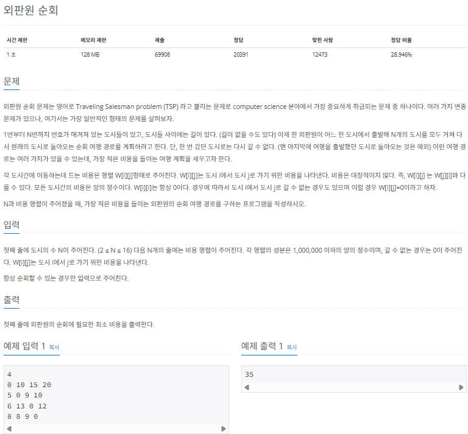

### $[01단계]$ 문제 분석하기

외판원 순회 문제는 영어로 TSP(traveling salesman problem)라고 불리고, 컴퓨터 과학 분야에서 가장 중요하게 취급되는 문제 중 하나입니다. 여러가지 응용문제가 있지만 여기서는 가장 일반적인 문제를 살펴보겠습니다.

N의 크기가 매우 작기 때문에 모든 순서를 완전 탐색하면 정답을 구할 수 있습니다. 먼저 점화식을 정의하겠습니다.

> 점화식의 정의

```
D[c][v] : 현재 도시가 C, 현재까지 방문한 모든 도시 리스트가 v일때 앞으로 남은 모든 도시를 경유하는 데 필요한 최소 비용
```

예를 들어 D[2][1,2]는 현재 도시가 2이고, 1,2 도시를 방문한 상태에서 나머지 모든 도시를 경유하는 데 필요한 비용입니다.

완전 탐색의 경우에는 DFS나 BFS를 이용해 이미 학습한 부분이므로 문제가 없지만, 여기서는 생각해야 할 문제가 하나 더 있습니다. 바로 D[i][j]에서 j가 나타내는 것이 현재까지 방문한 모든 도시 리스트라는 것입니다. 리스트 데이터를 j라는 변수 1개에 저장할 수 있는 방법은 무엇일까요? 바로 bit, 즉 이진수로 표현할 수 있습니다.

총 도시가 4개일 때 예로 들어 방문 도시를 이진수로 표현해보겠습니다. 방문 도시를 이진수의 각 자릿수로 표현하고 방문 시 1, 미방문 시 0의 값으로 저장합니다.

이러한 방식으로 방문 리스트를 1개의 변수로 표현할 수 있습니다.

### $[02단계]$ 손으로 풀어보기

1. 먼저 점화식을 구합니다. c번 도시에서 v리스트 도시를 방문한 후 남은 모든 도시를 순회하기 위한 최소 비용을 구하려면, 현재 방문하지 않은 모든 도시에 대해 다음 도시로 선택하고 점화식을 이용해 비용을 갱신하는 과정을 반복합니다. 방문하지 않은 도시를 i라고 했을 때 다음과 같습니다. W[c][i]는 도시 c에서 도시 i로 가기 위한 비용을 나타냅니다.

```
D[c][v] = min(D[c][v], D[i][v | (1 << i)] + W[c][i])
```

2. W 배열을 저장합니다.

3. 점화식으로 정답을 구한 후 최솟값을 정답으로 출력합니다.

### $[03단계]$ 슈도코드 작성하기

```
W (도시의 개수)
W[i][j] (i 도시에서 j 도시로 가는데 드는 비용을 저장하는 배열)
D[c][v] (현재 도시 c이고 현재까지 방문한 도시 리스트가 v일때 남은 모든 도시를 경유하는 데 드는 최소 비용)

for (i -> 0 ~ N) {
  for (j -> 0 ~ N) {
    배열 w에 값 저장하기
  }
}

for (i -> 0 ~ N) {
  for (j -> 0 ~ 1 << N) {
    배열 D를 충분히 큰 수로 저장하기
  }
}

tsp(0 , 1) // 완전 탐색 함수 수행

---

// 모든 경우의 수에 대한 완전 탐색, 재귀함수 구현
tsp (c, v) {
  if (모든 도시를 방문한 경우) {
    시작 도시로 돌아갈 수 있는 경우 -> return W[c][시작도시]
    시작 도시로 돌아갈 수 없는 경우 -> return 무한대 (정답이 될 수 없음)
  }
  if (이미 계산한 적이 잇는 경우) { // 다시 계산할 필요 없음
    return D[c][v]
  }
  for (i -> 0 ~ N) {
    if (방문한 적이 없고 갈 수 있는 도시인 경우) {
      D[c][v] = min(D[c][v] , tsp(i, (v | 1 << i)) + W[c][i])
    }
  }

  return D[c][v];
}
```

### $[04단계]$ 코드 구현하기

```c
#include <iostream>
#include <cmath>
using namespace std;

static int INF = 1000000 * 16 + 1;
static int N;
static int W[16][16];
static int D[16][1 << 16] = {0,};
int tsp(int c, int v);

int main(int argc, char* argv[])
{
    cin >> N;

    // 배열 w에 값 저장하기
    for (int i = 0; i < N; i++)
    {
        for (int j = 0; j < N; j++)
        {
            cin >> W[i][j];
        }
    }

    cout << tsp(0, 1) << "\n";
}

// 모든 경우의 수에 대한 완전 탐색, 재귀함수 구현
int tsp(int c, int v)
{
    if (v == (1 << N) - 1) // 모든 노드를 방문했을때
    {
        return W[c][0] == 0 ? INF : W[c][0];
    }
    // 이미 방문한 노드일때 -> 이미 계산했다면 바로 반환 메모이제이션
    if (D[c][v] != 0)
        return D[c][v];

    int min_val = INF;
    for (int i = 0; i < N; i++)
    {
        // 방문한 적이 없고 갈 수 있는 도시일 때
        if ((v & (1 << i)) == 0 && W[c][i] != 0)
        {
            min_val = min(min_val, tsp(i, (v | (1 << i))) + W[c][i]);
        }
    }
    D[c][v] = min_val;
    return D[c][v];
}
```

---

### $[문제099]$ 가장 길게 증가하는 부분 수열 찾기

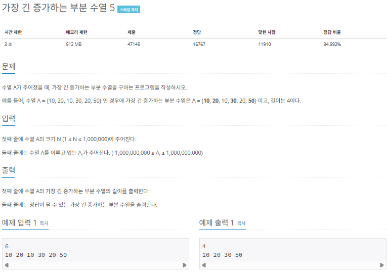

### $[01단계]$ 문제 분석하기

가장 길게 증가하는 부분 수열 (최장 증가 수열)의 점화식은 다음과 같이 비교적 간단하게 정의할 수 있습니다.

> 점화식 정의

```
D[i] : 0 ~ i 까지 i를 포함하는 가장 길게 증가하는 수열의 길이
```

부분 문제를 이용해 전체 문제를 풀이하려면 i의 값이 부분 문제의 핵심이 되도록 정의해야하므로 D[i]를 단순히 0 ~ i까지의 최장 증가 수열의 길이가 아닌 0 ~ i까지 i를 포함하는 최장 증가 수열의 길이로 정의하는 것이 중요합니다. 단, 문제에서 N의 최댓값이 1,000,000으로 크기 때문에 시간 복잡도를 고려해 풀이를 설계해야합니다.

### $[02단계]$ 손으로 풀어보기

1. 점화식을 구합니다. A[i]를 i번째 수열의 값이라고 정의하면 D[k]는 A[i] > A[k]를 만족하는 최대 수열의 길이입니다. 즉, A[i]보다 작은 값을 지닌 수열의 최장 증가 수열의 길이 중 최댓값을 찾아 해당 값에 + 1 한 값을 D[i]에 저장하면 됩니다.

```
D[i] = max({D[K]}) + 1 (k = 1 ~ i - 1)
```

2. 점화식을 이용해 D 배열의 값을 저장합니다. 이때 자신보다 작은 값을 지닌 최장 증가 수열 길이를 찾기 위해 B배열을 만들어 현재 가장 유리한 수열을 실시간으로 저장합니다.

3. D 배열을 이용해 정답을 출력합니다. 먼저 뒤에서부터 탐색해 최댓값 (5)과 동일한 값을 가지는 최초 index의 A[]값을 출력합니다. 그리고 값을 1만큼 감소시키고 index가 1이 될 때까지 반복합니다.

이때 시간 복잡도를 줄이기 위해 자신이 들어갈 수 있는 위치를 찾는 알고리즘을 이진 탐색을 이용해 구현해야 합니다.

### $[03단계]$ 슈도코드 작성하기

```
N (수열의 개수), A[] (수열의 데이터 저장), ans[] (정답 수열 저장)
D[] (0 ~ i까지 i를 포함하는 최장 증가 수열의 길이 저장)
B[] (현재 가장 유리한 증가 수열 저장)
수열 데이터를 입력받아 배열 A에 저장

B[1] = A[1], D[1] = 1 // 초기화

for (i -> 2 ~ N) {
  if (가장 마지막 수열보다 현재 수열이 큰 경우) {
    배열 B의 끝에 A[i]값 추가하기
    maxLength = maxLength + 1로 변경하고 배열 D에 maxLength 저장하기
  }
  else {
    이진 탐색을 이용하여 현재 수열이 들어갈 index 찾기
    B[index] = 현재 수열값 저장하고 D[i] = index 저장
  }
}
가장 긴 증가하는 부분 수열 길이 출력 (maxLength)

// 배열 D의 뒤에서부터 탐색
for (i -> N ~ 1) {
  최초 maxLength와 같은 값을 가지는 배열 D의 index를 찾아 해당 수열을 정답 배열에 저장
  maxLength 값 1 감소
}
저장된 정답 배열 출력

---
// 현재 수열이 들어갈 수 있는 위치를 빠르게 찾아내기 위한 함수
binarysearch(l, r, now) {
  while (l이 r 보다 작을 때까지 반복) {
    중앙값 = l + r / 2
    B[중앙값]이 now 보다 작으면 l값을 중앙값 + 1로 변경
    B[중앙값]이 now 보다 크거나 같으면 r값을 중앙값으로 변경
  }
  return l;
}
```

### $[04단계]$ 코드 구현하기

```c
#include <iostream>
using namespace std;

static int N, maxLength;
static int B[1000001], A[1000001], D[1000001], ans[1000001];
int binarysearch(int l, int r, int now);

int main(int argc, char* argv[])
{
    cin >> N;
    for (int i = 1; i <= N; i++)
    {
        cin >> A[i];
    }

    int index;
    B[++maxLength] = A[1];
    D[1] = 1;

    for (int i = 2; i <= N; i++)
    {
        // 가장 마지막 수열보다 현재 수열이 큰 경우
        if (B[maxLength] < A[i])
        {
            B[++maxLength] = A[i];
            D[i] = maxLength;
        }
        else
        {
            // 배열 B에서 A[i]보다 처음으로 크거나 같아지는 원소의 index 찾기
            index = binarysearch(1, maxLength, A[i]);
            B[index] = A[i];
            D[i] = index;
        }
    }

    // 가장 긴 증가하는 부분 수열 길이 출력
    cout << maxLength << "\n";
    index = maxLength;
    int x = B[maxLength] + 1;

    // 뒤에서부터 탐색하면서 정답 수열 저장하기
    for (int i = N; i >= 1; i--)
    {
        if (D[i] == index && A[i] < x)
        {
            ans[index] = A[i];
            x = A[i];
            index--;
        }
    }

    for (int i = 1; i <= maxLength; i++)
    {
        cout << ans[i] << " ";
    }

    return 0;
}

// 현재 수열이 들어갈 수 있는 위치를 빠르게 찾는 이진 탐색 구현
int binarysearch(int l, int r, int now)
{
    int mid;

    while (l < r)
    {
        mid = (l + r) / 2;
        if (B[mid] < now)
        {
            l = mid + 1;
        }
        else
        {
            r = mid;
        }
    }
    return l;
}
```
