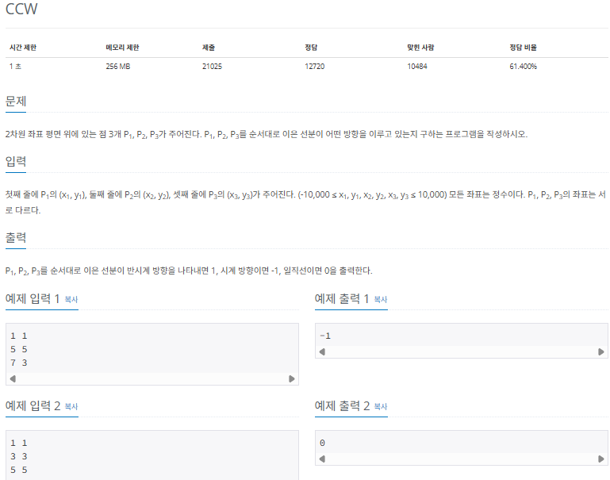
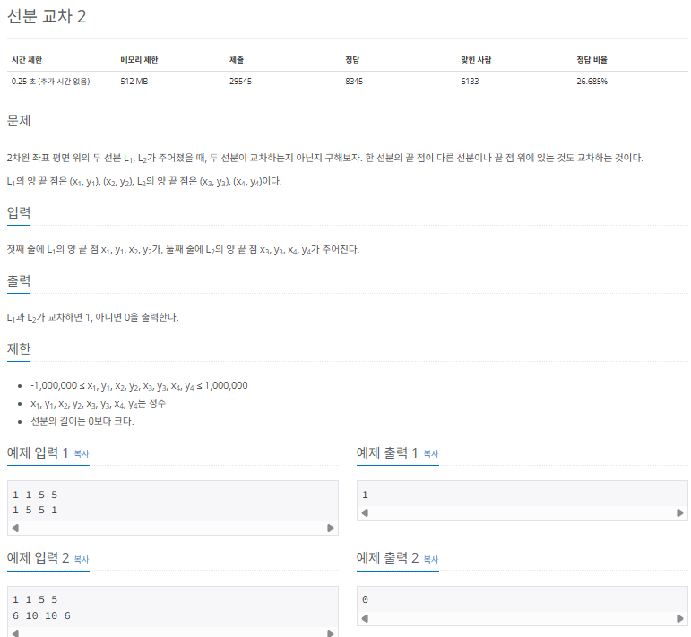
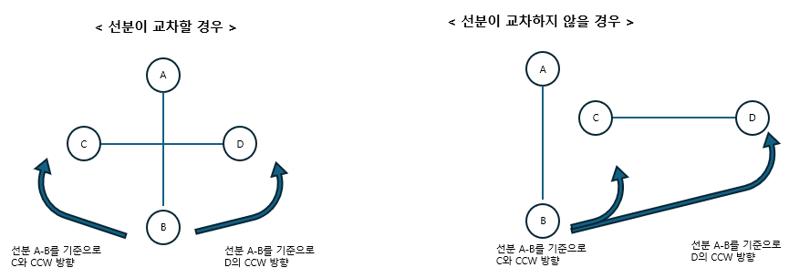
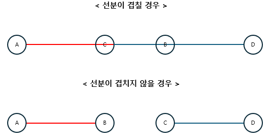
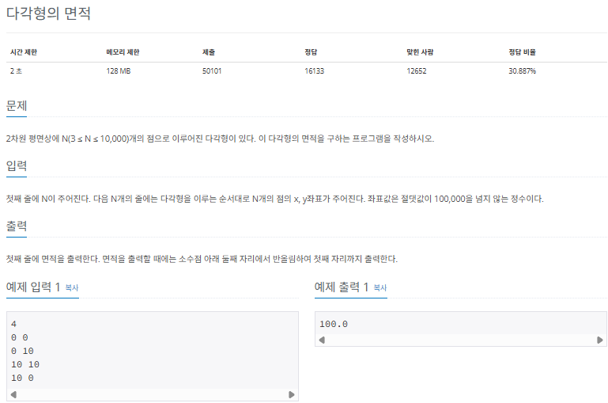
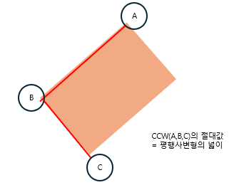
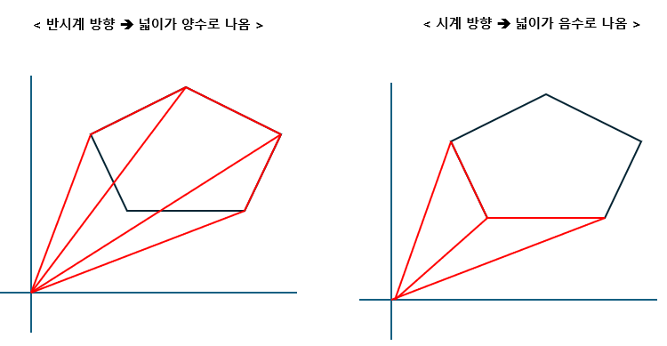

## 기하 알아보기

실제 코딩 테스트에서 기하 알고리즘을 다룰 때 이용하는 CC2에 관해 알아보겟습니다.

### 기하의 핵심이론

CCW(counter-clockwise)는 평문상의 3개의 점과 관련된 점들의 위치관계를 판단하는 알고리즘입니다. 수학적으로는 벡터의 외적과 관련된 이해가 필요하기만 이번 장에서는 코딩테스트에 집중하기 위해 CCW의 공식과 결괏값에 관련된 해석 부분을 집중적으로 다루겠습니다.

세 점을 A($X_1$, $Y_1$), B($X_2$, $Y_2$), C($X_3$, $Y_3$)라고 가정했을 때 CCW 공식은 다음과 같습니다.

> CWW 공식

- CCW = ($X_1$$Y_2$ + $X_2$$Y_3$ + $X_3$$Y_1$) - ($X_2$$Y_1$ + $X_3$$Y_2$ + $X_1$$Y_3$)

이 공식을 다음과 같이 도출하면 좀 더 쉽게 기억할 수 있습니다.

> CCW 공식 도출 과정

1. 1번째 점을 뒤에 한 번 더 습니다.
2. 오른쪽 아래 방향 화살표 곱은 더하고, 왼쪽 아래 방향 화살표 곱은 뺍니다.

이렇게 세 점이 주어졌을 때 CCW 공식을 사용해 세 점에 관한 다양한 관계를 도출할 수 있습니다. CCW 공식은 기하에서 가장 기본이 되므로 코드 자체를 암기해 자신의 것으로 만들어 놓는 것이 좋습니다.

다음으로 CCW를 수행한 결괏값이 어떤 의미를 지니고 있는지 설명하겠습니다. CCW는 부호에 따라 다음과 같은 3가지 의미가 있습니다.


이 부호와 별개로 CCW 겨로가의 절댓값은 세 점으로 이뤄진 두 벡터의 외적값을 나타내고, 이것은 CCW의 절대값을 절반으로 나누면 세 점으로 이뤄진 삼감형의 넓이를 나타낸다는 뜻입니다.

즉, |CCW 결괏값| / 2 는 세 점으로 이줘진 삼감형의 넓이로 이해하면 됩니다. 이 2가지 원리를 이용하면 다양한 기하 관련 문제를 해결할 수 있습니다.

---

### $[문제100]$ 선분 방향 구하기



### $[01단계]$ 문제 분석하기

전형적인 CCW 문제입니다. 핵심 이론에서 설명한 CCW 이론을 실제 코드로 구현할 수 있는지 묻는 문제입니다.

### $[02단계]$ 손으로 풀어보기

1. $P_1$, $P_2$, $P_3$ 3개의 점을 입력받아 변수에 저장하고, CCW를 계산합니다.

- CCW = ($X_1$$Y_2$ + $X_2$$Y_3$ + $X_3$$Y_1$) - ($X_2$$Y_1$ + $X_3$$Y_2$ + $X_1$$Y_3$)

```
CCW = (1 * 5 + 5 * 3 + 7 + 1) - (5 * 1 + 7 * 5 + 1 * 3)
    = 27 - 43 = -16
```

2. CCW 결괏값에 따라 정답을 출력합니다.

```
CCW 결괏갓 < 0 : 시계방향
CCW 결괏갓 = 0 : 일직선
CCW 결괏갓 > 0 : 반시계방향

=> -1 (반시계방향) 출력
```

### $[03단계]$ 슈도코드 작성하기

```
x1, y1, x2, y2, x3, y3 (세 점 x, y 좌푯값을 저장하는 변수)
세 점 정보를 x1, y1, x2, y2, x3, y3 에 입력받기

CCW 수행 -> (x1 * y2 + x2 * y3 + x3 * y1) - (x2 * y1 + x3 * y2 + x1 * y3)

결괏값 출력
```

### $[04단계]$ 코드 구현하기

```c
#include <iostream>
using namespace std;

int main(int argc, char* argv[])
{
    int x1, y1, x2, y2, x3, y3;
    cin >> x1 >> y1 >> x2 >> y2 >> x3 >> y3;
    int result = (x1 * y2 + x2 * y3 + x3 * y1) - (x2 * y1 + x3 * y2 + x1 * y3);

    if (result > 0)
        cout << 1;
    else if (result < 0)
        cout << -1;
    else
        cout << 0;
}
```

---

### $[문제101]$ 선분의 교차 여부 구하기



### $[01단계]$ 문제 분석하기

CCW의 특징을 이용하면 두 선분과 관련된 교차 여부를 구할 수 있습니다. 두 선분을 A-B, C-D 라고 명명했을 때, A-B 선분을 기준으로 점 C와 D를 CCW한 값의 곱과 C-D 선분을 기준으로 점 A와 B를 CCW한 값의 곱이 모두 음수이면 두 선분은 교차한다고 볼 수 있습니다.



선분 A-B를 무한대로 늘렸을 때 C,D 사이를 지나면 두 CCW의 결괏값의 부호는 항상 반대가 됩니다. 그러면 두 CCW의 결괏값의 곱은 항상 음수가 되고, C-D 선분과 관련된 A,B의 CCW 결괏값의 곱도 음수라면 두 선분은 교차한다고 할 수 있습니다.

두 선분이 교차하지 않으면 위와 같이 CCW의 방향이 같을 때 발생하고, 두 점과 관련된 CCW의 결괏값의 곱이 양수가 됩니다.

> 그럼 다음과 같이 선부이 겹칠 때는 어떻게 해야 하나요?



위 그림에 있는 두 예시에서 CCW의 결괏값은 모두 0입니다. 이때는 각 선분의 min max x, y 값으로 겹침 여부를 판단합니다.

선분이 겹치지 않는 경우는 한 선분의 min 값이 다른 선분의 max 값보다 클 때입니다.

위의 겹치지 않는 예시에서는 C-D의 min x값 (점 C의 x값)이 A-B의 max x값 (점 B의 x값)보다 크기 때문에 두 선분이 겹치지 않는다고 판단할 수 있습니다.

### $[02단계]$ 손으로 풀어보기

1. 두 선분과 관련된 CCW값의 곱을 구합니다.

```
x1 = 1, y1 = 1, x2 = 5, y2 = 5
x3 = 1, y3 = 5, x4 = 5, y4 = 1

각 점을 A,B,C,D로 정했을 때 CCW값을 구하면

CCW(ABC) = (1 * 5 + 5 * 5 + 1 * 1) - (5 * 1 + 1 * 5 + 1 * 5) = 16
CCW(ABD) = (1 * 5 + 5 * 1 + 5 * 1) - (5 * 1 + 5 * 5 + 1 * 1) = -16
CCW(CDA) = (1 * 1 + 5 * 1 + 1 * 5) - (5 * 5 + 1 * 1 + 1 * 1) = -16
CCW(CDB) = (1 * 1 + 5 * 5 + 5 * 5) - (5 * 5 + 5 * 1 + 1 * 5) = 16
```

2. 결과에 따른 선분 교차 여부를 확인합니다.

```
CCW(ABC) * CCW(ABD) = (16) * (-16) = 음수
CCW(CDA) * CCW(CDB) = (-16) * (16) = 음수

=> 곱의 결괏값이 모두 음수 => 선분이 교차함
```

### $[03단계]$ 슈도코드 작성하기

```
x1, y1, x2, y2, x3, y3, x4, y4 (네 점 x, y 좌푯값을 저장하는 변수)

각 선분과 관련된 CCW 수행하기
abc = CCW(x1, y1, x2, y2, x3, y3)
abd = CCW(x1, y1, x2, y2, x4, y4)
cda = CCW(x3, y3, x2, y2, x1, y1)
cdb = CCW(x3, y3, x4, y4, x2, y2)

각 선분과 관련된 ccw 결괏값의 곱이 모두 0일때 // 두 선분이 일직선상에 있음
-> 선분 겹침 여부 판별 함수 호출 (isOverlab) 겹쳤으면 1 아니면 0 출력

각 선분과 관련된 CCW 결괏값의 곱이 모두 양수가 아닐 때
-> 선분 교차로 판변 1 출력
-> 이외의 경우 (선분 미교차)  0 출력

---
// 선분 겸침 여부 판별 함수
isOverlab (두 선분의 (x,y) 좌표) {
  각 선분의 x, y와 관련된 min, max 값 구하기
  특정 선분과 좌표의 max 값이 타 선분의 min값보다 항상 크거나 같으면 선분 교차
  아닌 경우가 1개라도 발생하면 선분 미교차
}

// CCW구현
CCW (x1, y1, x2, y2, x3, y3) {
  result = (x1 * y2 + x2 * y3 + x3 * y1) - (x2 * y1 + x3 * y2 + x1 * y3)
  결과가 양수이면 1, 음수이면 -1, 0이면 0을 출력
}
```

### $[04단계]$ 코드 구현하기

```c
#include <iostream>
#include <cmath>
using namespace std;

int CCW(long x1, long y1, long x2, long y2, long x3, long y3);
bool isOverlab(long x1, long y1, long x2, long y2, long x3, long y3, long x4, long y4);
bool isCross(long x1, long y1, long x2, long y2, long x3, long y3, long x4, long y4);

int main(int argc, char* argv[])
{
    long x1, y1, x2, y2, x3, y3, x4, y4; // (네 점 x, y 좌푯값을 저장하는 변수)
    cin >> x1 >> y1 >> x2 >> y2 >> x3 >> y3 >> x4 >> y4;
    bool cross = isCross(x1, y1, x2, y2, x3, y3, x4, y4);

    if (cross)
        cout << 1;
    else
        cout << 0;

    return 0;
}

// CCW구현
int CCW(long x1, long y1, long x2, long y2, long x3, long y3)
{
    long result = (x1 * y2 + x2 * y3 + x3 * y1) - (x2 * y1 + x3 * y2 + x1 * y3);
    if (result > 0)
        return 1;
    else if (result < 0)
        return -1;
    return 0;
}

// 선분 겸침 여부 판별 함수
bool isOverlab(long x1, long y1, long x2, long y2, long x3, long y3, long x4, long y4)
{
    return min(x1, x2) <= max(x3, x4)
        && min(x3, x4) <= max(x1, x2)
        && min(y1, y2) <= max(y3, y4)
        && min(y3, y4) <= max(y1, y2);
}


bool isCross(long x1, long y1, long x2, long y2, long x3, long y3, long x4, long y4)
{
    int abc = CCW(x1, y1, x2, y2, x3, y3);
    int abd = CCW(x1, y1, x2, y2, x4, y4);
    int cda = CCW(x3, y3, x2, y2, x1, y1);
    int cdb = CCW(x3, y3, x4, y4, x2, y2);

    // 선분이 일직선인 경우
    if (abc  * abd == 0 && cda * cdb == 0)
    {
        return isOverlab(x1, y1, x2, y2, x3, y3, x4, y4); // 겹치는 선분인지 판별하기
    }
    // 선분이 교차하는 경우
    else if (abc * abd <= 0 && cda * cdb <= 0)
    {
        return true;
    }
    return false;
}
```

---

### $[문제103]$ 다각형의 넓이 구하기



### $[01단계]$ 문제 분석하기

CCW는 다른 의미로 벡터의 외적값을 의미하기도 합니다. 다음 그림에서 CCW(A,B,C)의 절댓값은 세 점으로 이뤄진 두 벡터의 외적 크기이고, 세 점을 기준으로 하는 평행사변형의 넓이를 나타냅니다.



즉, CCW의 절댓값을 2로 나누면 세 점을 꼭짓점으로 하는 삼각형의 넓이를 구할 수 있습니다. 다각형의 넓이는 결국 원점과 다른 두 점간의 CCW로 다음과 같이 표현할 수 있습니다.



문제에서 점들이 순서대로 제공되는 것은 알고 있지만, 반시계방향인지, 시계방향인지는 알 수 없습니다.

하지만 다른 방향의 넓의 부호는 항상 반대이므로 원점과 순서대로 오는 두 점간의 CCW값들의 합을 절댓값으로 변경하고 2로 나누면 다각형의 넓이가 됩니다.

> CCW = 벡터 외적값 = 3개의 점으로 이뤄지는 평행사변형의 넓이이므로 넓이의 값을 2로 나눠야 합니다.

원점과 다른 두 점 사이의 CCW공식을 좀 더 단순화 하면 다음과 같이 표현할 수 있습니다. 두 점을 $X_1$, $Y_1$과 $X_2$, $Y_2$라고 가정하겠습니다.

> 원점과 다른 두 점 사이의 CCW 공식

- CCW = ($x_2$$y_2$ + $x_2$$y_3$ + $x_3$$y_2$) - ($x_2$$y_1$ + $x_3$$y_2$ + $x_1$$y_3$)

```
CCW = (x2y2 + x2y3 + x3y2) - (x2y1 + x3y2 + x1y3)
    = (x1y2 + 0 + 0) - (x2y1 + 0 + 0)
    = x1y2 - x2y1
```

### $[02단계]$ 손으로 풀어보기

1. 원점과 순서대로 나오는 두 점 사이의 CCW 값을 계산합니다.

```
1번, 2번 : 0 * 10 - 0 * 0   = 0
2번, 3번 : 0 * 10 - 10 * 10 = -100
3번, 4번 : 10 * 0 - 10 * 10 = -100
4번, 1번 : 0 * 0 - 10 * 0   = 0     (마지막 점과 최초 점까지 계산해야 합니다.)
```

2. 결과의 총합을 절대값으로 변경한 후 2로 나눠 정답을 구합니다.

```
0 + -100 + -100 + 0 = -200

=> |-200| = 200
=> 200 / 2 = 100
=> 100
```

### $[03단계]$ 슈도코드 작성하기

```
N (점의 개수)
x (x좌표 저장 배열), y (y 좌표 저장 배열)
result (정답 변수)

for (i -> 0 ~ N - 1) {
  배열에 (x, y)좌표 저장
}

// 배열의 마지막에 처음 점 다시 넣기 -> 마지막과 처음 점도 CCW에 포함
x[N] = x[0]
y[N] = y[0]

for (i -> 0 ~ N) {
  // 원점 i,i + 1 -> 세 점에 대한 CCW값 구하여 result에 더하기
  result += x[i]y[i + 1] - x[i + 1]y[i]
}
result 의 절대값을 2로 나누고 둘째 자리에서 반올림하여 출력하기
```

### $[04단계]$ 코드 구현하기

```c
#include <iostream>
using namespace std;

static int N;
static long x[1001], y[1001];

int main(int argc, char* argv[])
{
    cin >> N;

    for (int i = 0; i < N; i++)
    {
        cin >> x[i];
        cin >> y[i];
    }

    // 마지막과 처음 점도 CCW에 포함
    x[N] = x[0];
    y[N] = y[0];
    double result = 0;

    for (int i = 0; i < N; i++)
    {
        result += (x[i] * y[i + 1]) - (x[i + 1] * y[i]);
    }
    cout << fixed;
    cout.precision(1);
    cout << abs(result) / 2.0;

    return 0;
}
```
