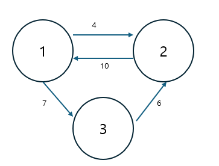

## 이차원 벡터 사용하기

코딩 테스트 문제에서는 그래프와 관련된 알고리즘이 자주 등장합니다. 이때 그래프 구조를 표현하는 데 많이 사용하는 것이 이차원 벡터입니다. 하지만 막상 시험에서 이차원 벡터를 사용하려면 사용법이 헷갈려 당황할 수 있습니다. 이 절에서는 이차원 벡터의 선언부터 활용까지 정확하게 이해할 수 있도록 3단계로 나누어 설명하겠습니다.

### 이차원 벡터를 이용한 그래프 구현

#### $[01단계]$ 이차원 벡터 선언과 초기화

먼저 다음과 같이 그래프의 에지를 표현하는 클래스를 만들어 놓았습니다.

```c
struct Edge {
  int endNode;
  int value;
}
```

해당 클래스를 자료형으로 하는 이차원 벡터를 초기화하는 방법을 확인해 보겠습니다.

```c
vector<vector<Edge>> A;
```

이차원 벡터의 배열을 선언한 코드입니다. 보통 이렇게 선언하면 초기화가 완료되었다고 착각하는 경우가 있습니다. 하지만 노드의 개수가 주어지면 그 개수만큼 벡터 공간을 만들어 주어야 합니다.

```c
int N,E;
cin >> N >> E;
A.resize(N + 1);
```

이 코드는 A[0]부터 A[N]까지 총 N+1개의 vector<Edge> 공간을 만들겠다는 의미입니다. 이제 초기화를 완료햇습니다. 이어서 이렇게 생성한 이차원 벡터에 그래프 데이터를 저장해 보겠습니다.

> 여기서 N개가 아닌 N+1 개로 만든 이유는 자료구조의 인덱스는 보통 0부터 시작하지만 실제 문제에서는 N개으ㅢ 노드가 있다면 1번 노드, 2번 노드, 3번 노드로 표현하는 것이 일반적이기 때문입니다. 따라서 문제의 표현 방식을 그대로 사용하기 위해 0번 공간은 사용하지 않고 1,2,3번을 사용합니다. 배열에서 A[3]을 사용하려면 int A[4], 즉 3보다 1 큰 수로 배열을 선언하는 것과 같은 의미입니다.

### $[02단계]$ 그래프 데이터 저장하기

다음과 같은 간단한 그래프가 있다고 가정하겠습니다.


보통 이런 그래프는 코딩 테스트에서 다음과 같은 입력값으로 주어집니다.

```
3 4     # 노드가 3개, 에지가 4개인 그래프
1 2 4   # 1번 노드에서 2번 노드로 가는 가중치 4의 에지가 있음
2 1 10
1 3 7
3 2 6
```

이러한 그래프 데이터를 이차원 벡터 자료구조를 이용하여 저장해 보겠습니다.

```c
for (int i = 0; i < E; i++) {   # 저장할 에지의 개수만큼 반복
  int s,e,v = 0;
  cin >> s >> e >> v;
  A[s].push_back({e,v});        # 이차원 벡터에 그래프 데이터 저장
}
```

이렇게 저장하면 실제 이차원 벡터에는 데이터가 다음과 같이 저장됩니다.

```
node     edge
  1   -> {2,4} , {3,7}
  2   -> {1,10}
  3   -> {2,6}
```

### $[03단계]$ 그래프 데이터 가져오기

이제 그래프 데이터 저장까지 완료했습니다. 마지막으로 필요한 데이터를 가져오는 코드를 살펴보겠습니다.

다음은 1번 노드에서 시작되는 에지 데이터를 가져오는 코드입니다.

```c
for (Edge edge : A[1]) {
  int next = edge.endNode;
  int value = edge.value;
  cout << "도착노드: " << next << ", 가중치: " << value << "\n";
}
```

이 코드를 사용하면 예제 그래프 데이터에서 다음과 같은 2개의 에지 데이터를 가져올 수 있습니다.

```
node     edge
  1   -> {2,4} , {3,7}    # 해당 데이터
  2   -> {1,10}
  3   -> {2,6}
```

다음은 지금까지 작성한 샘플의 전체 코드입니다. 코드를 보면서 다시 한번 흐름을 파악해 보세요

```c
#include <algorithm>
#include <iostream>
#include <cstdlib>
#include <vector>

using namespace std;

struct Edge {
    int endNode;
    int value;
};

int main(int argc, char *argv[]) {
    vector<vector<Edge>> A;

    int N, E;
    cin >> N >> E;
    A.resize(N + 1);

    for (int i = 0; i < E; i++) {
        int s, e, v = 0;
        cin >> s >> e >> v;
        A[s].push_back({e, v});
    }

    for (Edge edge: A[1]) {
        int next = edge.endNode;
        int value = edge.value;
        cout << "도착노드: " << next << ", 가중치: " << value << "\n";
    }

    return EXIT_SUCCESS;
}
```

#### 실행결과

```
3 4
1 2 4
2 1 10
1 3 7
3 2 6
도착노드: 2, 가중치: 4
도착노드: 3, 가중치: 7
```

지금까지 이차원 벡터의 선언 방법, 데이터 저장, 데이터 가져오기 등의 사용법을 단계별로 자세히 살펴보았습니다.
