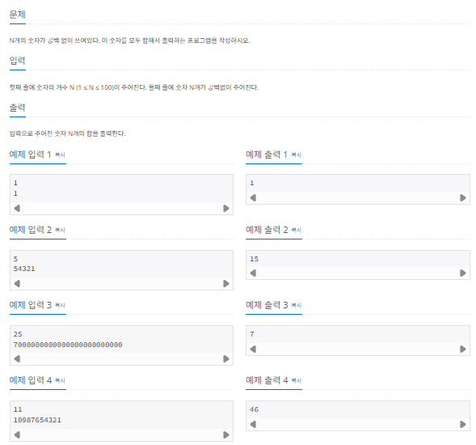
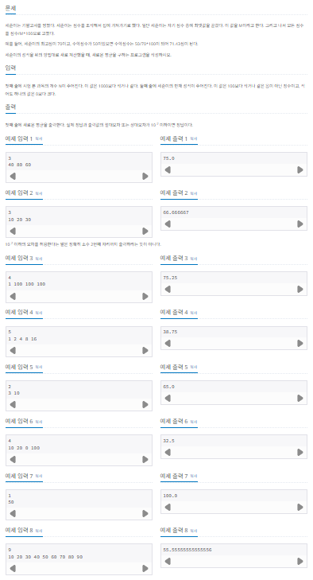

## 배열과 리스트 그리고 벡터

기본 자료구조인 배열과 리스트는 비슷한 점도 많지만 다른 점도 많습니다. 두 자료구조의 특징을 정확하게 이해하고 문제가 요구하는 조건에 따라 적절하게 선택해 사용하는 것이 중요합니다.

### 배열과 리스트의 핵심이론

#### 배열

배열은 메모리의 연속 공간에 값이 채워져 있는 형태의 자료구조입니다. 배열의 값은 인덱스를 통해 참조할 수 있으며, 선언한 자료형의 값만 저장할 수 있습니다.

> 배열의 특징

1. 인덱스를 사용하여 값에 바로 접근할 수 있다.
2. 새로운 값을 삽입하거나 특정 인덱스에 있는 값을 삭제하기 어렵다. 값을 삽입하거나 삭제하려면 해당 인덱스 주변에 있는 값을 이동시키는 과정이 필요하다.
3. 배열의 크기는 선언할 때 지정할 수 있으며, 한 번 선언하면 크기를 늘리거나 줄일 수 없다.
4. 구조가 간단하므로 코딩 테스트에서 많이 사용한다.

#### 리스트

리스트는 값과 포인터를 묶은 노드라는 것을 포인터로 연결한 자료구조 입니다.

> 리스트의 특징

1. 인덱스가 없으므로 값에 접근하려면 Head 포인터부터 순서대로 접근해야 한다. 다시 말해 값에 전근하는 속도가 느리다
2. 포인터로 연결되어 있으므로 데이터를 삽입하거나 삭제하는 연산속도가 빠르다.
3. 선언할 때 크기를 별도로 지정하지 않아도 된다. 리스트의 크기는 정해져 있지 않으며, 크기가 변하기 쉬운 데이터를 다룰때 적절하다.
4. 포인터를 지정할 공간이 필요하므로 배열보다 구조가 복잡하다.

#### 벡터

vector 는 C++ 표준 라이브러리에 있는 자료구조 컨테이너 중 하나로 사용자가 손쉽게 사용할 수 있도록 정의된 클래스입니다. 기존의 배열과 같은 특징을 가지면서 배열의 단점을 보완한 동적 배열의 형태라고 생각하면 됩니다. 벡터의 특징은 다음과 같습니다.

> 벡터의 특징

1. 동적으로 원소를 추가할 수 있다. 즉, 크기가 자동으로 늘어난다.
2. 맨 마지막 위치에 데이터를 삽입하거나 삭제할 때는 문제가 없지만 중간 데이터의 삽입 삭제는 배열과 같은 메커니즘으로 동작한다.
3. 배열과 마찬가지로 인덱스를 이용하여 각 데이터에 직접 접근할 수 있다.

#### 벡터의 사용법

```c

// 선언
vector<int> A;

// 삽입 연산
A.push_back(1);              // 마지막에 1 추가
A.insert(A.begin(), 7);      // 맨 앞에 7을 삽입
A.insert(A.begin() + 2, 10); // index 2의 위치에 10 삽입

// 갑 변경
A[4] = -5;  // index 4의 값을 -5로 변경

// 삭제 연산
A.pop_back();             // 마지막 값 삭제
A.erase(A.begin() + 3);   // index 3에 해당하는 값 삭제
A.clear();                // 모든 값 삭제

// 정보 가져오기
A.size();     // 데이터 개수
A.front();    // 처음 값
A.back();     // 마지막 값
A[3];         // index 3 에 해당하는 값
A.at(5);      // index 5 에 해당하는 값
A.begin();    // 첫번째 데이터 위치
A.end();      // 마지막 데이터 다음 위치
```

## $[문제1]$ $숫자의 합 구하기$ 백준 온라인 11720번



### $[01단계]$ 문제 분석하기

N의 범위가 1부터 100까지이므로 값을 int,long 같은 숫자형으로 담을 수 없습니다. 먼저 문자열 형태로 입력값을 받은 다음 이를 무자 배열로 변환하고, 문자 배열값을 순서대로 읽으면서 숫자형으로 변환해 더해야 합니다.

### $[02단계]$ 슈도코드 작성하기

```
N값 입력받기
숫자를 string 변수(numbers)로 입력받기
sum 변수 선언

for (numbers 길이만큼 반복) {
  sum에 배열의 각 자리의 값을 정수화하여 더하기
}
sum 출력
```

### $[03단계]$ 코드 구현하기

```c
#include <string>
#include <iostream>

using namespace std;

int main(int argc, char *argv[]) {

    int N;
    string numbers;
    cin >> N;
    cin >> numbers;

    int sum = 0;
    for (int i = 0; i < numbers.length(); i++) {
        sum += numbers[i] - '0';
    }
    cout << sum << "\n";

    return EXIT_SUCCESS;
}
```

#### 실행결과

```
5      # 입력값
54321  # 입력값
15
```

## $[문제2]$ $평균구하기$ 백준 온라인 1546번



### $[01단계]$ 문제 분석하기

최고 점수를 기준으로 전체 점수를 다시 계산해야 하므로 모든 점수를 입력받은 후에 최고점을 별도로 저장해야 합니다.
또한 문제에서 제시한 한 과목의 점수를 계산하는 식은 총합과 관련된 식으로 변활할 수 있습니다. 따라서 일일이 변환 점수를 구할 필요 없이 한 번에 변환한 점수의 평균 점수를 구할 수 있습니다.

#### 변환 점수의 평균을 구하는 식 (점수가 A,B,C 인 경우)

(A / M \* 100 + B / M \* 100 + C / M \* 100) / 3 = (A + B + C) \* 100 / M / 3

### $[02단계]$ 손으로 풀어보기

1. 점수를 1차원 배열에 저장합니다.
2. 배열을 탐색하며 최고 점수와 점수의 총합을 구합니다.
3. '총합 \* 100 / 최고 점수 / 과목의 수'를 계산해 다시 계산한 점수의 평균값을 출력합니다
   1. 총합 \* 100 / 최고 점수 / 과목의 수 = 31 \* 100 / 16 / 5 = 38.75

### $[03단계]$ 슈도코드 작성하기

```
N(시험을 본 과목의 개수)
A(과목 데이터 저장)

for (배열 길이만큼 반복) {
  점수 데이터 저장
}
for (배열 길이만큼 반복) {
  최고점 점수 판별하여 저장
  총점 계산
}
sum * 100 / 최고점 / 과목수 출력
```

### $[04단계]$ 코드 구현하기

```c
#include <string>
#include <iostream>

using namespace std;

int main(int argc, char *argv[]) {

    int N = 0;
    int A[1000];
    cin >> N;

    for (int i =0; i < N; i++) {
        cin >> A[i];
    }

    long sum = 0;
    long max = 0;

    for (int i = 0; i < N; i++) {
        if (A[i] > max) {
            max = A[i];
        }
        sum += A[i];
    }

    double result = sum * 100.0f / max / N;
    cout << result << "\n";

    return EXIT_SUCCESS;
}
```

#### 실행결과

```
3      # 입력값
10     # 입력값
20     # 입력값
30     # 입력값
66.6667
```
