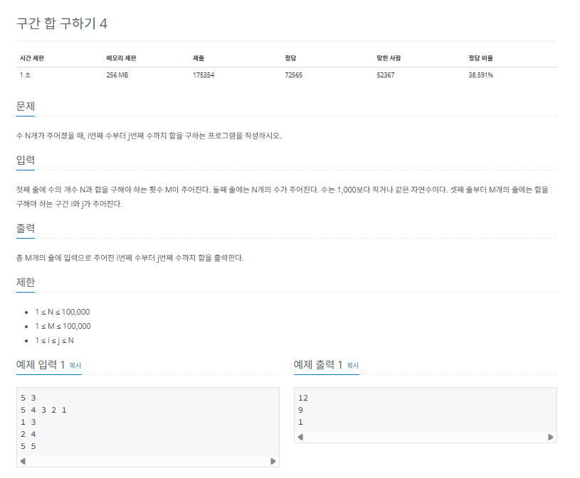
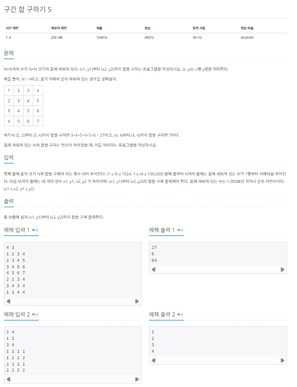
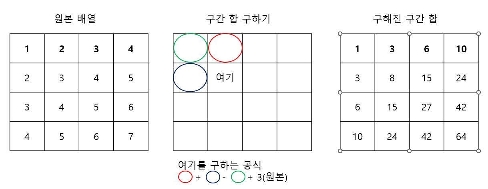
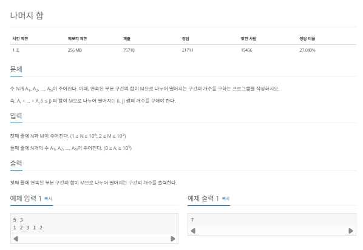
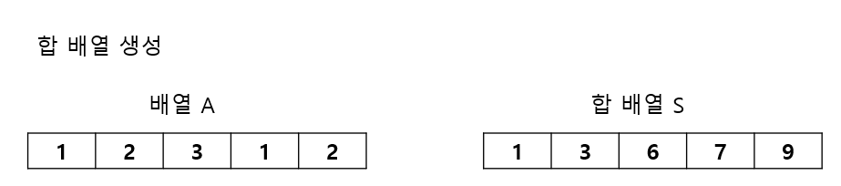
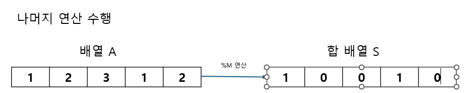

## 구간 합

구간 합은 합 배열을 이용하여 시간 복잡도를 더 줄이기 위해 사용하는 특수한 목적의 알고리즘 입니다. 코딩 테스트에서 빈도가 높으니 알아 두기 바랍니다.

### 구간 합의 핵심 이론

구간 합 알고리즘을 활용하려면 먼저 합 배열을 구해야 합니다. 배열 A가 있을 때 합 배열 S는 다음과 같이 정의합니다.

#### 합 배열 S 정의

S[i] = A[0] + A[1] + A[2] + ... + A[i-1] + A[i] # A[0]부터 A[i]까지의 합

합 배열은 기존 배열을 전처리한 배열이라 생각하면 됩니다. 이렇게 합 배열을 미리 구해 놓으면 기존 배열의 일정 범위 합을 구하는 시간 복잡도가 O(N)에서 O(1)로 감소합니다. 다음 그림을 통해 합 배열을 좀 더 자세히 설명해 보겠습니다.


A[i]부터 A[j]까지의 배열 합을 합 배열 없이 구하는 경우, 최악의 경우는 i가 0이고 j가 N인 경우로 시간 복잡도는 O(N)입니다. 이런 경우 앞에서 알아본 합 배열을 사용하면 O(1)안에 답을 구할 수 있습니다. 합 배열은 다음과 같은 간단한 공식으로 만들 수 있습니다.

#### 합 배열 S를 만드는 공식

S[i] = S[i - 1] + A[i];

이렇게 구현된 합 배열을 이용하여 구간 합 역시 쉽게 구할 수 있습니다. i에서 j까지 구간 합을 구하는 공식은 다음과 같습니다.

#### 구간 합을 구하는 공식

S[j] - S[i - 1] // i 에서 j까지 구간 합

구간 합 공식이 어떻게 나온 것인지 다음 그림을 통해 자세히 알아 보겠습니다. 다음 그림은 배열 A의 A[2]부터 A[5]까지의 구간 합을 합 배열을 통해 구하는 과정을 보여줍니다.


그림을 보면 합 배열과 구간 합이 연관되어 있다는 것을 알 수 있습니다. A[0] + ... + A[5]에서 A[0] + A[1]을 빼면 A[2]+ ... + A[5]가 나오므로 S[5]에서 S[1]을 빼면 구간 합을 쉽게 구할 수 있습니다.

#### A[2] ~ A[5] 구간 합을 합 배열로 구하는 과정

S[5] = A[0] + A[1] + A[2] + A[3] + A[4] + A[5]
S[1] = A[0] + A[1]
S[5] - S[1] = A[2] + A[3] + A[4] + A[5]

합 배열과 구간 합 공식을 적재적소에 활용하면 시간 복잡도를 줄이는데 많은 도움이 됩니다.

## $[문제]$ [책 64쪽, 백준 11659]



```c
#include <string>
#include <iostream>

using namespace std;

int main(int argc, char *argv[]) {

    int suNo;
    int quizNo;
    cin >> suNo >> quizNo;

    int S[100001] = {};

    for (int i = 1; i <= suNo; i++) {
        int temp;
        cin >> temp;
        S[i] = S[i - 1] + temp;
    }

    for (int i = 0; i < quizNo; i++) {
        int start, end;
        cin >> start >> end;
        cout << S[end] - S[start - 1] << "\n";
    }

    return EXIT_SUCCESS;
}
```

## $[문제]$ [책 67쪽, 백준 11660]



### $[01단계]$ 문제 분석하기

먼저 질의의 개수가 100,000이므로 이 문제 역시 질의마다 합을 구하면 안되고, 구간 합 배열을 이용해야 한다는 것을 알 수 있습니다. 구간 합 배열이 1차원에서 2차원으로 확장된것으로 생각하여 구간 합 배열을 어떻게 구성할 지 고민하는 것이 이 문제의 핵심입니다. 2차원 구간 합 배열은 다음과 같이 정의할 수 있습니다.

#### 2차원 구간 합 배열 D[X][Y] 정의

D[X][Y] = 원본 배열의 (0,0)부터 (X,Y)까지의 사각형 영역 안에 있는 수의 합

### $[02단계]$ 구간의 합 구하기

#### D[i][j]의 값을 채우는 구간 합 공식

> 2차원 구간 합 배열의 1행, 1열부터 구합니다. 구간 합 배열 1행,1열은 다음과 같이 구합니다.

```
D[1][j] = D[1][j-1] + A[i][j] # 오른쪽으로
D[i][1] = D[i-1][1] + A[i][j] # 아래로
```

> D[i][j]의 값을 채우는 구간 합 공식

```
D[i][j]의 값을 채우는 구간 합 공식
D[i][j] = D[i][j-1]        # 왼쪽 구간 합
        + D[i-1][J]        # 위쪽 구간 합
		- D[i-1][j-1]      # 왼쪽 위 대각선 구간 합
		+ A[i][j]          # 원본
```



결국 질의에 대한 답을 구하는 공식은 다음과 같습니다. 이를 통해 각 질의의 답을 빠르게 구할 수 있습니다.

### 질의 $X_1, Y_1, X_2, Y_2$에 대한 답을 구간 합으로 구하는 방법

$D[X_2][Y_2] - D[X_1-1][Y_2] - D[X_2][Y1-1] + D[X_1-1][Y_1-1]$

### $[03단계]$ 코드 구현

```c
#include <string>
#include <iostream>
#include <vector>

using namespace std;

int main(int argc, char *argv[]) {
    int N, M;
    cin >> N >> M;

    vector<vector<int> > A(N + 1, vector<int>(N + 1, 0)); // 원본 배열
    vector<vector<int> > D(N + 1, vector<int>(N + 1, 0)); // 구간 합 배열

    for (int i = 1; i <= N; i++) {
        for (int j = 1; j <= N; j++) {
            cin >> A[i][j];
            D[i][j] = D[i - 1][j] + D[i][j - 1] - D[i - 1][j - 1] + A[i][j];
        }
    }

    for (int i = 0; i < M; i++) {
        int x1, x2, y1, y2;
        cin >> x1 >> y1 >> x2 >> y2;
        int result = D[x2][y2] - D[x1-1][y2] - D[x2][y1-1] + D[x1-1][y1-1];
        cout << result << "\n";
    }


    return EXIT_SUCCESS;
}
```

#### 결과

```
4 3      # 입력값
1 2 3 4  # 입력값
2 3 4 5  # 입력값
3 4 5 6  # 입력값
4 5 6 7  # 입력값

2 2 3 4  # 입력값
27

3 4 3 4  # 입력값
6

1 1 4 4  # 입력값
64
```

## $[문제]$ [책 72쪽, 백준 10986]



### $[01단계]$ 문제 분석하기

N의 최댓값이 $10^6$이라 연산량이 적게 느껴질 수 있습니다. 하지만 잠시 생각해 보면 $10^6$개의 수에 대하여 모든 구간 합을 구해야 하므로 1초 안에 연산하기는 어렵습니다. 여기서도 구간 합 배열을 이용해야 합니다. 이 문제의 핵심 아이디어는 다음과 같습니다.

> 나머지 합 문제 풀이의 핵심 아이디어

1. (A + B) % C는 ((A % C) + (B % C)) % C와 같다. 다시말해 특정 구간 수들의 나머지 연산을 더해 나머지 연산을 한 값과 이 구간 합에 나머지 연산을 한 값은 동일하다.
2. 구간 합 배열을 이용한 식 S[j] - S[i]는 원본 배열의 i + 1부터 j까지의 구간 합이다.
3. S[j] % M 의 값과 S[i] % M의 값이 같다면 (S[j] - S[i]) % M은 0이다. 즉, 구간 합 배열의 원소를 M으로 나눈 나머지로 업데이트하고 S[j]와 S[i]가 같은 (i,j)쌍을 찾으면 원본 배열에서 i + 1부터 j까지의 구간 합이 M으로 나누어떨어진다는 것을 알 수 있다.

### $[02단계]$ 손으로 풀어보기

앞서 본 아이디어를 이용해 문제를 손으로 풀어보겠습니다.

1. 배열 A의 합 배열 S를 생성합니다.
   

2. 합 배열 s의 모든 값에 대해 M(3)으로 나머지 연산을 수행해 값을 업데이트합니다.
   

3. 우선 변경된 합 배열에서 원소 값이 0인 개수만 세어 정답에 더합니다. 변경된 합 배열의 원소 값이 0이라는 뜻은 원본 배열의 0부터 i까지의 구간 합이 이미 M으로 나누어떨어진다는 뜻이기 때문입니다.

```
경우의 수 = +3
```

4. 이제 변경된 합 배열에서 원소 값이 같은 인덱스의 개수, 즉, 나머지 값이 같은 합 배열의 개수를 셉니다. 변경된 합 배열에서 원소 값이 같은 2개의 원소를 뽑는 모든 경우의 수를 구하여 정답에 더하면 됩니다. 위의 예에서는 0이 3개, 1이 2개이므로, $_3C_2, _2C_2$로 경우의 수를 구하여 더하면 됩니다.

   > 앞서 본 아이디어에서 변경된 합 배열에서 S[i]와 S[j]의 나머지가 같으면 원본 배열에서 i + 1까지의 구간 합이 M으로 나누어떨어지는 구간이라고 설명했습니다.

1. $_3C_2$ = 3 -> 경우의 수 = +3
1. $_2C_2$ = 1 -> 경우의 수 = +1
1. 총 경우의 수 = 3 + 3 + 1 = 7

### $[03단계]$ 슈도 코드 작성하기

```
N(수열의 개수), M(나누어떨어져야 하는 수)
S(합 배열), C(같은 나머지를 가지는 인덱스를 카운트하는 배열)

for (i -> 1 ~ N) {
  S[i] = S[i-1] + A[i]  // 합 배열 저장
}
for (i -> 0 ~ N) {
  remainder = S[i] % M; // 합 배열을 M으로 나눈 나머지 값
  if (remainder == 0) 정답을 1 증가
  C[remainder]의 값을 1 증가시킴
}
for (i -> 0 ~ M) {
  C[i] (i를 나머지로 가지는 인덱스의 개수)에서 2가지를 뽑는 경우의 수를 정답에 더하기
  // C[i]개 중에 2개를 뽑는 경우의 수 계산 공식 -> C[i] * (C[i] - 1) / 2
}

결과값(answer) 출력
```

### $[04단계]$ 코드 구현하기

```c
#include <string>
#include <iostream>
#include <vector>

using namespace std;

int main(int argc, char *argv[]) {

    int N, M;
    cin >> N >> M;
    vector<long> S(N , 0);
    vector<long> C(N , 0);

    long answer = 0;
    cin >> S[0];

    // 구간 합 구하기
    for (int i = 1; i < N; i++) {
        int temp = 0;
        cin >> temp;
        S[i] = S[i - 1] + temp;
    }

    // 합 배열의 모든 값에 % 연산 수행하기
    for (int i = 0; i < N; i++) {
        int remainder = S[i] % M;
        // 0 ~ i까지의 구간 합 자체가 0일때 정답에 더하기
        if (remainder == 0) answer++;

        // 나머지가 같은 인덱스의 개수 세기
        C[remainder]++;
    }
    for (int i = 0; i < M; i++) {
        if (C[i] > 1) {
            // 나머지가 같은 인덱스 중 2개를 뽑는 경우의 수를 더하기
            answer = answer + (C[i] * (C[i] - 1) / 2);
        }
    }

    cout << answer << "\n";
    return EXIT_SUCCESS;
}
```

#### 결과

```
5 3         # 입력값
1 2 3 1 2   # 입력값
7
```
