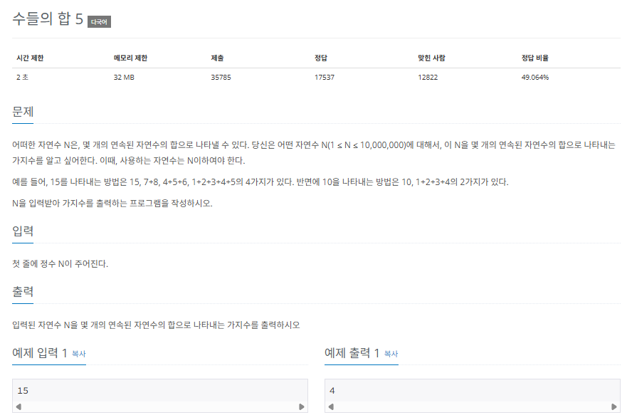
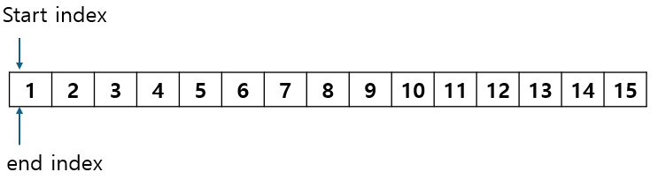
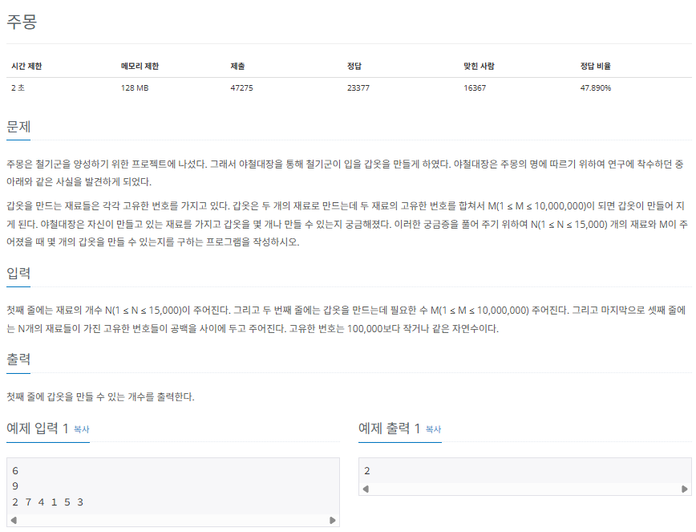
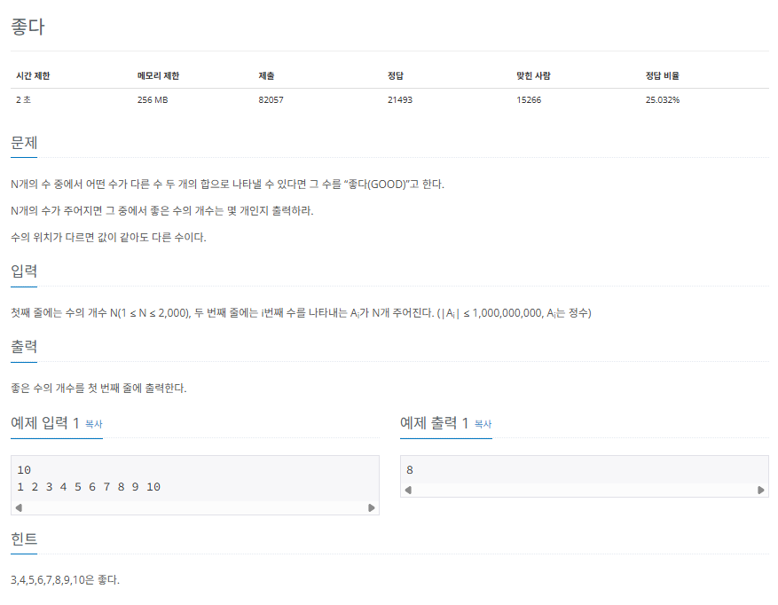

## 투 포인터

투 포인터는 2개의 포인터로 알고리즘의 시간 복잡도를 최적화합니다. 알고리즘이 매우 간단하므로 바로 실전문제로 갑니다.

### $[문제006]$ 연속된 자연수의 합 구하기



### $[01단계]$ 문제 분석하기

이 문제는 시간 복잡도 분석으로 사용할 알고리즘의 범위부터 줄여야 합니다. 우선 문제에 주어진 시간 제한은 2초입니다. 그런데 N의 최대값은 10,000,000으로 매우 크게 잡혀있습니다. 이런 상황에서는 O(nlogn)의 시간 복잡도 알고리즘을 사용하면 제한 시간을 초과하므로 O(n)의 시간 복잡도 알고리즘을 사용해야 합니다. 이런 경우 자주 사용하는 방법인 투 포인터입니다. 연속된 자연수의 합을 구하는 문제이므로 시작 인덱스와 종료 인덱스를 지정하여 연속된 수를 표현하겠습니다. 시작 인덱스, 종료 인덱스를 투 포인터로 지정한 후 문제에 접근해 보겠습니다.

### $[02단계]$ 손으로 풀어 보기

1. 입력받은 값을 N에 저장한 후 코드에서 사용할 변수를 모두 초기화합니다. 결과 변수 count를 1로 초기화하는 이유는 N이 15일때 숫자 15만 뽑는 경우의 수를 미리 넣고 초기화했기 때문입니다.



초기화: sum = 1, count = 1

2. 다음과 같은 투 포인터 이동 원칙을 활용해 배열의 끝까지 탐색하면서 합이 N이 되는 경우의 수를 구합니다. start_index를 오른쪽으로 한칸 이동하는 것은 연속된 자연수에서 왼쪽 값을 삭제하는 것과 효과가 같으며, end_index를 오른쪽으로 한 칸 이동하는 것은 연속된 자연수의 범위를 한 칸 더 확장하는 의미입니다. sum과 N이 같은 때는 경우의 수를 1을 증가시키고, end_index를 오른쪽으로 이동시킵니다.

> 투 포인터 이동 원칙

```
1. sum > N : sum = sum - start_index; start_index++;
2. sum < N : end_index++; sum = sum + end_index;
3. sum == N : end_index++; sum = sum + end_index; count++;
```

3. 2단계를 end_index가 N이 될 때까지 반복하되, 포인터를 이동할 때마다 현재의 총합과 N을 비교해 값이 같으면 count를 1만큼 증가시키면 됩니다.

### $[03단계]$ 코드 구현하기

```c
#include <string>
#include <iostream>
#include <vector>

using namespace std;

int main(int argc, char *argv[]) {
    int N;
    cin >> N;
    int count = 1;
    int start_index = 1;
    int end_index = 1;
    int sum = 1;

    while (end_index != N) {
        if (sum == N) {             // 답을 찾았을 때
            count++;
            end_index++;
            sum = sum + end_index;
        } else if (sum > N) {       // 현재 합이 답보다 클때;
            sum = sum - start_index;
            start_index++;
        } else {                    // 현재 합이 답보다 작을 때
            end_index++;
            sum = sum + end_index;
        }
    }

    cout << count << "\n";

    return EXIT_SUCCESS;
}
```

#### 결과

```
15   # 입력값
4
```

### $[문제007]$ 주몽의 명령



### $[01단계]$ 문제 분석하기

우선 시간본작도를 고려해 봅시다. 두 재료의 번호의 합, 즉, 크기를 비교하므로 값을 정렬하면 문제를 좀 더 쉽게 풀 수 있습니다. N의 최대 범위가 15,000이므로 O(nlogn)시간 복잡도 알고리즘을 사용해도 문제가 없겠네요. 일반적으로 정렬 알고리즘의 시간 복잡도는 O(nlogn)입니다. 즉, 정렬을 사용해도 괜찮습니다. 입력받은 N개의 재룟값을 정렬한 다음 양쪽 끝의 위치를 투 포인터로 지정해 문제에 접근해 보겠습니다.

> 투 포인터 이동 원칙은 다음과 같습니다.

1. A[i] + A[j] > M : j--; // 번호의 합이 M보다 크므로 큰 번호 index를 내립니다.
2. A[i] + A[j] < M : i++; // 번호의 합이 M보다 작으므로 작은 번호 index를 올립니다.
3. A[i] + A[j] == M : i++; j--; count++; // 양쪽 포인터를 모두 이동시키고 count를 증가시킵니다.

### $[02단계]$ 코드 구현하기

```c
#include <algorithm>
#include <string>
#include <iostream>
#include <vector>

using namespace std;

int main(int argc, char *argv[]) {
    int N, M;
    cin >> N >> M;
    vector<int> A(N, 0);

    for (int i = 0; i < N; i++) {
        cin >> A[i];
    }
    sort(A.begin(), A.end());

    int count = 0;
    int i = 0;
    int j = N - 1;

    while (i < j) {
        // 투 포인터 이동 원칙에 따라 포인터를 이동하며 처리
        if (A[i] + A[j] < M) {
            i++;
        } else if (A[i] + A[j] > M) {
            j--;
        } else {
            count++;
            i++;
            j--;
        }
    }

    cout << count << "\n";
    return EXIT_SUCCESS;
}
```

### $[문제008]$ '좋은 수' 구하기



### $[01단계]$ 문제 분석하기

시간 복잡도부터 생각해 봅시다. N의 개수가 최대 2,000이라 가정해도 좋은 수 하나를 찾는 알고리즘의 신간 복잡도는 $N^2$보다 작아야합니다. 만약 좋은 수 하나를 찾는 데 시간 복잡도가 $N^2$인 알고리즘을 사용하면 최종 시간 복잡도는 $N^3$이 되어 제한 시간 안에 문제를 풀 수 없기 때문이죠. 따라서 좋은 수 하나를 찾는 알고리즘의 시간 복잡도는 최소 O(nlogn)이어야 합니다. 정렬, 투 포인터 알고리즘을 사용하면 되겠네요. 단, 정렬된 데이터에서 자기 자신을 좋은 수 만들기에 포함하면 안됩니다. 이점을 예외로 처리해야 한다는 것을 염두에 두고 문제에 접근해 보겠습니다.

### $[02단계]$ 손으로 풀어보기

1. 수를 입력받아 배열에 저장한 후 정렬합니다.
2. 투 포인터 i,j를 배열 A양쪽 끝에 위치시키고 조건에 적합한 투 포인터 이동 원칙을 활용하여 탐색을 수행합니다. 판별의 대상이 되는 수는 K라고 가정합니다.

> 투 포인터 이동 원칙

1. A[i] + A[j] > K : j--;
2. A[i] + A[j] < K : i++;
3. A[i] + A[j] == K : count++; 프로세스 종료

4. 2단계를 배열의 모든 수에 대해 반복합니다. 즉, K가 N이 될 때까지 반복하며 좋은 수가 몇개인지 셉니다.

### $[03단계]$ 코드 구현하기

```c
#include <algorithm>
#include <string>
#include <iostream>
#include <vector>

using namespace std;

int main(int argc, char *argv[]) {
    int N;
    cin >> N;

    vector<int> A(N, 0);

    for (int i = 0; i < N; i++) {
        cin >> A[i];
    }
    sort(A.begin(), A.end());

    int result = 0;
    for (int k = 0; k < N; k++) {
        long find = A[k];
        int i = 0;
        int j = N - 1;

        while (i < j) {
            int sum = A[i] + A[j];
            if (sum == find) {

                if (i != k && j != k) {
                    result++;
                    break;
                }
                // 단, 정렬된 데이터에서 자기 자신을 좋은 수 만들기에 포함하면 안됩니다.
                else if (i == k) {
                    i++;
                } else if (j == k) {
                    j--;
                }

            } else if (sum < find) {
                i++;
            } else {
                j--;
            }
        }
    }


    return EXIT_SUCCESS;
}
```
