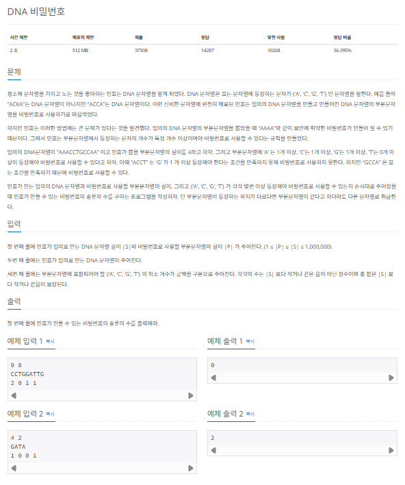
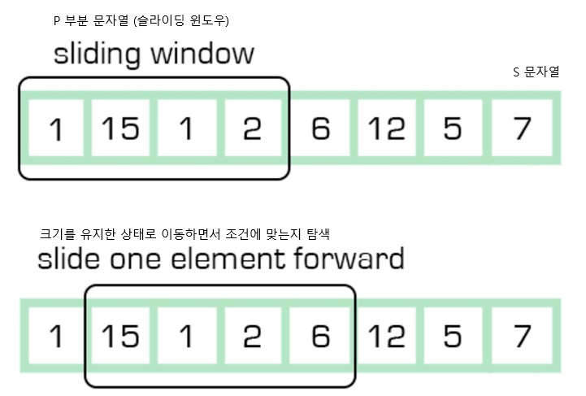
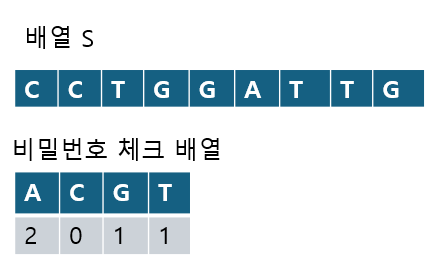
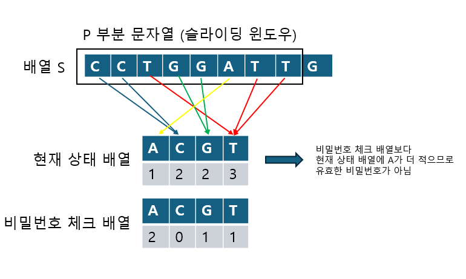
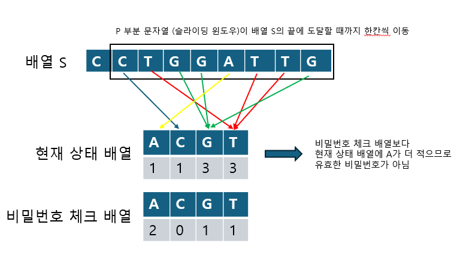
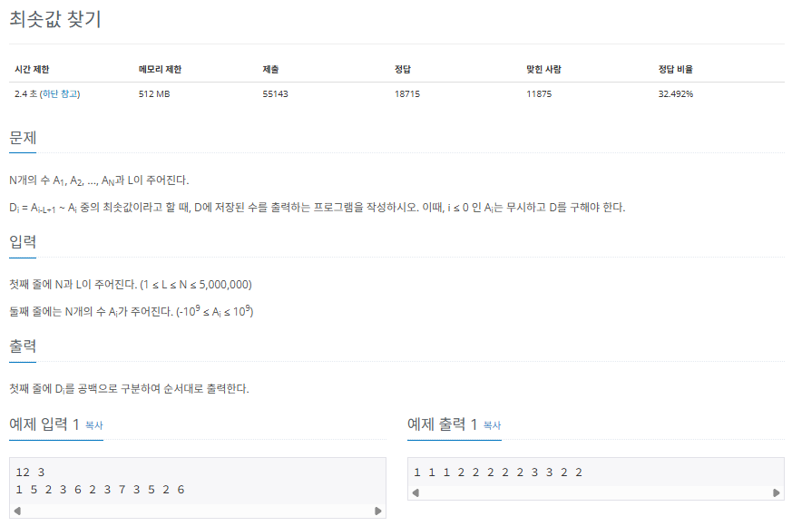
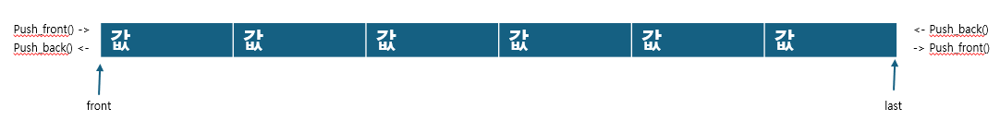
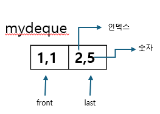
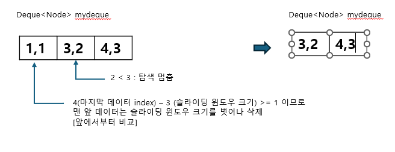
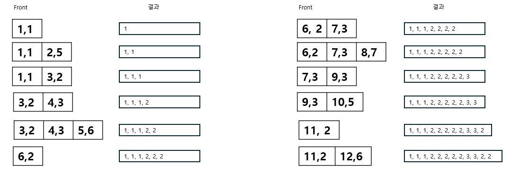

## 슬라이딩 윈도우

슬라이딩 윈도우 알고리즘은 2개의 포인터로 범위를 지정한 다음, 범위(window)를 유지한 채로 이동(sliding)하며 문제를 해결합니다. 투 포인터 알고리즘과 매우 비슷하고 원리도 간단하므로 설명없이 발 ㅗ실전 문제를 풀며 슬라이딩 윈도우 알고리즘의 개념과 원리를 공부해 보겠습니다.

### $[문제009]$ DNA 비밀번호



### $[01단계]$ 문제 분석하기

P와 S의 길이가 1,000,000으로 매우 크기 때문에 O(n)의 시간 복잡도 알고리즘으로 문제를 해결해야 합니다. 이때 부분 문자열의 길이가 P이므로 슬라이딩 윈도우의 개념을 이용하면 문제를 쉽게 해결할 수 있습니다.



그림에서처럼 길이가 P인 윈도우를 지정하여 배열 S의 시작점에 놓습니다. 그런다음 윈도우를 오른쪽으로 밀면서 윈도우에 잡힌 값들이 조건에 맞는지 탐색합니다. 마치 창틀에 창문을 놓고 이동하는 모양 같네요. 그래서 슬라이딩 윈도우라는 이름이 붙은것입니다. 배열 S의 길이만큼만 탐색을 진행하면 되므로 O(n)의 시간 복잡도로 문제를 해결할 수 있습니다. 이 개념을 바탕으로 문제를 풀어보겠습니다.

### $[02단계]$ 손으로 풀어보기

1. 배열 S와 비밀번호 체크 배열을 저장합니다.



2. 윈도우에 포함된 문자로 현재 상태 배열을 만듭니다. 그런 다음 현재 상태 배열과 비밀번호 체크 배열을 비교하여 유효한 비밀번호인지 판단합니다.



3. 윈도우를 한 칸씩 이동하며 현재 상태 배열을 업데이트합니다. 현재 상태 배열을 업데이트한 이후에는 비밀번호 체크 배열과 비교하여 비밀번호 유효성을 판단합니다. 현재 상태 배열을 업데이트할 땐느 빠지는 문자열, 신규 문자열만 확인하여 업데이트합니다.



위 그림의 경우 윈도우를 한 칸 이동하여 C가 빠지고, G가 추가되어 현재 상태 배열을 1,2,2,3에서 1,1,3,3으로 업데이트한 것입니다. 유효한 비밀번호는 아닙니다.

이 문제는 슬라이딩 윈도우 원리 이외에도 '실제 문자열과 관련된 배열 처리를 어떻게 할 것인가?', '비밀번호 유효성 검사를 보다 빠르게 할 수 있는 방법이 있을까?'등 코드 수준에서 고민이 필요한 부분이 있습니다.

### $[03단계]$ 코드 구현하기

```c
#include <complex.h>
#include <iostream>

using namespace std;

int checkArr[4];
int myArr[4];
int checkSecret = 0;

void Add(char c);

void Remove(char c);

int main(int argc, char *argv[]) {
    int S, P;
    cin >> S >> P;
    int Result = 0;
    string A;
    cin >> A;

    for (int i = 0; i < 4; i++) {
        cin >> checkArr[i];
        if (checkArr[i] == 0) {
            checkSecret++;
        }
    }

    for (int i = 0; i < P; i++) {
        // 초기 P 부분 문자열 처리
        Add(A[i]);
    }
    if (checkSecret == 4) {
        Result++;
    }

    // 슬라이딩 윈도우 처리 부분
    for (int i = P; i < S; i++) {
        int j = i - P;
        Add(A[i]);
        Remove(A[j]);
        // 4종류 문자의 개수 조건을 모두 충족하면 유효한 비밀번호
        if (checkSecret == 4) {
            Result++;
        }
    }

    cout << Result << endl;
    return EXIT_SUCCESS;
}

void Add(char c) {
    switch (c) {
        case 'A':
            myArr[0]++;
            if (myArr[0] == checkArr[0])
                checkSecret++;
            break;
        case 'C':
            myArr[1]++;
            if (myArr[1] == checkArr[1])
                checkSecret++;
            break;
        case 'G':
            myArr[2]++;
            if (myArr[2] == checkArr[2])
                checkSecret++;
            break;
        case 'T':
            myArr[3]++;
            if (myArr[3] == checkArr[3])
                checkSecret++;
            break;
    }
}

void Remove(char c) {
    switch (c) {
        case 'A':
            if (myArr[0] == checkArr[0])
                checkSecret--;
            myArr[0]--;
            break;
        case 'C':
            if (myArr[1] == checkArr[1])
                checkSecret--;
            myArr[1]--;
            break;
        case 'G':
            if (myArr[2] == checkArr[2])
                checkSecret--;
            myArr[2]--;
            break;
        case 'T':
            if (myArr[3] == checkArr[3])
                checkSecret--;
            myArr[3]--;
            break;
    }
}
```

### $[문제010]$ 최솟값 찾기



### $[01단계]$ 문제 분석하기

일정 범위 안에서 최솟값을 구하는 문제이므로 슬라이딩 윈도우와 정렬을 사용하면 될 것 같습니다. 윈도우의 크기는 문제에서 최솟값을 구하는 범위가 i - L부터 i까지이므로 L로 생각하면 됩니다. 최솟값을 찾기위한 정렬은 어떨까요? 일반적으로 정렬은 O(nlogn)의 시간 복잡도를 가지므로 N과 L의 최대 범위가 5,000,000인 이 문제에서는 정렬을 사용할 수 없습니다. 다시 말해 O(n)의 시간 복잡도로 해결해야 합니다. 이때 슬라이딩 위녿우를 덱(deque)으로 구현하여 정렬 효과를 볼 수 있습니다. 우선 덱의 구조를 이해해 봅시다.



그림을 보면 덱은 양 끝에서 데이터를 삽입하거나 삭제할 수 있는 자료구조라는 것을 파악할 수 있습니다. 왼쪽에서는 push_front(), pop_front() 함수가 삽입, 삭제 역할을 하고, 오른쪽에서는 push_back(), push_back() 함수가 삽입,삭제 역할을 합니다. 덱을 이용하여 정렬 효과를 어떻게 얻는지 손으로 문제를 풀어 보며 알아봅시다.

### $[02단계]$ 손으로 풀어보기

1. 덱에서는 (인덱스,숫자) 형태의 노드를 클래스로 구현하여 저장합니다. 덱에서 노드를 제거하는 상황을 설명하기 위해 (1,1)과 (2,5)를 덱에 추가할 때 필요한 탐색, 검사 과정은 생략했습니다. 생략한 과정들은 덱에서 노드를 제거하는 과정을 설명한 이후 다시 설명하겠습니다.



2. 이 상태에서 새 노드(3,2)가 덱에 저장됩니다. 여기부터 기존 덱에 있던 노드가 제거됩니다.


새 노드 (3,2)가 저장될 때 덱 뒤에서부터 비교를 시작합니다. (2,5)는 (3,2)보다 숫자가 크므로 (2,5)는 덱에서 제거(pop_back)합니다. 이어서 (1,1)은 (3,2)보다 숫자가 작으므로 탐색을 멈추고 (3,2)를 덱에 저장합니다. 결과를 보면 (2,5)가 덱에서 제거되어 덱에는 (1,1),(3,2)순서로 노드가 오름차순으로 정렬되어 있습니다. 바로 이것이 덱을 이용하여 정렬 효과를 보는 방법입니다. 정리를 끝마친 상태의 덱을 보면 인덱스 범위는 1~3으로 슬라이딩 윈도우의 크기인 K(3)와 같습니다. 최솟값 찾기는 쉽습니다. 바로 덱 처음에 있는 (1,1)노드의 숫잣값입니다.

3. 계속해서 새 노드를 추가합니다. 이번에는 인덱스 범위가 슬라이딩 윈도우를 벗어난 예를 볼 수 있습니다.



새 노드 (4,3)은 덱 뒤에서부터 비교했을때 (3,2)보다 숫자가 크므로 덱에 저장됩니다. 여기서 인덱스 범위에 의해 덱 앞쪽의 노드가 제거됩니다. (1,1)(3,2)(4,3)의 인덱스 범위는 1~4이므로 윈도우 범위인 3을 벗어납니다. 최솟값은 윈도우 범위 내에서 찾기로 했으므로 (1,1)은 덱에서 제거해야 합니다. 제거가 끝난 이후에 최솟값을 출력하며 2입니다.

4. 다시 정리하면 숫자 비교, 윈도우 범위 계산이 끝난 덱에서 맨 앞에 있는 노드의 숫자를 출력하기만 하면 정답이 됩니다. 전체 과정을 나타내면 다음과 같습니다.



### $[03단계]$ 코드 구현하기

```c
#include <iostream>
#include <deque>

using namespace std;
typedef pair<int, int> Node;

int main(int argc, char *argv[]) {

    int N, L;
    cin >> N >> L;
    deque<Node> mydeque;

    for (int i =0; i < N; i++) {
        int now;
        cin >> now;

        // 값이 들어올 때마다 정렬하지 않고
        // 현재 수보다 큰 값을 덱에서 제거하여 시간 복잡도를 줄임
        while (mydeque.size() && mydeque.back().first > now) {
            mydeque.pop_back();
        }
        mydeque.push_back(Node{now, i});

        // 범위에서 벗어난 값은 덱에서 제거
        if (mydeque.front().second <= i - L) {
            mydeque.pop_front();
        }

        cout << mydeque.front().first << " ";
    }
}
```

이 문제의 핵심은 정렬 알고리즘을 사용하지 않고 슬라이딩 윈도우와 덱을 이용해 정렬 효과를 보는 것입니다. 코드를 직접 구현하면서 슬라이딩 윈도우 기법을 자신의 것으로 만들어 보세요.
