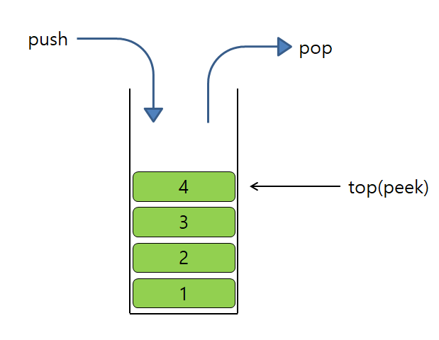
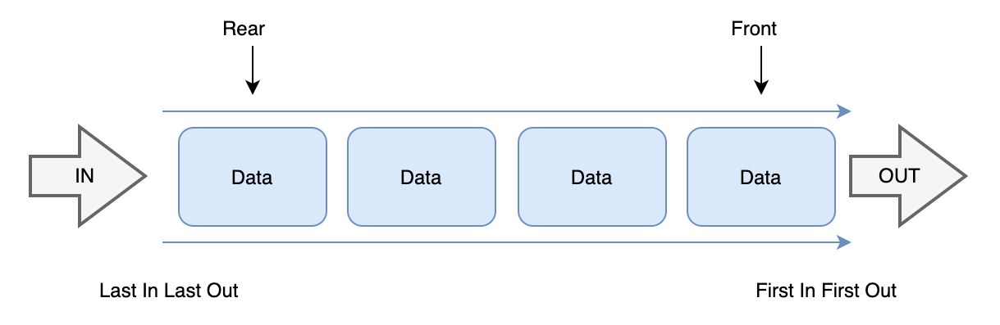
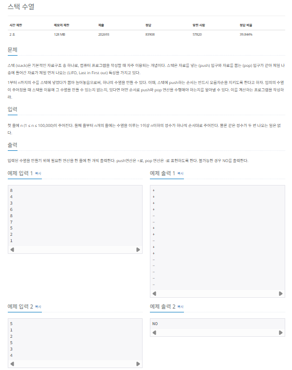
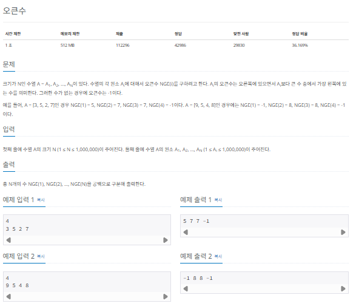
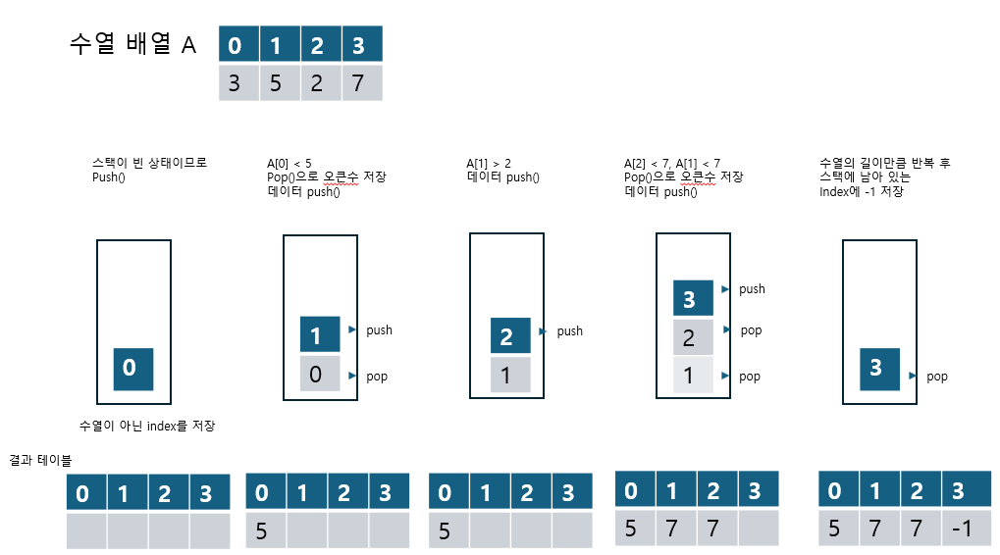
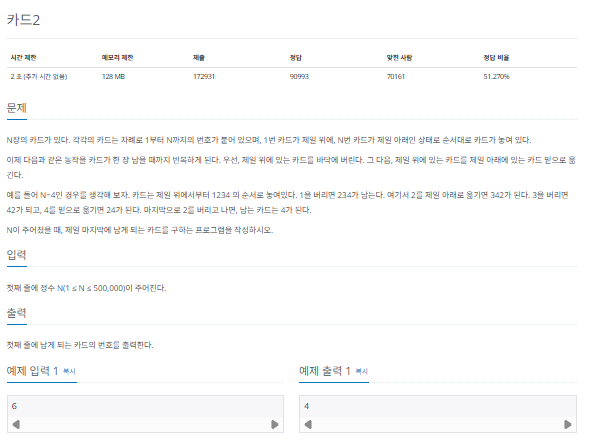
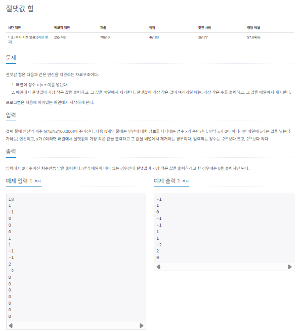

## 스택과 큐

스택과 큐는 배열에서 조금 더 발전한 형태의 자료구조입니다. 서로 구조는 비슷하지만 처리 방식은 다릅니다. 두 자료구조를 잠시 알아보겠습니다.

### 스택과 큐의 핵심이론

#### 스택

스택(stack)은 삽입과 삭제 연산이 후입선출(LIFO)로 이뤄지는 자료구조입니다. 후입선출은 삽입과 삭제가 한쪽에서만 일어나는 특징이 잇습니다.



그림을 보면 새 값이 스택에 들어가면 top이 새 값을 가리킵니다. 스택에서 값을 빼낼 때 pop은 top이 가리키는 값을 스택에서 빼게 되어 있으므로 결과적으로 가장 마지막에 넣었던 값이 나오게 됩니다.

```
스택용어

[위치]
top  : 삽입과 삭제가 일어나는 위치
[연산]
push : top 위치에 새로운 데이터를 삽입하는 연산
pop  : top 위치에 현재 있는 데이터를 삭제하고 확인하는 연산
top  : top 위치에 현재 있는 데이터를 단순 확인하는 연산
```

스택은 깊이 우선 탐색 (DFS)과 백트래킹 종류의 코딩 테스트에 효과적이므로 반드시 알아두어야 합니다.

#### 큐

큐(queue)는 삽입과 삭제 연산이 선입선출(FIFO)로 이뤄지는 자료구조입니다. 스택과 다르게 먼저 들어온 데이터가 먼저 나갑니다. 그래서 삽입과 삭제가 양방향에서 이뤄집니다.



그림을 보면 새 값 추가는 큐의 back(rear)에서 이뤄지고, 삭제는 큐의 front에서 이뤄집니다.

```
큐 용어

[위치]
back(rear) : 큐에서 가장 끝 데이터를 가리키는 영역
front      : 큐에서 가장 앞의 데이터를 가리키는 영역
[연산]
push       : back 부분에 새로운 데이터를 삽입하는 연산
pop        : front 부분에 있는 데이터를 삭제하고 확인하는 연산
```

큐는 너비 우선 탐색 (BFS)에서 자주 사용하므로 이 역시 잘 알아야두어야 합니다.

> 우선순위 큐란?

우선순위 큐(prioority queue)는 값이 들어간 순서와 상관없이 우선순위가 높은 데이터가 먼저 나오는 자료구조입니다. 큐 설정에 따라 front에 항상 최댓값 또는 최솟값이 위치합니다. 우선순위 큐는 일반적으로 heap을 이용해 구현하는데, 힙은 트리 종류 중 하나이므로 여기서는 개념정도만 알아 둡시다.

### $[문제011]$ 스택으로 수열 만들기



### $[01단계]$ 문제 분석하기

스택의 원리를 정확하게 알고 있는지를 묻는 문제입니다. 이 문제는 스택의 pop, push 연산과 후입선출 개념을 이해하고 있다면 쉽게 풀 수 있습니다. 스택에 넣는 값은 오름차순 정렬이어야 한다는 것에 유념하며 손으로 문제를 풀어봅시다.

### $[02단계]$ 손으로 풀어보기

이 문제는 1부터 자연수를 증가시키면서 입력으로 주어진 숫자와 비교하여 증가시킨 자연수를 스택에 추가하거나 빼는 방식으로 풀면 됩니다. 예제 1번을 이용해 설명하겠습니다. 먼저 스택 연산은 다음 2가지 방법으로 수행합니다.

> 스택 연산 수행 방법

1. 현재 수열 값 >= 자연수
   1. 현재 수열 값이 자연수보다 크거나 같을 때까지 자연수를 1씩 증가시키며 자연수를 스택에 push한다. 그리고 push가 끝나면 현재 수열을 출력하기 위해 마지막 1회만 pop 한다.
   2. 예를 들어 현재 수열 값이 4면 스택에는 1,2,3,4를 push 하고 마지막에 1회만 pop하여 4를 출력한뒤 조건문을 빠져나온다. 자연수는 5가 된다.
2. 현재 수열 값 < 자연수
   1. 현재 수열 값보다 자연수가 크다면 pop으로 스택에 있는 값을 꺼낸다. 꺼낸 값이 현재 수열 값이거나 아닐 수 있다. 만약 아니라면 후입선출 원리에 따라 수열을 표현할 수 없으므로 NO를 출력한 후 문제를 종료하고, 현재 수열 값이라면 그대로 조건문을 빠져나온다.
   2. 앞의 예를 이어 설명하면 자연수는 5, 현재 수열 값은 3이므로 스택에서 3을 꺼낸다. 현재 수열 값과 스택에서 꺼낸 값은 같으므로 계속해서 스택 연산을 수행할 수 있다. 스택에는 1,2가 남아있으며, 자연수는 5다.

### $[03단계]$ 코드 구현하기

```c
#include <algorithm>
#include <iostream>
#include <vector>
#include <stack>

using namespace std;

int main(int argc, char *argv[]) {

    int N;
    cin >> N;
    vector<int> A(N, 0);
    vector<char> resultV;

    for (int i = 0; i < N; i++) {
        cin >> A[i];
    }

    stack<int> myStack;
    int num = 1; // 오름차순
    bool result = true;

    for (int i = 0 ; i < A.size(); i++) {
        int su = A[i]; // 현재 수열의 수
        // 현재 수열값 >= 오름차순 자연수 : 값이 같아질 때까지 push() 수행
        if (su >= num) {
            while (su >= num) {
                myStack.push(num++);
                resultV.push_back('+');
            }
            myStack.pop();
            resultV.push_back('-');
        }
        // 현재 수열값 < 오름차순 자연수 : pop()을 수행하여 수열 원소를 꺼냄
        else {
            int n = myStack.top();
            myStack.pop();
            // 스택의 가장 위의 수가 만들어야 하는 수열의 수보다 크다면 수열을 출력할 ㅅ ㅜ없음
            if (n > su) {
                cout << "NO";
                result = false;
                break;
            }
            else {
                resultV.push_back('-');
            }
        }
    }
    if (result) {
        for (int i = 0; i < resultV.size(); i++) {
            cout << resultV[i] << '\n';
        }
    }

    return EXIT_SUCCESS;
}
```

### $[문제012]$ 오큰수 구하기



### $[01단계]$ 문제 분석하기

N의 최대 크기가 1,000,000 이므로 반복문으로 오큰수를 찾으면 제한 시간을 초과합니다. 스택에 다음 아이디어를 추가해 이 문제를 풀어보겠습니다.

> 핵심 아이디어

1. 스택에 새로 들어오는 수가 top에 존재하는 수보다 크면 그 수는 오큰수가 된다.
2. 오큰수를 구한 후 수열에서 오큰수가 존재하지 않는 숫자에 -1을 출력해야 한다.

### $[02단계]$ 손으로 풀어보기

정답 배열의 값을 모두 채운 후 출력하면 문제가 요구하는 답을 구할 수 있습니다. 다음 문제 푸는 순서를 예제 입력 1, 예제 입력 2에 적용해봅시다.

> 문제 푸는 순서

1. 스택이 채워져 있고 A[index] > A[top] 인 경우 pop한 인덱스를 이용하여 정답 수열에 오큰수를 저장합니다. pop은 조건을 만족하는 동안 계속 반복합니다.
2. 현재 인덱스를 스택에 push 하고 다음 인덱스로 넘어갑니다.
3. 과정 1~2를 수열 길이만큼 반복한 다음 현재 스택에 남아 있는 인덱스에 -1을 저장합니다.

우선 예제 입력 1을 놓고 문제 푸는 순서를 적용해 봅시다. pop은 정답 배열에 값을 추가하는 것이고, push 다음 인덱스를 본다고 생각하면 됩니다.



처음에는 스택이 비어 있으므로 과정(1) 없이 과정(2)를 진행합니다. 인덱스 0을 push 하고 다음 인덱스로 넘어갑니다. A[1]은 5이고 A[top]은 3이므로 스택에서 pop을 수행하지 않고 Result[0]에 오큰수 5를 저장합니다. 1회 반복으로 스택이 비었으므로 pop은 더 진행하지 않습니다. 인덱스 1을 push하고 다음 인덱스로 넘어갑니다. A[2]는 2이고 A[top]은 5이므로 과정(2)를 진행하여 push 한 다음 인덱스로 넘어갑니다. 이 과정을 수열의 길이만큼 반복 후 스택에 남아 있는 index에 -1을 저장하면 정답 배열을 완성할 수 있습니다. 계속해서 예제 입력 2에 대해서도 위 과정을 수행해 봅시다.

### $[03단계]$ 코드 구현하기

```c
#include <algorithm>
#include <iostream>
#include <vector>
#include <stack>

using namespace std;

int main(int argc, char *argv[]) {
    int N;
    cin >> N;
    vector<int> A(N, 0);
    vector<int> ans(N, 0);

    for (int i = 0; i < N; i++) {
        cin >> A[i];
    }

    stack<int> myStack;
    myStack.push(0);
    for (int i = 1; i < N; i++) {
        // 스택이 비지 않고 현재 수열이 스택 top 위치의 값보다 크면
        while (!myStack.empty() && A[myStack.top()] < A[i]) {
            ans[myStack.top()] = A[i];
            myStack.pop();
        }

        myStack.push(i); // 신규 데이터 push()
    }
    while (!myStack.empty()) {
        ans[myStack.top()] = -1;
        myStack.pop();
    }
    for (int i = 0; i < N; i++) {
        // 정답 출력
        cout << ans[i] << " ";
    }
    return EXIT_SUCCESS;
}
```

스택의 후입선출이라는 독특한 성질이 종종 시간 복잡도를 줄이거나 특정한 무넺의 조건을 손쉽게 해결하는 실마리가 될 때가 있습니다.

### $[문제013]$ 카드 게임



### $[01단계]$ 문제 분석하기

큐를 잘 이해하고 있는지를 묻는 문제입니다. 가장 위의 카드를 가장 아래에 있는 카드 밑으로 옮기는 동작은 큐의 선입선출 성직을 이용하면 쉽게 구현할 수 있습니다. 카드의 개수의 최대가 500,000이므로 시간 복잡도의 제약도 크지 않습니다.

### $[02단계]$ 손으로 풀어보기

> 문제를 푸는 순서

1. pop 을 수행하여 맨 앞 카드를 버린다.
2. 과정(1)에 이어 바로 pop -> push를 수행해 맨 앞에 있는 카드를 가장 아래로 옮긴다.
3. 큐의 크기가 1이 될 때까지 과정 1~2를 반복한 후 큐에 남은 원소를 출력한다.

### $[03단계]$ 코드 구현하기

```c
#include <algorithm>
#include <iostream>
#include <vector>
#include <queue>
using namespace std;

int main(int argc, char *argv[]) {

    int N;
    cin >> N;

    queue<int> myqueue;

    for (int i = 0; i < N; i++) {
        myqueue.push(i);
    }

    while (myqueue.size() > 1) {
        myqueue.pop(); // 맨 위 카드를 버림
        myqueue.push(myqueue.front()); // 맨 위 카드를 가장 아래 카드 밑으로 이동
        myqueue.pop();
    }

    cout << myqueue.front() << "\n";

    return EXIT_SUCCESS;
}
```

### $[문제014]$ 절댓값 힙 구현하기



### $[01단계]$ 문제 분석하기

N의 최대 범위가 100,000으로 O(nlogn)시간 복잡도를 가진 알고리즘으로 풀 수 있습니다.
데이터가 새로 삽입될 때마다 절댓값과 관련된 정렬이 필요하므로 우선순위 큐로 문제를 쉽게 해결할 수 있습니다. 단, 이 문제는 절댓값 정렬이 필요하므로 우선순위 큐의 정렬 기준을 직접 정의해야 합니다.

### $[02단계]$ 손으로 풀어보기

> 문제 푸는 순서

1. X = 0 일 때
   1. 큐가 비어있을 때는 0을 출력하고 비어있지 않을 때는 절댓값이 최소인 값을 출력한다.
   2. 단, 절댓값이 같다면 음수를 우선하여 출력한다.
2. X != 0일 때
   1. 큐에 새로운 값을 추가하고 우선순위 큐 정렬 기준으로 자동 정력한다.

### $[03단계]$ 코드 구현하기

```c
#include <algorithm>
#include <iostream>
#include <vector>
#include <queue>
using namespace std;

struct compare {
    bool operator()(int o1, int o2) {
        int first_abs = abs(o1);
        int second_abs = abs(o2);
        if (first_abs == second_abs) {
            return o1 > o2;
        } else {
            return first_abs > second_abs;
        }
        return 0;
    }
};


int main(int argc, char *argv[]) {
    // 우선순위 큐 선언 방식: <자료형, 구현체, 비교 합수명>
    priority_queue<int, vector<int>, compare> MyQueue;

    int N;
    cin >> N;

    for (int i = 0; i < N; i++) {
        int request;
        cin >> request;

        if (request == 0) {
            if (MyQueue.empty()) {
                cout << "0\n";
            } else {
                cout << MyQueue.top() << '\n';
                MyQueue.pop();
            }
        } else {
            MyQueue.push(request);
        }
    }

    return EXIT_SUCCESS;
}
```
