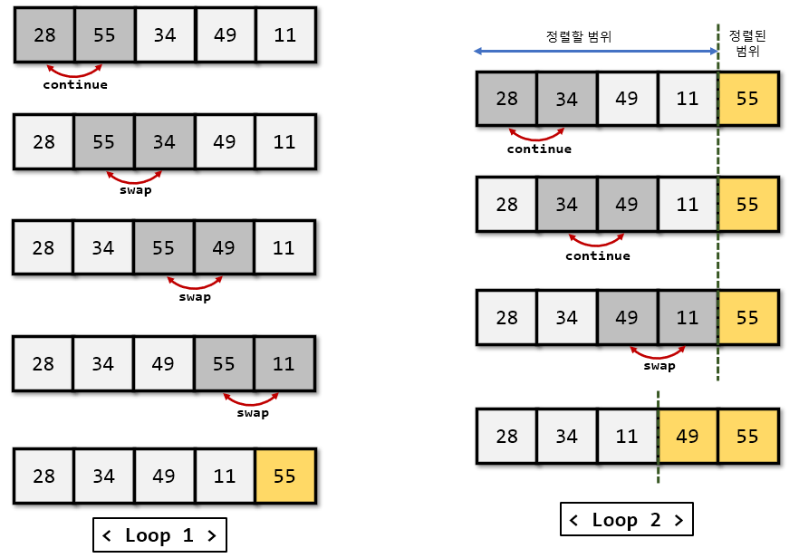
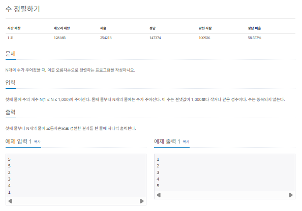
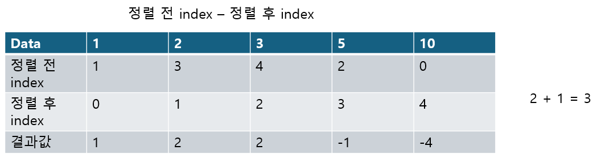

## 버블 정렬

이번 장에서 다룰 알고리즘의 정의는 다음과 같습니다.

|  정렬 알고리즘  |                                          정의                                           |
| :-------------: | :-------------------------------------------------------------------------------------: |
|  버블(bubble)   |           데이터의 인접 요소끼리 비교하고, swap 연산을 수행하며 정렬하는 방식           |
| 선택(Selection) |    대상에서 가장 크거나 작은 데이터를 찾아 선택하는 과정을 반복하면서 정렬하는 방식     |
| 삽입(insertion) | 대상을 선택해 정렬된 영역에서 선택 데이터의 적절한 위치를 찾아 삽입하면서 정렬하는 방식 |
|    퀵(Quick)    |                   pivot 값을 선정해 해당 값을 기준으로 정렬하는 방식                    |
|   병합(merge)   |            이미 정렬된 부분 집합들을 효율적으로 병합해 전체를 정렬하는 방식             |
|   기수(radix)   |                데이터의 자릿수를 바탕으로 비교해 데이터를 정렬하는 방식                 |

### 버블 정렬의 핵심 이론

버블 정렬(bubble sort)는 두 인접한 데이터의 크기를 비교해 정렬하는 방법입니다. 간단하게 구현할 수는 있지만, 시간 복잡도는 $O(n^2)$으로 다른 정렬 알고리즘보다 속도가 느린편입니다. 다음 그림과 같이 루프(loop)를 돌면서 인접한 데이터 간의 swap 연산으로 정렬합니다.



정렬 과정은 다음과 같습니다.

> 버블 정렬 과정

1. 비교 연산이 필요한 루프 범위를 설정한다.
2. 인접한 데이터 값을 비교한다.
3. swap 조건에 부합하면 swap 연산을 수행한다.
4. 루프 범위가 끝날 때까지 2~3을 반복한다.
5. 정렬된 영역을 설정한다. 다음 루프를 실행할 때는 이 영역을 제외한다.
6. 비교 대상이 없을 때까지 1~5를 반복한다.

만약 특정한 루프의 전체 영역에서 swap이 한번도 발생하지 않았다면 그 영역 뒤에 있는 데이터가 모두 정렬됐다는 뜻으로 프로세스를 종료합니다.

### $[문제015]$ 수 정렬하기 1



### $[01단계]$ 문제 분석하기

sort() 함수를 이용해 쉽게 정렬할 수 있지만, 이번에는 정렬을 직접 구현해 문제를 해결해 보겠습니다.

N의 최대 범위가 1,000으로 매우 작기 때문에 $O(n^2)$ 시간 복잡도 알고리즘으로 풀 수 있습니다. 버블 정렬의 시간 복잡도가 $O(n^2)$ 이므로 버블 정렬 알고리즘을 이용해 정렬해도 사간 복잡도 안에서 문제를 해결할 수 있습니다.

### $[02단계]$ 코드 구현하기

```c
#include <iostream>
#include <vector>

using namespace std;

int main(int argc, char *argv[]) {
    int N;
    cin >> N;
    vector<int> A(N, 0);


    for (int i = 0; i < N; i++) {
        cin >> A[i];
    }

    for (int i = 0; i < N; i++) {
        for (int j = 0; j < N - 1 - i; j++) {
            if (A[j] > A[j+1]) {
                A[j] ^= A[j+1];
                A[j+1] ^= A[j];
                A[j] ^= A[j+1];
            }
        }
    }

    for (int i = 0 ; i < N; i++) {
        cout << A[i] << "\n";
    }

    return EXIT_SUCCESS;
}
```

### $[문제016]$ 버블 정렬 프로그램 1


### $[01단계]$ 문제 분석하기

버블 정렬의 swap 이 한번도 일어나지 않은 루프가 언제인지 알아내는 문제입니다. 핵심 이로넹서 언급했듯이 '버블 정렬의 이중 for문에서 안쪽 for문 전체를 돌 때 swap이 일어나지 않았다'는 것은 이미 모든 데이터가 정렬됐다는 것을 의미합니다. 이때는 프로세스를 바로 종료해 식나 복잡도를 줄일 수 있습니다. 하지만 이 문제는 N의 최대 범위가 500,000이므로 버블 정렬로 문제를 풀면 시간을 초과할 수 있습니다. 안쪽 for 문이 몇 번 수행됐는지 구하는 다른 아이디어가 필요합니다.

> 안쪽 for 문이 몇 번 수행됐는지 구하는 다른 아이디어

안쪽 루프는 1에서 n - i까지, 즉 왼쪽에서 오른쪽으로 이동하면서 swap을 수행한다. 이는 특정 데이터가 안쪽 루프에서 swap의 왼쪽으로 이동할 수 있는 최대거리가 1이라는 뜻이다. 즉, 데이터의 정렬 전 index와 정렬 후 index를 비교해 왼쪽으로 가장 많이 이동한 값을 찾으면 이 문제를 해결할 수 있다.

### $[02단계]$ 손으로 풀어 보기

1. 기본으로 제공하는 sort() 함수로 배열을 정렬합니다. sort()함수의 시간 복잡도는 O(nlogn)입니다.
2. 각 데이터마다 정렬 전 index값에서 정렬 후 index값을 빼고 최댓값을 찾습니다. 그리고 swap 이 일어나지 않는 반복문이 한 번 더 실행되는 것을 감안해 최댓값에 1을 더합니다.
   

### $[03단계]$ 코드 구현하기

```c
#include <iostream>
#include <vector>
#include <algorithm>

using namespace std;

int main(int argc, char *argv[]) {

    int N;
    cin >> N;
    vector<pair<int,int>> A(N);

    for (int i = 0; i < N; i++) {
        cin >> A[i].first;
        A[i].second = i;
    }
    sort(A.begin(),A.end());

    int Max = 0;

    for (int i = 0; i < N; i++) {
        // 정렬 전 index - 정렬 후 index 를 계산한 값 중 최댓값을 찾아 저장
        if (Max < A[i].second - i) {
            Max = A[i].second - i;
        }
    }

    cout << Max + 1;

    return EXIT_SUCCESS;
}
```
