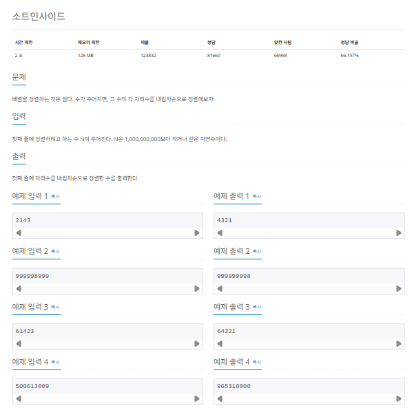

## 선택정렬

선택 정렬 (selection sort)는 대상 데이터에서 최대나 최소 데이터를 나열된 순으로 찾아가며 선택하는 방법입니다. 선택 정렬은 구현 방법이 복잡하고, 시간복잡도도 $O(n^2)$으로 효율적이지 않아 코딩 테스트에서는 많이 사용하지 않습니다.

### 선택 정렬의 핵심 이론

최솟값 또는 최댓값을 찾고, 남은 정렬 부분의 가장 앞에 있는 데이터와 swap 하는 것이 선택 정렬의 핵심입니다.


> 선택 정렬 과정

1. 남은 정렬 부분에서 최솟값 또는 최댓값을 찾는다.
2. 남은 정렬 부분에서 가장 앞에 있는 데이터와 선택된 데이터를 swap한다.
3. 가장 앞에 있는 데이터의 위치를 변경해(index++)남은 정렬 부분의 범위를 축소한다.
4. 전체 데이터 크기만큼 index가 커질 때까지, 즉 남은 정렬 부분이 없을때까지 반복한다.

### $[문제017]$ 내림차순으로 자릿수 정렬하기



### $[01단계]$ 문제 분석하기

...

### $[02단계]$ 코드 구현하기

```c
#include <iostream>
#include <vector>
#include <algorithm>
#include <string>
using namespace std;

int main(int argc, char *argv[]) {
    string str;
    cin >> str;
    vector<int> A(str.size(), 0);

    for (int i = 0; i < str.size(); i++) {
        A[i] = stoi(str.substr(i, 1));
    }

    // 선택정렬
    for (int i = 0; i < A.size(); i++) {
        int Max = i;
        for (int j = i + 1; j < A.size(); j++) {
            if (A[j] > A[Max]) {
                Max = j;
            }
        }

        if (A[i] > A[Max]) {
            A[i] ^= A[Max];
            A[Max] ^= A[i];
            A[i] ^= A[Max];
        }
    }

    for (int i = 0 ;i < A.size(); i++) {
        cout << A[i] << " ";
    }
    return EXIT_SUCCESS;
}
```
