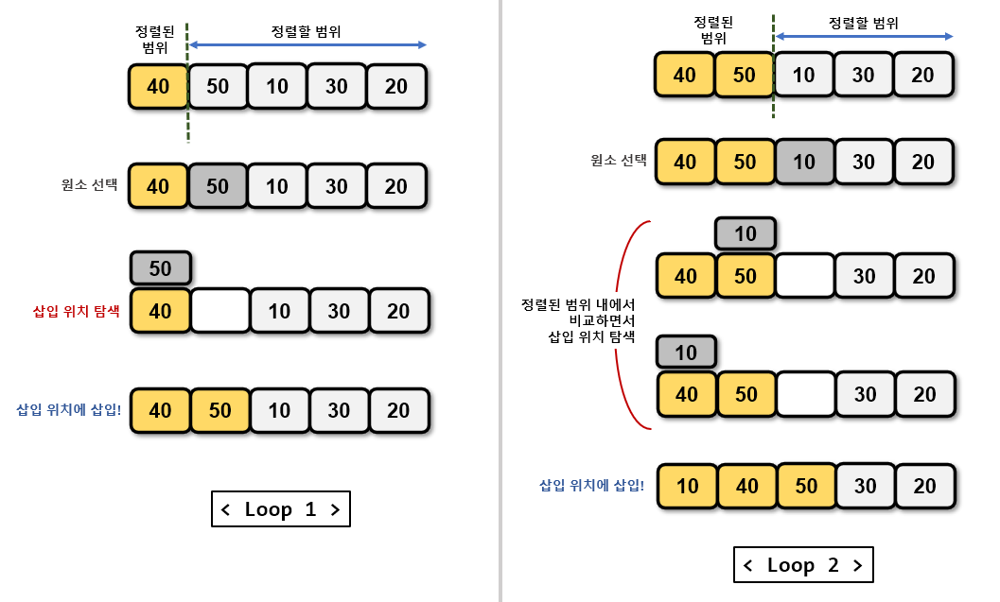
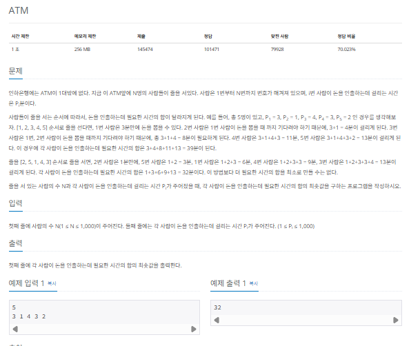

## 삽입 정렬

삽입 정렬 (insertion sort)은 이미 정렬된 데이터 범위에 정렬되지 않은 데이터를 적절한 위치에 삽입해 정렬하는 방식입니다. 시간 복잡도는 $O(n^2)$으로 느린 편이지만 구현하기가 쉽습니다.

### 삽입 정렬의 핵심 이론

선택 데이터를 현재 정렬된 데이터 범위 내에서 적절한 위치에 삽입하는 것이 삽입 정렬의 핵심입니다.



> 삽입 정렬 과정

1. 현재 index에 잇는 데이터 값을 선택한다.
2. 현재 선택한 데이터가 정렬된 데이터 범위에 삽입될 위치를 탐색한다.
3. 삽입 위치부터 index에 있는 위치까지 shift 연산을 수행한다.
4. 삽입 위치에 현재 선택한 데이터를 삽입하고 index++ 연산을 수행한다.
5. 전체 데이터의 크기만큼 index가 커질때까지, 즉 선택할 데이터가 없을때까지 반복한다.

적절한 삽입 위치를 탐색하는 부분에서 이진 탐색(binary search)등과 같은 탐색 알고리즘을 사용하면 시간 복잡도를 줄일 수 있습니다.

### $[문제018]$ ATM 인출 시간 계산하기



### $[01단계]$ 문제 분석하기

ATM에서 모든 사람이 가장 빠른 시간에 인출하는 방법을 그리디 방식으로 해결해 봅시다. ATM 앞에 잇는 사람 중 인출 시간이 가장 적게 걸리는 사람이 먼저 인출할 수 있도록 순서를 정하는 것이 곧 그리디 방식입니다. 이렇게 하려면 인출 시간을 기준으로 값을 정렬해야 합니다. N의 최댓값이 1,000이고, 시간 제한이 1초이므로 시간 복잡도가 $O(n^2)$이하인 정렬 아록리즘 중 아무거나 사용해도 됩니다. 여기서는 삽입 정렬을 이용해 풀어보겠습니다.

### $[02단계]$ 코드 구현하기

```c
#include <iostream>
#include <vector>
#include <algorithm>
#include <string>
using namespace std;

int main(int argc, char *argv[]) {

    int N;
    cin >> N;
    vector<int> A(N , 0);
    vector<int> S(N, 0);

    for (int i = 0 ; i < N ; i++) {
        cin >> A[i];
    }

    // 삽입정렬 (1번 인덱스 부터)
    for (int i = 1; i < N; i++) {
        int insert_point = i;
        int insert_value = A[i];

        for (int j = i - 1; j >= 0; j--) {
            if (A[j] < A[i]) {
                insert_point = j + 1;
                break;
            }
            if (j == 0) {
                insert_point = 0;
            }
        }

        for (int j = i; j > insert_point; j--) {
            A[j] = A[j - 1];
        }
        A[insert_point] = insert_value;
    }

    // 합 배열 만들기
    S[0] = A[0];

    for (int i = 1; i < N; i++) {
        S[i] = S[i - 1] + A[i];
    }

    // 합 배열 총 합 구하기
    int sum = 0;

    for (int i = 0; i < N; i++) {
        sum += S[i];
    }
    cout << sum;
    return EXIT_SUCCESS;
}
```
