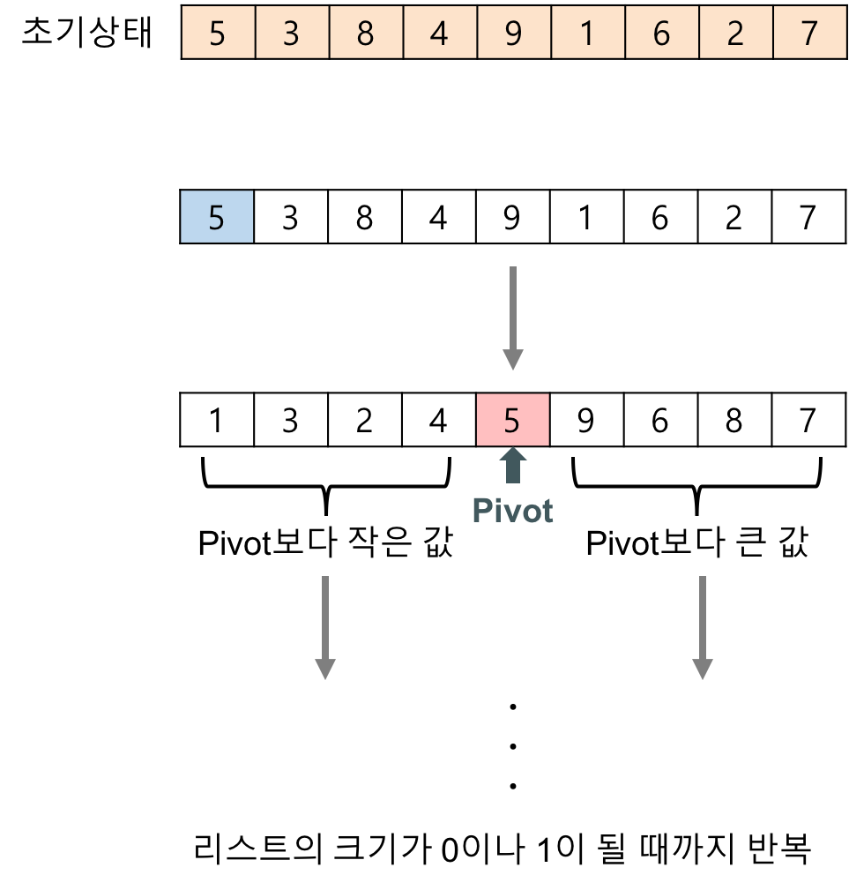
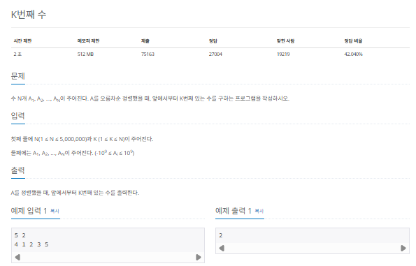

## 퀵 정렬

퀵 정렬(quick sort)는 기준값(pivot)을 선정해 해당 값보다 작은 데이터와 큰 데이터로 분류하는 것을 반복해 정렬하는 알고리즘입니다. 기준값을 어떻게 선정하는지가 시간 복잡도에 많은 영향을 미치는데, 평균 시간 복잡도는 $O(nlogn)$이며 최악의 경우 시간 복잡도가 $O(n^2)$가 됩니다.

### 퀵 정렬의 핵심 이론

pivot을 중심으로 계속 데이터를 2개의 집합으로 나누면서 정렬하는 것이 퀵 정렬의 핵심입니다.



퀵 정렬의 자세한 과정은 다음과 같습니다.


> 퀵 정렬 과정

1. 데이터를 분할하는 pivot을 설정한다.
2. pivot을 기준으로 다음 a~e과정을 거쳐 데이터를 2개의 집합으로 분리한다.
   1. start 가 가리키는 데이터가 pivot이 가르키는 데이터보다 작으면 start를 오른쪽으로 1칸 이동한다.
   2. end 가 가리키는 데이터가 pivot이 가리키는 데이터보다 크면 end를 왼쪽 1칸으로 이동한다.
   3. start 가 가리키는 데이터가 pivot이 가리키는 데이터보다 크고, end가 가리키는 데이터가 pivot이 가리키는 데이터보다 작으면 start,end가 가리키는 데이터를 swap하고 start는 오른쪽, end는 왼쪽으로 1칸씩 이동한다.
   4. start와 end 가 만날 때까지 a-b-c를 반복한다.
   5. start와 end 가 만나면 만난 지점에서 가리키는 데이터와 pivot이 가리키는 데이터를 비교하여 pivot이 가리키는 데이터가 크면 만난 지점의 오른쪽에, 작으면 만난지점의 왼쪽에 pivot이 가리키는 데이터를 삽입한다.
3. 분리 집합에서 각각 다시 pivot을 선정한다.
4. 분리 집합의 요소가 1개 이하가 될 때까지 1 ~ 3 과정을 반복한다.

퀵 정렬 시간 복잡도는 비교적 준수하므로 코딩 테스트에서 종종 응용합니다.

### $[문제019]$ K번째 수 구하기



### $[01단계]$ 문제 분석하기

앞에서 배운 퀵 정렬을 구현해 주어진 수를 오름차순 정렬하고, K번째 수를 출력해 보겠습니다.

> 퀵 정렬은 pivot의 선택에 따라 최악의 시간 복잡도가 $n^2$이므로 해당 문제에서는 병합 정렬 등을 이용하는게 더 안전합니다. 다만, 여기서는 퀵 정렬의 원리를 이해하고자 퀵 정렬로 풀이를 진행합니다.

> pivot 을 정하는 방법

1. pivot == K : K번째 수를 찾은 것이므로 알고리즘을 종료한다.
2. pivot > K : pivot의 왼쪽 부분에 K가 있으므로 왼쪽 (S ~ pivot - 1)만 정렬을 수행한다.
3. pivot < K : pivot의 오른쪽 부분에 K가 있으므로 오른쪽(pivot + 1 ~ E)만 정렬을 수행한다.

### $[02단계]$ 코드 구현하기

```c
#include <iostream>
#include <vector>
#include <string>
using namespace std;

void quickSort(vector<int> &A, int S, int E, int K);

int partition(vector<int> &A, int S, int E);

void swap(vector<int> &A, int i, int j);


int main(int argc, char *argv[]) {
    int N, K;
    cin >> N >> K;
    vector<int> A(N, 0);

    for (int i = 0; i < N; i++) {
        cin >> A[i];
    }

    quickSort(A, 0, N - 1, K - 1);
    cout << A[K - 1];

    return EXIT_SUCCESS;
}

// S : start , E : end, K : 찾을 수
void quickSort(vector<int> &A, int S, int E, int K) {
    int pivot = partition(A, S, E);
    // K 번째 수가 pivot이면 더는 구할 필요가 없음
    if (pivot == K) {
        return;
    }
    // K가 pivot보다 작으면 왼쪽 그룹만 정렬 수행하기
    else if (K < pivot) {
        quickSort(A, S, pivot - 1, K);
    }
    // K가 pivot보다 크면 오른쪽 그룹만 정렬 수행하기
    else if (K > pivot) {
        quickSort(A, pivot + 1, E, K);
    }
}

int partition(vector<int> &A, int S, int E) {
    if (S + 1 == E) {
        if (A[S] > A[E]) {
            swap(A, S, E);
        }
        return E;
    }

    int M = (S + E) / 2;
    swap(A, S, M); // 중앙값을 1번째 요소로 이동
    int pivot = A[S];
    int i = S + 1, j = E;

    while (i <= j) {
        // 피벗보다 작은 수가 나올 때까지 j--
        while (j >= S + 1 && pivot < A[j]) {
            j--;
        }
        // 피벗보다 큰 수가 나올 때까지 i++
        while (i <= E && pivot > A[i]) {
            i++;
        }
        if (i < j) {
            swap(A, i, j);
        } else {
            break;
        }
    }

    // i == j 피벗의 값을 양쪽으로 분리한 가운데 오도록 설정하기
    A[S] = A[j];
    A[j] = pivot;
    return j;
}

void swap(vector<int> &A, int i, int j) {
    A[i] ^= A[j];
    A[j] ^= A[i];
    A[i] ^= A[j];
}
```
