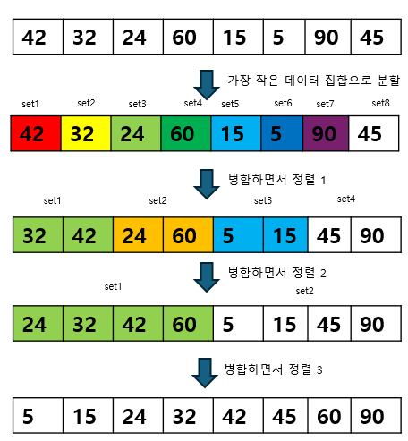
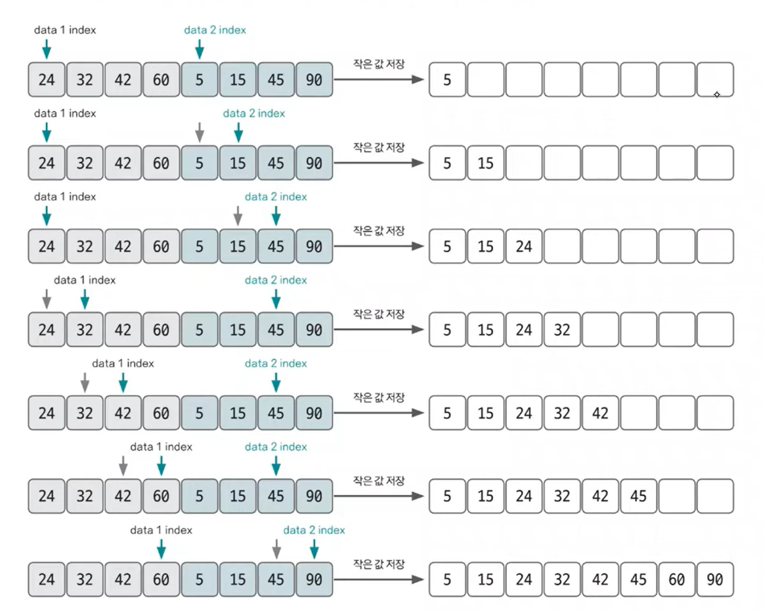
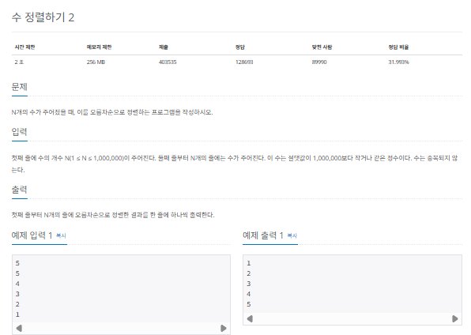
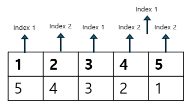
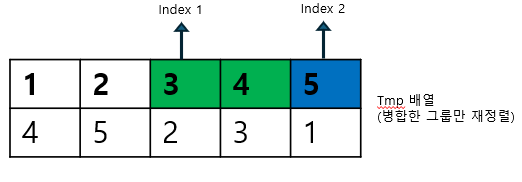
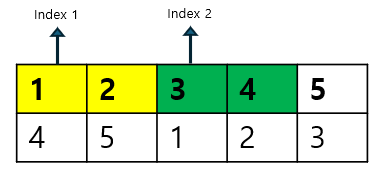
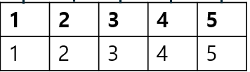
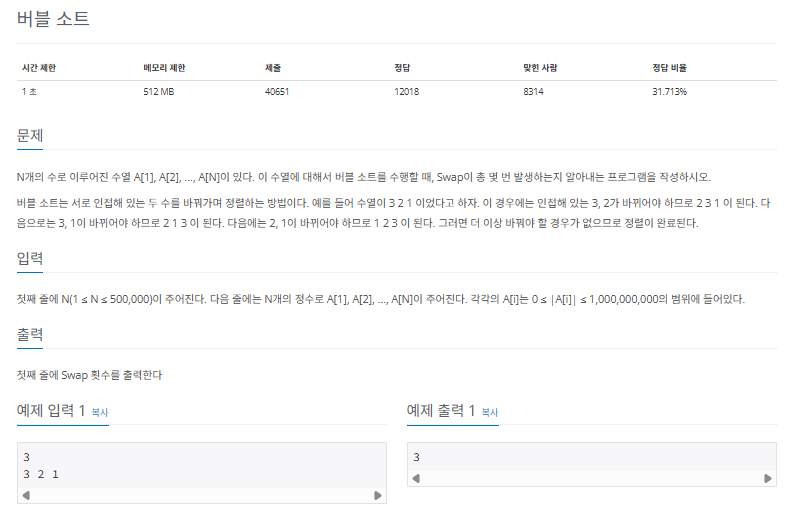
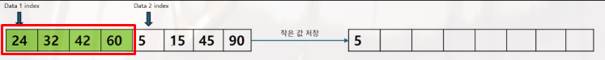
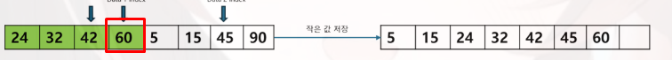

## 병합 정렬

병합 정렬(merge sort)은 분할 정복(divide and conquer) 방식을 사용해 데이터를 분할하고 분할한 집합을 정렬하며 합치는 알고리즘입니다. 병합 정렬의 시간 복잡도는 $O(nlogn)$입니다.

### 병합 정렬의 핵심이론

다음 그림을 보며 병합 정렬을 이해해 봅시다. 부분 그룹은 setN으로 표시했습니다.



### 병합 정렬 수행 방식

그림을 보면 처음에는 8개의 그룹으로 나눕니다. 이 상태에서 2개씩 그룹을 합치며 오름차순 정렬을 합니다. 그 결과 (32,42)(24,60)(5,15)(45,90)이 됩니다. 이어서 2개씩 그룹을 합치며 다시 오름차순 정렬을 합니다.

병합 정렬은 코딩 테스트의 정렬 관련 문제에서 자주 등장합니다. 특히 2개의 그룹을 병합하는 원리는 꼭 숙지해야 합니다. 다음 설명을 통해 2개의 그룹을 병합하는 원리를 알아봅시다

### 2개의 그룹을 병합하는 과정

투 포인터 개념을 사용하여 왼쪽, 오른쪽 그룹을 병합합니다. 왼쪽 포인터와 오른쪽 포인터의 값을 비교하여 작은 값을 결과 배열에 추가하고 포인터를 오른쪽으로 1칸 이동시킵니다. 이 방식은 여러 문제에서 응용하므로 반드시 숙지하는 것이 좋습니다.



### $[문제020]$ 수 정렬하기



### $[01단계]$ 문제 분석하기

1. 정렬할 그룹을 최소 길이로 나눕니다. 그림에서 알 수 있듯이 원본 배열의 길이가 5이므로 2,2,1길이로 나눴습니다. 이제 나눈 그룹마다 병합 정렬합니다. 그룹마다 index1, index2를 지정하여 비교하면서 정렬 용도로 선언한 tmp 배열에 병합정렬합니다.



여기서는 그룹이 3개이므로 2번째, 3번째 그룹을 병합했습니다.



1. 이어서 병합된 그룹을 대상으로 정렬합니다. index2의 경우 오른쪽으로 이동할 공간이 없으므로 index1만 이동하는 형태로 정렬합니다.



2. 마지막 정렬입니다. 1,2,3,4,5순서로 깔끔하게 정렬됬습니다.



### $[02단계]$ 코드 구현하기

```c
#include <complex.h>
#include <iostream>
#include <vector>

using namespace std;

void merge_sort(int s, int e);

static vector<int> A;
static vector<int> tmp;

int main(int argc, char *argv[]) {
    int N;
    cin >> N;
    A = vector<int>(N + 1, 0);
    tmp = vector<int>(N + 1, 0);

    for (int i = 1; i <= N; i++) {
        cin >> A[i];
    }
    merge_sort(1, N);

    for (int i = 1; i <= N; i++) {
        cout << A[i] << "\n";
    }

    return 0;
}

void merge_sort(int s, int e) {
    if (e - s < 1) {
        return;
    }

    // middle 구하기
    int m = s + (e - s) / 2;

    // 재귀 함수 형태로 구현
    merge_sort(s, m); // start ~ middle
    merge_sort(m + 1, e); // middle + 1 ~ end

    for (int i = s; i <= e; i++) {
        tmp[i] = A[i];
    }

    int k = s;
    int index1 = s;
    int index2 = m + 1;

    // 두 그룹을 병합하는 로직
    while (index1 <= m && index2 <= e) {
        if (tmp[index1] > tmp[index2]) {
            A[k] = tmp[index2];
            k++;
            index2++;
        }
        else {
            A[k] = tmp[index1];
            k++;
            index1++;
        }
    }
    // 한쪽 그룹이 모두 선택된 후 남아 있는 값 정리하기
    while (index1 <= m) {
        A[k] = tmp[index1];
        k++;
        index1++;
    }
    while (index2 <= e) {
        A[k] = tmp[index2];
        k++;
        index2++;
    }
}
```

### $[문제021]$ 버블 정렬 프로그램 2



### $[01단계]$ 문제 분석하기

N의 최대 범위가 500,000이므로 $O(nlogn)$의 시간 복잡도로 정렬을 수행하면 됩니다. 앞에서 배운 병합 정렬로 정렬을 후행한 후 겨로가를 출력해 보겠습니다.

제목은 버블 정렬이지만, N의 최대 범위가 500,000이므로 곧이곧대로 버블 정렬을 사용하면 제한 시간을 초과합니다. 즉, 이 문제는 버블 정렬이 아닌 $O(nlogn)$의 시간 복잡도를 가진 병합 정렬을 사용해야 합니다. 병합 정렬을 이해한 상태라면 두 그룹을 병합하는 과정에 버블 정렬의 swap이 포함되어 있다는 것을 떠올릴 수 있습니다.


5가 앞에 있는 데이터셋에 남아 있는 데이터보다 앞으로 이동하므로 swap이 4번 일어난 것과 동일


45가 앞에 있는 데이터셋에 남아 있는 데이터보다 앞으로 이동하므로 swap이 1번 일어난 것과 동일

위쪽 그림을 보면 두 그룹을 병합 정렬하는 과정에서 뒤쪽 그룹의 5가 앞쪽 그룹의 24,43,42,60의 앞에 놓입니다. 이는 버블 정렬에서 swap을 4번해야 볼 수 있는 효과입니다. 아래쪽 그림도 마찬가징비니다. 45는 60보다 앞에 놓이므로 버블 정렬에서 swap을 1번 한 것과 동일합니다.

> 손으로 풀어본다면

병합정렬은 동일하게 진행합니다. 다만 정렬 과정에서 index가 이동한 거를 result 에 저장합니다.

### $[02단계]$ 코드 구현하기

```c
#include <complex.h>
#include <iostream>
#include <vector>

using namespace std;

void merge_sort(int s, int e);

static vector<int> A;
static vector<int> tmp;
static long result;

int main(int argc, char *argv[]) {
    int N;
    cin >> N;
    A = vector<int>(N + 1, 0);
    tmp = vector<int>(N + 1, 0);

    for (int i = 1; i <= N; i++) {
        cin >> A[i];
    }
    result = 0;
    merge_sort(1, N);

    cout << result << "\n";
    return 0;
}

void merge_sort(int s, int e) {
    if (e - s < 1) {
        return;
    }

    // middle 구하기
    int m = s + (e - s) / 2;

    // 재귀 함수 형태로 구현
    merge_sort(s, m); // start ~ middle
    merge_sort(m + 1, e); // middle + 1 ~ end

    for (int i = s; i <= e; i++) {
        tmp[i] = A[i];
    }

    int k = s;
    int index1 = s;
    int index2 = m + 1;

    // 두 그룹을 병합하는 로직
    while (index1 <= m && index2 <= e) {
        if (tmp[index1] > tmp[index2]) {
            A[k] = tmp[index2];
            // --- 뒤쪽 데이터 값이 작아 선택되는 경우 결괏값 업데이트
            result = result + index2 - k;
            // ---
            k++;
            index2++;
        } else {
            A[k] = tmp[index1];
            k++;
            index1++;
        }
    }
    // 한쪽 그룹이 모두 선택된 후 남아 있는 값 정리하기
    while (index1 <= m) {
        A[k] = tmp[index1];
        k++;
        index1++;
    }
    while (index2 <= e) {
        A[k] = tmp[index2];
        k++;
        index2++;
    }
}
```
