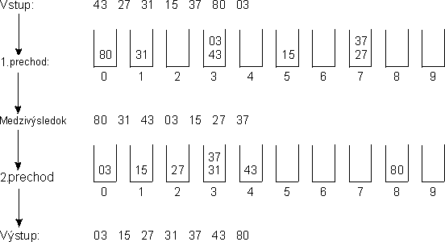
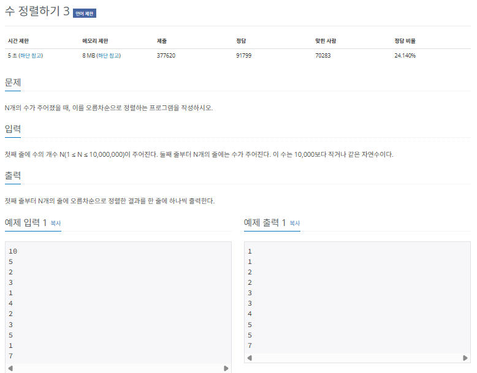
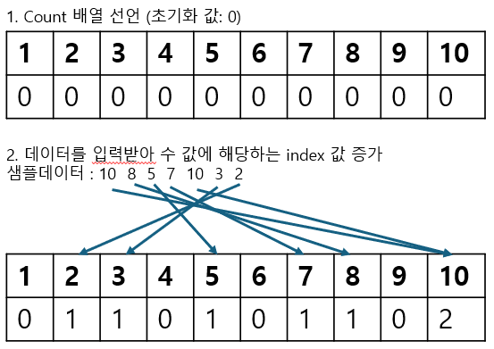
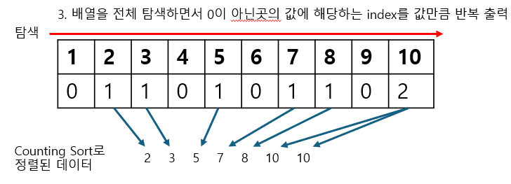

## 기수 정렬

기수 정렬(radix sort)는 값을 비교하지 않는 특이한 정렬입니다. 기수 정렬은 값을 놓고 비교할 자릿수를 정한 다음 해당 자릿수만 비교합니다. 기수 정렬의 시간 복잡도는 O(kn)으로, 여기서 k는 데이터의 자릿수를 말합니다.

### 기수 정렬의 핵심 이론

기수 정렬은 10개의 큐를 이용합니다. 각 큐는 값의 자릿수를 대표합니다. 다음 그림을 봅시다.



> Medzivysledok : 일의 자릿수 기준으로 데이터 정렬 (일의 자리에서 정렬된 순서 기준으로 십의 자리에 저장하는 것이 중요)

그림을 보면 원본 배열은 16,80,18,77,03,24,88,23 입니다. (다른 그림[161쪽 참조])

먼저 일의 자릿수 기준으로 배열 원소를 큐에 집어넣습니다. 그런 다음 0번째 큐부터 9번째 큐까지 pop을 진행합니다. 그 결과 80,03,23,24,16,77,18,88 이 만들어집니다. 이어서 십의 자릿수를 기준으로 같은 과정을 진행합니다. 마지막 자릿수를 기준으로 정렬할 때까지 앞의 과정을 반복합니다.

기수 정렬은 시간 복잡도가 가장 짧은 정렬입니다. 만약 코딩 테스트에서 정렬해야 하는 데이터의 개수가 너무 많으면 기수 정렬 알고리즘을 고려할 수 있습니다.

### $[문제022]$ 수 정렬하기 3



### $[01단계]$ 문제 분석하기

이 문제는 N의 최대 개수가 10,000,000으로 매우 크기 때문에 $O(nlogn)$보다 더 빠른 알고리즘이 필요합니다. 문제에서 주어지는 숫자의 크기가 10,000 이하라는 것을 바탕으로 기수 정렬과 함께 많이 사용하는 계수 정렬(counting sort)를 사용하여 문제를 해결해 보도록 하겠습니다.

계수 정렬은 로직이 기수 정렬보다 조금 더 간단합니다.

### $[02단계]$ 손으로 풀어보기

숫자 크기가 10,000 이하이므로 10,001 크기의 배열을 선언합니다. 이후 문제에서 입력하는 수를 차례대로 받아 수의 값을 배열의 인덱스값으로 판단하고 해당 인덱스에 해당하는 값을 1증가하여 줍니다.

샘플 데이터 (10,8,5,7,10,3,2)를 예로 들어 설명합니다.



이어서 배열을 처음부터 끝까지 탐색하면서 값이 0이 아닐 경우 해당 값이 잇는 index를 값만큼 반복하여 출력합니다.



### $[03단계]$ 슈도코드 작성하기

```
N (정렬할 수 개수)
count (계수 정렬 배열)

for (N만큼 반복) {
  count 배열에 현재 수에 해당하는 index의 값 1 증가시키기
}
for (i는 0 ~ 10000까지) {
  // i 가 기존 input에 있는 수였다면
  if (count[i]의 값이 0이 아니면) {
    해당 값만큼 i를 반복하여 출력
  }
}
```

### $[04단계]$ 코드 구현하기

```c
#include <csetjmp>
#include <iostream>
using namespace std;

int main(int argc, char *argv[]) {
    int N;
    cin >> N;
    int count[10001] = {0};
    int number = 0;

    for (int i = 1; i <= N; i++) {
        cin >> number;
        count[number]++;
    }

    for (int i = 0; i <= 10000; i++) {
        if (count[i] != 0) {
            // 해당 count 배열의 값 만큼 index를 반복하여 출력
            for (int j = 0; j < count[i]; j++) {
                cout << i << "\n";
            }
        }
    }

    return 0;
}
```
