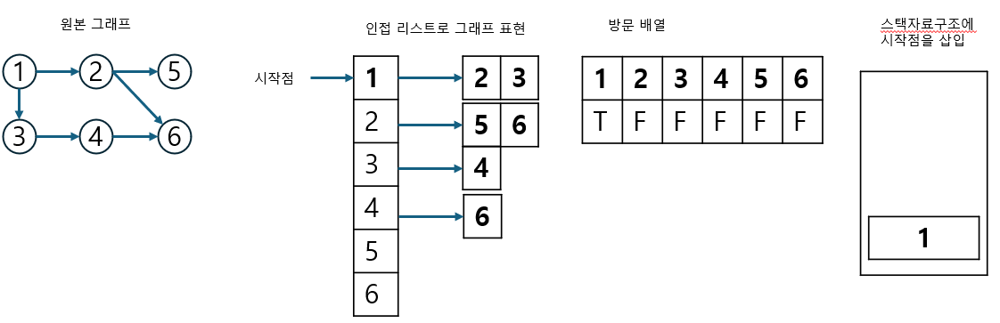
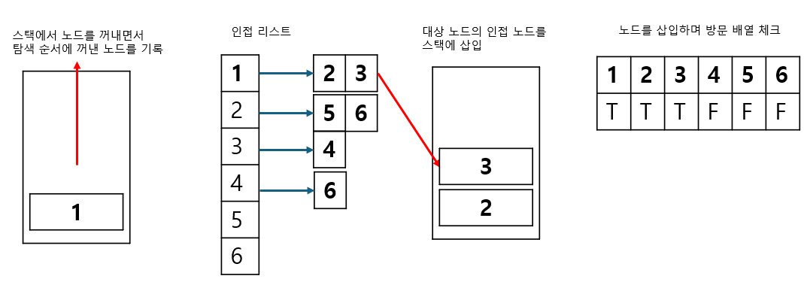
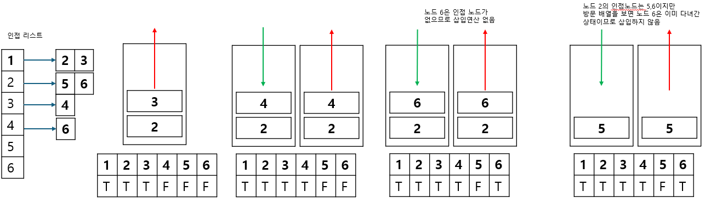
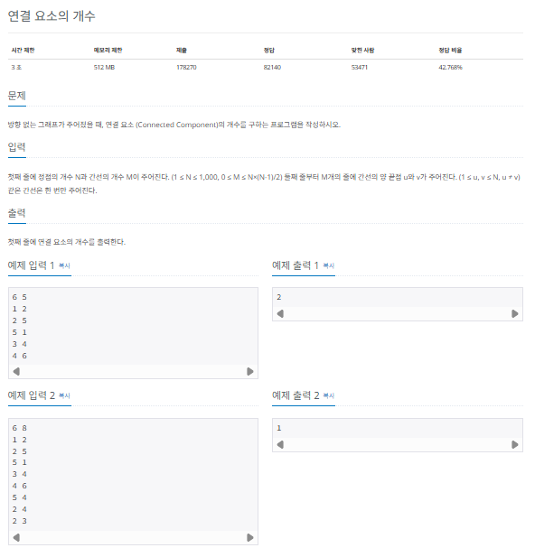
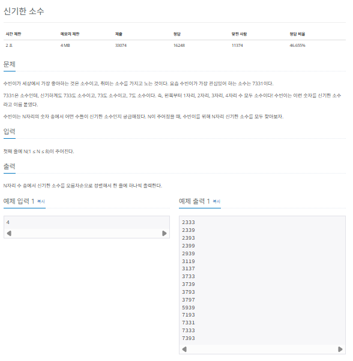
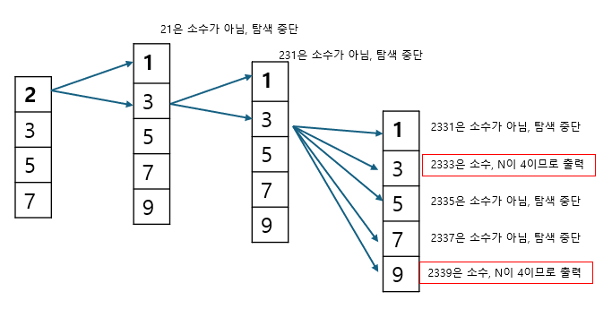
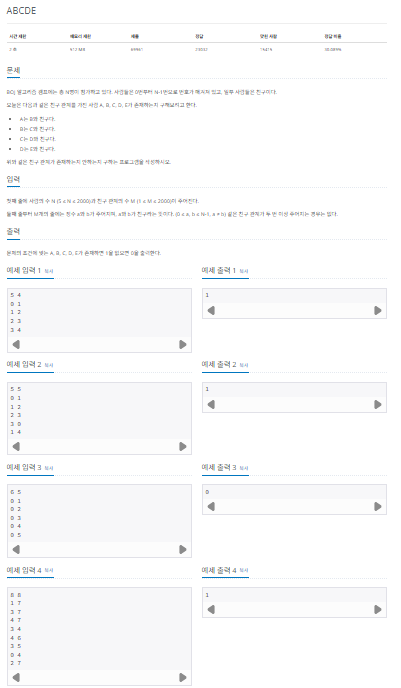
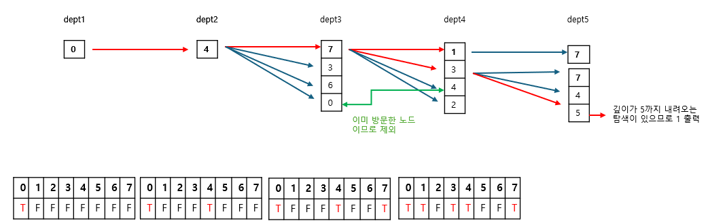

## 깊이 우선 탐색

깊이 우선 탐색 (DFS : depth-first search)은 그래프 완전 탐색 기법 중 하나입니다. 깊이 우선 탐색은 그래프의 시작 노드에서 출발하여 탐색할 한쪽 분기를 정하여 최대 깊이까지 탐색을 마친 후 다른 쪽 분기로 이동하여 다시 탐색을 수행하는 알고리즘입니다.

다음은 깊이 우선 탐색의 기능, 특징, 시간 복잡도를 표로 정리한 것입니다. 표의 시간 복잡도 노드 개수를 V, 에지 개수를 E로 표시했습니다.

|       기능       | 특징                                            | 시간 복잡도(노드 수:V, 에지 수 :E) |
| :--------------: | :---------------------------------------------- | :--------------------------------: |
| 그래프 완전 탐색 | 1. 재귀 함수로 구현 <br/>2. 스택 자료 구조 이용 |              O(V + E)              |

깊이 우선 탐색은 실제 구현 시 재귀 함수를 이용하므로 스택 오버플로(stack overflow)에 유의해야 합니다. 깊이 우선 탐색을 응용하여 풀 수 있는 문제는 단절점 찾기, 단절선 찾기, 사이클 찾기, 위상 정렬등이 있습니다.

### 깊이 우선 탐색의 핵심 이론

DFS는 한 번 방문한 노드를 다시 방문하면 안되므로 노드 방문 여부를 체크할 배열이 필요합니다. 그래프는 인접 리스트로 표현하겠습니다. 그리고 DFS의 탐색 방식은 후입선출 특성을 가지므로 스택을 사용하여 설명하겠습니다.

> 여기서는 설명의 편의를 위해 스택을 사용했습니다. 하지만 DFS는 스택보다는 스택 성질을 갖는 재귀함수로 많이 구현합니다.

#### 1. DFS를 시작할 노드를 정한 후 사용할 자료구조 초기화하기

DFS를 위해 필요한 초기 작업은 인접 리스트로 그래프 표현하기, 방문 배열 초기화하기, 시작 노드 스택에 삽입하기 입니다. 스택에 시작 노드를 1로 삽입할 때 해당 위치의 방문 배열을 체크하면 T,F,F,F,F,F가 됩니다.



#### 2. 스택에서 노드를 꺼낸 후 꺼낸 도의 인접 노드를 다시 스택에 삽입하기

이제 pop을 수행하여 노드를 꺼냅니다. 꺼낸 노드를 탐색 순서에 기입하고 인접 리스트의 인접 노드를 스택에 삽입하며 방문 배열을 체크합니다. 방문 배열은 T,T,T,F,F,F가 됩니다.



#### 3. 스택 자료구조에 값이 없을때까지 반보갛기

앞선 과정을 스택 자료구조에 값이 없을 때까지 반복합니다. 이때 이미 다녀간 노드는 방문 배열을 바탕으로 재삽입하지 않는것이 핵심입니다.



탐색 순서 : 1 -> 3 -> 4 -> 6 -> 2 -> 5

이어서 설명하면 스택에서 3을 꺼내며 탐색순서에 기록하고 인접 노드 4를 스택에 삽입하며 방문 배열에 체크합니다. 4를 꺼내며 탐색 순서에 기록하고 6을 삽입하며 방문 배열에 체크합니다.
6을 꺼내며 탐색 순서에 기록하고 6과 인접한 노드는 없으므로 추가 삽입은 없습니다.

계속해서 스택에서 2를 꺼내며 탐색 순서에 기록하고 2와 인접한 5,6을 삽입하기 위해 보지만, 이때 6은 방문 배열에 T로 체크되어 있으므로 5만 삽입합니다. 이 과정을 스택이 빌 때까지 진행합니다.

### $[문제023]$ 연결 요소의 개수 구하기



### $[01단계]$ 문제 분석하기

노드의 최대 개수가 1,000이므로 시간 복잡도 $O(N^2)$이하의 알고리즘을 모두 사용할 수 있습니다. 연결 요소는 에지로 연결된 노드의 집합이며, 한번의 DFS가 끝날 때까지 탐색한 모든 노드의 집합을 하나의 연결 요소로 판단할 수 있습니다.

### $[02단계]$ 손으로 풀어보기

1. 그래프를 입접 리스트로 저장하고 방문 배열도 초기화합니다. 방향이 없는 그래프이기 때문에 양쪽으로 에지를 모두 저장합니다.

```
[인접리스트]
1 : 2,5
2 : 1,5
3 : 4
4 : 3,6
5 : 2,1
6 : 4

[방문배열]
[1][2][3][4][5][6]
[F][F][F][F][F][F]
```

2. 임의의 시작점에서 DFS를 수행합니다. 현재의 경우 1을 시작점으로 정했습니다. 탐색을 마친 이후 방문한 곳은 1,2,5가 되었습니다.

```
[인접리스트]
1 : 2,5    -> 시작점
2 : 1,5
3 : 4
4 : 3,6
5 : 2,1
6 : 4

[방문배열]
[1][2][3][4][5][6]
[T][T][F][F][T][F]

[탐색순서]
1 -> 5 -> 2
```

3. 아직 방문하지 않은 노드가 있으므로 시작점을 다시 정해 탐색을 진행합니다. 현재의 경우 3,4,6 순서로 탐색을 마쳤습니다. 모든 노드를 방문 했으니 전체 탐색을 종료합니다.

```
[인접리스트]
1 : 2,5
2 : 1,5
3 : 4      -> 시작점
4 : 3,6
5 : 2,1
6 : 4

[방문배열]
[1][2][3][4][5][6]
[T][T][T][T][T][T]

[탐색순서]
3 -> 4 -> 6 -> 탐색 종료
```

4. 1 ~ 3 과정을 통해 총 2번의 DFS가 진행되었다는 것을 알 수 있습니다. 즉, 연결 요소 개수는 2개입니다.

> 모든 노드를 탐색하여 탐색 종료 -> DFS 총 2회 수행 = 연결 요소 개수 = 2

만약 그래프가 모두 연결되어 있었다면 DFS는 1번 실행되었을 것입니다. 다시 말해 모든 노드를 탐색하는 데 실행한 DFS의 실행 횟수가 곧 연결 요소 개수와 같습니다.

### $[03단계]$ 슈도코드 작성하기

```
N(노드 개수), M(엣지 개수)
A(그래프 데이터 저장 인접 리스트) // 이차원 벡터 형태
visited(방문 기록 저장 배열)

벡터 A 크기 N + 1로 재설정

for(M의 개수만큼 반복) {
  인접 리스트 A에 그래프 데이터 저장
}
for(N의 개수만큼 반복) {
  if (방문하지 않은 노가 있다면) {
    연결 요소 개수 ++;
    DFS실행
  }
}

연결 요소 개수 출력

// DFS 구현
DFS {
  if (현재 노드 == 방문 노드) return;
  visited 배열에 현재 노드 방문 기록
  for (현재 노드에서 연결된 모든 노드 탐색) {
    if (현재 노드의 연결 노드 중 방문하지 않은 노드) {
      DFS 실행(방문하지 않은 노드)
    }
  }
}
```

### $[04단계]$ 코드 구현하기

```c
#include <csetjmp>
#include <iostream>
#include <vector>
using namespace std;

static vector<vector<int> > A;
static vector<bool> visited;

void DFS(int v);

int main(int argc, char *argv[]) {
    int N, M;
    cin >> N >> M;
    A.resize(N + 1);
    visited = vector<bool>(N + 1, false);

    for (int i = 0; i < M; i++) {
        int s, e;
        cin >> s >> e;
        A[s].push_back(e);
        A[e].push_back(s);
    }

    int count = 0;

    for (int i = 1; i < N + 1; i++) {
        if (!visited[i]) {
            count++;
            DFS(i);
        }
    }
    cout << count << "\n";
    return 0;
}

void DFS(int v) {
    if (visited[v]) return;
    visited[v] = true;

    for (int i : A[v]) {
        if (!visited[i]) {
            DFS(i);
        }
    }
}
```

### $[문제024]$ 신기한 소수 찾기



### $[01단계]$ 문제 분석하기

앞에서 언급했듯이 DFS는 재귀 함수의 형태를 띱니다. 여기서는 재귀 함수의 원리 설명과 함께 DFS를 풀어 봅니다. 재귀 함수를 잘 이해하면 문제 조건에 맞도록 코드를 수정하기가 쉽습니다.

### $[02단계]$ 손으로 풀어보기

소수는 약수가 1과 자기 자신뿐인 수를 말합니다. 예를 들어 4는 약수가 1,2,4이므로 소수가 아니고 7은 1,7이므로 소수입니다.

우선 자릿수가 한 개인 소수는 2,3,5,7이므로 이 수부터 탐색을 시작합니다. 4,6,8,9를 제외한 가지치기 방식을 적용한 것입니다. 이어서 자릿수가 두 개인 현재 수 \* 10 + a를 계산하여 이 수가 소수인지 판단하고, 소수하면 재귀 함수로 자릿수를 하나 늘립니다. 단, a가 짝수 인 경우는 항상 2를 약수로 가지므로 가지치기로 a가 짝수인 경우를 제외합니다. 이런 방식으로 자릿수를 N까지 확장했을 때 그 값이 소수라면 해당 값을 출력합니다.



1. 2,3,5,7 부터 탐색 시작
2. 일의 자리에 붙는 수는 홀수만 허용

위 그림을 보면 앞에서 말한 방식, 즉, DFS의 형태로 탐색합니다. 그리고 첫 탐색 배열, 중간 탐색 배열을 가지치기하여 시간 복잡도를 줄였습니다. 또한 중간 탐색 과정에서 소수가 아닌 경우 멈추는 가지치기도 포함되므로 제한 시간 내에 풀 수 있습니다. 소수를 판별하는 방법은 보통 에라토스테네스의 체를 사용하지만 여기서는 단순한 소수 판별 함수를 사용해도 시간안에 풀 수 있습니다.

### $[04단계]$ 코드 구현하기

```c
#include <csetjmp>
#include <iostream>
#include <vector>
using namespace std;

void DFS(int number, int jarisu);

bool isPrime(int num);

static int N;

int main(int argc, char *argv[]) {
    cin >> N;
    DFS(2, 1);
    DFS(3, 1);
    DFS(5, 1);
    DFS(7, 1);
    return 0;
}

void DFS(int number, int jarisu) {
    if (jarisu == N) {
        if (isPrime(number)) {
            cout << number << "\n";
        }
        return;
    }

    for (int i = 1; i < 10; i++) {
        if (i % 2 == 0) continue;
        if (isPrime(number * 10 + i)) {
            DFS(number * 10 + i, jarisu + 1);
        }
    }
}

bool isPrime(int num) {
    for (int i = 2; i <= num / 2; i++) {
        if (num % i == 0) {
            return false;
        }
    }
    return true;
}
```

### $[문제025]$ 친구 관계 파악하기



### $[01단계]$ 문제 분석하기

N의 최대 범위가 2,000이므로 알고리즘의 시간 복잡도를 고려할 때 좀 자유롭겠네요. 그리고 문제에서 요구하는 A,B,C,D,E의 관계는 재귀함수의 형태와 비슷합니다. 주어진 모든 노드에 DFS를 수행하고 재귀의 깊이가 5이상이면 1, 아니라면 0을 출력합니다. DFS의 시간 복잡도는 O(V + E)이므로 최대 4,000, 모든 노드를 진행했을때 4,000 \* 2,000, 즉 8,000,000이므로 DFS를 사용해도 제한시간 내에 문제를 풀 수 있습니다.

### $[02단계]$ 손으로 풀어보기

1. 그래프 데이터를 인접 리스트로 저장합니다.

```
0 : 4
1 : 7
2 : 7
3 : 7,4,5
4 : 7,3,6,8
5 : 3
6 : 4
7 : 1,3,4,2
```

2. 모든 노드에서 DFS를 수행합니다. 수행할 때 재귀 호출마다 깊이를 더합니다. 깊이가 5가되면 1을 출력하고 프로그램을 종료합니다.



3. 모든 노드를 돌아도 1이 출력되지 않았다면 0을 출력합니다.

### $[04단계]$ 코드 구현하기

```c
#include <iostream>
#include <vector>
using namespace std;

static vector<vector<int> > A;
static vector<bool> visited;
static bool arrive;

void DFS(int now, int depth);


int main(int argc, char *argv[]) {
    int N, M;
    cin >> N >> M;
    arrive = false;
    A.resize(N);
    visited.resize(N, false);

    for (int i = 0; i < M; i++) {
        int s, e;
        cin >> s >> e;
        A[s].push_back(e);
        A[e].push_back(s);
    }
    // 노드마다 DFS 실행
    for (int i = 0; i < N; i++) {
        DFS(i, 1);
        if (arrive) break;
    }

    int result = arrive ? 1 : 0;
    cout << result << "\n";
    return 0;
}

void DFS(int now, int depth) {
    if (depth == 5 || arrive) {
        arrive = true;
        return;
    }
    visited[now] = true;

    for (int i: A[now]) {
        if (!visited[i]) {
            DFS(i, depth + 1);
        }
    }
    visited[now] = false;
}
```
