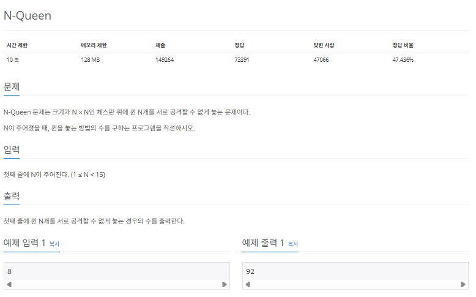
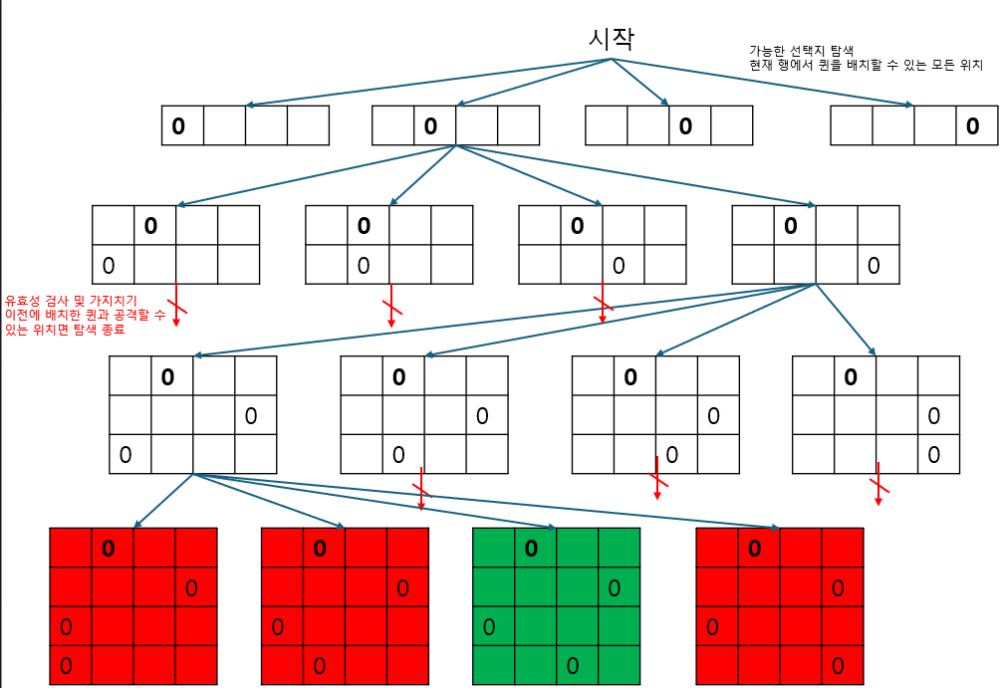
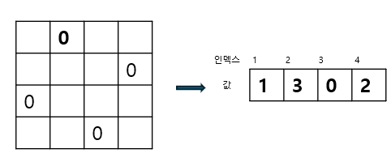
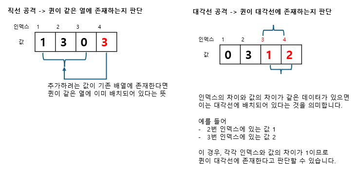
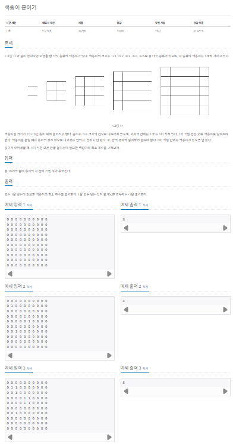
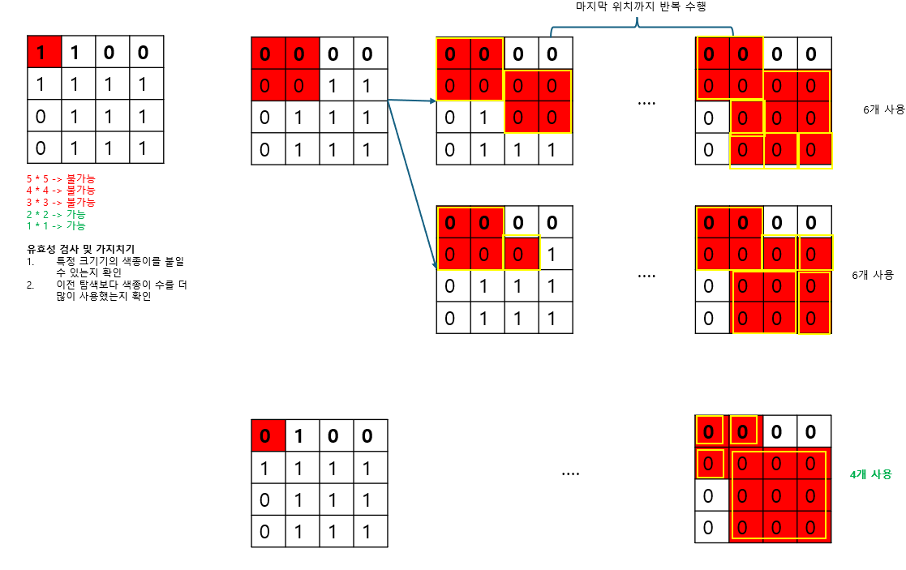

## 백트래킹

백트래킹(backtracking)은 문제를 해결하는 탐색 기법입니다. 문제를 해결할 수 있는 모든 경로를 탐색하면서 선택한 경로가 유효하지 않거나 조건에 만족하는 해를 찾지 못할 경우, 이전 단계로 되돌아가 다른 경로를 시도하는 알고리즘입니다.

|                 기능                 | 특징                                             | 시간 복잡도(N: 분기 수, d: 탐색 길이) |
| :----------------------------------: | :----------------------------------------------- | :-----------------------------------: |
| 문제를 해결할 수 있는 모든 경로 탐색 | 1. 재귀 함수로 구현 <br/>2. 가지치기로 성능 향상 |               $O(N^d$)                |

백트래킹은 일반적으로 재귀 함수 형태로 구현하며, 앞서 배운 깊이 우선 탐색(DFS)의 개념과 구현방식이 매우 유사합니다. 가장 큰 특징인 가지치키(pruning)로 유효하지 않은 경로를 조기에 배제하여 탐색 범위를 줄이고 성능을 높일 수 있다는 점입니다.

굳이 차이점을 찾아보자면, DFS가 모든 노드를 탐색하는 것을 목적으로 하는 반면, 백트래킹은 조건을 만족하는 해를 찾기 위해 불필요한 경로는 조기에 차단하며 효율적으로 탐색한다는 점입니다. 백트래킹을 활용할 수 있는 대표적인 문제로는 조합, 순열, N-Queens 문제 등이 있습니다.

### 백트래킹 핵심 이론

백트래킹은 문제를 해결하기 위해 가능한 한 모든 경우의 수를 탐색하되, 조건을 만족하지 않는 경로를 가지치키하여 탐색 범위를 줄이는 것이 핵심입니다. 이 과정은 기본적으로 재귀 함수를 이용해 구현하며, 다음 3단계로 작동합니다.

1. 가능한 선택지 탐색하기
   1. 현재 상태에서 가능한 선택지를 모두 탐색합니다.
2. 유효성 검사 및 가지치키
   1. 각 선택지가 문제의 조건을 만족하는지 검사합니다. 만약 조건을 만족하지 않으면 해당 경로는 더 이상 탐색하지 않고 즉시 이전 단계로 되돌아갑니다.
3. 해답 도출하기
   1. 백트래킹으로 조건을 만족하는 해답을 찾으면 이를 기록하고, 필요에 따라 다른 경로도 계속 탐색합니다.

이제 실전 문제로 백트래킹의 동작 원리를 더욱 깊이 이해하고 사용방법까지 익혀 보겠습니다.

### $[문제026]$ N과 M


### $[01단계]$ 문제 분석하기

N과 M의 범위가 8 이하이므로 시간 복잡도에서 비교적 자유로운 문제입니다. 길이가 M인 모든 수열의 경우의 수를 구하는 것이 목표이므로, 백트래킹 알고리즘을 이용하여 가능한 모든 경우를 구하면 문제의 답을 도출할 수 있습니다. 앞서 핵심 이론에서 제시한 3단계를 문제에 맞게 다음과 같이 정의할 수 있습니다.

1. 가능한 선택지 탐색
   1. 현재 수열에서 추가할 수 있는 자연수를 탐색합니다.
2. 유효성 검사 및 가지치기
   1. 자연수가 기존 수열에서 이미 사용한 수라면, 해당 수를 선택한 탐색은 진행하지 않고 이전 단계로 돌아갑니다.
3. 해답 도출
   1. 수열의 길이가 M이 될 때 해당 수열의 정보를 출력합니다.

### $[02단계]$ 슈도코드 작성하기

```
N, M(1~N까지 자연수를 선택하여 길이가 M인 수열 모두 구하기)
V (숫자 사용 여부 저장 배열)
S (수열 정보 저장 배열)
백트래킹 실행 (매개변수: 수열의 길이)

// 백트래킹 상세 구현
backtracking (수열의 길이) {
  if (길이가 M인 수열이 만들어 진 경우)
    수열 정보 출력 및 함수 반환

  // 자연스럽게 사전순으로 출력되도록 탐색 기준 설정
  for (1 ~ N까지 자연수 탐색) {
      if (아직 수열에 포함되지 않은 수인 경우) {
        V 배열에 수 사용 표시
        수열에 수 추가
        수열 길이는 1 증가시키고 backtracking 함수 재귀 호출
        V 배열에 수 사용 표시 제거
      }
  }
}
```

### $[03단계]$ 코드 구현하기

```c
#include <iostream>
using namespace std;

static int N, M;
static bool V[8]; // 숫자 사용 여부 저장하기
static int S[8]; // 수열 정보 저장하기

void backtracking(int length);

int main(int argc, char *argv[]) {
    cin >> N >> M;
    backtracking(0);
    return 0;
}

void backtracking(int length) {
    // 길이가 M인 수열이 만들어진 경우
    if (length == M) {
        for (int i = 0; i < M; i++) {
            cout << S[i] + 1 << " ";
        }
        cout << '\n';
        return;
    }

    // 탐색
    for (int i = 0; i < N; i++) {
        if (!V[i]) {
            V[i] = true;    // 수 사용 저장하기
            S[length] = i; // 수열에 수 사용하기
            backtracking(length + 1);
            V[i] = false;
        }
    }
}
```

### $[문제027]$ N-Queen 배치하기



### $[01단계]$ 문제 분석하기

N의 크기가 최대 15이므로 시간 복잡도는 크게 걱정할 필요 없습니다. 체스에서 퀸은 가로, 세로, 대각선으로 공격할 수 있으므로 같은 행에는 퀸이 1개만 존재할 수 있습니다. 그리고 이를 확장해서 생각해 보면, 결국 모든 행에 퀸을 1개씩 배치해야 N개의 퀸을 서로 공격하지 않도록 놓을 수 있습니다.

따라서 맨 위 행부터 시작해 행마다 퀸을 하나씩 배치하면서 가능한 모든 경우의 수를 찾는 방식으로 접근해야 합니다. 이때 백트래킹 알고리즘을 사용하여 구하면 됩니다.

1. 가능한 선택지 탐색
   1. 현재 행에서 퀸을 놓을 수 있는 위치를 탐색합니다.
2. 유효성 검사 및 가지치키
   1. 해당 위치에 퀸을 배치할 때 다른 퀸과 서로 공격할 수 있는지 확인합니다. 공격할 수 있다면 탐색을 종료하고 이전 단계로 돌아갑니다.
3. 해답 도출 마지막 행까지 퀸 배치를 모두 완료하면 경우의 수를 1증가시키고, 백트래킹 전체를 종료하면 경우의 수를 출력합니다.

### $[02단계]$ 손으로 풀어보기

N이 4라고 가정하고 문제를 풀어보겠습니다. 1번째행부터 다음 그림과 같이 퀸을 배치할 수 있는 모든 위치를 탐색합니다. 기본적으로 후보가 될 수 있는 위치는 해당 행의 모든 열입니다. 퀸을 배치한 후에는 이전 행들에 배치되어 있는 퀸들과 서로 공격할 수 있는지 검사합니다. 퀸은 직선과 대각선으로 공격할 수 있으므로, 공격 가능 여부는 같은 열이나 대각선 위에 퀸이 2개 이상 존재하는지 여부로 검사합니다. 만약 공격할 수 있다면 해당 배치는 가지치키를 수행하여 탐색을 종료합니다.



이렇게 백트래킹 알고리즘을 수행함녀서 마지막 행까지 퀸을 모두 배치하면 유효한 경우로 판단하여 경우의 수를 1증가시킵니다. 알고리즘을 모두 수행 완료한 후 경우의 수를 출력합니다.

추가로 N \* N인 체크판이 주어지므로 문제를 이차원배열로 생각할 수 있지만, 의외로 다음과 같이 일차원 배열로도 퀸 배치 정보를 충분히 저장할 수 있습니다. 바로 일차원 배열의 인덱스를 행로, 값을 열로 생각하는 방법입니다.



퀸의 배치 정보를 일차원 배열로 저장하면 공격 가능 여부를 다음과 같이 쉽게 구현할 수 있습니다.



### $[03단계]$ 슈도코드 작성하기

```
A (퀸 배치 정보 저장 배열)
N (체스판 크기)
cnt (퀸을 배치하는 경우의 수 저장 변수)

백트래킹 실행 (매개변수: 행)
경우의 수 출력

// 백트래킹 상세 구현
backtracking (현재 행) {
  if (퀸 N개를 모두 배치한 경우)
    경우의 수 1 증가 및 함수 반환

  for (1 ~ N까지 모든 열 탐색) {
    i열에 퀸 배치하기
    // check 함수로 판단하기
    if (이번 행에 배치한 퀸이 이전 퀸들과 공격할 수 없는 경우) {
      행의 값을 1 증가시키고 backtracking 함수 재귀 호출
    }
  }
}

// 공격 불가능 여부를 체크하는 함수 상세 구현
check (현재 행) {
  for (0행부터 현재 행 전까지 배치된 모든 퀸 탐색) {
    if (이번에 배치한 퀸과 일직선 배치가 있는 경우) 공격 가능 반환
    if (이번에 배치한 퀸과 대각선 배치가 있는 경우) 공격 가능 반환
  }
  공격 불가능 반환
}
```

### $[04단계]$ 코드 구현하기

```c
#include <iostream>
using namespace std;

static int A[15]; // 퀸 배치 정보
static int N;     // 체스판 크기
static int cnt = 0; // 정답

void backtracking(int row);
bool check(int row);

int main(int argc, char *argv[]) {
    cin >> N;
    backtracking(0);
    cout << cnt << '\n';
    return 0;
}

void backtracking(int row) {
    if (row == N) {
        cnt ++;
        return;
    }

    for (int i = 0; i < N; i++) {
        A[row] = i;
        // 배치한 퀸이 이전 퀸들과 서로 공격할 수 없다면
        if (check(row)) {
            backtracking(row + 1);
        }
    }
}

bool check(int row) {
    for (int i = 0; i < row; ++i) {
        // 일직선 배치
        if (A[i] == A[row]) return false;
        // 대각선 배치
        if (abs(row - i) == abs(A[i] - A[row])) return false;
    }
    return true;
}
```

### $[문제028]$ 색종이 붙이기



### $[01단계]$ 문제 분석하기

종이의 크기는 10 \* 10이고 색종이의 개수가 25개로 많지 않으므로, 색종이를 붙일 수 있는 경우의 수를 모두 탐색해보면 됩니다. 이때 모든 경우의 수는 백트래킹 알고리즘을 이용하여 구하면 됩니다. 이번에도 문제를 백트래킹 3단계에 맞춰 정리해 보겠습니다.

1. 가능한 선택지 탐색
   1. 탐색은 색종이를 붙일 수 잇는 1번째 위치를 찾는 것으로 시작합니다. 탐색 위치는 왼쪽 위에서 시작하여 오른쪽으로 이동하고, 오른쪽 끝에 도달하면 한 줄 아래로 내려가서 다시 왼쪽부터 이동하는 방식으로 진행합니다. (일관된 방향으로 탐색)
2. 유효성 검사 및 가지치키
   1. 현재 선택한 위치에 색종이를 붙일 수 있는지 확인합니다. 사용할 수 있는 색종이의 크기는 다섯 종류이며, 크기별로 각각 최대 5장까지 사용할 수 있습니다. 색종이를 해당 위치에 붙일 수 있다면 탐색을 계속 진행하고, 붙일 수 없다면 해당 탐색을 종료합니다. 또한 목표는 사용한 색종이 개수를 최소화하는 것이므로, 현재까지 사용한 색종이 수가 이미 구한 최솟값을 초과하는 경우에도 탐색을 중단합니다.
3. 해답 도출
   1. 모든 1을 덮는 탐색을 완료하면 그 과정에서 사용한 색종이 수를 기록합니다. 탐색을 모두 끝낸 뒤에는 이렇게 기록된 색종이 수 중에서 가장 작은 값을 찾아 출력합니다.

### $[02단계]$ 손으로 풀어보기

다음과 같이 크기가 4 \* 4인 색종이가 있다고 가정하고, 1을 모두 덮는 최소 색종이 수를 구해보겠습니다. 코드에서는 색종이로 1을 덮는 과정을 해당 영역의 데이터를 0으로 변경하는 것으로 처리합니다.


이렇게 해당 범위를 모두 0으로 변경하는 이유는 이후 탐색과정에서 같은 영역을 중복하여 색종이로 덮는 실수를 방지하기 위해서입니다. 이제 백트래킹 알고리즘을 이용하여 다음과 같이 색종이를 붙일 수 있는 모든 경우의 수를 탐색하고 그중에 색종이 수가 최소인 경우를 찾아냅니다.



그리디 방식으로 먼저 큰 색종이로 덮는 것이 유리해 보일 수 있스빈다. 하지만 예제와 같이 큰 색종이를 먼저 사용했을 때 오히려 반대로 더 많은 색종이가 필요할 수도 있습니다. 따라서 모든 색종이 크기를 대상으로 탐색하는 과정을 반드시 거쳐야합니다.

### $[03단계]$ 슈도코드 작성하기

```
M (종이 상태 저장 배열)
S (남은 색종이 수 저장 배열)
result (최소로 사용한 개수 저장)

10*10 크기의 종이 데이터 저장하기
백트래킹 실행 (매개변수: 탐색위치, 사용한 색종이 수)
if (1을 모두 덮은 수 없는 경우) {
  -1 출력
}
else {
  최소로 사용한 색종이 개수 출력
}

// 백트래킹 상세 구현
backtracking (탐색 위치, 사용한 색종이 수) {
  if (1이 적힌 모든 칸을 색종이로 붙이고 x,y 좌표를 끝까지 탐색한 경우) {
    최소로 사용한 개수 업데이트 및 함수 반환

    if (최소로 사용한 색종이 수보다 현재 탐색에서 사용한 색종이 수가 많으면)  {
      함수 반환
    }

    if (현재 위치가 1이면) {
      크기가 큰 순서부터 색종이 5종류 중 재고가 있는 색종ㅇ ㅣ붙여보기
      if (붙일 수 있으면) {
        해당 크기의 색종이 재고 1 감소
        종이 붙이기: 종이로 덮이는 부분 1 -> 0으로 변경
        현재 사용한 색종이 수를 1 증가 시키고 다음 위치로 좌표를 이동하여 backtracking 함수 재귀 호출
        해당 크기의 색종이 재고 1 증가
        종이 떼어 내기: 기존에 덮인 부분 0 -> 1로 변경
      }
    }
  }
  else {
    좌표를 다음 위치로 이동하여 backtracking 함수 재귀 호출
  }
}
```

### $[04단계]$ 코드 구현하기

```c
#include <iostream>
#include <climits>
#include <algorithm>
using namespace std;

static int M[10][10];
static int S[6] = {0, 5, 5, 5, 5, 5}; // 남은 색종이 개수
static int result = INT_MAX;

void backtracking(int xy, int useCnt);

bool check(int x, int y, int size);

void fill(int x, int y, int size, int num);

int main(int argc, char *argv[]) {
    for (int i = 0; i < 10; ++i) {
        for (int j = 0; j < 10; ++j) {
            cin >> M[i][j];
        }
    }

    // 1일 적힌 모든 칸을 붙일 때 사용한 색종이 개수에 대한 경우의 수를 백트래킹으로 탐색
    backtracking(0, 0);

    if (result == INT_MAX)
        cout << -1 << '\n';
    else
        cout << result << '\n';

    return 0;
}


void backtracking(int xy, int useCnt) {
    // 1이 적힌 모든 칸을 색종이로 붙였을때 (x,y 조퐈를 끝까지 탐색한 경우) 탐색 종료
    if (xy == 100) {
        result = min(result, useCnt);
        return;
    }

    int x = xy % 10;
    int y = xy / 10;

    if (result <= useCnt) return;

    if (M[y][x] == 1) {
        // 5 * 5 까지 색종이 붙일 수 있으니
        for (int i = 5; i >= 1; --i) {
            if (S[i] > 0 && check(x, y, i)) {
                S[i]--; // 종이 사용하기
                fill(x, y, i, 0); // 종이 붙이기: 종이로 덮이는 부분 1 -> 0으로 변경
                backtracking(xy + 1, useCnt + 1);
                S[i]++;
                fill(x, y, i, 1); // 종이 떼어내기: 기존에 덮인 부분 0 -> 1으로 변경
            }
        }
    } else {
        // 현재 좌표의 값이 0이면 바로 다음 칸으로 이동
        backtracking(xy + 1, useCnt);
    }
}

bool check(int x, int y, int size) {
    if (x + size > 10 || y + size > 10) return false;
    for (int i = y; i < y + size; ++i) {
        for (int j = x; j < x + size; ++j) {
            if (M[i][j] != 1) return false;
        }
    }
    return true;
}

void fill(int x, int y, int size, int num) {
    for (int i = y; i < y + size; ++i) {
        for (int j = x; j < x + size; ++j) {
            M[i][j] = num;
        }
    }
}
```
