## 너비 우선 탐색

너비 우선 택색 (BFS: breadth-first search)도 그래프를 완전 탐색하는 방법 중 하나로, 시작 노드에서 출발해 시작 노드를 기준으로 가까운 노드를 먼저 방문하면서 탐색하는 알고리즘 입니다.

|       기능       | 특징                                      | 시간 복잡도(노드 수:V, 에지 수 :E) |
| :--------------: | :---------------------------------------- | :--------------------------------: |
| 그래프 완전 탐색 | 1. FIFO 탐색 <br/>2. Queue 자료 구조 이용 |              O(V + E)              |

너비 우선 탐색은 선입선출 방식으로 탐색하므로 큐를 이용해 구현합니다. 또한 너비 우선 탐색은 탐색 시작 노드와 가까운 노드를 우선하여 탐색하므로 목표 노드에 도착하는 경로가 여러 개 일때 최단 경로를 보장합니다.

### 너비 우선 탐색의 핵심 이론

BFS의 원리를 3단계로 나눠 자세히 알아볼까요?

#### 1. BFS를 시작할 노드를 정한 후 사용할 자료구조 초기화하기

BFS도 DFS와 마찬가지로 방문했던 노드는 다시 방문하지 않으므로 방문한 노드를 체크하기 위한 배열이 필요합니다. 그래프를 인점 리스트로 표현하는 것 역시 DFS와 동일합닙다. 하나 차이점이 있다면 탐색에 스택이 아닌 큐를 사용합니다.

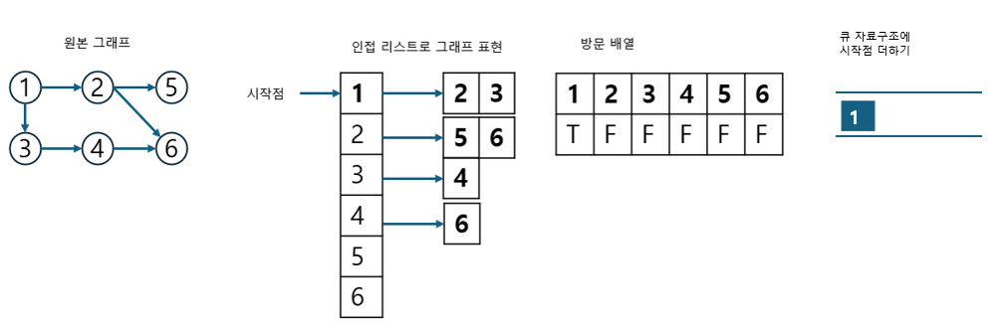

앞의 그림은 시작 노드를 큐에 삽입하며 방문 배열을 체크한 것을 보여줍니다.

#### 2. 큐에서 노드를 꺼낸 후 꺼낸 노드의 인접 노드를 다시 큐에 삽입하기

큐에서 노드를 꺼내면서 인접 노드를 큐에 삽입합니다. 이때 방문 배열을 체크하여 이미 방문한 노드는 큐에 삽입하지 않습니다. 또한 큐에서 꺼낸 노드는 탐색 순서에 기록합니다.

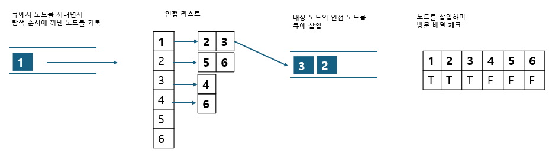

위 그림의 경우 1을 꺼내며 탐색 순서에 1을 기록하고 인접 노드 3,2를 큐에 삽입하며 방문 배열에 체크했습니다.

#### 3. 큐 자료구조에 값이 없을 때까지 반복하기

큐에 노드가 없을 때까지 앞선 과정을 반복 합니다. 선입선출 방식으로 탐색하므로 탐색 순서가 DFS와 다름을 확인해 보세요.

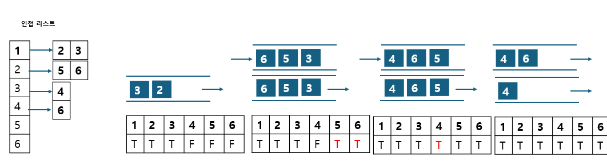

탐색 순서 : 1 -> 2 -> 3 -> 5 -> 6 -> 4

2,3 순서로 노드를 꺼내며 인접 노드를 큐에 삽입합니다. 2의 경우 5,6은 아직 방문한 적으로 없으므로 방문 배열을 체크하며 모두 삽입합니다. 3의 경우 4 역시 방문한 적이 없으므로 방문 배열을 체크하며 삽입합니다. 탐색 순서는 2,3이 기록됩니다. 5,6을 꺼낼 때는 인접 노드가 없으니 탐색 순서에 기록만 하고 꺼냅니다. 4를 꺼낼 땐느 인접 노드가 6이지만 이미 앞서 방문했으므로 6은 큐에 삽입하지 않고 꺼내기만 합니다. 최종 탐색 순선느 1,2,3,5,6,4 입니다.

### $[문제029]$ DFS와 BFS 프로그램

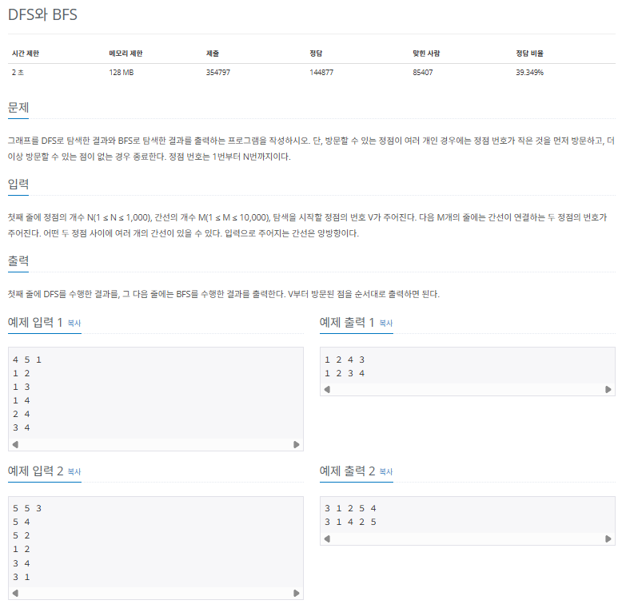

### $[01단계]$ 문제 분석하기

DFS와 BFS를 구현할 수 있는지 물어보는 기본문제 입니다. 앞에서 제대로 공부했다면 충분히 풀 수 있습니다.

### $[02단계]$ 손으로 풀어보기

1. 인접 리스트에 그래프를 저장합니다.

```
[1] -> [2][3][4]
[2] -> [4][1]
[3] -> [4][1]
[4] -> [1][2][3]
```

2. DFS를 실행하면서 방문 배열 체크와 탐색 노드 기록을 수행합니다. 문제 조건에서 작은 번호의 노드부터 탐색한다 했으므로 인접 노드를 오름차순으로 정렬한 후 재귀 함수를 호출합니다.

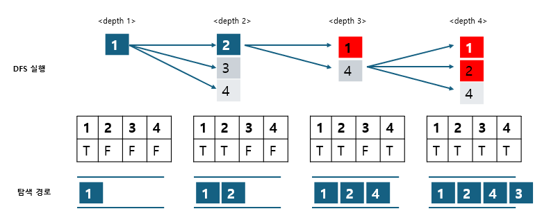

3. BFS도 같은 방식으로 진행합니다. 노드를 오름차순으로 정렬하여 큐에 삽입합니다.

> DFS와 달리 BFS는 재귀 함수로 구현하지 않고 큐를 이용하여 구현합니다.

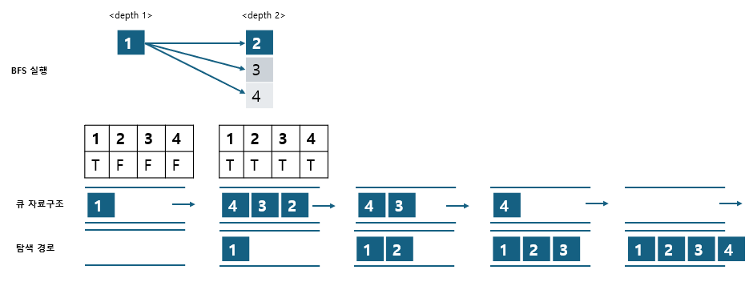

4. DFS와 BFS를 마쳤다면 각각 탐색하며 기록한 데이터를 출력합니다.

### $[03단계]$ 슈도코드 작성하기

```
N (노드개수) , M(에지 개수), Start (시작점)
A (그래프 데이터 저장 인접 리스트)
visited (방문 기록 저장 배열)

인접 리스트 A 크기 초기화

for (M의 개수만큼 반복) {
  인접 리스트 A에 그래프 데이터 저장
}

// 오름차순 정렬
for (N의 개수만큼 반복) {
  각 노드에 대한 에지를 정렬
}

visited 배열 초기화
DFS(Start) 실행
visited 배열 초기화
BFS(Start) 실행

// DFS 구현
DFS {
   현재 노드 출력
   visited 배열에 현재 노드 방문 기록
   현재 노드의 연결 노드 중 방문하지 않은 노드에 대해 DFS 실행 (재귀함수)
}

// BFS 구현
BFS {
  큐 자료구조에 시작 노드 넣기
  visited 배열에 현재 노드 방문 기록

  while (큐가 빌 때까지) {
    큐에서 노드 데이터를 가져오기
    가져온 노드 출력
    현재 노드의 연결 노드 중 방문하지 않은 노드에 대해 큐에 데이터를 삽입
    visited 배열에 방문 기록
  }
}
```

### $[04단계]$ 코드 구현하기

```c
#include <iostream>
#include <vector>
#include <algorithm>
#include <queue>

using namespace std;

static vector<vector<int> > A;
static vector<bool> visited;
static bool arrive;

void DFS(int node);

void BFS(int node);

int main(int argc, char *argv[]) {
    int N, M, Start;
    cin >> N >> M >> Start;
    arrive = false;
    A.resize(N + 1);

    for (int i = 0; i < M; i++) {
        int s, e;
        cin >> s >> e;
        A[s].push_back(e);
        A[e].push_back(s);
    }

    // 방문할 수 있는 노드가 여러 개 일때는 번호가 작은것부터 먼저 방문하기 위해 정렬
    for (int i = 1; i <= N; i++) {
        sort(A[i].begin(), A[i].end());
    }

    visited = vector<bool>(N + 1, false);
    DFS(Start);
    cout << "\n";
    fill(visited.begin(), visited.end(), false);
    BFS(Start);
    cout << "\n";
}

void DFS(int node) {
    cout << node << " ";
    visited[node] = true;

    for (int i: A[node]) {
        if (!visited[i]) {
            DFS(i);
        }
    }
}

void BFS(int node) {
    queue<int> myqueue;
    myqueue.push(node);
    visited[node] = true;

    while (!myqueue.empty()) {
        int now_node = myqueue.front();
        myqueue.pop();
        cout << now_node << " ";
        for (int i: A[now_node]) {
            if (!visited[i]) {
                visited[i] = true;
                myqueue.push(i);
            }
        }
    }
}
```

### $[문제030]$ 미로 탐색하기

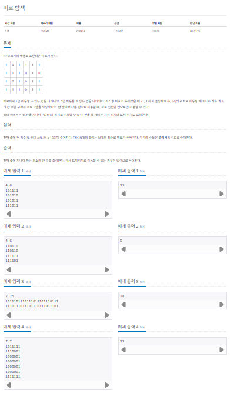

### $[01단계]$ 문제 분석하기

N,M의 최대 데이터의 크기가 100으로 매우 작기 때문에 시간 제한은 별도로 생각하지 않아도 되는 문제입니다. 문제의 요구 사항은 지나야 하는 칸 수의 초솟값을 찾는 것입니다. 이는 완전 탐색은 진행하며 몇 번째 깊이에서 원하는 값을 찾을 수 있는지를 구하는 것과 동일합니다. 따라서 BFS를 사용해 최초로 도달했을 때의 깊이를 출력하면 문제를 해결할 수 있습니다. DFS보다 BFS가 적합한 이유는 BFS는 해당 깊이에서 갈 수 있는 노드 탐색을 마친 후 다음 깊이로 넘어가기 때문입니다.

### $[02단계]$ 손으로 풀어보기

예제 입력 2번을 이용해 풀어 보겠습니다. 먼저 2차원 배열에 데이터를 저장한 다음 (1,1)에서 BFS를 실행합니다. 상,하,좌,우 네 방향을 보며 인접한 칸을 봅니다. 인접한 칸의 숫자가 1이면서 아직 방문하지 않았다면 큐에 삽입합니다. 종료 지점 (N,M)에서 BFS를 종료하며 깊이를 출력합니다.

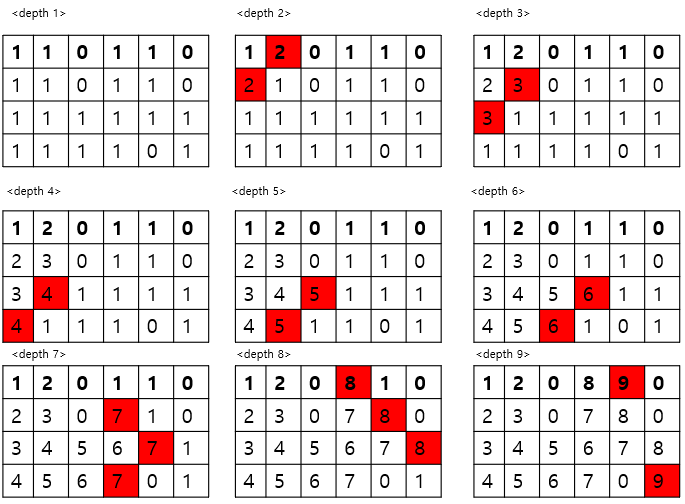

그림을 보면 (1,1)에서 출발해 상,하,좌,우 순서로 노드를 큐에 삽입하며 방문 배열에 체크합니다. 지금은 하,우만 방문할 수 있으므로, 하,우 순서로 노드를 큐에 삽입합니다. 이때 방문한 데이터의 값을 depth의 값을 저장하기 위해 이전 데이터의 값 + 1로 업데이트 합니다. 이런 방식으로 노드를 방문하면 깊이 9단계에서 (4,6)에 도달합니다.

### $[03단계]$ 슈도코드 작성하기

```
dx, dy (상하좌우 탐색을 위한 define 값 정의 변수)
A (데이터 저장 이차원 배열)
N (row), N (column)
visited (방문 기록 이차원 배열)

for (N의 개수만큼 반복) {
  for (M의 개수만큼 반복)
    배열 A에 데이터 저장
}

BFS(0,0)실행

// BFS 구현
BFS {
  큐 자료구조에 시작 노드 넣기
  visited 배열에 현재 노드 방문 기록
  while (큐가 빌 때까지) {
    큐에서 노드 데이터를 가져오기
    for (상하좌우 탐색) {
      if (유효한 좌표) {
        if (이동할 수 있는 칸이면서 방문하지 않은 노드) {
          visited 배열에 방문 기록
          배열 A에 새롭게 이동한 노드의 depth를 현재 노드의 depth + 1 값으로 업데이트
          큐에 데이터 삽입
        }
      }
    }
  }
}
```

### $[04단계]$ 코드 구현하기

```c
#include <iostream>
#include <queue>
using namespace std;

static int dx[] = {0, 1, 0, -1};
static int dy[] = {1, 0, -1, 0};
static int A[101][101];
static bool visited[101][101] = {false};
static int N, M;

void BFS(int i, int j);

int main(int argc, char *argv[]) {
    cin >> N >> M;
    for (int i = 0; i < N; i++) {
        string s;
        cin >> s;
        for (int j = 0; j < M; j++) {
            A[i][j] = s[j] - '0';
        }
    }

    BFS(0, 0);
    cout << A[N - 1][M - 1] << "\n";
    return 0;
}

void BFS(int i, int j) {
    queue<pair<int, int> > myqueue;
    myqueue.push(make_pair(i, j));

    while (!myqueue.empty()) {
        int now[2];
        now[0] = myqueue.front().first;
        now[1] = myqueue.front().second;
        myqueue.pop();
        visited[i][j] = true;

        for (int k = 0; k < 4; k++) {
            int x = now[0] + dx[k];
            int y = now[1] + dy[k];

            // 좌표 유효성 검사
            if (x >= 0 && y >= 0 && x < N && y < M) {
                if (A[x][y] != 0 && !visited[x][y]) {
                    visited[x][y] = true;
                    A[x][y] = A[now[0]][now[1]] + 1; // 깊이 업데이트
                    myqueue.push(make_pair(x, y));
                }
            }
        }
    }
}
```

### $[문제031]$ 트리의 지름 구하기

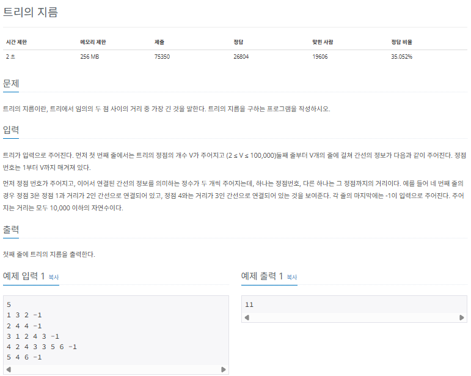

### $[01단계]$ 문제 분석하기

가장 긴 경로를 찾는 방법과 관련된 아이디어가 필요한 문제입니다. 아이디어는 다음과 같습니다.

> 가장 긴 경로 찾기 아이디어

- 아이디어 임의의 노드에서 가장 긴 경로로 연결된 노드는 트리의 지름에 해당하는 두 노드 중 하나이다.

이 아이디어를 바탕으로 문제를 풀어보겠습니다.

### $[02단계]$ 손으로 풀어보기

1. 그래프를 인접 리스트로 저장합니다. 이때 그림에서 알 수 있듯이 (노드,가중치)를 표현하기 위해 노드는 벡터로 선언합니다.

```
[1] -> [(3,2)]
[2] -> [(4,4)]
[3] -> [(1,2)][(4,3)]
[4] -> [(2,4)][(3,3)][(5,6)]
[5] -> [(4,6)]
```

2. 임의의 노드에서 BFS를 수행하고 탐색할 때 각 노드의 거리를 배열에 저장합니다. 여기에서는 임의의 노드 중 노드 2에서 탐색을 시작하는 경우를 살펴보겠습니다.


그림을 보면 2에서 출발하므로 distance[2]는 0입니다. 2는 4와 연결되어 있으므로 4를 방문합니다. 2와 4의 거리는 4이므로 distance[4]에 현재 노드의 거리 + 에지 길이, 즉, distance[2] + 4를 기록합니다. 그 결과 distance[4]에는 4가 기록됩니다. 이어서 4는 2,3,5와 연결되어 있습니다. 그런데 2는 방문했으므로 3과 5를 방문합니다. 4에서 3으로 향하는 에지 길이는 3이므로 distance[3]에 distance[4] + 3을 기록합니다. 그 결과 distance[3]에는 7이 기록됩니다. 이런 방식으로 노드를 방문하며 거리 배열을 업데이트 합니다.

3. 과정 2에서 얻은 배열에서 임의의 노드와 가장 먼 노드를 찾습니다. 그런 다음 그 노드부터 BFS를 다시 수행합니다. 마찬가지로 탐색할 때 각 노드의 거리를 배열에 저장합니다. 지금은 distance[5]가 가장 크므로 5부터 BFS를 다시 수행합니다.

distance 업데이트 방식은 과정 2와 같습니다.

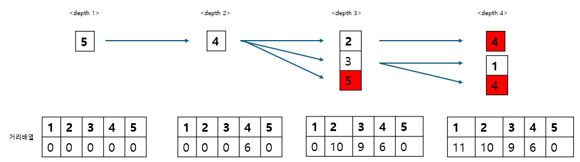

4. 과정 3에서 거리 배열에 저장한 값 중 가장 큰 값을 이 트리의 지름으로 출력합니다.

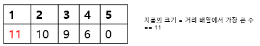

### $[03단계]$ 슈도코드 작성하기

```
edge (에지 데이터를 표현하는 pair 변수 -> 목적 노드, 거리 표현을 위해 사용)
N (노드 개수)
A (그래프 데이터 저장 인접 리스트)
visited (방문 기록 저장 배열)
m_distance (거리 저장 배열)
인접 리스트 A 크기 초기화

for (N의 개수만큼 반복) {
  인접 리스트 A에 그래프 데이터 저장
}

visited 배열 초기화
m_distance 배열 초기화

BFS(임의의 점을 시작점으로) 실행

m_distance 배열에서 가장 큰 값을 가지는 노드를 시작점으로 지정
visited 배열 초기화
m_distance 배열 초기화
BFS(새로운 시작점으로) 실행
distance 배열에서 가장 큰 수를 정답으로 출력
```

### $[04단계]$ 코드 구현하기

```c
#include <iostream>
#include <vector>
#include <algorithm>
#include <queue>
using namespace std;

typedef pair<int, int> edge;
static vector<vector<edge> > A;
static vector<bool> visited;
static vector<int> m_distance;

void BFS(int index);

int main(int argc, char *argv[]) {
    int N;
    cin >> N;
    A.resize(N + 1);

    for (int i = 0; i < N; i++) {
        int S;
        cin >> S;
        while (true) {
            int E, V;
            cin >> E;
            if (E == -1)
                break;
            cin >> V;
            A[S].push_back(edge(E, V));
        }
    }

    m_distance = vector<int>(N + 1, 0);
    visited = vector<bool>(N + 1, false);
    BFS(1);
    int Max = 1;

    for (int i = 2; i <= N; i++) {
        if (m_distance[Max] < m_distance[i]) {
            Max = i;
        }
    }
    fill(m_distance.begin(), m_distance.end(), 0);
    fill(visited.begin(), visited.end(), false);
    BFS(Max); // 거리 배열에서 가장 큰 값을 다시 시작점으로 지정
    sort(m_distance.begin(), m_distance.end());
    cout << m_distance[N] << "\n";
}

void BFS(int index) {
    queue<int> myqueue;
    myqueue.push(index);
    visited[index] = true;

    while (!myqueue.empty()) {
        int now_node = myqueue.front();
        myqueue.pop();
        for (edge i: A[now_node]) {
            if (!visited[i.first]) {
                visited[i.first] = true;
                myqueue.push(i.first);
                // 거리 배열 업데이트
                m_distance[i.first] = m_distance[now_node] + i.second;
            }
        }
    }
}
```
