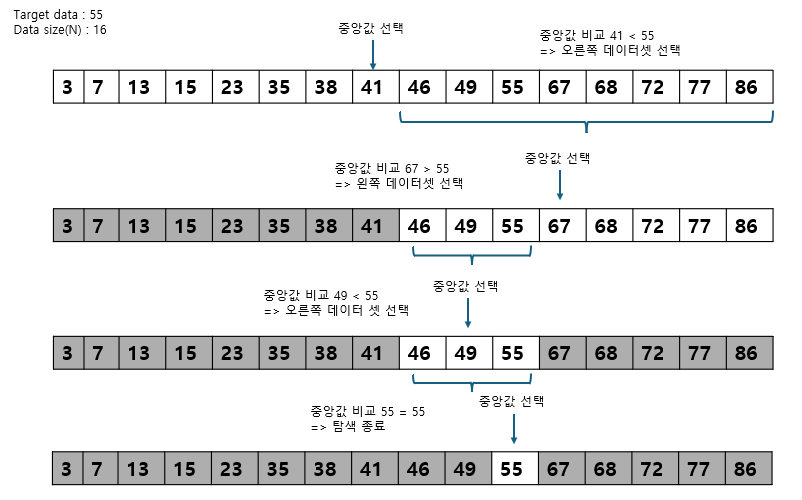
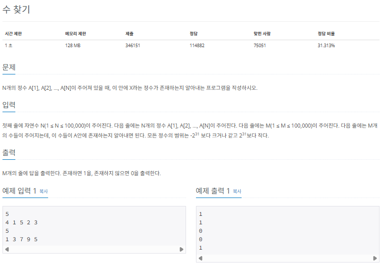
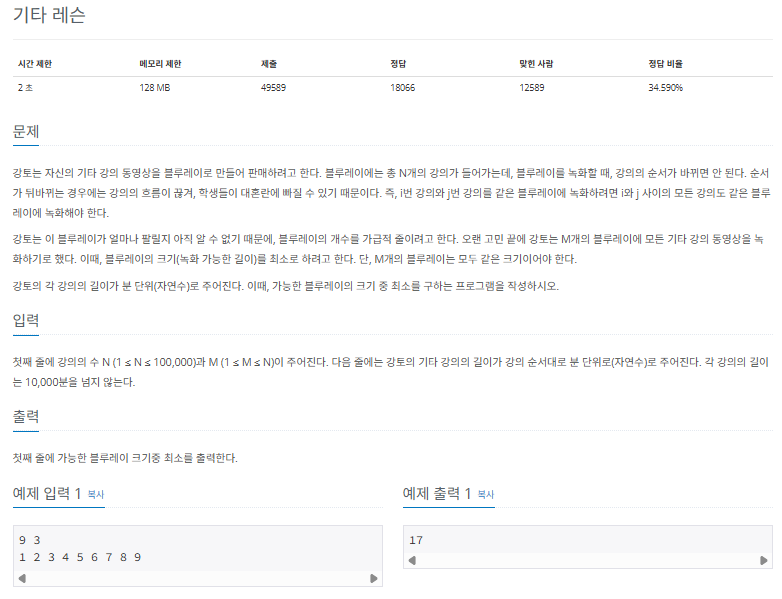
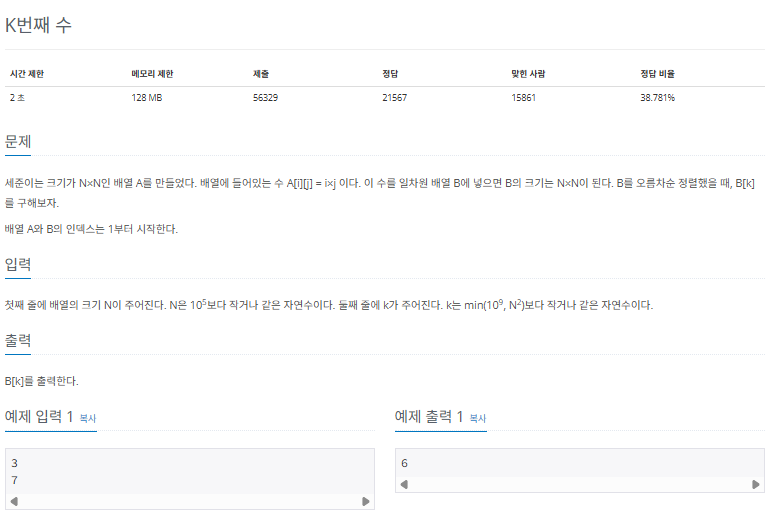
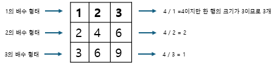
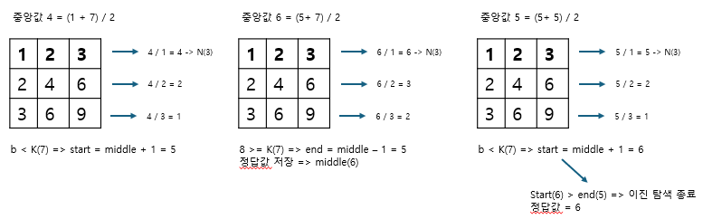

## 이진 탐색

이진 탐색 (binary search)는 데이터가 정렬된 상태에서 원하는 값을 찾아내는 알고리즘입니다. 대상 데이터의 중앙값과 찾고자 하는 값을 비교해 데이터의 크기를 절반씩 줄이면서 대상을 찾습니ㅏㄷ.

|       기능       | 특징                                | 시간 복잡도(N: 분기 수, d: 탐색 길이) |
| :--------------: | :---------------------------------- | :-----------------------------------: |
| 타깃 데이터 탐색 | 중앙값 비교를 이용한 대상 축소 방식 |               $O(logN)$               |

이진 탐색은 정렬 데이터에서 원하는 데이터를 탐색할 때 사용하는 가장 일반적인 알고리즘입니다. 구현 및 원리가 비교적 간단하므로 많은 코딩 테스트에서 부분 문제로 요구하는 영역입니다.

### 이진 탐색의 핵심 이론

이진 탐색은 오름차순으로 정렬된 데이터에서 다음 4가지 과정을 반복합니다.

> 이진 탐색 과정

1. 현재 데이터셋의 중앙값(median)을 선택한다.
2. 중앙값 > 타깃 데이터(target data)일 때 중앙값 기준으로 왼쪽 데이터셋을 선택한다.
3. 중앙값 < 타깃 데이터(target data)일 때 중앙값 기준으로 오른쪽 데이터셋을 선택한다.
4. 과정 1 ~ 3 을 반복하다가 중앙값 === 타깃 데이터일 때 탐식을 종료한다.

좀 더 자세히 알아보겠습니다. 총 16개의 데이터가 있는 데이터셋에서 값이 55인 데이터를 찾는 과정입니다.



이렇게 이진 탐색을 사용하면 N개의 데이터에서 logN번의 연산으로 원하는 데이터의 위치를 찾을 수 있습니다. 예를 들어 16개의 데이터면 최대 4번의 연산으로 원하는 데이터의 위치를 찾을 수 잇습니다. 다만 이진 탐색은 데이터가 정렬되어 있어야 합니다. 이런 특징을 잘 염두에 두고 문제를 풀어봅시다.

### $[문제032]$ 원하는 정수 찾기



### $[01단계]$ 문제 분석하기

N의 최대 범위가 100,000 이므로 단순 반복문으로는 이 문제를 풀 수 없습니다. 이진 탐색을 적용하면 데이터 정렬까지 고려하여 O(nlogn)시간 복잡도로 해결할 수 있으므로 이진 탐색을 적용합시다. 앞에서 언급했듯이 이진 탐색은 정렬을 가정하므로 정렬 함수도 사용합니다.

### $[03단계]$ 슈도코드 작성하기

```
N (정렬할 수 개수), M(탐색할 숫자의 개수)
A (정렬할 배열)

for (N의 개수만큼 반복) {
  배열 A 저장
}
배열 A 정렬

for (M의 개수만큼 반복) {
  target (찾아야 하는 수)

  // 이진 탐색 시작
  start (시작 인덱스)
  end   (종료 인덱스)

  while (시작 인덱스 <= 종료 인덱스) {
      midi (중간 인덱스)
      midv (중간 인덱스에 있는 값)

      if (중간값 > target) {
        종료 인덱스 = 중간 인덱스 - 1
      }
      else if (중간값 < target) {
        시작 인덱스 = 중간 인덱스 + 1
      }
      else {
        찾았으므로 반복문 종료
      }
  }

  if (찾았음) 1 출력
  else 0 출력
}
```

### $[04단계]$ 코드 구현하기

```c
#include <iostream>
#include <vector>
#include <algorithm>
using namespace std;

int main(int argc, char *argv[]) {
    int N, M;
    cin >> N;
    vector<int> A(N);

    for (int i = 0; i < N; i++) {
        cin >> A[i];
    }
    // 배열 A 정렬 시간 복잡도 : O(nlogn)
    sort(A.begin(), A.end());
    cin >> M;

    for (int i = 0; i < M; i++) {
        bool find = false;
        int target;
        cin >> target;

        // --- 이진 탐색 시작
        int start = 0;
        int end = A.size() - 1;

        while (start <= end) {
            int midi = (start + end) / 2;
            int midV = A[midi];

            if (midV > target) {
                end = midi - 1;
            } else if (midV < target) {
                start = midi + 1;
            } else {
                find = true;
                break;
            }
        }
        // ---

        if (find)
            cout << 1 << "\n";
        else
            cout << 0 << "\n";
    }
}
```

### $[문제033]$ 블루레이 만들기



### $[01단계]$ 문제 분석하기

블루레이의 크기가 모두 같고 녹화 순서가 바뀌지 않아야 함이라는 문제 조건이 이진 탐색 알고리즘을 선택하게 하는 실마리입니다. 블루레이에 첫 레슨부터 마지막 레슨까지 차례대로 저장하다 보면 지정한 블루레이 크기로 모든 레슨을 저장할 수 있는지 판단할 수 있기 때문입니다. 모두 저장할 수 있다면 블루레이 크기를 줄이고 저장할 수 없다면 블루레이 크기를 늘리는 방식으로 블루레이 크기의 최솟값을 알 수 있습니다.

### $[02단계]$ 손으로 풀어보기

1. 이진 탐색의 시작 인덱스는 최대 길이의 레슨이고 종료 인덱스는 모든 레슨 길이의 합입니다. 총 9개로 구성된 레슨의 시간은 각각 1,2,3,4,5,6,7,8,9이므로 이진 탐색의 시작 인덱스는 최대 레슨 시간인 9, 종료 인덱스는 레슨 시간을 모두 합한 45입니다. 블루레이 개수가 3일 때 9 ~ 45사이에서 블루레이 크기의 최솟값을 이진탐색으로 찾으면 됩니다.

2. 9 ~ 45 사이에서 이진 탐색을 다음과 같이 수행합니다. 이진 탐색은 시작 인덱스 > 종료 인덱스일 때까지 수행합니다.

> 이진 탐색 수행

1. 중앙값 크기로 모든 레슨을 저장할 수 있으면 종료 인덱스 = 중앙값 - 1 // 왼쪽 데이터셋
2. 중앙값 크기로 모든 레슨을 저장할 수 없으면 시작 인덱스 = 중앙값 + 1 // 오른쪽 데이터셋

### $[03단계]$ 코드 구현하기

```c
#include <iostream>
#include <vector>
using namespace std;

int main(int argc, char *argv[]) {
    int N, M;
    cin >> N >> M;
    vector<int> A(N);
    int start = 0;
    int end = 0;

    for (int i = 0; i < N; i++) {
        cin >> A[i];
        if (start < A[i]) {
            start = A[i]; // 레슨 최댓값을 시작 인덱스로 저장
        }
        end = end + A[i]; // 모든 레슨의 총합을 종료 인덱스로 저장
    }

    while (start <= end) {
        int middle = (start + end) / 2;
        int sum = 0;
        int count = 0;

        // middle 값으로 모든 레슨을 저장할 수 있는지 확인
        for (int i = 0; i < N; i++) {
            if (sum + A[i] > middle) {
                count++;
                sum = 0;
            }
            sum = sum + A[i];
        }

        if (sum != 0) {
            count++;
        }
        if (count > M) {
            start = middle + 1;
        } else {
            end = middle - 1;
        }
    }
    cout << start << "\n";
}
```

### $[문제034]$ 배열에서 K번째 수 찾기



### $[01단계]$ 문제 분석하기

k의 범위가 1~min($10^9$ , $N^2$)이므로 시간 복잡도가 $N^2$인 알고리즘은 사용할 수 없습니다. 여기서는 이진 탐색을 사용합니다. 이진 탐색으로 중앙값보다 작은 수의 개수를 세면서 범위를 절반씩 줄이는 방법으로 B[k]값을 구합니다. 다시말해 작은 수의 개수가 k-1개인 중앙값이 정답입니다. 작은 수의 개수를 세는 아이디어가 이 문제를 푸는 열쇠입니다.

### $[02단계]$ 손으로 풀어보기

2차원 배열은 N행이 N의 배수로 구성되어 있으므로 2차원배열에서의 k번째 수는 k를 넘지 않습니다. 다시 말해 2차원 배열의 1 ~ k번째 안에 정답이 있습니다. 이점에 주목하여 이진탐색의 시작 인덱스를 1, 종료 인덱스를 k로 지정합니다. 다음은 N = 3, k = 7일때를 예로 든것입니다.



최초의 중앙값은 4입니다. 각 행에서 중앙값보다 작거나 같은 수의 개수는 그림에서 알 수 있듯이 중앙값을 각 행의 첫번째 값으로 나눈 값입니다. 단, 나눈 값이 N보다 크면 N으로 정합니다. 1열은 1로 나눠 4,2 열은 2로 나눠 2,3 열은 3으로 나눠 1을 얻습니다. 그 겨로가 각 열에서 중앙값 4보다 작거나 같은 수의 개수는 3,2,1로 6개가 됩니다. 중앙값보다 작거나 같은 수의 개수는 min(middle / i,N)으로 계산합니다. 그리고 이를 통해 중앙값 4는 6번째 수보다 큰 수가 될 수 없다는 것을 알 수 있으며, 중앙값 4보다는 큰 범위에 정답이 있다는 것을 유추할 수 있습니다

정리하면 중앙값보다 작은 수의 개수가 k보다 작으면 시작 인덱스를 중앙값 + 1, 중앙값보다 작은 수의 개수가 k보다 크거나 같으면 종료 인덱스를 중앙값 - 1로 하면서 정답을 중앙값으로 업데이트하며 시작 인덱스가 종료 인덱스보다 커질 때까지 이진 탐색을 진행합니다.

> 이진 탐색 조건

1. 중앙값 보다 작은 수의 개수가 K보다 작으면 시작 인덱스 = 중앙값 + 1
2. 중앙값 보다 작은 수의 개수가 K보다 크거나 같으면 종료 인덱스 = 중앙값 - 1, 정답 변수 = 중앙값

이제 문제를 풀어 봅시다.



위 그림은 N = 3, k = 7을 찾는 과정을 보여 줍니다. 1번째 중앙값은 4이며 4보다 작거나 같은 수의 개수는 6(k보다 작음)이므로 시작 인덱스를 중앙값 + 1 = 5, 종료 인덱스를 7로 하고 정답 업데이트는 하지 않습니다. 계속해서 이진 탐색을 진행합니다.

2번째 중앙값은 6이며 6보다 작거나 같은 수의 개수는 8(k보다 크거나 같음)이므로 시작 인덱스를 5, 종료 인덱스를 중앙값 - 1 = 5로 하고 정답을 6으로 업데이트합니다. 아직 시작 인덱스가 종료 인덱스보다 크지 않으므로 계속해서 이진탐색을 진행합니다.

3번째 중앙값은 5이며 5보다 작거나 같은 수의 개수는 6(k보다 작음)이므로 시작 인덱스를 중앙값 + 1 = 6, 종료 인덱스를 5로 합니다. 시작 인덱스가 종료 인덱스보다 크므로 이진 탐색을 종료합니다. 이 과정에서 업데이트한 정답은 6이므로 정답은 6이 됩니다.

### $[03단계]$ 슈됴코드 작성하기

```
N(배열의 크기)
K(구하고자 하는 index)
start(시작 인덱스 = 1)
end (종료 인덱스 = K)

// 이진 탐색 수행
while(시작 인덱스 <= 종료 인덱스) {
  middle (중앙 인덱스)
  cnt (중앙값보다 작은 수의 개수)

  // 중앙값보다 작은 수는 몇 개인지 계산
  for (N의 개수만큼 반복) {
    cnt에 중앙 인덱스를 i로 나눈 값과 N중 작은 값 더하기
  }
  // 현재 중앙값보다 작은 수의 개수가 K보다 작음
  if (cnt  K) {
      시작 인덱스 = 중앙 인덱스 + 1
  }
  else {
      종료 인덱스 = 중앙 인덱스 - 1
      정답 변수에 중앙값 저장
  }
}

정답 출력
```

### $[04단계]$ 코드 구현하기

```c
#include <iostream>
using namespace std;

int main(int argc, char *argv[]) {
    long N, K;
    cin >> N >> K;
    long start = 1, end = K;
    long ans = 0;

    // 이진 탐색 수행
    while (start <= end) {
        long middle = (start + end) / 2;
        long cnt = 0;

        // 중앙값보다 작은 수는 몇개인지 계산
        for (int i = 1; i <= N; i++) {
            cnt += min(middle / i, N);
        }

        if (cnt < K) {
            start = middle + 1;
        }
        else {
            ans = middle; // 현재 단계의 중앙값을 정답 변수에 저장
            end = middle - 1;
        }
    }
    cout << ans << "\n";
}
```
