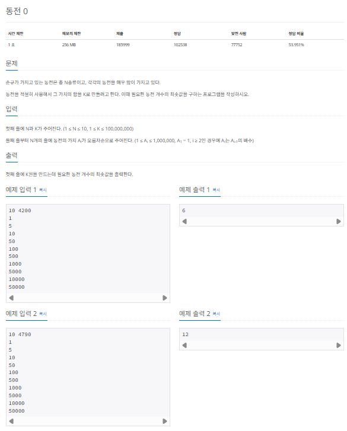
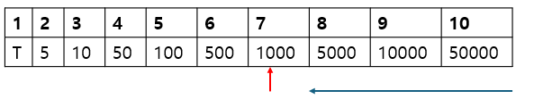
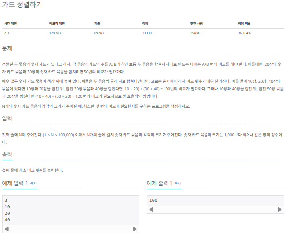
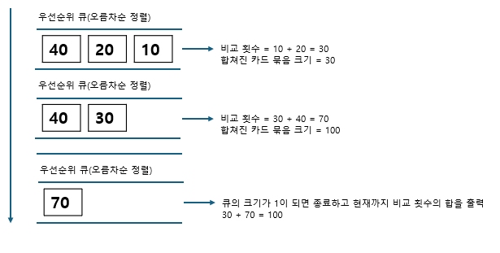
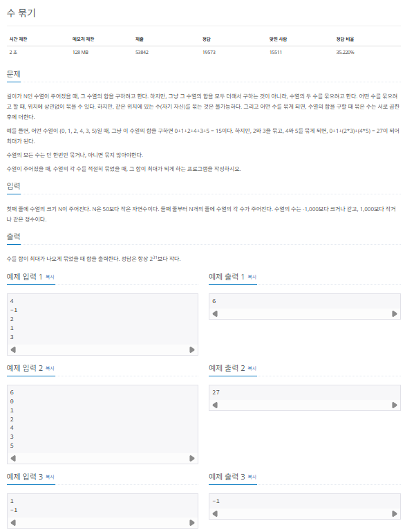
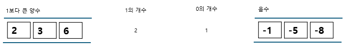
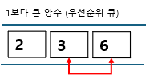
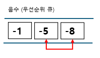

## 그리디 알고리즘

기르디 (greedy)알고리즘은 현재 상태에서 보는 선택지 중 최선의 선택지가 전체 선택지 중 최선의 선택지라고 가정하는 알고리즘입니다.

### 그리디 알고리즘의 핵심 이론

그리디 알고리즘은 다음과 같은 3단계를 반복하면서 문제를 해결합니다.

> 그리디 알고리즘 수행 과정

1. 해 선택
   1. 현재 상태에서 가장 최선이라고 생각되는 해를 선택한다.
2. 적절성 검사
   1. 현재 선택한 해가 전체 문제의 제약 조건에 벗어나지 않는지 검사한다.
3. 해 검사
   1. 현재까지 선택한 해 집합이 전체 문제를 해결할 수 있는지 검사한다. 전체 문제를 해결하지 못한다면 1로 돌아가 같은 과정을 반복한다.

### $[문제035]$ 동전 개수의 최솟값 구하기



### $[01단계]$ 문제 분석하기

전형적인 그리디 알고리즘 문제입니다. 이 문제는 그리디 알고리즘으로 풀 수 있도록 뒤의 동적 가격 $A_i$가 앞에 나오는 동적 가격 $A_i$$_-$$_1$의 배수가 된다는 조건을 부여했스비다. 즉, 동전을 최소로 사용하여 K를 만들기 ㅜ이해서는 가장 가격이 큰 동전부터 차례대로 사용하면 됩니다.

### $[02단계]$ 손으로 풀어보기

1. 가격이 큰 동전부터 내림차순으로 K보다 가격이 작거나 같은 동전이 나올 때까지 탐색합니다.



2. 탐색을 멈춘 동전의 가격으로 K를 나눠 몫은 동전 개수에 더하고, 나머지 K값으로 갱신합니다.

```
4200 / 1000 = 4 => 동전 개수 4개 추가
4200 % 1000 = 200 => K = 200
```

3. 과정 1 ~ 2를 나머지 0이 될 때까지 반복합니다.

```
200 / 100 = 2 => 동전 개수 2개 추가
200 % 100 = 0 => K = 0
탐색을 종료하고 현재까지 나온 동전 개수를 출력 = 4 + 2 = 6
```

### $[02단계]$ 슈도코드 작성하기

```
N (동전 개수), K(목표 금액)
A (동전 데잍 배열)

for (N만큼 반복) {
  배열 A 저장
}

// 가치가 큰 동전부터 선택해야 개수를 최소로 구성할 수 있음
for (N 만큼 반복 i --) {
  if (현재 K보다 동전 가치가 작으면) {
    동전 수 += 목표 금액 / 현재 동전 가치
    목표 금액 = 목표 금액 % 현재 동전 가치
  }
}
```

### $[03단계]$ 코드 구현하기

```c
#include <iostream>
#include <vector>
using namespace std;

int main(int argc, char *argv[]) {
    int N, K;
    cin >> N >> K;
    vector<int> A(N);

    for (int i = 0; i < N; i++) {
        cin >> A[i];
    }

    int count = 0;

    for (int i = N - 1; i >= 0; i--) {
        // 현재 동전의 가치가 K보다 작거나 같으면 구성에 추가
        if (A[i] <= K) {
            count += (K / A[i]);
            K = K % A[i]; // K를 현재 동전을 사용하고 남은 금액으로 갱신
        }
    }

    cout << count << "\n";
}
```

### $[문제036]$ 카드 정렬하기



### $[01단계]$ 문제 분석하기

잘 생각하면 먼저 선택된 카드 묶음이 비교 횟수에 더 많은 영향을 미치는 것을 알 수 있습니다. 따라서 카드 묶음의 카드의 개수가 작은 순서대로 먼저 합치는 것이 전체 비교 횟수를 줄일 수 있는 방법입니다.

현재 데이터 중 가장 작은 카드의 개수를 가진 묶음 2개를 뽑아야 하고, 이 2개를 기준으로 합친 새로운 카드 묶음을 다시 데이터에 넣고 정렬해야 합니다. 즉, 데이터의 삽입 삭제, 정렬이 자주 일어난다는 뜻입니다. 따라서 이 문제는 우선순위 큐를 이용해야 합니다.

### $[02단계]$ 손으로 풀어보기

1. 현재 카드의 개수가 가장 작은 묶음 2개를 선택해 합칩니다.
2. 합친 카드 묶음을 다시 저체 카드 묶음 속에 넣습니다.
3. 과정 1 ~ 2를 카드 묶음이 1개만 남을 때까지 반복합니다.



### $[02단계]$ 슈도코드 작성하기

```
N (카드 묶음 개수)
pq (우선순위 큐) // 오름차순 정렬

for (N만큼 반복) {
  우선순위 큐에 데이터 저장
}

// 자동 정렬에 따라 작은 카드 묶음 2개를 쉽게 뽑을 수 있음
while (우선순위 큐 크기가 1이 될 때까지) {
  2개 카드 묶음을 큐에서 뽑음
  2개 카드 묶음을 합치는 데 필요한 비교 횟수를 결괏값에 더함
  2개 카드 묶음의 합을 우선순위 큐에 다시 넣음
}

누적된 비교 횟수 출력
```

### $[03단계]$ 코드 구현하기

```c
#include <iostream>
#include <vector>
#include <queue>
using namespace std;

int main(int argc, char *argv[]) {
    int N;
    cin >> N;
    priority_queue<int, vector<int>, greater<int> > pq; // 오름차순 정렬
    int data;

    for (int i = 0; i < N; i++) {
        cin >> data;
        pq.push(data);
    }

    int data1 = 0;
    int data2 = 0;
    int sum = 0;

    while (pq.size() != 1) {
        data1 = pq.top();
        pq.pop();
        data2 = pq.top();
        pq.pop();
        sum += data1 + data2;
        pq.push(data1 + data2);
    }

    cout << sum << "\n";
}
```

### $[문제037]$ 수를 묶어서 최댓값 만들기



### $[01단계]$ 문제 분석하기

N의 최대 범위가 50이므로 시간 복잡도와 관련된 제약은 적은 문제입니다. 무넺의 내용에 집중해 아이디어를 생각해 봅시다. 가능한 한 큰 수들끼리 묶어야 결괏값이 커진다는 것을 알 수 있습니다. 주어진 수열이 1,2,3,4라면 1 _ 4 + 2 _ 3 보다 1 _ 2 + 3 _ 4의 결괏값이 더 큽니다. 또한 음수끼리 곱하면 양수로 변하는 성질을 추가로 고려해 문제를 풀어보겠습니다.

> 해당 부분도 우선순위 큐를 사용합니다.

### $[02단계]$ 손으로 풀어보기

1. 수의 집합을 1보다 큰 수, 1, 0, 음수 이렇게 4가지 유형으로 나눠 저장합니다.



2. 1보다 큰 수의 집합을 정렬해 최댓값부터 차례대로 곱한 후 더합니다. 원소의 개수가 홀수일 때 마지막 남은 수는 그대로 더합니다.



> 2 + (3 \* 6) = 20

3. 음수의 집합을 정렬해 최솟값부터 차례대로 곱한 후에 더합니다. 원소의 개수가 홀수일 때 수열에 0이 있다면 1개 남은 음수를 0과 곱해 0을 만들고, 수열에 0이 없다면 그대로 더합니다.



> (0 _ (-1) + (-5) _ (-8)) = 40

4. 과정 2 ~ 3에서 구한 값을 더하고, 그 값에 숫자 1의 개수를 더합니다.

```
20 + 40 + 2 = 62
```

### $[02단계]$ 슈도코드 작성하기

```
N (수열의 크기)
plushPq (양수 우선순위 큐)
minusPq (음수 우선순위 큐)
one (1의 개수 카운트)
zero (0의 개수 카운트)

for (N만큼 반복) {
  데이터를 4개의 그룹에 분리 저장
}

// 양수 처리
while (양수 우선순위 큐 크기가 2보다 작을 때까지) {
  수 2개를 큐에서 뽑은 (remove 연산)
  두 개의 수를 곱한 값을 결과값에 더함
}
양수 우선순위 큐에 데이터가 남아 있으면 해당 데이터를 결괏값에 더함

// 음수 처리
while (음수 우선순위 큐 크기가 2보다 작을 때까지) {
  수 2개를 큐에서 뽑은 (remove 연산)
  두 개의 수를 곱한 값을 결과값에 더함
}
음수 우선순위 큐에 데이터가 남아있고 0 데이터가 하나도 없으면 해당 데이터를 결과값에 더함

// 1처리
1의 숫자 개수를 결괏값에 더함

결과값 출력
```

### $[03단계]$ 코드 구현하기

```c
#include <iostream>
#include <vector>
#include <queue>
using namespace std;

int main(int argc, char *argv[]) {
    int N;
    cin >> N;

    priority_queue<int> plusPq;
    priority_queue<int, vector<int>, greater<int> > minusPq;
    int one = 0;
    int zero = 0;

    for (int i = 0; i < N; i++) {
        int data;
        cin >> data;
        if (data > 1) {
            plusPq.push(data);
        } else if (data == 1) {
            one++;
        } else if (data == 0) {
            zero++;
        } else {
            minusPq.push(data);
        }
    }

    int sum = 0;

    // 양수 처리
    while (plusPq.size() > 1) {
        int first = plusPq.top();
        plusPq.pop();
        int second = plusPq.top();
        plusPq.pop();
        sum = sum + first * second;
    }
    if (!plusPq.empty()) {
        sum = sum + plusPq.top();
        plusPq.pop();
    }

    // 음수 처리
    while (minusPq.size() > 1) {
        int first = minusPq.top();
        minusPq.pop();
        int second = minusPq.top();
        minusPq.pop();
        sum = sum + first * second;
    }
    if (!minusPq.empty()) {
        if (zero == 0) {
            sum = sum + minusPq.top();
            minusPq.pop();
        }
    }

    // 1 처리
    sum = sum + one;
    cout << sum << "\n";
}
```
