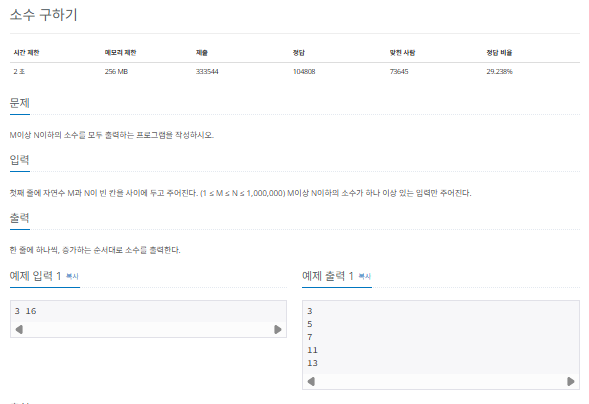
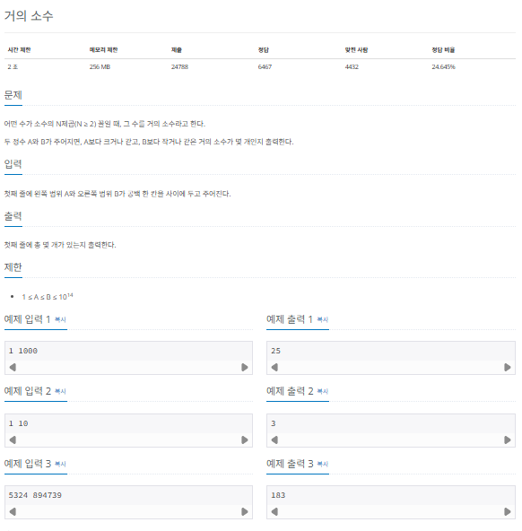

## 소수 구하기 (에라토스테네스의 체)

소수 (prime number)는 자신보다 작은 2개의 자연수를 곱해 만들 수 없는 1보다 큰 자연수입니다. 다시 말해, 1과 자기 자신 외에 약수가 존재하지 않는 수를 말합니다. 코딩 테스트에서는 이러한 소수를 판별하는 방식을 묻는 소수 구하기 문제가 종종 출제됩니다.

### 소수 구하기 핵심 이론

소수를 구하는 대표적인 판별법으로는 에라토스테네스의 체를 들 수 있습니다. 에라토스테네스의 체 원리는 다음과 같습니다.

> 에라토스테네스의 체 원리

1. 구하고자 하는 소수의 범위만큼 1차원 배열을 생성한다.
2. 2부터 시작해서 현재 선택한 숫자가 지워지지 않은 숫자라면 해당 숫자의 배수에 해당하는 수를 배열에서 끝까지 탐색하면서 지운다. 이때 처음으로 선택한 숫자는 지우지 않는다.
3. 배열의 끝까지 과정 2을 반복한 후에 배열에 남은 모든 수를 출력한다.

### 에라토스테네스의 체 원리 이해하기

1부터 30까지의 수 중 소수를 구하는 예시를 보면서 에라토스테네스의 체 원리를 알아보겠습니다.

1. 먼저 주어진 범위까지 배열을 생성합니다. 1은 소수가 아니므로 삭제하고, 배열은 2부터 시작합니다.

```
선택 : [2]

[1][2][3][4][5][6][7][8][9][10][11][12][13][14][15]
[16][17][18][19][20][21][22][23][24][25][26][27][28][29][30]
```

2. 선택한 수의 배수를 모두 삭제합니다. 현재의 경우 2의 배수를 모두 삭제합니다.

```
[x][2][3][x][5][x][7][x][9][x][11][x][13][x][15]
[x][17][x][19][x][21][x][23][x][25][x][27][x][29][x]
```

3. 다음 지워지지 않은 수를 선택합니다. 즉, 3을 선택하고 선택한 수의 모든 배수를 삭제합니다. 이미 지운 수는 다시 지우지 않습니다.

```
[x][2][3][x][5][x][7][x][x][x][11][x][13][x][x]
[x][17][x][19][x][x][x][23][x][25][x][x][x][29][x]
```

4. 앞의 과정을 배열의 끝까지 반복합니다.

```
[x][2][3][x][5][x][7][x][x][x][11][x][13][x][x]
[x][17][x][19][x][x][x][23][x][x][x][x][x][29][x]
```

5. 삭제 되지 않은 수를 모두 출력합니다.

즉, 1부터 30까지의 수 중 소수는 2,3,5,7,11,13,17,19,23,29 입니다.

> 에라토스테네스의 체를 사용할 때 시간 복잡도는?

일반적으로 에라토스테네스의 체를 구현하려면 이중 for문을 이용하므로 시간 복잡도가 $O(N^2)$정도라고 판단할 수 있습니다. 하지만 실제 시간 복잡도는 최적화 정도에 따라 다르겠지만, 일반적으로 $O(Nlog(logN))$입니다.

그 이유는 배수를 삭제하는 연산으로 실제 구현에서 바깥쪽 for문을 생략하는 경우가 빈번하게 발생하기 때문입니다. 이러한 이유 때문에 에라토스테네스의 체 기법은 현재에도 코딩 테스트에서 소수를 구하는 일반적인 방법으로 통용되고 있습니다.

### $[문제040]$ 소수 구하기



### $[01단계]$ 문제 분석하기

숫자 사이에 소수를 출력하는 문제입니다. N의 최대 범위가 1,000,000이므로 일반적인 소수 구하기 방식으로 문제를 풀면 시간 초과가 발생합니다. 따라서 앞서 배운 에라토스테네스 방법으로 문제를 풀어야 합니다.

### $[02단계]$ 손으로 풀어보기

1. 크기가 N + 1인 배열을 선언한 후 값은 각각의 인덱스값으로 채웁니다. 소수 구하기에서는 0번째 배열을 사용하지 않아 다음 그림에서는 0번째 배열이 생략되어 있습니다.

```
[1][2][3][4][5][6][7][8][9][10][11][12][13][14][15][16]
```

2. 1은 소수가 아니므로 삭제합니다.

```
[x][2][3][4][5][6][7][8][9][10][11][12][13][14][15][16]
```

3. 2부터 N의 제곱근까지 값을 탐색합니다. 값이 인덱스값이면 그대로 두고, 그 값의 배수를 탐색해 0으로 변경합니다.

```
2 : [x][2][3][x][5][x][7][x][9][x][11][x][13][x][15][x]
3 : [x][2][3][x][5][x][7][x][x][x][11][x][13][x][x][x]
```

4. 배열에 남아 있는 수 중 M이상 N 이하의 수를 모두 출력합니다.

```
[x][2][3][x][5][x][7][x][x][x][11][x][13][x][x][x]

2, 3, 5, 7, 11, 13
```

> N의 제곱근까지만 탐색하는 이유

N의 제곱근이 n일 시 N = a \* b를 만족하는 a와 b가 둘 다 n보다 클 수 없습니다. a가 n보다 크다면 b는 n보다 작아야 합니다. 즉, N보다 작은 수 가운데 소수가 아닌 수는 항상 n보다 작은 약수를 가집니다. 따라서 에라토스테네스의 체로 n이하의 수의 배수를 모두 제거하면 1부터 N 사이의 소수를 구할 수 있습니다.

### $[02단계]$ 슈도코드 작성하기

```
N (시작 수)
M (종료 수)
A (소수 판별 배열)

for (N만큼 반복) {
  배열 A 초기화 // 각각의 인덱스 값으로 초기화
}

for (N제곱근까지 반복) {
  소수가 아니면 넘어감
  for (소수의 배수 값을 N까지 반복) {
    해당 수가 소수가 아님을 표시
  }
}
for (M ~ N까지 반복) {
  배열 A에서 소수 값 출력
}
```

### $[03단계]$ 코드 구현하기

```c
#include <iostream>
#include <vector>
#include <cmath>
using namespace std;

int main(int argc, char *argv[]) {
    int M, N;
    cin >> M >> N;
    vector<int> A(N + 1);

    for (int i = 2; i <= N; i++) {
        A[i] = i;
    }

    // --- 에라토스테네스의 체 시작
    // 제곱근까지만 수행
    for (int i = 2; i <= sqrt(N); i++) {
        if (A[i] == 0) {
            continue;
        }
        // 배수 지우기
        for (int j = i + i; j <= N; j = j + i) {
            A[j] = 0;
        }
    }
    // ---

    for (int i = M; i <= N; i++) {
        if (A[i] != 0) {
            cout << A[i] << "\n";
        }
    }
    return 0;
}
```

### $[문제041]$ 거의 소수 구하기



### $[01단계]$ 문제 분석하기

최대 범위에 해당하는 모든 소수를 구해 놓고, 이 소수들의 N제곱값이 입력된 A와 B사이에 존재하는지 판단해 문제를 해결할 수 있습니다. N >= 2 이므로 입력에서 주어진 범위의 최댓값인 $10^1$$^4$의 제곱근인 $10^7$까지 소수를 탐색해야 합니다. 에라토스테네스의 체를 이용해 빠르게소수를 먼저 구합니다. 그 이후에는 주어진 소수들의 N제곱값이 A ~ B 범위 안에 존재하는지 판별해 유효한 소수의 개수를 세면 이 문제를 해결할 수 있습니다.

### $[03단계]$ 코드 구현하기

```c
#include <iostream>
#include <cmath>
using namespace std;

#define Tbsv 10000001

int main(int argc, char *argv[]) {

    long Min, Max;
    cin >> Min >> Max;
    long A[Tbsv];

    for (int i = 2; i < Tbsv; i++) {
        A[i] = i;
    }
    for (int i = 2; i <= sqrt(Tbsv); i++) {
        if (A[i] == 0)
            continue;
        for (int j = i + i; j <= Tbsv; j += i) {
            A[j] = 0;
        }
    }

    int count = 0;

    for (int i = 2; i < Tbsv; i++) {
        if (A[i] != 0) {
            long temp = A[i];

            while ((double) A[i] <= (double) Max / (double) temp) {
                if ((double) A[i] >= (double) Min / (double) temp) {
                    count++;
                }
                temp = temp * A[i];
            }
        }
    }

    cout << count << "\n";

    return 0;
}
```

### $[문제041]$ 소수 & 팰린드롬 수 중에서 최솟값 찾기


### $[01단계]$ 문제 분석하기

에라토스테네스의 체를 이용해 최대 범위에 해당하는 모든 소수를 구해 놓은 후 이 소수들의 집합에서 N보다 크거나 같으면서 팰린드롬 수인 것을 찾아내면 되는 문제입니다. 앞에서 배웠던 두 문제와 매우 비슷하므로 답을 쉽게 구할 수 있습니다.

단, 팰린드롬 수를 판별할 때 숫잣값을 배열 형태로 변환할 수 있다는 점을 이용하면 조금 더 쉽게 로직을 구현할 수 있습니다.

### $[02단계]$ 손으로 풀어보기

1. 2 ~ 10,000,000 사이에 존재하는 모든 소수를 구합니다. 그중 N보다 크거나 같은 소수에서 팰린드롬 수인지를 판별합니다.

```
[31][37][41][43][47][53][59][61]...[89][97][101]
```

2. 소수의 값을 char 배열 형태로 변환한 후 양끝부터 투 포인터를 비교하면 쉽게 팰린드롬 수인지 판별할 수 있습니다. 소수 1,030,401을 예로 들어 보겠습니다. 다음과 같이 char 배열로 형 변환하고, 배열의 처음과 끝을 가리키는 포인터 (S,E)를 부여해 두 값을 비굫바니다. 두 값이 같으면 S++, E-- 연산으로 두 포인터를 이동합니다. S < E를 만족할 때까지 반복해 모든 값이 같으면 팰린드롬 수로 판별합니다.

```
1,030,401 => char 배열로 형 변환

[1][0][3][0][4][0][1]
S                  E
```

3. 오름차순으로 과정 2를 실행하다가 최초로 팰린드롬 수가 나오면 프로그램을 종료합니다.

```
[31][37][41][43][47][53][59][61]...[89][97][101]
----------------->
팰린드롬 수 탐색
```

### $[03단계]$ 코드 구현하기

```c
#include <iostream>
#include <cmath>
#include <string>
using namespace std;

bool isPalindrome(int target);

#define tsv 10000001

int main(int argc, char *argv[]) {
    long N;
    cin >> N;
    long A[tsv];

    for (int i = 2; i < tsv; i++) {
        A[i] = i;
    }
    // 에라토스테네스의 체
    for (int i = 2; i <= sqrt(tsv); i++) {
        if (A[i] == 0) continue;
        for (int j = i + i; j <= tsv; j += i) {
            A[j] = 0;
        }
    }

    int i = N;

    // N부터 1씩 증가하면서 소수와 팰리늗롬 수가 맞는지 확인
    while (true) {
        if (A[i] != 0) {
            int result = A[i];
            if (isPalindrome(result)) {
                cout << result << "\n";
                break;
            }
        }
        i++;
    }
}

bool isPalindrome(int target) {
    string temp_str = to_string(target); // 숫자를 문자열로 변환
    char const *temp = temp_str.c_str(); // 문자열을 배열로 변환

    int s = 0;
    int e = temp_str.size() - 1;

    while (s < e) {
        if (temp[s] != temp[e])
            return false;
        s++;
        e--;
    }
    return true;
}
```
