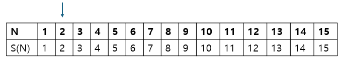
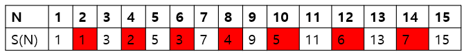
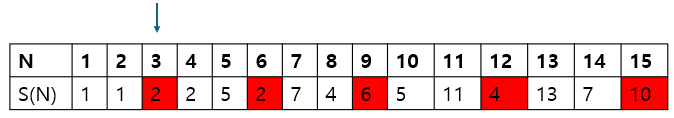
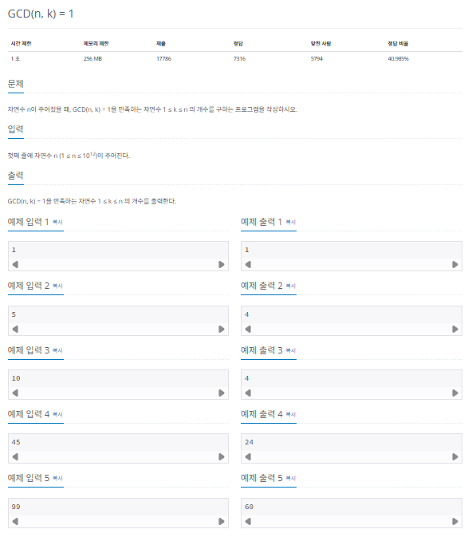

## 오일러 피

오일러 피 함수 P[N]의 정의는 1부터 N까지 범위에서 N과 서로소인 자연수의 개수를 뜻합니다. 오일러 피 함수는 증명 과정을 공부해야 완벽하게 알 수 있지만 이 책에서는 실제 코딩 테스트에 사용하기 위한 구현 부분만 알아봅니다.

### 오일러 피의 핵심 이론

오일러 피 함수의 원리는 에라토스테네스의 체와 비슷합니다.

> 오일러 피 함수의 원리

1. 구하고자 하는 오일러 피의 범위만큼 배열을 자기 자신의 인덱스값으로 초기화한다.
2. 2부터 시작해 현재 배열의 값과 인덱스가 같으면 (= 소수일 때) 현재 선택된 숫자(K)의 배수에 해당하는 수를 배열 끝까지 탐색하며 P[i] = P[i] - P[i]/K 연산을 수행한다. (i는 K의 배수)
3. 배열의 끝까지 과정 2를 반복하여 오일러 피 함수를 완성한다.

### 오일러 피 함수의 원리 이해하기

다음 예를 통해 오잉ㄹ러 피 함수를 좀 더 자세히 알아보겠습니다.

1. 구하고자 하는 범위까지 배열을 생성한 후 2를 선택합니다.



2. 2의 모든 배수마다 P[i] = P[i] - P[i] / K(2) 연산을 수행해 값을 갱신합니다. 예를 들어 8 = 8 - (8 / 2)를 통해 4를 계산합니다.



3. 소수 구하기에서 배수를 지우는 부분만 P[i] = P[i] - P[i] / K 로 변경하면 오일러 피 함수를 간단히 구현할 수 있습니다. 탐색을 계속 진행하면서 N = S(N)인 곳(소수)을 찾아 값을 갱신합니다.



4. 배열이 끝날 때까지 반복합니다.

> 수학적으로 오일러 피 함수 이해하기

이 원리가 정확하게 이해되지 않을 수 있습니다. 수학적인 측면에서 좀 더 알아보겠습니다.

1. 초기 상태 : S(6) = 6
   1. 서로소가 될 수 있는 후보의 개수로 초기화 (1,2,3,4,5,6)
2. 2의 배수로 인한 탈락
   1. S(6) = 6 - (6/2) = 3(1,3,5)
3. 3의 배수로 인한 탈락
   1. S(6) = 3 - (3/3) = 2(1,5)

이때 후보에서 삭제하는 기준을 6이 아닌 업데이트된 3으로 진행하는 이유는 3의 배수 중 2의 배수인 수, 즉 3과 2의 공배수는 2의 배수에서 이미 삭제됐기 때문에 중복 삭제를 막기 위함입니다. 이 예시에서는 6을 중복 삭제하지 않기 위한 것이겠죠? 최종적으로 S(6) = 2가 됩니다. 이때 2의 의미는 숫자 6과 6 이하의 숫자 중 서로소가 되는 개수가 2개 (1,5)라는 뜻이 됩니다.

오일러 피를 구하는 문제가 출제되는 빈도는 높지 않습니다. 하지만 원리를 알지 못하면 출제됐을 때 문제 자체에 접근하기 어렵습니다.

### $[문제044]$ 오일러 피 함수 구현하기



### $[01단계]$ 문제 분석하기

문제에서 요구하는 GCD(n, k) = 1을 만족하는 자연수의 개수가 바로 오일러 피 함수의 정의입니다. 즉, 오일러 피 함수를 잘 구현할 수 있는지 묻는 문제입니다.

### $[02단계]$ 손으로 풀어보기

1. 서로소의 개수를 표현하는 변수 result와 현재 소인수 구성을 표시하는 변수 n을 선언합니다. 예제 입력 4의 경우 변수 초기화는 n = 45, result = 45로 합니다.
2. 오일러 피 핵심 이론 부분을 참고해 2 ~ N 제곱근까지 탐색하면서 소인수일 때 result = result - (result / 소인수) 연산으로 result 값을 업데이트 합니다. 이때 n에서 이 소인수는 나누기 연산으로 삭제합니다.
   1. P(현재 수) = 2 => n(45) % P(2) != 0 => 소인수가 아님
   2. P(현재 수) = 3 => n(45) % P(3) == 0 => 소인수이므로 값 업데이트
      1. result = 45 - 45 / 3 = 30
      2. n = 45 / $3^2$ = 5
   3. P(현재 수) = 4 => 현재 n(5)의 제곱근보다 4가 크므로 반복문 종료

3. 반복문 종료 후 현재 n이 1보다 크면 n이 마지막 소인수라는 뜻입니다. result = result - (result / n)연산으로 result 값을 마지막으로 업데이트한 후 출력합니다.
   1. result(30) = 30 - (30 / 5) = 24

### $[03단계]$ 슈도코드 작성하기

```
n (소인수 표현) , result (결괏값)

for (2 ~ n의 제곱근) {
  if (현재 값이 소인수라면) {
    결괏값 = 결괏값 - 결괏값 / 현재값
    n에서 현재 소인수 내역을 제거하기 (2^7*11*13 -> 현재 소인수가 2일 때 11 * 13 으로 변경)
  }
}

// n이 마지막 소인수 일 때
if (n > 1) {
  결괏값 = 결괏값 - 결괏값 / n
}
결괏값 출력
```

### $[04단계]$ 코드 구현하기

```c
#include <iostream>
#include <cmath>
using namespace std;

int main(int argc, char *argv[]) {
    long n;
    cin >> n;
    long result = n;

    // --- 오일러 피 함수 구현
    // 제곱근까지만 진행
    for (long p = 2; p <= sqrt(n); p++) {
        // p 가 소인수 인지 확인
        if (n % p == 0) {
            result = result - result / p; // 결괏값 업데이트
            // 해당 소인수 지우기 (2^7*11 이라면 2^7을 없애고 11만 남김
            while (n % p == 0) {
                n /= p;
            }
        }
    }

    // 아직 소인수 구성이 남아있는 경우
    if (n > 1) {
        // 반복문에서 제곱근까지만 탐색했기 때문에 1개의 소인수가 누락되는 케이스 처리
        result = result - result / n;
    }

    cout << result << "\n";
    return 0;
}
```
