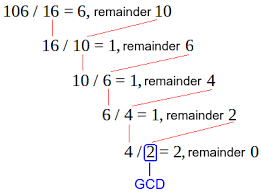
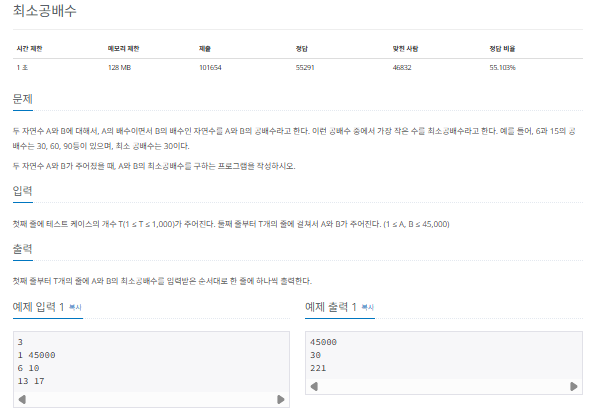
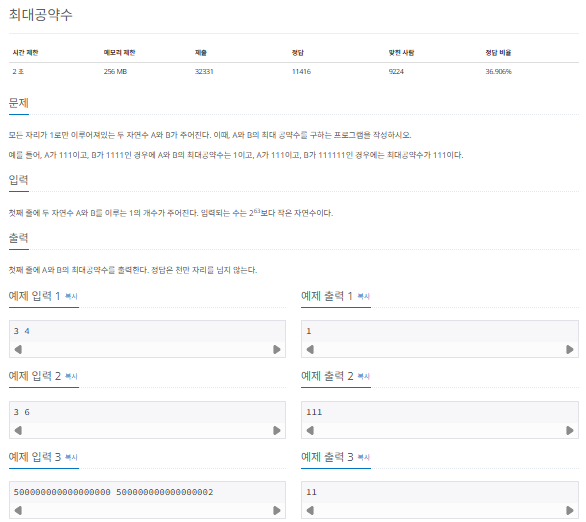
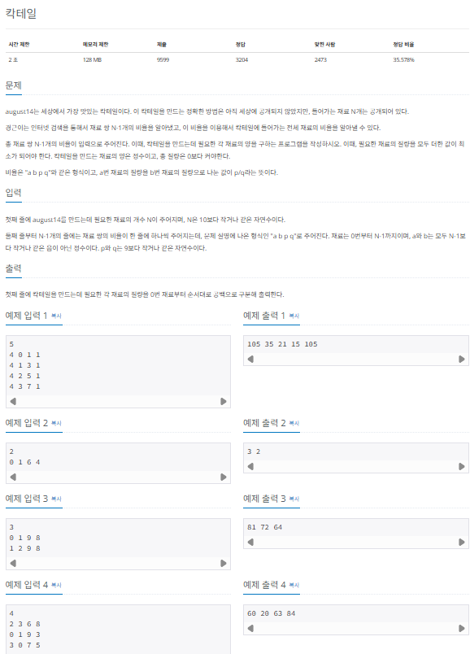
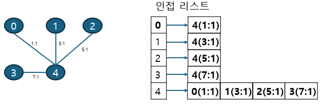
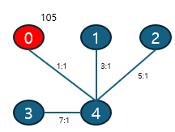
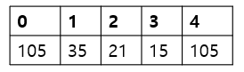

## 유클리드 호제법

유클리드 호제법 (euclidean-algorithm)은 두 수의 최대 공약수를 구하는 알고리즘입니다. 일반적으로 최대 공약수를 구하는 방법은 소인수 분해를 이용한 공통된 소수의 곱으로 표현할 수 있지만 유클리드 호제법은 좀 더 간단한 방법을 제시합니다.

### 유클리드 호제법의 핵심 이론

유클리드 호제법을 수행하려면 먼저 MOD연산을 이해하고 있어야 합니다. MOD연산이 최대 공약수를 구하는 데 사용하는 핵심 연산이기 때문입니다.

| 연산 |               기능                |            예제            |
| :--: | :-------------------------------: | :------------------------: |
| MOD  | 두 값을 나눈 나머지를 구하는 연산 | 10 MOD 4 = 2 // 10 % 4 = 2 |

MOD 연산을 이해하면 다음과 같은 3단계로 유클리드 호제법을 구현할 수 있습니다.

> MOD 연산으로 구현하는 유클리드 호제법

1. 큰 수를 작은 수로 나누는 MOD 연산을 수행한다.
2. 앞 단계에서의 작은 수와 MOD 연산 결괏값(나머지)으로 MOD 연산을 수행한다.
3. 과정 2를 반복하다가 나머지가 0이 되는 순간의 작은 수를 최대 공약수로 선택한다.

### 유클리드 호제법의 원리 이해하기

예시를 보며 다시 한번 이해해볼까요? 다음은 106과 16의 최대 공약수를 유클리드 호제법으로 찾아보는 그림입니다.

> 최대 공약수를 구하는 연산은 일반적으로 GCD 으로 정의합니다.

> 최소 공배수를 구하는 연산은 일반적으로 LCM 으로 정의합니다.

> 최소공배수는 A와 B가 주어졌을 때 'A \* B / 최대 공약수'를 계산해 구할 수 있습니다.



### $[문제045]$ 최소 공배수 구하기



### $[01단계]$ 문제 분석하기

최소공배수는 A와 B가 주어졌을 때 'A \* B / 최대 공약수'를 계산해 구할 수 있습니다. 결국 이 문제는 유클리드 호제법을 이용해 최대 공약수를 구한 후 두 수의 곱을 최대 공약수로 나눠 주는 것으로 해결할 수 있습니다.

### $[02단계]$ 손으로 풀어보기

1. 유클리드 호제법을 이용해 A,B의 최대 공약수를 구합니다.
2. 두 수의 곱을 최대 공약수로 나눈 값을 정답으로 출력합니다.

### $[03단계]$ 슈도코드 작성하기

```
t (테스트 케이스)

for (t 만큼 반복) {
  a (첫번째 수)
  b (두번째 수)
  결괏값 = a * b / gcd(a,b)
  결괏값 출력
}

// 최대 공약수 gcd() 함수 구현
gcd (작은 수, 큰 수) {
  if (b가 0이면) {
    a가 최대 공배수
  }
  else {
    // 재귀 함수 형태로 구현
    gcd (작은 수, 큰 수 % 작은 수)
  }
}
```

### $[04단계]$ 코드 구현하기

```c
#include <iostream>
using namespace std;

int gcd(int a, int b);

int lcm(int a, int b);

int main(int argc, char *argv[]) {
    int t;
    cin >> t;

    for (int i = 0; i < t; i++) {
        int a, b;
        cin >> a >> b;
        int result = lcm(a, b);
        cout << result << endl;
    }
    return 0;
}

// -- 최대 공배수
int gcd(int a, int b) {
    if (b == 0) {
        return a;
    } else {
        return gcd(b, a % b); // 재구 함수 형태로 구현
    }
}

// 최소 공배수
int lcm(int a, int b) {
    return a * b / gcd(a, b);
}
```

### $[문제046]$ 최대 공약수 구하기



### $[01단계]$ 문제 분석하기

예제 입력 3과 같이 입력값이 크면 단순한 방법으로는 최대 공약수를 찾을 수 없습니다. 하지만 주어진 예제를 바탕으로 다음 규칙을 찾을 수 있습니다.

> 예제의 규칙

1. 수의 길이를 나타내는 두 수의 최대 공약수는 A와 B의 최대 공약수의 길이를 나타낸다
2. 즉, 3, 6의 최대 공약수 3은 A(111)와 B(111111)의 최대 공약수 (111)의 길이를 나타낸다.

이 규칙을 바탕으로 문제를 풀어보겠습니다.

### $[02단계]$ 손으로 풀어보기

1. 유클리드 호제법을 이용해 주어진 A,B의 최대 공약수를 구합니다.

```
1. 500000000000000002 % 500000000000000000 = 2;
2. 500000000000000000 % 2 = 0

최대 공약수 = 0
```

2. 공약수의 길이만큼 1을 반복해 출력합니다.

```
최대 공약수가 2이므로 2번 반복해 1을 출력
=> 11
```

### $[03단계]$ 슈도코드 작성하기

```
a (첫 번째 수)
b (두 번째 수)
결괏값 = gcd (a,b)
결괏값 만큼 1을 반복하여 출력

// 최대공약수 함수 구현
gcd {
  if (b가 0이면) {
    a가 최대 공약수
  }
  else {
    // 재귀 함수 형태로 구현
    gcd(작은 수, 큰 수 % 작은 수)
  }
}
```

### $[04단계]$ 코드 구현하기

```c
#include <iostream>
using namespace std;

int gcd(long long a, long long b);

int main(int argc, char *argv[]) {
    long long a, b;
    cin >> a >> b;
    long result = gcd(a, b);

    while (result > 0) {
        cout << 1;
        result--;
    }
    cout << '\n';
    return 0;
}

// -- 최대 공배수
int gcd(long long a, long long b) {
    if (b == 0) {
        return a;
    } else {
        return gcd(b, a % b); // 재구 함수 형태로 구현
    }
}
```

### $[문제047]$ 칵테일 만들기



### $[01단계]$ 문제 분석하기

문제에서는 N - 1개의 비율로 N개의 재료와 관련된 전체 비율을 알아낼 수 있다고 했습니다. 이것을 그래프 관점으로 생각하면 사이클이 없는 트리 구조로 이해할 수 있습니다. 이 내용을 바탕으로 임의의 노드에서 DFS를 진행하면서 정답을 찾으면 됩니다. DFS과정에서 유클리드 호제법을 사용해 비율들의 최소 공배수와 최대 공약수를 구하고, 재료의 최소 질량을 구하는 데 사용해 문제를 해결해 보겠습니다.

### $[02단계]$ 손으로 풀어보기

1. 인접 리스트를 이용해 각 재료의 비율 자료를 그래프로 구현합니다.



2. 데이터를 저장할 때마다 비율과 관련된 수들의 최소 공배수를 업데이트 합니다.

```
A, B의 최소 공배수는 A * B / 최대 공약수
=> 1, 3, 5, 7의 최소 공배수는 105
```

3. 임의의 시작점에 최소 공배수 값을 저장합니다.



4. 임의의 시작점에 DFS로 탐색하면서 각 노드의 값을 이전 노드의 값과 비율 계산을 통해 계산하고 저장합니다.

```
😵‍💫 0을 임의의 점으로 선정
   => 0에서 DFS로 탐색을 수행하면 0 -> 4 -> 1 -> 2 ->3 순으로 탐색
😵‍💫 4 => 0번 노드값 * 1/1 = 105
😵‍💫 1 => 4번 노드값 * 1/3 = 35
😵‍💫 2 => 4번 노드값 * 1/5 = 21
😵‍💫 3 => 4번 노드값 * 1/7 = 15
```



5. 각 노드의 값을 모든 노대의 최대 공약수로 나눈 뒤 출력합니다.

```
105, 35, 21, 15, 105의 최대 공약수는 1
=> 각 배열의 값을 1로 나눠 출력
=> 105 35 21 15 105
```

### $[03단계]$ 슈도코드 작성하기

```
A (인접 리스트) // 3개의 데이터를 넣어야 하므로 tuple 벡터 형태 사용
lcm (최소 공배수)
visited (DFS 탐색 시 탐색 여부 저장 배열)
D (각 노드 값 저장 배열)
N (재료의 개수)

for (N - 1번 반복) {
  인접 리스트 배열에 해당 에지 정보 저장
  최소 공배수 업데이트
}

0번 노드에 최소 공배수 저장
0번에서 DFS 탐색 수행

DFS를 통하여 업데이트된 배열 D 값의 최대 공약수 계산
배열 D의 각 값을 최대 공약수로 나누어 정답 출력

// 최대 공약수 GCD() 함수 구현
GCD {
  if (b가 0이면) {
    a가 최대 공약수
  }
  else {
    // 재귀함수
    gcd (작은 수, 큰 수 % 작은 수)
  }
}

// DFS 탐색 함수 구현
DFS {
  visited 배열에 현재 노드 방문 기록
  현재 노드의 연결 노드 중 방문하지 않은 노드에 대해 다음 노드 값 = 현재 노드값 * 비율로 갱신
  DFS 실행 (재귀)
}
```

### $[04단계]$ 코드 구현하기

```c
#include <iostream>
#include <vector>
#include <tuple>
using namespace std;

vector<tuple<int, int, int> > A[10];
long lcm;
bool visited[10];
long D[10];

long gcd(long a, long b);

void DFS(int node);

int main(int argc, char *argv[]) {
    int N;
    cin >> N;
    lcm = 1;

    for (int i = 0; i < N - 1; i++) {
        int a, b, p, q;
        cin >> a >> b >> p >> q;
        A[a].push_back(make_tuple(b, p, q));
        A[b].push_back(make_tuple(a, p, q));

        // 두 수의 최소 공배수는 두 수의 곱을 최대 공약수로 나누는 것
        lcm *= ((p * q) / gcd(p, q));
    }

    D[0] = lcm;
    DFS(0);
    long mgcd = D[0];

    for (int i = 1; i < N; i++) {
        mgcd = gcd(mgcd, D[i]);
    }
    for (int i = 0; i < N; i++) {
        cout << D[i] / mgcd << " ";
    }
    return 0;
}

// 최대 공약수 구현
long gcd(long a, long b) {
    if (b == 0) {
        return a;
    } else {
        return gcd(b, a % b); // 재귀 함수 형태로 구현
    }
}

// DFS 함수 구현
void DFS(int node) {
    visited[node] = true;

    for (tuple<int, int, int> i: A[node]) {
        int next = get<0>(i);
        if (!visited[next]) {
            // 주어진 비율로 다음 노드값 업데이트
            D[next] = D[node] * get<2>(i) / get<1>(i);
            DFS(next);
        }
    }
}
```
