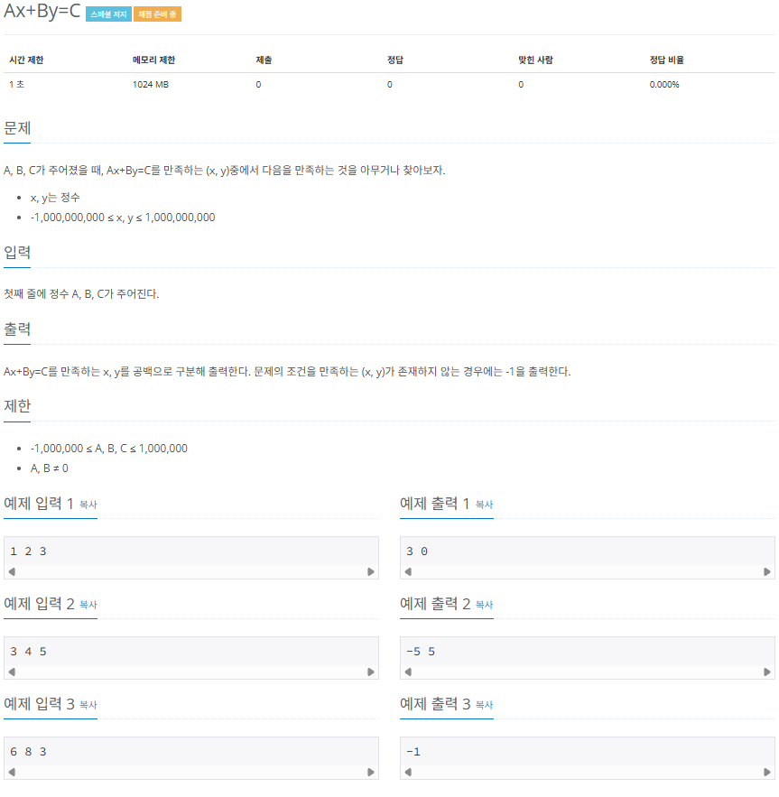

## 확장 유클리드 호제법

유클리드 호제법의 목적이 두 수의 최대 공약수를 구하는 것이라면 확장 유클리드 호제법의 목적은 방정식의 해를 구하는 것입니다. 홪갖ㅇ 유클리드 호제법을 제대로 이해하려면 수장 중명과정까지 공부해야 하지만 여기서는 확장 유클리드 호제법 관련 문제를 풀기 위한 알고리즘만 설명합니다.

### 확장 유클리드 호제법의 핵심 이론

확장 유클리드 호제법에서 해를 구하고자 하는 방정식은 다음과 같습니다.

> 해를 구하고자 하는 방정식

- ax + by = c (a, b, c, x, y 는 정수)

이때 방정식은 c % gcd(a,b) = 0 인 경우에만 정수 해를 가집니다. 다시말해 c가 a와 b의 최대 공약수의 배수인 경우에만 정수해를 가집니다. 이는 ax + by = c가 정수해를 갖게 하는 c의 최솟값이 gcd(a,b)라는 것을 의미합니다. 이 내용을 숙지한 후 확장 유클리드 호제법을 구현합시다. 구현에는 재귀 함수를 사용합니다.

### 확장 유클리드 호제법의 원리 이해하기

5x + 9y = 2일때 이 식을 만족하는 정수 x, y를 구해 보겠습니다.

1. 우선 5x + 9y가 정수해를 갖게 하는 c의 최솟값이 gcd(5, 9)라는 것을 적용하여 식을 다시 놓습니다. gcd(5, 9) = 1이므로 5x + 9y = 1로 식을 다시 놓고 다음단계를 진행합니다.

2. a, b로 유클리드 호제법을 반복 실행하며 몫, 나머지를 저장합니다. 반복은 나머지가 0이 되면 중단합니다.

| 유클리드 호제법 실행 | 나머지 | 몫  | 순서 |
| :------------------: | :----: | :-: | :--: |
|      5 % 9 = 5       |   5    |  0  |  1   |
|      9 % 5 = 4       |   4    |  1  |  2   |
|      5 % 4 = 1       |   1    |  1  |  3   |
|      4 % 1 = 0       |   0    |  4  |  4   |

3. 반복으로 구한 나머지와 몫을 이용하여 거꾸로 올라가며 x = $y^1$, y = $x^1$ - $y^1$ \* q를 계산합니다. $x^1$은 이전 x, $y^1$는 이전 y를 의미하고, q는 현재 보고 있는 몫을 의미합니다. 이때 처음 시작하는 x, y는 이전 x와 이전 y가 없으므로 각각 0,1으로 지정하여 역계산을 진행합니다.

| 나머지 | 몫  | x = $y^1$, y = $x^1$ - $y^1$ \* q 역순 계산 | 순서 |
| :----: | :-: | :-----------------------------------------: | :--: |
|   5    |  0  |        X = 2, Y= -1 - (2 \* 0) = -1         |  4   |
|   4    |  1  |        X = -1, Y= 1 - (-1 \* 1) = 2         |  3   |
|   1    |  1  |         X = 1, Y= 0 - (1 \* 1) = -1         |  2   |
|   0    |  4  |         X = 0, Y= 1 - (0 \* 4) = 1          |  1   |

4. 이렇게 재귀 방식으로 알아낸 최종 x, y는 ax + by = gcd(a,b)를 만족합니다. 그리고 c / gcd(a,b) = K를 가정하면 최초 방정식의 해는 Kx, Ky로 간단히 구할 수 있습니다. 과정 3에서 찾은 x는 2, y는 -1이고 K값을 구하면 2(c값) / 1(최대 공약수) = 2가 되므로 2의 값을 기존의 x(2), y(-1)값에 각각 곱합니다. 이에 따라 최초 방정식의 해는 4, -2가 됩니다.

> 오른쪽 변의 값이 gcd(a,b)의 배수가 아니라면?

위의 예제에서 만약 오른쪽 변의 값이 gcd(a,b)의 배수의 형태가 아니라면 어떻게 x, y의 값을 도출할 수 있을까요? 결론적으로 이 경우를 만족하는 x, y값은 정수 범위에서 존재하지 않습니다. 따라서 확장 유클리드 호제법을 구현할 때 먼저 오른쪽 변의 값이 gcd(a,b)의 배수라는 조건을 만족하는 지 먼저 판단해야 합니다. 만약 조건을 만족하지 않는다면 이후 프로그램을 수행하지 않고 불가능 표현하는 값을 출력하면 됩니다.

또한 이미 눈치챘겠지만, 유클리드 호제법의 구조 자체가 특정한 값을 업데이트시키면서 같은 로직을 반복적으로 수행하므로 재귀함수의 형태로 구현합니다.

### $[문제048]$ $A_x$ + $B_y$ = C



### $[01단계]$ 문제 분석하기

앞에서 배운 '확장 유클리드 호제법'을 그대로 구현하면 되는 문제입니다. 핵심 이론을 다시 한번 정확하게 학습하고, 학습 내용을 실전 문제에 적용해 보세요.

### $[02단계]$ 손으로 풀어보기

1. C의 값이 A와 B의 최대 공약수의 배수 형태인지 확인합니다. 최대 공약수의 배수 형태라면 C의 값을 최대 공약솔 변경합니다. 최대 공약수의 배수 형태가 아니라면 -1을 출력한 후 프로그램을 종료합니다.

```
3x + 4y = 5
=> 3과 4의 최대 공약수는 1이고, 5는 1의 배수이므로 C를 1로 변경
=> 3x + 4y = 1
```

2. A와 B에 관해 나머지가 0이 나올 때까지 확장 유클리드 호제법을 수행합니다.

| 유클리드 호제법 실행 | 나머지 | 몫  | 순서 |
| :------------------: | :----: | :-: | :--: |
|      3 % 4 = 3       |   3    |  0  |  1   |
|      4 % 3 = 1       |   1    |  1  |  2   |
|      3 % 1 = 0       |   0    |  3  |  3   |

3. 나머지가 0이 나오면 x = 1, y = 0으로 설정한 후 과정 2에서 구한 몫들을 식 (x = $y^1$, y = $x^1$ - $y^1$ \* 몫)에 대입하면서 역순으로 계산합니다.

| 나머지 | 몫  | x = $y^1$, y = $x^1$ - $y^1$ \* q 역순 계산 | 순서 |
| :----: | :-: | :-----------------------------------------: | :--: |
|   3    |  0  |        x = -1, y = 1 - (-1 \* 0) =1         |  3   |
|   1    |  1  |        x = 1, y = 0 - (1 \* 1) = -1         |  2   |
|   0    |  3  |         x = 0, y = 1 - (0 \* 3) = 1         |  1   |

4. 최종으로 계산된 x, y값에 C를 x와 y의 최대 공약수로 나눈 값을 각각 곱해 방정식의 해를 구합니다.

```
몫 = 5 / gcd(a,b) = 5 / 1 = 5
x = -1
y = 1 * 5 = 5

=> 기존 방정식에 대입해 검산하면 3x + 4y = 5
=> 3(-5) + 4(5) = 5 -> -15 + 20 = 5이므로 정답은 (-5, 5)
```

### $[03단계]$ 슈도코드 작성하기

```
a (첫번째 수), b (두번째 수), c (세번째 수)
최대 공약수 = gcd(a,b)

if (c가 최대 공약수의 배수가 아니면) {
  -1 출력
}
else {
  나머지(b)가 0이 될 때까지 재귀 함수를 호출하는 유클리드 호제법 함수 호출
  각 결괏값에 (c / 최대 공약수) 값을 곱하고 해당 값을 출력
}

// 유클리드 호제법 함수 구현
Execute (a ,b) {
  if(b == 0) 재귀 함수를 중단하고 return;
  // 호제법 함수 호출 (재귀 함수 형태)
  Execute(b , a % b)
  // 재귀를 빠져나오는 형태가 자연스럽게 역순이 됨
  X = $Y^1$
  Y = $X^1$ - ($Y^1$ * 몫)을 계산하는 역산 로직 구현
}

// 최대 공약수 함수 구현
gcd (a,b) {
  if (b가 0이면) {
    a 가 최대 공약수
  } else {
    // 재귀 함수 형태로 구현
    gcd (작은 수, 큰 수 % 작은 수)
  }
}
```

### $[04단계]$ 코드 구현하기

```c
#include <iostream>
#include <vector>
using namespace std;

long gcd(long a, long b);

vector<long> Execute(long a, long b);

int main(int argc, char *argv[]) {
    long a, b, c;
    cin >> a >> b >> c;
    long tgcd = gcd(a, b); // 최대 공약수

    if (c % tgcd != 0) {
        cout << -1 << "\n";
    } else {
        int mok = (int) (c / tgcd);
        vector<long> ret = Execute(a, b);
        cout << ret[0] * mok << " " << ret[1] * mok;
    }

    return 0;
}

vector<long> Execute(long a, long b) {
    vector<long> ret(2);

    if (b == 0) {
        ret[0] = 1;
        ret[1] = 0;
        return ret;
    }
    long q = a / b;
    // 재귀 형태로 호제법 수행
    vector<long> v = Execute(b, a % b);
    // 재귀를 빠져나오는 형태가 자연스럽게 역순이 됨
    ret[0] = v[1];
    ret[1] = v[0] - v[1] * q;
    return ret;
}

long gcd(long a, long b) {
    if (b == 0) {
        return a;
    } else {
        return gcd(b, a % b);
    }
}
```
