## 그래프의 표현

여기서는 그래프를 구현하는 3가지 방법을 알아봅시다. 그래프 관련 문제 풀이를 위한 필수 과정이므로 확실히 공부하고 넘어가기 바랍니ㅏㄷ.

### 에지 리스트

에지 리스트 (edge list)는 에지를 중심으로 그래프를 표현합니다. 에지리스트는 배열에 출발 노드, 도착 노드를 저장하여 에지를 표현합니다. 또는 출발 노드, 도착노드, 가중치를 저장하여 가중치가 있는 에지를 표현합니다. 다음을 통해 에지 리스트를 자세히 알아보겠습니다.

#### 에지 리스트로 가중치 없는 그래프 표현하기

가중치가 없는 그래프는 출발 노드와 도착 노드만 표현하므로 배열의 열은 2개면 충분합니다.

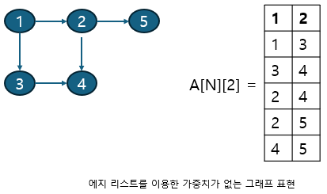

1에서 2로 뻗어나가는 에지는 [1,2]로 표현합니다. 4에서 5로 뻗어나가는 에지는 [4,5]로 표현합니다. 이처럼 방향이 잇는 그래프는 순서에 맞게 노드를 배열에 저장하는 방식으로 표현합니다. 그리고 노드를 배열에 저장하여 에지를 표현하므로 에지 리스트라 합니다.

> 여기서는 방향이 있는 그래프를 예로 들었습니다. 만약 방향이 없는 그래프라면 [1,2], [2,1]은 같은 표현입니다.

#### 에지 리스트로 가중치 있는 그래프 표현하기

가중치가 있는 그래프는 열을 3개로 늘려 3번째 열에 가중치를 저장하면 됩니다. 다음 그림을 봅시다.

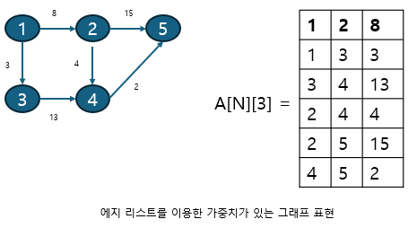

1에서 2로 향하는 가중치가 8인 에지는 이제 [1,2,8]로 표현합니다. 이처럼 에지 리스트는 구현하기 쉽습니다. 하지만 특정 노드와 관련된 에지를 탐색하기는 쉽지 않습니다. 에지 리스트는 노드 사이의 최단 거리를 구하는 벨만-포드나 최소 신장 트리를 찾는 크루스칼 알고리즘에 사용하며, 노드 중심 알고리즘에는 잘 사용하지 않습니다.

### 인접 행렬

인접 행렬 (adjacency matrix)은 2차원 배열을 자료구조로 이용하여 그래프를 표현합니다. 인접 행렬은 에지 리스트와 다르게 노드 중심으로 그래프를 표현합니다. 다음은 노드가 5개인 그래프를 5 \* 5 인접 행렬로 표현한 것입니다. 그림으로 인접 행렬을 자세히 이해해봅시다.

#### 인접 행렬로 가중치 없는 그래프 표현하기

다음 그림을 보면 1에서 2를 향하는 에지를 인접 행렬은 1행 2열에 1을 저장하는 방식으로 표현합니다. 1을 저장하는 이유는 가중치가 없기 때문입니다. 1에서 2로 향하는 에지가 있다는 표시를 노드 중심으로 한다고 이해하면 됩니다.

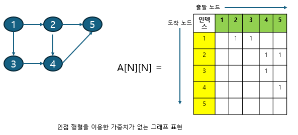

#### 인접 행렬로 가중치 있는 그래프 표현하기

계속해서 가중치가 있는 그래프 표현도 봅니다. 앞의 가중치가 없는 그래프를 이해했다면 가중치가 있는 그래프는 그림만 쓱 봐도 쉽게 이해할 수 있을 것입니다. 2에서 5로 향하는 에지의 가중치를 2행 5열에 기록합니다.

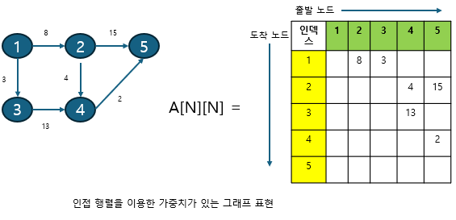

이처럼 인접 행렬을 이용한 그래프 구현은 쉽습니다. 두 노드를 연결하는 에지의 여부와 가중치 값은 배열에 직접 접근하면 바로 확인할 수 있는 것도 장점이비다. 하지만 노드와 관련되어 있는 에지를 탐색하려면 N번 접근해야 하므로 시간 복잡도가 인접 리스트에 비해 느리고 노드 개수에 비해 에지가 적을 때는 공간 효율성이 떨어집니다.

### 인접 리스트

C++의 인접 리스트 (adjacency list)는 이차원 벡터로 그래프를 표현합니다. 자료형은 문제의 조건에 맞게 설정합니다. 다음 그림으로 이해해 볼까요?

#### 인접 리스트로 가중치 없는 그래프 표현하기

다음은 인접 리스트로 가중치 없는 그래프를 표현한 것입니다. 여기서는 int형 데이터 하나로 그래프를 표현하기에 충분하므로 vector<vector<int>> A로 선언했습니다. 인접 리스트에는 N번 노드와 연결된 노드를 벡터의 위치 N에 연결된 노드 개수 만큼 노드 데이터를 push_back()으로 더하는 방식으로 표현합니다.


예를 들어 노드 1과 연결된 2,3 노드는 A[1]에 [2,3]을 연결하는 방식으로 표현합니다. 계속해서 인접 리스트로 가중치 있는 그래프를 표현하는 방법을 알아봅시다.

#### 인접 리스트로 가중치 있는 그래프 표현하기

가중치가 있는 경우 pair 클래스를 이용하여 표현할 수 있습니다. 다음은 (도착 노드, 가중치)를 갖는 pair 클래스를 이차원 벡터에 사용한 것입니다.

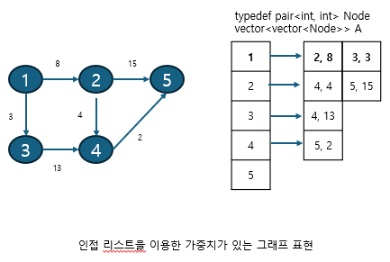

그래프를 구현하는 다른 방법에 비해 인접 리스트를 이용한 그래프 구현은 복잡한 편입니다. 하지만 노드와 연결된 에지를 탐색하는 시간은 매우 뛰어나며, 노드 개수가 커도 공간 효율이 좋아 메모리 초과 에러도 발생하지 않습니다. 이런 장점으로 실제 코딩 테스트에서는 인접 리스트를 이용한 그래프 구현을 선호합니다.

---

### $[문제049]$ 특정 거리의 도시 찾기

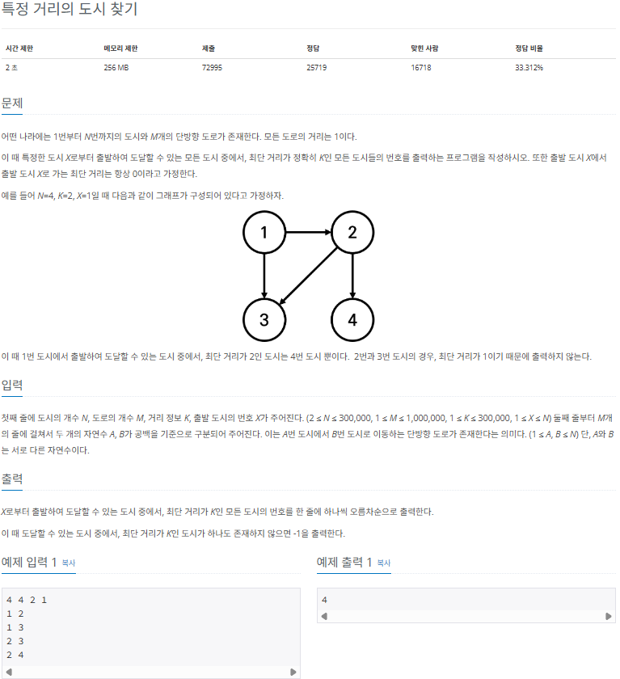

### $[01단계]$ 문제 분석하기

모든 도로의 거리가 1이므로 가중치가 없는 인접 리스트로 이 그래프를 표현할 수 있습니다. 도시의 개수가 300,000, 도로의 최대 크기가 1,000,000이므로 BFS 탐색을 수행하면 이 문제를 시간 복잡도 안에 해결할 수 있습니다.

### $[02단계]$ 손으로 풀어보기

1. 인접 리스트로 도시와 도로 데이터의 그래프를 구현합니다.

```
vector<vector<int>> A

[1] -> [2][3]
[2] -> [3][4]
[3]
[4]
```

2. BFS 탐색 알고리즘으로 탐색을 수행하면서 각 도시로 가는 최단 거리값을 방문 배열에 저장합니다.

```
[BFS 실행]   <depth 1>     <depth 2>     <depth 3>

             [1]     ->     [2]    ->    [3](이미 방문했던 노드)
                            [3]          [4]

[방문 배열]  [1][2][3][4]  [1][2][3][4]  [1][2][3][4]  [1][2][3][4]
             [0][ ][ ][ ]  [0][1][1][ ]  [0][1][1][2]  [0][1][1][2]
[탐색 경로]  ------------  ------------  ------------  ------------
                            1             1  2  3       1  2  3  4
             ------------  ------------  ------------  ------------
```

3. 탐색 종료 후 방문 배열에서 값 K와 같은 도시의 번호를 출력합니다.

```
[방문 배열]  [1][2][3][4]
             [0][1][1][2]

[4] -> K(=2)와 같은 값을 가진
[2]    도시 번호 출력 => 4
```

### $[03단계]$ 슈도코드 작성하기

```
N (노드 개수), M(에지 개수), K(목표 거리), X(시작점)
answer (정답 배열)
A(그래프 데이터 저장 인접 리스트) visited (방문 거리 저장 배열)
벡터 A 크기 설정 (N + 1)

for (M의 개수만큼 반복하기) {
  인접 리스트 A에 그래프 데이터 저장
}

visited 벡터 크기 설정 (N + 1) 및 -1로 초기화

BFS(X) 실행하기

for (N의 개수만큼 반복하기) {
  방문 거리가 K인 노드의 숫자를 정답 배열에 더하기
}

정답 배열 오름차순 정렬 후 출력

// BFS 구현
BFS {
  큐 자료구조에 출발 노드 더하기
  visited 배열에 현재 노드 방문 기록
  while (큐가 빌 때까지) {
    큐에서 노드 데이터를 가져오기
    현재 노드의 연결 노드 중 방문하지 않은 노드를 큐에 데이터 삽입하고 visited 배열에 방문 거리 기록 \
    -> 이전 노드의 방문 노드 거리 + 1
  }
}
```

### $[04단계]$ 코드 구현하기

```c
#include <iostream>
#include <vector>
#include <algorithm>
#include <queue>
using namespace std;

void BFS(int node);

static vector<vector<int> > A;
static vector<int> answer;
static vector<int> visited;

int main(int argc, char *argv[]) {
    long N, M, K, X;
    cin >> N >> M >> K >> X; // 노드 수, 에지 수, 목표거리, 시작점
    A.resize(N + 1);

    for (int i = 0; i < M; i++) {
        int S, E;
        cin >> S >> E;
        A[S].push_back(E);
    }

    visited.resize(N + 1);

    for (int i = 0; i <= N; i++) {
        visited[i] = -1;
    }

    BFS(X);

    for (int i = 0; i <= N; i++) {
        if (visited[i] == K) {
            answer.push_back(i);
        }
    }

    if (answer.empty()) {
        cout << -1 << "\n";
    } else {
        sort(answer.begin(), answer.end());
        for (int temp: answer) {
            cout << temp << "\n";
        }
    }

    return 0;
}

void BFS(int node) {
    queue<int> queue;
    queue.push(node);
    visited[node]++;

    while (!queue.empty()) {
        int now_node = queue.front();
        queue.pop();
        for (int i: A[now_node]) {
            if (visited[i] == -1) {
                visited[i] = visited[now_node] + 1;
                queue.push(i);
            }
        }
    }
}
```

### $[문제050]$ 효율적으로 해킹하기

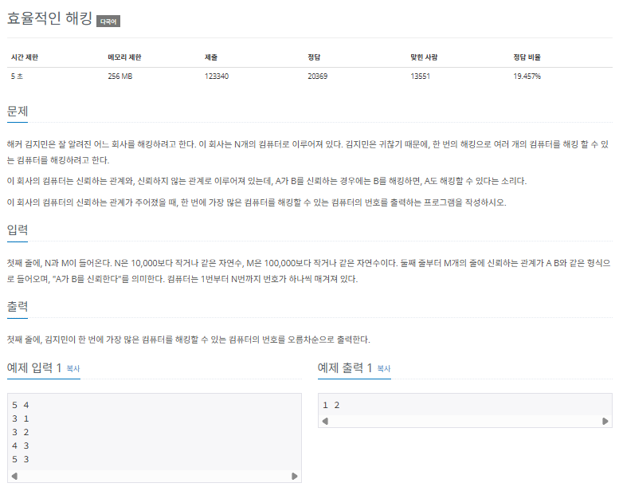

### $[01단계]$ 문제 분석하기

N과 m의 크기가 작은 편이므로 시간 복잡도와 관련된 제약은 크지 않은 편입니다. 이 문제에서 잘 확인해야 할 부분은 신뢴 관계가 A,B라고 했을때 A가 B를 신뢰한다는 것입니다. 또한 가장 많은 컴퓨터를 해킹할 수 있는 컴퓨턴느 신뢰를 가장 많이 받는 컴퓨터입니다. 그래프의 노드와 에지를 기준으로 이해하면 A라는 노드에서 탐색 알고리즘으로 방문하는 노드가 B,C라고 하면 B,C는 A에게 신뢰받는 노드가 됩니다. 이 부분을 고려해 문제에 접근해 보겠습니다.

### $[02단계]$ 손으로 풀어보기

1. 인접 리스트로 컴퓨터와 신뢰 관계 데이터의 그래프를 표현합니다.

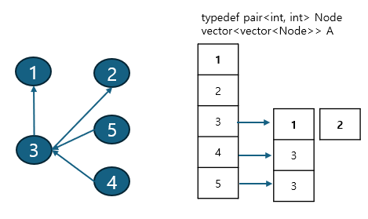

2. 모든 노드로 각각 BFS 탐색 알고리즘을 적용해 탐색을 수행합니다. 탐색을 수행하면서 탐색되는 노드들의 신뢰도를 증가시켜 줍니다.

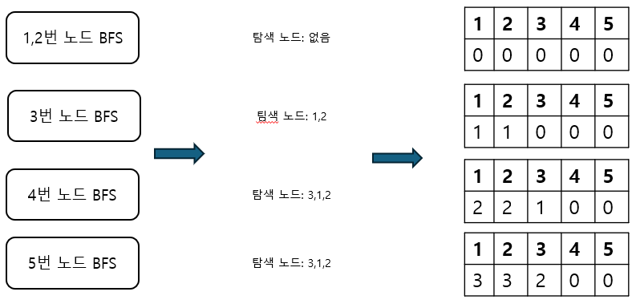

3. 탐색 종료 후 신뢰도 배열을 탐색해 신뢰도의 최댓값을 Max값으로 지정하고, 신뢰도 배열을 다시 탐색하면서 Max값을 지닌 노드를 오름차순 출력합니다.

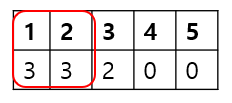

```
신뢰도 배열의 최댓값은 3
=> 값 3을 지닌 노드의 인덱스값을 오름차순으로 출력
=> 1, 2
```

### $[03단계]$ 슈도코드 작성하기

```
N(노드 개수), M(에지 개수)
answer(정답 배열)
A(그래프 데이터 저장 인접 리스트), visited(방문 여부 저장 배열)
배열 A 크기 설정 (N + 1)

for (M의 개수만큼 반복하기) {
  인접 리스트 A에 그래프 데이터 저장
}

visited 배열 크기 설정 (N + 1)

for (i -> N의 개수만큼 반복하기) {
  visited 배열 초기화하기
  BFS(i) 실행 // 모든 노드에서 BFS 실행
}
for (N의 개수만큼 반복하기) {
  answer 배열에서 가장 큰 수 찾기 -> maxVal
}
for (N의 개수만큼 반복하기) {
  answer 배열에서 maxVal과 같은 값을 가진 index를 정답으로 출력하기
}

정답 배열 오름차순 정렬해 출력

// BFS 구현
BFS {
  큐 자료구조에 출발 노드 더하기
  visited 배열에 현재 노드 방문 기록
  while (큐가 빌 때까지) {
    큐에서 노드 데이터 가져오기
    현재 노드의 연결 노드 중 방문하지 않은 노드로 신규 노드 인덱스의 정답 배열값 증가시키기
    큐에 데이터 삽입하고 visited 배열에 방문 기록
  }
}
```

### $[04단계]$ 코드 구현하기

```c
#include <complex.h>
#include <iostream>
#include <vector>
#include <queue>
using namespace std;

void BFS(int node);

static vector<vector<int> > A;
static vector<int> answer;
static vector<bool> visited;

int main(int argc, char *argv[]) {
    long N, M;
    cin >> N >> M;
    A.resize(N + 1);
    answer.resize(N + 1);
    visited.resize(N + 1);

    for (int i = 0; i < M; i++) {
        int S, E;
        cin >> S >> E;
        A[S].push_back(E);
    }

    for (int i = 0; i <= N; i++) {
        fill(visited.begin(), visited.end(), false);
        BFS(i);
    }

    int maxVal = 0;
    for (int i = 1; i <= N; i++) {
        maxVal = max(maxVal, answer[i]);
    }
    for (int i = 1; i <= N; i++) {
        // answer 배열에서 maxVal과 같은 값을 가진 index 를 정답으로 출력
        if (answer[i] == maxVal) {
            cout << i << " ";
        }
    }

    return 0;
}

void BFS(int node) {
    queue<int> myqueue;
    myqueue.push(node);
    visited[node] = true;

    while (!myqueue.empty()) {
        int now_node = myqueue.front();
        myqueue.pop();

        for (int i: A[now_node]) {
            if (!visited[i]) {
                visited[i] = true;
                answer[i]++;
                myqueue.push(i);
            }
        }
    }
}
```

### $[문제051]$ 이분 그래프 판별하기

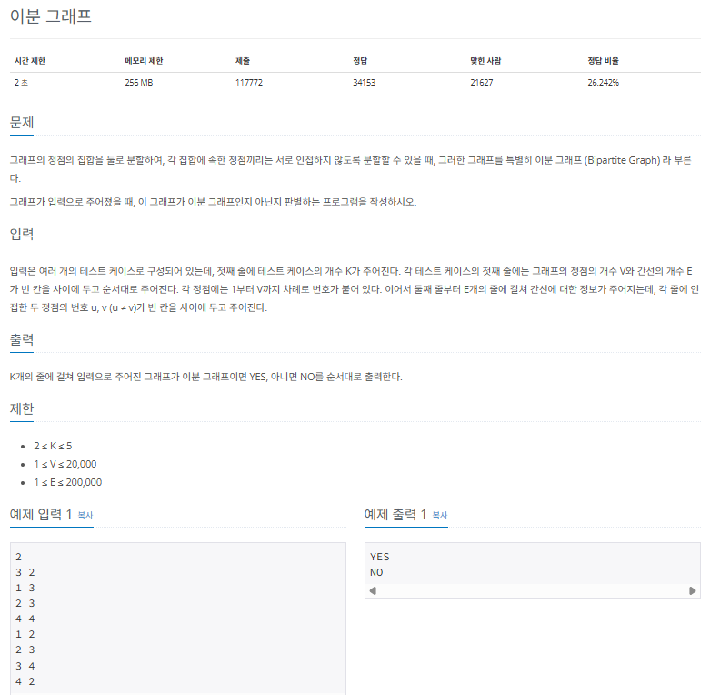

### $[01단계]$ 문제 분석하기

노드의 집합을 2개로 나누는데, 인접한 노드끼리 같은 집합이 되지 않도록 적절하게 임의로 분할할 수 있다고 합니다. 잘 생각해보면 트리는 항상 이분 그래프가 된다는 것을 알 수 있습니다. 사이클이 발생하지 않으면 탐색을 하면서 다음 노드를 이번 노드와 다른 집합으로 지정하면 되기 때문입니다. 단, 사이클이 발생했을 때는 이런 이분 그래프가 불가능할 때가 있습니다. 바로 다음과 같을 때입니다.

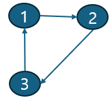

이때는 3번 노드를 1번 집합으로 설정하면 1번 노드와 인접하면서 같은 집합에 속하게 되고, 2번 집합으로 설정하면 2번 노드와 인접하면서 같은 집합에 속하게 돼 이분 그래프가 불가능합니다. 그렇다면 이때를 어떻게 도출할 수 있을까요? 바로 기존의 탐색 매커니즘에서 탐색한 노드에 다시 접근하게 됐을 때 현재 노드의 집합과 같으면 이분 그래프가 불가능하다는 것으로 판별할 수 있습니다.

### $[02단계]$ 손으로 풀어보기

1. 입력된 그래프 데이터를 인접 리스트로 구현합니다.

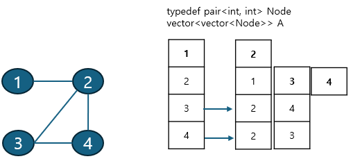

2. 모든 노드로 각각 DFS 탐색 알고리즘을 적용해 탐색을 수행합니다. DFS를 실행할 때 현재 노드에서 연결된 노드 중 이미 방문한 노드가 나와 같은 집합이면 이분 그래프가 아닌 것으로 판별합니다. 실행 결과가 이분 그래프가 아니면 이후 노드를 탐색하지 않습니다.

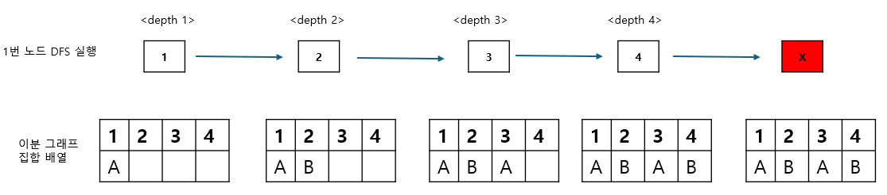

3. 이분 그래프 여부를 정답으로 출력합니다.

```
출발 노드 (4)와 도착 노드(2)의 집합이 같으므로 이분 그래프 불가능
=> NO 출력
```

4. 테스트 케이스의 개수만큼 과정 1 ~ 3 을 반복합니다.

> 여기에서 모든 노드로 DFS를 실행하는 이유는 그래프의 모든 노드가 이어져 있지 ㅇ낳고, 여러 개의 부분 그래프로 이뤄진 케이스 존재할 수 있기 때문입니다.

### $[03단계]$ 슈도코드 작성하기

```
N(노드 개수), M(에지 개수), check(이분 그래프 체크 배열)
A(그래프 데이터 저장 인접 리스트), visited(방문 기록 저장 배열)
T(테스트 케이스)

for (N의 개수만큼 반복하기) {
  V(노드 개수)
  E(에지 개수)
  배열 A 크기 설정 (V + 1)
  visited 배열 크기 설정 (V + 1)
  check 배열 크기 설정 (V + 1)
  IsEven = true 설정

  for (M의 개수만큼 반복하기) {
    A 인접 리스트에 그래프 데이터 저장
  }
  for (V 개수만큼 반복하기) {
    각 노드에서 DFS 실행 -> 결과가 이분 그래프가 아니면 반복 종료
    이분 그래프 여부를 정답으로 출력
    모든 변수를 다음 테스트 케이스를 위해 초기화
  }
}

// DFS 구현
DFS {
  visited 배열에 현재 노드 방문 기록
  if (현재 노드의 연결 노드 중 방문하지 않은 노드로) {
    현재 노드와 다른 집합으로 연결 노드 집합 저장
    DFS 실행 (재귀 형태)
  }
  // 이미 방문한 노드인데 현재 나의 노드와 같은 집합이면
  else {
    이분 그래프가 아님
  }
}
```

### $[04단계]$ 코드 구현하기

```c
#include <iostream>
#include <vector>
using namespace std;

void DFS(int node);

static vector<vector<int> > A;
static vector<int> check;
static vector<bool> visited;
static bool isEven;

int main(int argc, char *argv[]) {
    int N;
    cin >> N;

    for (int t = 0; t < N; t++) {
        int V, E;
        cin >> V >> E;
        A.resize(V + 1);
        visited.resize(V + 1);
        check.resize(V + 1);
        isEven = true;

        for (int i = 0; i < E; i++) {
            int S, E;
            cin >> S >> E;
            A[S].push_back(E);
            A[E].push_back(S);
        }

        // 주어진 그래프가 하나로 연결된다는 보장이 없으므로 모든 노드에서 수행
        for (int i = 1; i <= V; i++) {
            if (isEven) {
                DFS(i);
            } else {
                break;
            }
        }

        if (isEven) {
            cout << "YES" << "\n";
        } else {
            cout << "NO" << "\n";
        }

        for (int i = 0; i <= V; i++) {
            A[i].clear();
            visited[i] = false;
            check[i] = 0;
        }
    }
    return 0;
}

void DFS(int node) {
    visited[node] = true;

    for (int i: A[node]) {
        if (!visited[i]) {
            // 인접한 노드는 같은 집합이 아니므로 이전 노드와 다른 집합으로 처리
            check[i] = (check[node] + 1) % 2;
            DFS(i);
        }
        // 이미 방문한 노드가 현재 노드와 같은 집합이면 이분 그래프가 아님
        else if (check[node] == check[i]) {
            isEven = false;
        }
    }
}
```

### $[문제052]$ 물의 양 구하기

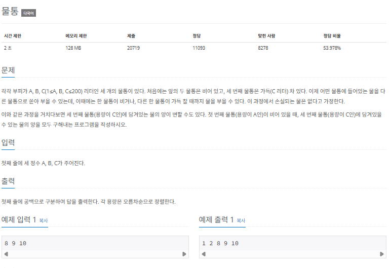

### $[01단계]$ 문제 분석하기

지금까지 접해 봤던 그래프 데이터를 저장하고 저장한 자료구조를 이용하는 방식과 달리, 그래프 원리를 적용해 그래프를 역으로 그리는 방식으로 접근하는 문제입니다. A,B,C의 특정 용량 상태를 1개의 노드로 가정하고, 조건에 따라 이 상태에서 변경할 수 있는 이후 용량 상태가 에지로 이어진 인접한 노드라고 생각하고, 문제에 접급해 봅시다.

### $[02단계]$ 손으로 풀어보기

1. 처음에는 물통 A,B가 비어있고, C는 꽉 차 있으므로 최초 출발 노드를 (0,0,3번째 물통의 용량)으로 초기화 합니다.

```
[0][0][10]
```

2. BFS를 수행합니다. 탐색 과정은 다음과 같습니다.

> BFS 과정

1. 노드에서 갈 수 있는 6가지 경우 (A -> B, A->C, B->A, B->C, C->A, C->B)에 관해 다음 노드로 정해 큐에 추가한다. A,B,C 용량이 동일한 노드에 방문한 이력이 있을 때는 큐에 추가하지 않는다.
2. 보낸는 물통의 모든 용량을 받는 물통에 저장하고, 보내는 물통에는 0을 저장한다. 단, 받는 물통이 넘칠 때는 초과하는 값만큼 보내는 물통에 남긴다.
3. 큐에 추가하는 시점에 1번째 물통(A)의 용량이 0일 때가 있으면 3번째 물통(C)의 값을 정답 배열에 추가한다.
4. 정답 배열을 오름차순 출력합니다.

### $[04단계]$ 코드 구현하기

```c
#include <iostream>
#include <queue>
using namespace std;

void BFS();

// 6가지 이동 케이스를 표현하기 위한 배열
static int Sender[] = {0, 0, 1, 1, 2, 2};
static int Receiver[] = {1, 2, 0, 2, 0, 1};
// A B의 용량만 있으면 C의 용량이 고정되므로 2개로만 체크 가능
static bool visited[201][201];
static bool answer[201];
static int now[3]; // A B C 물의 양을 저장하는 배열

int main(int argc, char *argv[]) {
    cin >> now[0] >> now[1] >> now[2];
    BFS();

    for (int i = 0; i < 201; i++) {
        if (answer[i]) {
            cout << i << " ";
        }
    }

    return 0;
}

void BFS() {
    queue<pair<int, int> > myqueue;
    myqueue.push(make_pair(0, 0));
    visited[0][0] = true;
    answer[now[2]] = true;

    while (!myqueue.empty()) {
        pair<int, int> p = myqueue.front();
        myqueue.pop();
        int A = p.first;
        int B = p.second;
        int C = now[2] - A - B; // C는 전체 물의 양에서 A 와 B를 뺀 것

        // A->B, A->C, B->A, B->C, C->A, C->B 6개의 케이스로 이동
        for (int k = 0; k < 6; k++) {
            int next[] = {A, B, C};
            next[Receiver[k]] += next[Sender[k]];
            next[Sender[k]] = 0;

            // 대상 물통의 용량보다 물이 많아 넘칠때
            if (next[Receiver[k]] > now[Receiver[k]]) {
                // 초과하는 만큼 다시 이전 물통에 넣음
                next[Sender[k]] = next[Receiver[k]] - now[Receiver[k]];
                // 대상 물통은 최대로 채움
                next[Receiver[k]] = now[Receiver[k]];
            }

            // A와 B의 물의 양을 통하여 방문 배열 체크
            if (!visited[next[0]][next[1]]) {
                visited[next[0]][next[1]] = true;
                myqueue.push(make_pair(next[0], next[1]));
                // A의 물의 양이 0일 때 C의 물의 양을 정답 변수에 저장
                if (next[0] == 0) {
                    answer[next[2]] = true;
                }
            }
        }
    }
}
```
