## 유니온 파인드

유니온 파인드(union-find)는 일반적으로 여러 노드가 있을 때 특정 2개의 노드를 연결해 1개의 집합으로 묶는 union 연산과 두 노드가 같은 집합에 속해 있는지를 확인하는 find 연산으로 구성된 알고리즘입니다.

### 유니온 파인드의 핵심 이론

유니온 파인드는 union, find 연산을 완벽히 이해하는 것이 핵심입니다. 두 연산은 다음과 같습니다. 이 설명을 염두에 두고 원리를 공부해 봅시다.

> union, find 연산

1. union 연산
   - 각 노드가 속한 집합을 1개로 합치는 연산입니다. 노드 a,b가 a ∈ A, b ∈ B 일때 union(a,b)는 A U B를 말합니다.
2. find 연산
   - 특정 노드 a에 관해 a가 속한 집합의 대표 노드를 반환하는 연산입니다. 노드 a가 a ∈ A일때 find(a)는 A 집합의 대표 노드를 반환합니다.

> 수학 기호 ∈ (포함된다, 속한다, find)

```
A = {1, 2, 3}

2 ∈ A   → 맞음 (2는 A에 있음)
5 ∈ A   → 틀림 (5는 A에 없음)
```

> 수학 기호 U (합집합, union)

```
A ∪ B
뜻 : A와 B를 합친 집합

[예시]
A = {1, 2, 3}
B = {3, 4, 5}

A ∪ B = {1, 2, 3, 4, 5}
```

### 유니온 파인드의 원리 이해하기

두 연산을 알아봤으므로 이번에는 유니온 파인드 알고리즘 구현 방법을 설명하겠습니다.

1. 유니온 파인드를 표현하는 일반적인 방법은 1차원 배열을 이용하는 것입니다. 처음에는 노드가 연결되어 있지 않으므로 각 노드가 대표 노드가 됩니다. 각 노드가 모두 대표 노드이므로 배열을 자신의 인덱스 값으로 초기화합니다.

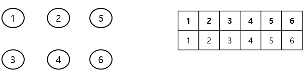

2. 2개의 노드를 선택해 각각의 대표 노드를 찾아 연결하는 union 연산을 수행합니다. 배열을 보면 1,4와 5,6을 union 연산으로 연결합니다. 배열[4]는 1로, 배열[6]은 5로 업데이트합니다. 이렇게 업데이트하는 것의 의미를 이해해야합니다. 1,4의 연결을 예로 들어 설명해 보겠습니다. 1은 대표 노드, 4는 자식 노드로 union 연산을 하므로 배열[4]의 대표 노드를 1로 설정한 것입니다. 다시 말해 자식 노드로 들어가는 노드값 4를 대표 노드값 1로 변경한 것입니다. 그 결과 각각의 집합이었던 1,4는 하나로 합쳐집니다.

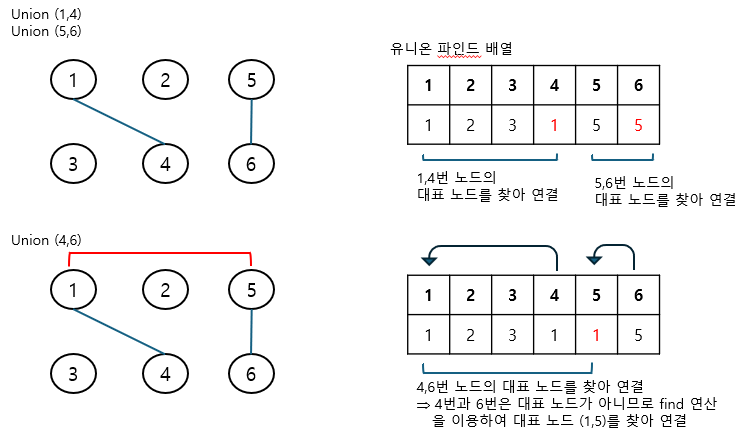

이제 union(4,6)으로 4와 6을 연결해 봅니다. 그런데 4,6은 대표 노드가 아닙니다. 그래서 각 노드의 대표 노드를 찾아 올라간 다음 그 대표 노드를 연결합니다. 여기서는 4의 대표 노드 1에 6의 대표 노드 5를 연결한 것입니다. 배열은 그럼 [1,2,3,1,1,5]가 됩니다. 배열 상태로 보면 그래프의 연결이 잘 안보일 수도 있겠지만 다음 find 연산 설명을 보면 위 배열이 그래프 연결을 잘 나타내고 있다는 것을 쉽게 이해할 수 있습니다.

3. find 연산은 자신이 속한 집합의 대표 노드를 찾는 연산입니다. find 연산은 단수히 대표 노드를 찾는 역할만 하는 것이 아니라 그래프를 정돈하고 시간 복잡도를 줄입니다. 이 특징은 매우 중요하므로 다음 설명에 집중하기 바랍니다.

> find 연산의 작동 원리

1. 대상 노드 배열에 index값과 value 값이 동일한지 확인합니다.
2. 동일하지 않으면 value 값이 가리키는 index 위치로 이동합니다.
3. 이동 위치의 index 값과 value 값이 같을 때까지 과정 1 ~ 2 을 반복합니다. 반복이므로 이 부분은 재귀 함수로 구현합니다.
4. 대표 노드에 도달하면 재귀 함수를 빠져나오면서 거치는 모든 노드값을 대표 노드값으로 변경합니다.

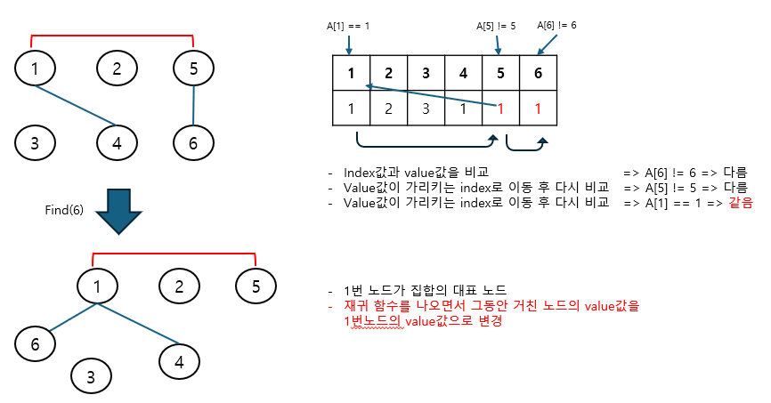

find 연산은 잘 생각하면 시간 복잡도가 줄어드는 효과를 얻게 됩니다. 연산을 할 때 거치는 노드들이 대표 노드와 바로 연결되는 형태로 변경되는 것을 알 수 있습니다. 이렇게 되면 추후 노드와 관련된 find 연산속도가 O(1)로 변경됩니다. 다음 예로 확인해 보겠습니다.

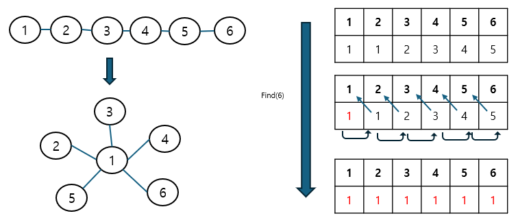

한 번의 find 연산을 이용해 모든 노드가 루트 노드에 직접 연결되는 형태로 변경되는 것을 볼 수 있습니다. 이러한 형태로 변경되면 이후 find 연산이 진행될 때 경로 앞축의 효과가 나타납니다. 예를 들어 이후 find(4)연산을 수행하면 한 번의 디오으로 바로 대표 노드를 찾을 수 있게 되겠죠?

> 경로 압축은 실제 그래프에서 여러 노드를 거쳐야 하는 경로에서 그래프를 변형해 더 짧은 경로로 갈 수 있도록 함으로써 시간 복잡도를 효과적으로 줄이는 방법을 말합니다.

이제 관련 실전 문제를 풀면서 유니온 파인드 알고리즘을 실제로 구현해 보겠습니다.

---

### $[문제053]$ 집합 표현하기

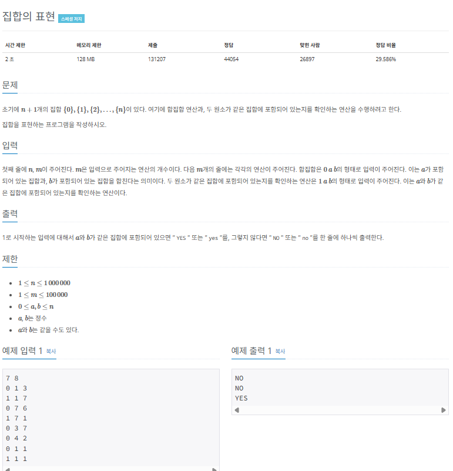

### $[01단계]$ 문제 분석하기

최대 원소의 개수 1,000,000과 질의 개수 100,000이 큰 편이므로 경로 압축이 필요한 전형적인 유니온 파인드 문제입니다. 앞에서 설명했던 핵심 이론을 실제 코드로 구현하면서 유니온 파인드 원리에 관해 좀 더 정확하게 이해하길 바랍니다.

### $[02단계]$ 손으로 풀어보기

1. 처음에는 노드가 연결되 있지 않으므로 각 노드의 대표 노드는 자기 자신입니다. 각 노드의 값을 자기 인덱스값으로 초기화합니다.

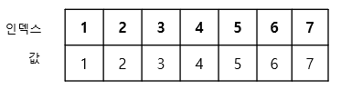

2. find 연산으로 특정 노드의 대표 노드를 찾고, union 연산으로 2개의 노드를 이용해 각 대표 노드를 찾아 연결합니다. 그리고 질의한 값에 따라 결과를 반환합니다.

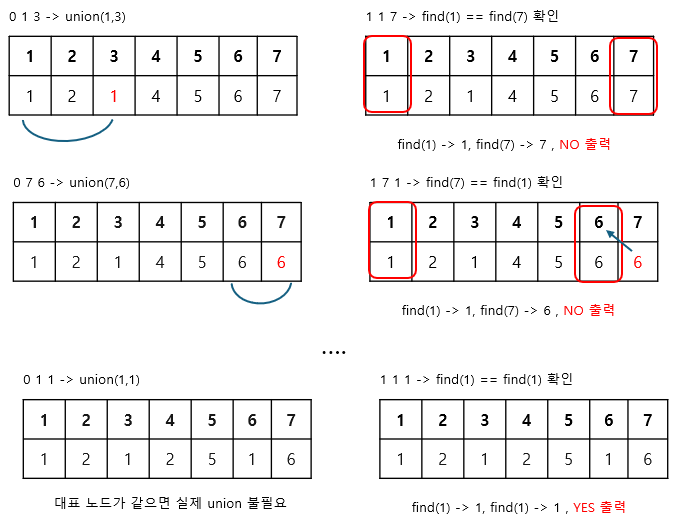

> 유니온 파인드에서 자주 실수하는 부분

find 연산을 수행할 때 재귀 함수에서 나오면서 탐색한 모든 노드의 대표 노드값을 이번 연산에서 발견한 대표 노드로 변경하는 부분과 union 연산에서 선택된 노드끼리 연결하는 것이 아닌 선택된 노드의 대표 노드끼리 연결하는 부분이 유니온 파인드에서 가장 많이 실수하는 부분입니다.

### $[03단계]$ 슈도코드 구현하기

```
N(운서 개수), M(질의 개수)
parent (대표 노드 저장 배열)

for (N만큼 반복) {
   대표 노드를 자기 자신으로 초기화
}
for (M만큼 반복) {
   if (0이면) 집합 합치기 -> union 연산
   else 같은 집합 원소인지 확인하고 결괏값 출력
}

// union 연산
unionfunc (a, b) {
   a와 b의 대표 노드 찾기
   두 원소의 대표 노드끼리 연결
}

// find 연산
find (a) {
   a가 대표 노드면 반환
   아니면 a의 대표 노드값을 find(parent[a]) 값으로 저장 -> 재귀 함수 형태
}

// checkSame : 두 원소가 같은 집합인지 확인
checkSame (a, b) {
   a와 b의 대표 노드 찾기
   두 대표 노드가 같으면 true
   아니면 false return;
}
```

### $[04단계]$ 코드 구현하기

```c
#include <iostream>
#include <vector>

using namespace std;
static vector<int> parent;

void unionfunc(int a, int b);

int find(int a);

bool checkSame(int a, int b);

int main() {
    int N, M;
    cin >> N >> M;
    parent.resize(N + 1);

    // 대표 노드를 자기 자신으로 초기화하기
    for (int i = 0; i <= N; i++) {
        parent[i] = i;
    }
    for (int i = 0; i < M; i++) {
        int question, a, b;
        cin >> question >> a >> b;

        if (question == 0) {
            unionfunc(a, b);
        } else {
            // 같은 집합 원소인지 확인하기
            if (checkSame(a, b)) {
                cout << "YES" << "\n";
            } else {
                cout << "NO" << "\n";
            }
        }
    }

    return 0;
}

// union 연산
void unionfunc(int a, int b) {
    a = find(a);
    b = find(b);

    if (a != b) {
        parent[b] = a;
    }
}

// find 연산
int find(int a) {
    if (a == parent[a]) {
        return a;
    }
    // 재귀 함수 형태로 구현
    return parent[a] = find(parent[a]);
}

// 두 원소가 같은 집합인지 확인
bool checkSame(int a, int b) {
    a = find(a);
    b = find(b);
    return a == b;
}
```

### $[문제054]$ 여행계획 짜기

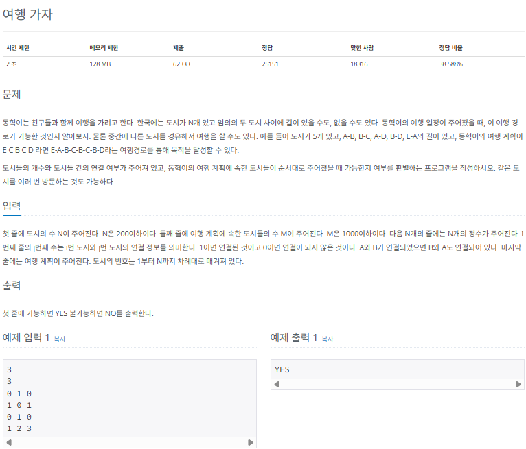

### $[01단계]$ 문제 분석하기

도시의 연결 여부를 유니온 파인드 연산을 이용해 해결할 수 있다는 아이디어를 떠올릴 수 있으면 쉽게 해결할 수 있는 문제입니다. 일반적으로 유니온 파인드는 그래프 영역에서 많이 활용되지만, 위 문제와 같이 단독으로 활용할 수 있다는 점도 참고하세요. 이 문제에서는 도시 간 연결 데이터를 인접 행렬의 형태로 주었기 때문에 인접 행렬을 탐색하면서 연결될 때마다 union 연산을 수행하는 방식으로 문제에 접근하면 됩니다.

### $[02단계]$ 손으로 풀어보기

1. 도시와 여행 경로 데이터를 저장하고 각 노드와 관련된 대표 노드 배열의 값을 초기화 합니다.

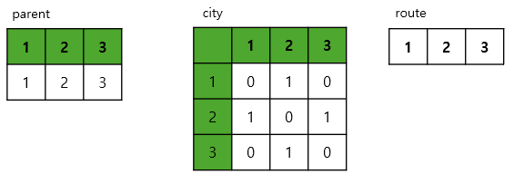

2. 도시 연결 정보가 저장된 인접 행렬을 탐색하면서 도시가 연결돼 있을 때 union 연산을 수행합니다.

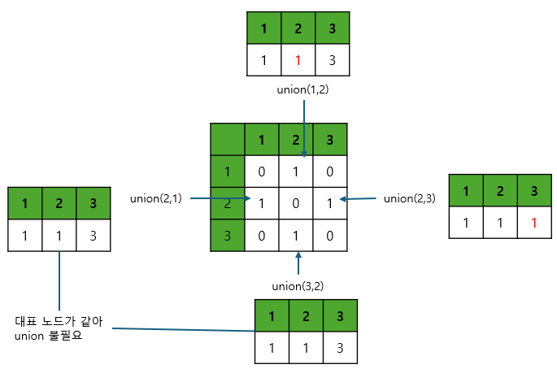

3. 여행 결로에 포함된 도시의 대표 노드가 모두 같은지 확인한 후 결괏값을 출력합니다.

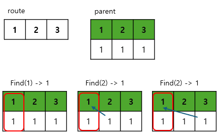

```
재귀 함수를 빠져나가면서 배열의 값을 대표 노드로 변경
=> 경로 압축
=> 여행 경로에 있는 모든 도시의 대표 도시가 1로 같으므로 YES 출력
```

### $[03단계]$ 슈도코드 구현하기

```
N(도시 수), M(여행 계획에 속한 도시의 수)
dosi (도시 연결 데이터 배열), route (여행 계획 도시 저장 배열)

for (N만큼 반복) {
   for (N만큼 반복) {
      dosi 데이터 저장
   }
}
for (M만큼 반복) {
   route 데이터 저장
}
for (N만큼 반복) {
   대표 노드를 자기 자신으로 초기화
}

// 인접 행렬 탐색
for (i -> N만큼 반복) {
   for (j -> N만큼 반복) {
      dosi[i][j] == 1이면, 즉 도시가 연결돼 있으면 union 연산
   }
}
for (M만큼 반복) {
   route에 포함된 노드의 대표 노드가 모두 같은지 확인한 후 결괏값 출력
}

// union 함수 구현
unionfunc(a, b) {
   a와 b의 대표 노드 찾기
   두 원소의 대표 노드끼리 연결
}

// find 함수 구현
find (a) {
   a가 대표 노드면 반환
   아니면 a의 대표 노드값을 find(parent[a])값으로 저장 -> 재귀 함수 형태
}
```

### $[04단계]$ 코드 구현하기

```c
#include <iostream>
#include <vector>

using namespace std;
static vector<int> parent;

void unionfunc(int a, int b);

int find(int a);


int main() {
    int N, M;
    cin >> N >> M;
    int dosi[201][201];

    // 도시 연결 데이터 저장
    for (int i = 1; i <= N; i++) {
        for (int j = 1; j <= N; j++) {
            cin >> dosi[i][j];
        }
    }
    int route[1001];

    // 여행 도시 정보 저장
    for (int i = 1; i <= M; i++) {
        cin >> route[i];
    }

    // 대표 노드를 자기 자신으로 초기화
    parent.resize(N + 1);
    for (int i = 1; i <= N; i++) {
        parent[i] = i;
    }

    // 인접 행렬 탐색에서 도시가 연결되면 유니온 실행
    for (int i = 1; i <= N; i++)
        for (int j = 1; j <= N; j++) {
            if (dosi[i][j] == 1) {
                unionfunc(i, j);
            }
        }

    // 여행 계획 도시가 하나의 대표 도시로 연결되는지 확인
    int index = find(route[1]);
    bool connect = true;

    for (int i = 2; i<= M; i++) {
        if (index != find(route[i])) {
            cout << "NO" << "\n";
            connect = false;
            break;
        }
    }
    if (connect)
        cout << "YES" << "\n";

    return 0;
}

// union 연산
void unionfunc(int a, int b) {
    a = find(a);
    b = find(b);

    if (a != b) {
        parent[b] = a;
    }
}

// find 연산
int find(int a) {
    if (a == parent[a]) {
        return a;
    }
    // 재귀 함수 형태로 구현
    return parent[a] = find(parent[a]);
}
```

### $[문제055]$ 거짓말쟁이가 되긴 싫어

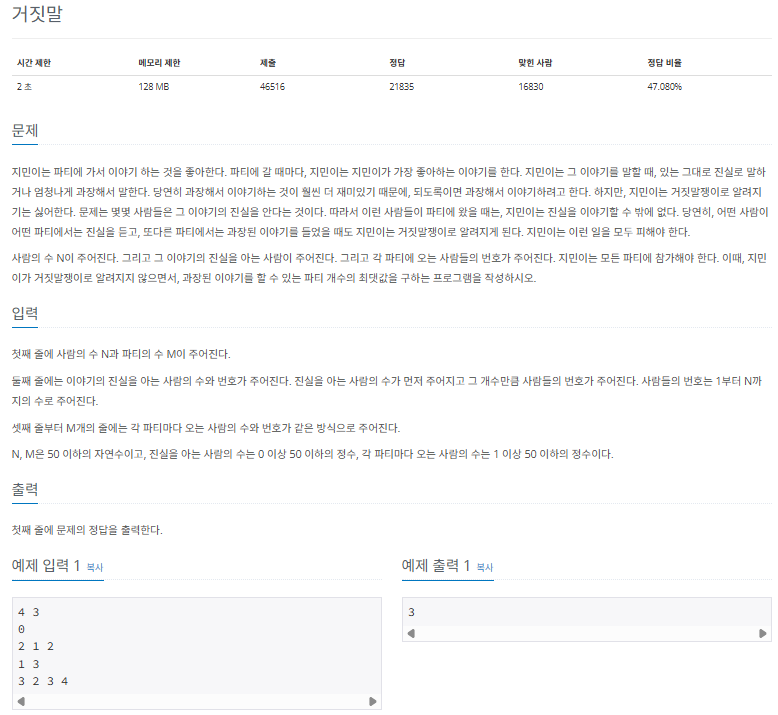

### $[01단계]$ 문제 분석하기

이 문제의 핵심은 파티에 참석한 사람들을 1개의 집합으로 생각하고, 각각의 파티마다 union 연산을 이용해 사람들을 연결하는 것입니다. 이 작업을 하면 1개의 파티에 참여한 모든 사람은 가틍ㄴ 대표 노드를 바라보게 됩니다. 이후 각 파티의 대표 노드와 진실을 아는 사람들의 각 대표 노드가 동일한지 find 연산을 이용해 확인함으로써 과장된 이야기를 할 수 있는지 판단할 수 있습니다.

### $[02단계]$ 손으로 풀어보기

1. 예제 입력 6을 이용해 문제를 풀어 보겠습니다. 진실을 아는 사람 데이터, 파티 데이터, 유니온 파인드를 위한 대표 노드 자료구조를 초기화합니다.

```
[1][2][3][4][5][6][7][8]
[1][2][3][4][5][6][7][8]
```

2. union 연산을 수행해 각 파티에 참여한 사람들을 1개의 그룹으로 만듭니다.

```
1. [2 3 4 => union(3,4)]
[1][2][3] [4] [5][6][7][8]
[1][2][3] [3] [5][6][7][8]

2. [1 5 => 1명이기 때문에 연산 불필요]

3. [2 5 6 => union(5,6)]
[1][2][3][4][5] [6] [7][8]
[1][2][3][3][5] [5] [7][8]

4. [2 6 8 => union(6,8)]
[1][2][3][4][5] [6] [7] [8]
[1][2][3][3][5] [5] [7] [5]

5. [1 8 => 1명이기 때문에 연산 불필요]
```

3. find 연산을 수행해 각 파티의 대표 노드와 진실을 아는 사람들이 같은 그룹에 있는지 확인합니다. 파티에 참여한 사람 노드는 모두 연결돼 있으므로 아무 사람이나 지정해 find 연산을 수행하면 됩니다.

```
[진실을 아는 사람들의 대표 노드 => find(1), find(2), find(7) => 1,2,7]
[1][2] [3][4][5][6] [7] [8]
[1][2] [3][3][5][5] [7] [5]
```

4. 모든 파티에 관해 과정 3을 반복해 수행하고, 모든 파티의 대표 노드가 진실을 아는 사람들과 다른 그룹에 있다면 결괏값을 증가 시킵니다.

```
1번째 파티 (3,4) => find(3) => 3: 일치하지 않으므로 과장할 수 있음
2번째 파티 (5)   => find(5) => 5: 일치하지 않으므로 과장할 수 있음
3번째 파티 (5,6) => find(5) => 5: 일치하지 않으므로 과장할 수 있음
4번째 파티 (6,8) => find(6) => 5: 일치하지 않으므로 과장할 수 있음
5번째 파티 (8)   => find(8) => 5: 일치하지 않으므로 과장할 수 있음

(만약 파티에서 임의로 지정한 사람의 find 연산값이 1,2 또는 7이었다면 과장할 수 없음)
```

### $[04단계]$ 코드 구현하기

```c
#include <iostream>
#include <vector>

using namespace std;

static vector<int> parent;
static vector<int> trueP;
static vector<vector<int>> party;
static int result;

void unionfunc(int a, int b);

int find(int a);


int main() {
    int N, M, T;
    cin >> N >> M >> T;
    trueP.resize(T);

    // 진실을 아는 사람 저장
    for (int i = 0; i < T; i++) {
        cin >> trueP[i];
    }

    // 파티 데이터 저장
    party.resize(M);
    for (int i = 0; i < M; i++) {
        int party_size;
        cin >> party_size;

        for (int j = 0; j < party_size; j++) {
            int temp;
            cin >> temp;
            party[i].push_back(temp);
        }
    }

    // 대표 노드를 자기 자신으로 초기화하기
    parent.resize(N + 1);
    for (int i = 0; i <= N; i++) {
        parent[i] = i;
    }

    // 각 파티에 참여한 사람을 하나의 그룹으로 만들기 -> union 연산
    for (int i = 0; i < M; i++) {
        int firstPeople = party[i][0];
        for (int j = 1; j < party[i].size(); j++) {
            unionfunc(firstPeople, party[i][j]);
        }
    }

    // 각 파티에서 진실을 아는 사람과 같은 그룹에 있다면 과장할 수 없음
    for (int i = 0; i < M; i++) {
        bool isPossible = true;
        int cur = party[i][0];
        for (int j = 0; j < T; j++) {
            if (find(cur) == find(trueP[j])) {
                isPossible = false;
                break;
            }
        }
        if (isPossible) {
            result++;
        }
    }

    cout << result;
    return 0;
}

// union 연산
void unionfunc(int a, int b) {
    a = find(a);
    b = find(b);

    if (a != b) {
        parent[b] = a;
    }
}

// find 연산
int find(int a) {
    if (a == parent[a]) {
        return a;
    }
    // 재귀 함수 형태로 구현
    return parent[a] = find(parent[a]);
}
```
