## 위상 정렬

위상 정렬 (topology sort)은 사이클이 없는 방향 그래프에서 노드 순서를 찾는 알고리즘입니다.

|         기능          | 특징               | 시간 복잡도(노드 수:V, 에지 수 :E) |
| :-------------------: | :----------------- | :--------------------------------: |
| 노드 간의 순서를 결정 | 사이클이 없어야 함 |              O(V + E)              |

위상 정렬에서는 항상 유일한 값으로 정렬되지 않습니다. 또한 사이클이 존재하면 노드 간의 순서를 명확하게 정의할 수 없으므로 위상 정렬을 적용할 수 없습니다. 이 부분을 염두에 두고 위상 정렬에 관해 본격적으로 알아볼까요?

### 위상 정렬의 핵심 이론

위상 정렬은 다음과 같은 단계로 설명할 수 있습니다.

### 위상 정렬의 원리 이해하기

1. 진입 차수를 이해해 봅시다. 진입 차수 (in-degree)는 자기 자신을 가리키는 에지의 개수입니다. 다음을 보면 이차원 벡터로 그래프를 표현했습니다. 그래프는 사이클이 없는 상태입니다.

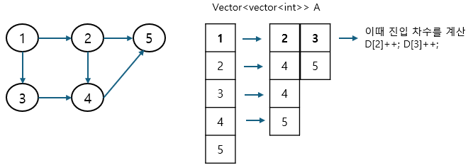

진입 차수 배열 D를 다음과 같이 업데이트합니다. 1에서 2,3을 가리키고 있으므로 D[2], D[3]을 각각 1만큼 증가시킵니다. 인접 리스트에 기반을 둔 진입 차수 배열은 다음과 같이 만들 수 있습니다.

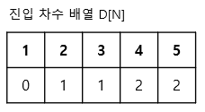

2. 진입 차수 배열에서 진입 차수가 0인 노드를 선택하고 선택된 노드를 정렬 배열에 저장합니다. 그 후 인접 리스트에서 선택된 노드가 가리키는 노드들의 진입 차수를 1씩 뺍니다.

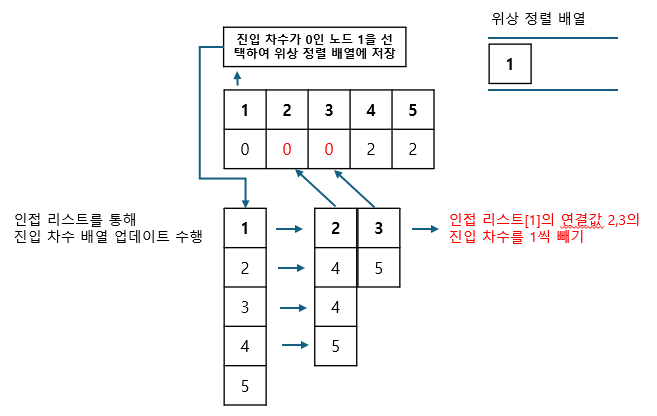

위 그림의 경우 진입 차수가 0인 노드 1을 선택하여 2,3의 진입 차수를 1씩 빼 D[2], D[3]을 0으로 만든 것입니다. 계속해서 다음 노드 2를 선택하여 반복합니다. 이 과정을 모든 노드가 정렬될 때까지 반복합니다. 여기서 진입 차수가 0인 노드 3을 먼저 선택했다면 3이 우선 위상 정렬 배열에 들어갈 것입니다. 앞서 위상 정렬이 늘 같은 정렬 결과를 보장하지 않는다고 말했던 것이 바로 이런 경우를 말합니다.

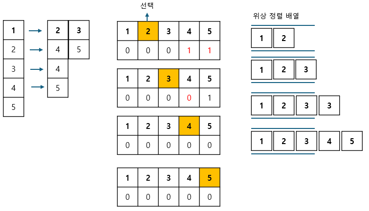

위상 정렬 배열 결과는 다음과 같습니다.

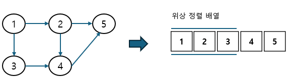

---

### $[문제056]$ 줄 세우기

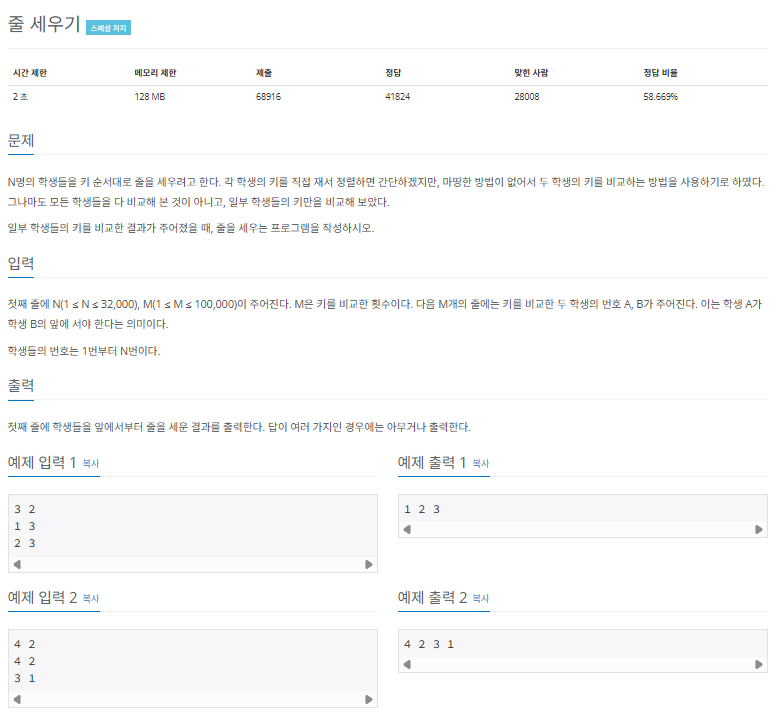

### $[01단계]$ 문제 분석하기

학생들을 노드로 생각하고, 키 순서 비교 데이터로 에지를 만든다고 생각했을 때 노드의 순서를 도출하는 가장 기본적인 문제입니다. 특히 답이 여러 개일때 아무것이나 출력해도 된다는 전제는 위상 정렬의 결괏값이 항상 유일하지 않다는 알고리즘의 전제와 동일하는 것을 알 수 있습니다.

### $[02단계]$ 손으로 풀어보기

1. 인접 리스트에 노드 데이터를 저장하고, 진입 차수 배열값을 업데이트 합니다.

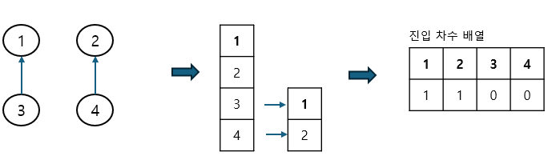

2. 다음 순서에 따라 위상 정렬을 수행합니다.

> 위상 정렬 수행 과정

1. 진입 차수가 0인 노드를 큐에 저장한다.
2. 큐에서 데이터를 봅아와서 해당 노드를 탐색 결과에 추가하고, 해당 노드가 가리키는 노드의 진입 차수를 1씩 감소한다.
3. 감소했을 때 진입 차수가 0이 되는 노드를 큐에 삽입한다.
4. 큐가 빌 때까지 1 ~ 3을 반복한다.

### $[03단계]$ 슈도코드 작성하기

```
N(학생 수), M(비교 횟수)
A(비교 데이터 저장 인접 리스트)
indegree(진입 차수 저장)
학생 수만큼 인접 리스트 크기 설정
진입 차수 배열 크기 설정

for (비교 횟수만큼 반복) {
  인전 리스트 데이터 저장
  진입 차수 배열 초기 데이터 저장
}

// 위상 정렬 수행
큐 생성

for (학생 수) {
  진입 차수 배열의 값이 0인 학생(노드를 큐에 삽입)
}
while (큐가 빌 때까지) {
  현재 노드 = 큐에서 데이터 가져오기
  현재 노드 값 출력
  for (현재 노드에서 갈 수 있는 노드의 개수) {
    타깃 노드 진입 차수 배열 --
    if (타깃 노드의 진입 차수가 0이면) {
      큐에 타깃 노드 추가
    }
  }
}
```

### $[04단계]$ 코드 구현하기

```c
#include <iostream>
#include <vector>
#include <queue>
using namespace std;

int main(int argc, char *argv[]) {
    int N, M;
    cin >> N >> M;
    vector<vector<int> > A;
    vector<int> indegree;
    A.resize(N + 1);
    indegree.resize(N + 1);

    for (int i = 0; i < M; i++) {
        int S, E;
        cin >> S >> E;
        A[S].push_back(E);
        indegree[E]++; // 진입 차수 배열 데이터 저장하기
    }

    // --- 위상 정렬 수행
    queue<int> myqueue;

    for (int i = 1; i <= N; i++) {
        if (indegree[i] == 0) {
            myqueue.push(i);
        }
    }

    while (!myqueue.empty()) {
        int now = myqueue.front();
        myqueue.pop();
        cout << now << " ";
        for (int next: A[now]) {
            indegree[next]--;
            if (indegree[next] == 0) {
                myqueue.push(next);
            }
        }
    }
    // ---
}
```

### $[문제057]$ 게임 개발하기

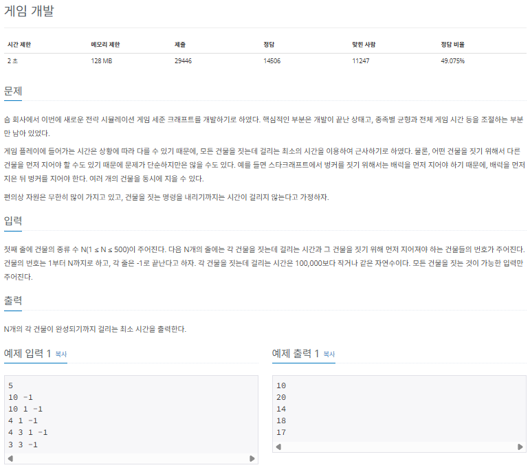

### $[01단계]$ 문제 분석하기

이 문제를 풀기 위해서는 어떤 건물을 짓기 위해 먼저 지어야 하는 건물이 있을 수 있다라는 문장에 주목해야 합니다. 각 건물을 노드라고 생각하면 그래프 형태에서 노드 순서를 정렬하는 아록리즘인 위상 정렬을 사용하는 문제라는 것을 눈치챌 수 있습니다. 건물의 수가 최대 500, 시간 복잡도가 2초이므로 시간 제한 부담은 거의 없습니다.

### $[02단계]$ 손으로 풀어보기

1. 입력 데이터를 바탕으로 필요한 자료 구조를 초기화합니다. 진입 차수 배열은 [0,1,1,1,2,1], 정답 배열은 모두 0으로 초기화 합니다.

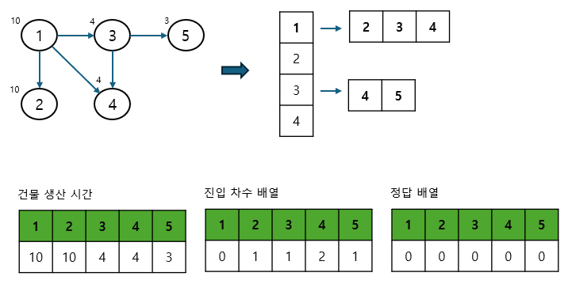

2. 위상 정렬을 실행하면서 각 건물을 짓는 데 걸리는 최대 시간을 업데이트합니다. 최대 시간은 다음과 같이 두 값 중 더 큰 값으로 업데이트 합니다.\

> 진입 차수 배열과 위상 정렬 배열, 정답 배열 업데이트 방법

- max( 현재 건물(노드)에 저장된 최대 시간, 이전 건물(노드)에 저장된 최대 시간 + 현재 건물(노드)의 생산시간 )


3. 정답 배열에 자기 건물을 짓는데 걸리는 시간을 더한 후 정답 배열을 차례대로 출력합니다.

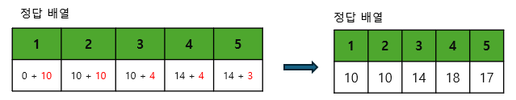

### $[03단계]$ 슈도코드 작성하기

```
N(건물의 종류)
A(인접 리스트)
indegree(진입 차수 배열)
selfBuild (건물은 짓는 데 걸리는 시간 저장 배열)

건물의 개수만큼 인접 리스트 크기 설정
진입 차수 배열 크기 설정
건물을 짓는 데 걸리는 시간 저장 배열 크기 설정

// 각종 데이터 저장
for (건물의 개수) {
  인접 리스트 데이터 저장
  진입 차수 배열 초기 데이터 저장
  건물을 짓는 데 걸리는 시간 데이터 저장
}

// 위상 정렬 수행
큐 생성

for (건물 수) {
  진입 차수 배열의 값이 0인 건물(노드) 를 큐에 삽입
}

while (큐가 빌 때까지) {
  현재 노드 = 큐에서 데이터 가져오기
  for (현재 노드에서 갈 수 있는 노드의 개수) {
    타깃 노드 진입 차수 배열 --
    결과 노드 업데이트 = max (현재 저장된 값, 현재 출발 노드 + 비용)
    if (타깃 노드의 진입 차수가 0이면) {
      우선순위 큐에 타깃 노드 추가
    }
  }
}
```

### $[04단계]$ 코드 구현하기

```c
#include <iostream>
#include <vector>
#include <queue>
using namespace std;

int main(int argc, char *argv[]) {
    int N;
    cin >> N;
    vector<vector<int> > A;
    vector<int> indegree; // 진입 차수 배열
    vector<int> selfBuild; // 건물은 짓는 데 걸리는 시간 저장 배열
    A.resize(N + 1);
    indegree.resize(N + 1);
    selfBuild.resize(N + 1);

    for (int i = 1; i <= N; i++) {
        // 해당 건물을 짓는 데 걸리는 시간
        cin >> selfBuild[i];
        // 인접 리스트 데이터 저장
        while (true) {
            int preTemp;
            cin >> preTemp;

            if (preTemp == -1) {
                break;
            }
            A[preTemp].push_back(i);
            indegree[i]++; // 진입 차수 데이터 저장
        }
    }

    // --- 위상 정렬 수행
    queue<int> myqueue;

    for (int i = 1; i <= N; i++) {
        if (indegree[i] == 0) {
            myqueue.push(i);
        }
    }

    vector<int> result;
    result.resize(N + 1);

    while (!myqueue.empty()) {
        int now = myqueue.front();
        myqueue.pop();

        for (int next: A[now]) {
            indegree[next]--;
            result[next] = max(result[next], result[now] + selfBuild[now]);
            if (indegree[next] == 0) {
                myqueue.push(next);
            }
        }
    }

    for (int i = 1; i <= N; i++) {
        cout << result[i] + selfBuild[i] << " ";
    }

    return 0;
}
```

### $[문제058]$ 임계 경로 구하기

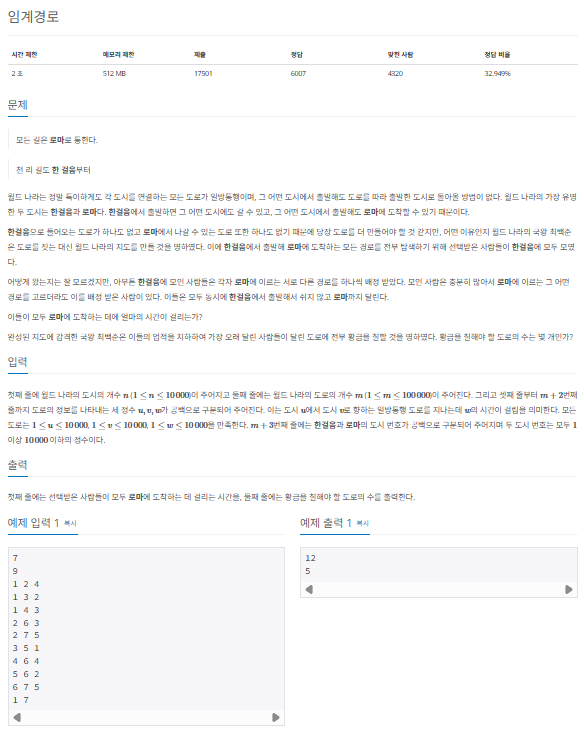

### $[01단계]$ 문제 분석하기

출발 도시와 도착 도시가 주어지기 때문에 일반적인 위상 정렬이 아닌 시작점을 출발도시로 지정하고 위상 정렬을 수행하면 출발 도시에서 도착 도시까지 거치는 모든 도시와 관련된 임계 경로값을 구할 수 있습니다. 단, 이 문제의 핵심은 1분도 쉬지 않고 달려야 하는 도로의 수를 구하는 것인데, 이를 해결하려면 에지 뒤집기라는 아이디어가 필요합니다.

에지 뒤집기 아이디어는 그래프 문제에서 종종 나오는 개념이므로 이 문제를 이용해 학습해 봅시다.

### $[02단계]$ 손으로 풀어보기

1. 인접 리스트에 노드 데이터를 저장하고, 진입 차수 배열의 값을 업데이트합니다. 이때 에지의 방향이 반대인 역방향 인접 리스트도 함께 생성하고 저장합니다.

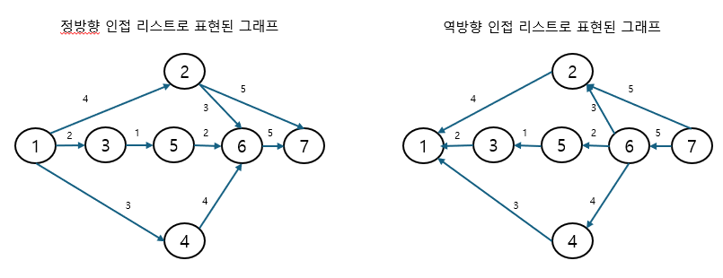

2. 시작 도시에서 위상 정렬을 수행해 각 도시와 관련된 임계 경로를 저장합니다.

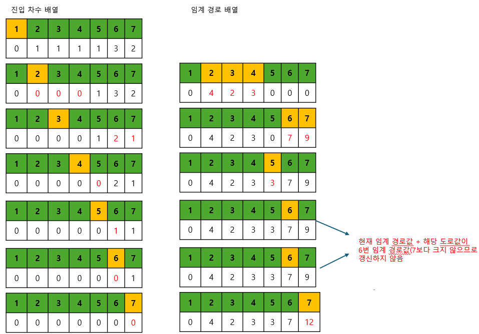

3. 도착 도시에서 역방향으로 위상 정렬을 수행합니다. 이때 '이 도시의 임계 경로값 + 도로 시간(에지) == 이전 도시의 임계 경로값'일 경우에는 이 도로를 1분도 쉬지 않고 달려야 하는 도로로 카운팅 하고, 이 도시를 큐에 삽입하는 로직을 구현해야 합니다.

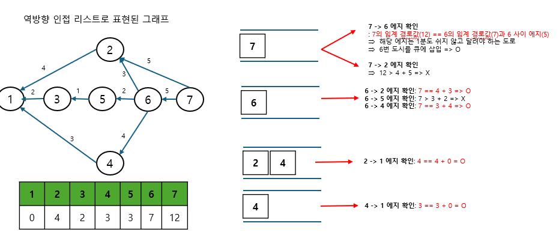

4. 도착 도시의 임계 경로값(12)과 1분도 쉬지 않고 달려야 하는 도로의 수(5)를 출력합니다.

> 노드를 큐에 삽입할 때 주의점

1분도 쉬지 않고 달려야 하는 도로로 이어진 노드와 연결된 다른 도로만이 1분도 쉬지 안혹 달령 ㅑ하는 도로의 후보가 될 수 있으므로 이 매커니즘을 바탕으로 노드를 큐에 삽입해야 합니다. 또한 중복으로 도로를 카운트하지 않기 위해 이미 방문한 적이 있는 노드는 큐에 넣어 주지 않습니다. 기존의 위상 정렬 방식을 완벽하게 이해하고, 요구 사항에 따라 적절하게 로직을 수정할 수 있어야만 문제를 풀 수 있기 때문에 많이 고민해야 합니다.

### $[03단계]$ 슈도코드 작성하기

```
N (도시 수), M(도로 수)
A(도시 인접 리스트)
reverseA (역방향 도시 인접 리스트)
indegree (진입 차수 배열)
도시 수 만큼 도시 인접 리스트, 역방향 도시 인접 리스트, 진입 차수 배열 크기 설정

for (도시 수만큼 반복) {
  인접 리스트 데이터 저장
  역방향 인접 리스트 데이터 저장
  진입 차수 배열 초기 데이터 저장
}

startDosi(시작 도시 저장)
endDosi(도작 도시 저장)

// 위상 정렬 수행
큐 생성하기
출발 도시를 큐에 삽입
result(각 도시의 최대 걸리는 시간 저장 - 임계 경로 값)

while (큐가 빌 때까지) {
  현재 노드 = 큐에서 데이터 가져오기

  for (현재 노드에서 갈 수 있는 노드의 수) {
    타깃 노드 진입 차수 배열 --
    result = 타깃 노드의 현재 경로값과 현재 노드의 경로값 + 도로 시간값 중 큰 값으로 저장
    if (타깃 노드의 진입 차수가 0이면) 큐에 타깃 노드 추가
  }
}

// 위상 정렬 역방향 수행
resultCount(1분도 쉬지 않고 달려야 하는 도로의 수)
visited(각 도시의 방문 여부 저장)
도착 도시를 규에 삽입
visited 배열에 도착 도시를 방문 도시로 표시

while (큐가 빌 때까지) {
  현재 노드 = 큐에서 데이터 가져오기

  for (현재 노드에서 갈 수 있는 노드의 개수 -> 역방향 인접 리스트 기준) {
    if (타깃 노드의 result값 + 도로를 지나는 데 걸리는 시간 (에지) == 현재 노드의 result 값) {
      1분도 쉬지 않고 달려야 하는 도로값 1 증가
      if (아직 방문하지 않은 도시이면) {
        visited 배열에 방문 도시 표시
        큐에 타깃 노드 추가
      }
    }
  }
}
```

### $[04단계]$ 코드 구현하기

```c
#include <iostream>
#include <vector>
#include <queue>
using namespace std;

int main(int argc, char *argv[]) {
    int N, M;
    cin >> N >> M;

    vector<vector<pair<int, int> > > A;
    vector<vector<pair<int, int> > > reverseA;
    vector<int> indegree; // 진입 차수 배열
    A.resize(N + 1);
    reverseA.resize(N + 1);
    indegree.resize(N + 1);

    for (int i = 0; i < M; i++) {
        int S, E, V;
        cin >> S >> E >> V;
        A[S].push_back(make_pair(E, V));
        reverseA[E].push_back(make_pair(S, V)); // 역방향 에지 정보 저장
        indegree[E]++; // 진입 차수 배열 저장
    }

    int startDosi, endDosi;
    cin >> startDosi >> endDosi;

    // --- 위상 정렬 수행
    queue<int> mqueue;
    mqueue.push(startDosi);
    vector<int> result;
    result.resize(N + 1);

    while (!mqueue.empty()) {
        int now = mqueue.front();
        mqueue.pop();

        for (pair<int, int> next: A[now]) {
            indegree[next.first]--;
            result[next.first] = max(result[next.first], result[now] + next.second);
            if (indegree[next.first] == 0) {
                mqueue.push(next.first);
            }
        }
    }

    // --- 위상 정렬 reverse 수행
    int resultCount = 0;
    vector<bool> visited;
    visited.resize(N + 1);
    queue<int> rqueue;
    rqueue.push(endDosi);
    visited[endDosi] = true;

    while (!rqueue.empty()) {
        int now = rqueue.front();
        rqueue.pop();

        for (pair<int, int> next: reverseA[now]) {
            // 1분도 쉬지 않는 도로 체크
            if (result[next.first] + next.second == result[now]) {
                resultCount++;
                // 중복 카운트 방지를 위해 이미 방문한 노드 제외
                if (visited[next.first] == false) {
                    visited[next.first] = true;
                    rqueue.push(next.first);
                }
            }
        }
    }

    cout << result[endDosi] << "\n";
    cout << resultCount << "\n";
    return 0;
}
```
