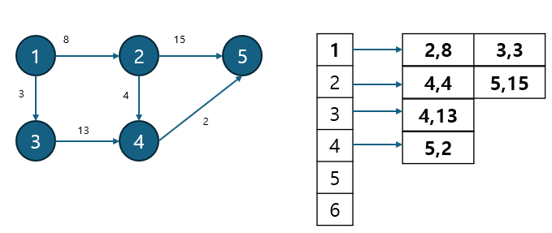
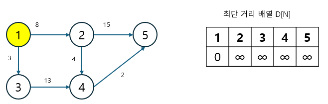
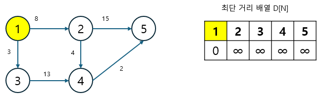
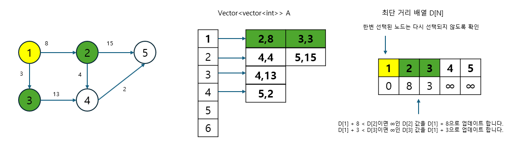
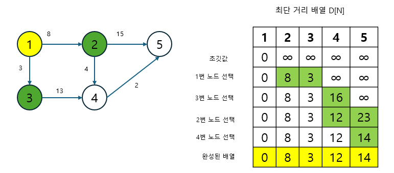
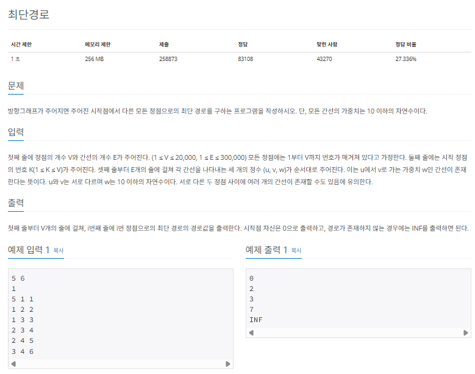
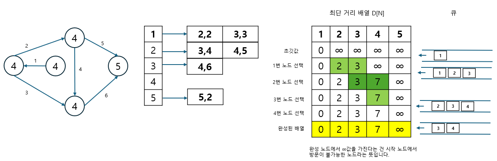
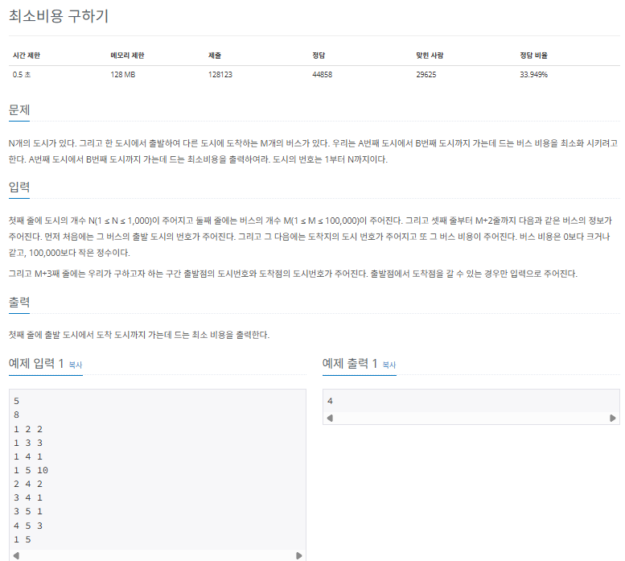
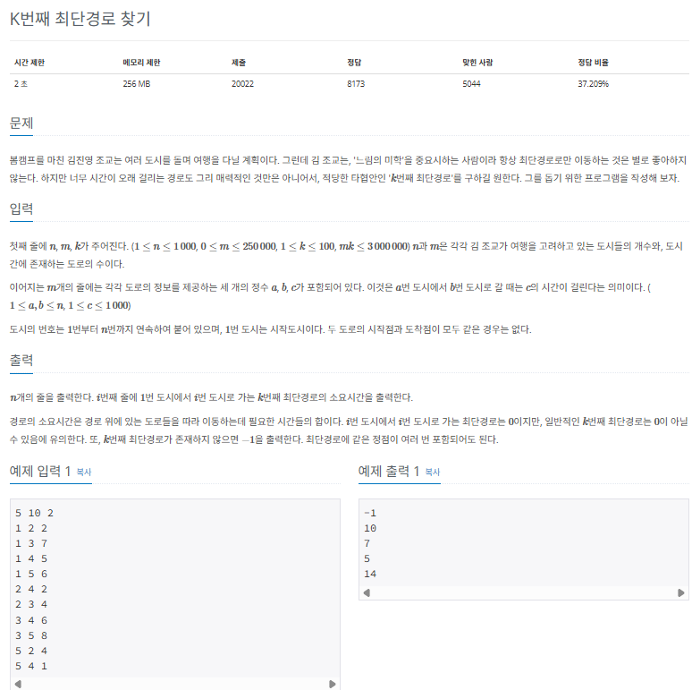

## 다익스트라

다익스트라 (dijkstra)알고리즘은 그래프에서 최단 거리를 구하는 알고리즘으로, 주요 특징을 다음과 같습니다.

|                   기능                   | 특징             | 시간 복잡도(노드 수:V, 에지 수 :E) |
| :--------------------------------------: | :--------------- | :--------------------------------: |
| 출발 노드와 모든 노드간의 최단 거리 탐색 | 에지는 모두 양수 |             $O(ElogV)$             |

특정 노드에서 다른 노드들의 최단 거리를 구하는 문제가 주어졌을 때 다익스트라 알고리즘을 사용하면 문제를 해결할 수 있습니다.

### 다익스트라 알고리즘의 핵심 이론

### 1. 인전 리스트로 구래프 구현하기

먼저 다음과 같이 주어진 그래프를 인접 리스트로 구현합니다.



다익스트라 알고리즘은 인접 행렬로 구현해도 좋지만 시간 복잡도 측면과 N의 크기가 클 것을 대비해 인접 리스트를 선태갛여 구현하는 것이 좋습니다. 그래프의 연결을 표현하기 위해 인접 리스트에 연결한 배열의 자료형은 (노드,가중치)와 같은 형태로 선언하여 사용한 점도 눈여겨보기 바랍니다.

### 2. 최단 거리 배열 초기화하기

최단 거리 배열을 만들고, 출발 노드는 0, 이외의 노드는 무한(∞)으로 초기화합니다. 이때 무한은 적당히 큰 값을 사용하면 됩니다. 우선 표기는 ∞으로 하겠습니다.

> ∞은 실제 구현 시 아주 큰 값, 예를 들어 문제에서 주어진 모든 에지의 합보다 충분히 더 큰 수로 정하면 됩니다.



### 3. 값이 가장 작은 노드 고르기

최단 거리 배열에서 현재 값이 가장 작은 노드를 고릅니다. 여기서는 값이 0인 출발 노드에서 시작하면 됩니다.



### 4. 최단 거리 배열 업데이트하기

선택된 노드에 연결된 에지의 값을 바탕으로 다른 노드의 값을 업데이트합니다. 1단계에서 저장한 입접 리스트를 이용해 현재 선택한 노드의 에지를 탐색하고 업데이트하면 됩니다. 연결노드의 최단 거리는 다음과 같이 두 값 중 더 작은 값으로 업데이트합니다.

> 최단 거리 어벧이트 방법

```
Min(선택 노드의 최단 거리 배열의 값 + 에지 가중치, 연결노드의 최단 거리 배열의 값)
```



### 과정 3 ~ 4를 반복해 최단 거리 배열 완성하기

모든 노드가 처리될 때까지 과정 3~4를 반복합니다. 과정 4에서 선택되었던 노드가 다시 선택되지 않도록 방문 배열을 만들어 처리하고, 모든 노드가 선택될 때까지 반복하면 최단 거리 배열이 완성됩니다.



이렇게 다익스트라 알고리즘의 핵심 이론을 알아봤습니다. 다시 한번 정리하면 다익스트라 알고리즘은 출발 노드와 그 외 노드 간의 최단거리를 구하는 알고리즘이고, 에지는 항상 양수여야 한다는 제약 조건이 잇습니다. 많은 사람이 다익스트라 알고리즘이 출발 노드와 도착 노드 간의 최단 거리를 구하는 알고리즘이라고 생각하는 경향이 있는데, 실제로 완성된 배열은 출발 노드와 이외의 모든 노드 간의 최단 거리를 표현합니다. 가끔 이 부분이 코딩 테스트에서 문제로 나올 때가 있으므로 꼭 숙지하기 바랍니다.

---

### $[문제059]$ 최단 경로 구하기



### $[01단계]$ 문제 분석하기

시작점에서 다른 노드까지 최단 거리를 구하는 문제로, 다익스트라 알고리즘의 가장 기본적인 형태로 구현할 수 있는지를 묻고 있습니다.

### $[02단계]$ 손으로 풀어보기

1. 인접 리스트에 노드를 저장하고 거리 배열을 초기화합니다. 거리 배열은 앞에서 설명했듯이 출발 노드는 0, 나머지는 무한으로 초기화합니다.
2. 최초 시작점을 큐에 삽입하고, 다음 과정에 따라 다익스트라 알고리즘을 수행합니다.

> 다익스트라 알고리즘 수행 과정

1. 거리 배열에서 아직 방문하지 않은 노드 중 현재 값이 가장 작은 노드를 선택한다.
2. 해당 노드와 연결된 노드들의 최단 거릿값을 다음 공식을 이용해 업데이트한다.
   1. [연결 노드 거리 배열값]보다 [선택 노드의 거리 배열값 + 에지 가중치]가 더 작은 경우 업데이트를 수행
   2. 업데이트가 수행되는 경우 연결 노드를 우선순위 큐에 삽입
3. 큐가 빌 때까지 1~2를 반복한다.

4. 완성된 거리 배열의 값을 출력합니다.



### $[03단계]$ 슈도코드 작성하기

```
mlist (그래프 정보 저장 인접 리스트)
mdistance (최단 거리 저장 배열)
visited (노드 사용 여부 저장)
q (다익스트라 알고리즘 수행을 위한 우선순위 큐) // 오름차순 정렬로 선언

V (노드 개수)
E (에지 개수)
K (출발 노드)
거리 배열은 충분히 큰 수로 초기화

for (에지 개수) {
  인접 리스트 배열에 에지 정보를 저장
}

다익스트라 알고리즘 수행
출발 노드를 우선순위 큐에 넣고 시작 // 자동으로 거리가 최소인 노드를 선택하게 함

while (큐가 빌 때까지) {
  현재 선택한 노드를 방문한 적이 있는지 확인
    현재 노드를 방문 노드로 업데이트
    for (현재 선택 노드의 에지 개수) {
      if (타깃 노드 방문 전 && 현재 선택 노드 최단 거리 + 비용 < 타깃 노드의 최단 거리) {
        타깃 노드 최단 거리 업데이트
        우선순위 큐에 타깃노드 추가
      }
    }
}

완성된 거리 배열을 탐색해 출력
```

### $[04단계]$ 코드 구현하기

```c
#include <iostream>
#include <vector>
#include <queue>
#include <limits>

using namespace std;

typedef pair<int, int> edge;
static int V, E, K; // 노드 개수, 에지 개수, 출발 노드
static vector<int> mdistance;
static vector<bool> visited;
static vector<vector<edge> > mlist;
static priority_queue<edge, vector<edge>, greater<edge> > q;

int main(int argc, char *argv[]) {
    cin >> V >> E >> K;
    mdistance.resize(V + 1);
    std::fill(mdistance.begin(), mdistance.end(), INT_MAX);
    visited.resize(V + 1);
    std::fill(visited.begin(), visited.end(), false);
    mlist.resize(V + 1);

    // 가중치가 있는 인접 리스트 초기화
    for (int i = 0; i < E; i++) {
        int u, v, w;
        cin >> u >> v >> w;
        mlist[u].push_back(make_pair(v, w));
    }

    // --- 다익스트라 알고리즘 수행
    q.push(make_pair(0, K));
    mdistance[K] = 0;

    while (!q.empty()) {
        edge current = q.top();
        q.pop();
        int c_v = current.second;
        // 이미 방문한 노드는 다시 큐에 넣지 않음
        if (visited[c_v]) {
            continue;
        }
        visited[c_v] = true;

        for (int i = 0; i < mlist[c_v].size(); i++) {
            edge tmp = mlist[c_v][i];
            int next = tmp.first;
            int value = tmp.second;

            // 최소 거리로 업데이트
            if (mdistance[next] > mdistance[c_v] + value) {
                mdistance[next] = mdistance[c_v] + value;
                q.push(make_pair(mdistance[next], next));
            }
        }
    }
    // --- 다익스트라 알고리즘 종료

    for (int i = 1; i <= V; i++) {
        if (visited[i]) {
            cout << mdistance[i] << "\n";
        } else {
            cout << "INF" << "\n";
        }
    }
    return EXIT_SUCCESS;
}
```

### $[문제060]$ 최단 경로 구하기



### $[01단계]$ 문제 분석하기

시작점과 도착점이 주어지고, 이 목적지까지 가는 최소 비용(최단 거리)를 구하는 문제입니다. 또한 버시 비용의 범위가 음수가 아니기 때문에 이 문제는 다익스트라 알고리즘을 이용해 해결할 수 있습니다. 도시의 개수가 최대 1,000개 이므로 인접 행렬 방식으로도 그래프를 표현할 수 있지만, 시간 복잡도나 공간 효율성 측면을 고려해 입적 리스트 자료구조를 선택했습니다.

### $[03단계]$ 슈도코드 작성하기

```
mlist (그래프 정보 저장)
dist (최단 거리 저장)
visited (노드 사용 여부 저장)
N (노드 수), M(에지 수)
거리 배열은 충분히 큰 수로 초기화

for (에지 개수) {
  인접 리스트 배열에 에지 정보를 저장
}
startIndex (시작점)
endIndex  (도착점)

시작점을 기준으로 다익스트라 수행
최단 거리 배열에서 목적지 길이를 찾아 출력

---
// 다익스트라 함수 별도 구현
다익스트라 (시작점, 종료점) {
  // 자동으로 거리가 최소인 노드를 선택할 수 있게 해주는 자료 구조
  시작점을 오름차순 우선순위 큐에 넣고 시작
  while (큐가 빌 때까지) {
    현재 선택한 노드를 방문한 적이 있는지 확인하기
    현재 노드를 방문 노드로 업데이트하기
    for (현재 선택 노드의 에지 개수) {
      if (타깃 노드 방문 전 && 현재 선택 노드 최단 거리 + 비용 < 타깃 노드의 최단 거리) {
        타깃 노드 최단 거리 업데이트
        우선순위 큐에 타깃노드 추가
      }
    }
  }
}
```

### $[04단계]$ 코드 구현하기

```c
#include <iostream>
#include <vector>
#include <queue>
#include <limits>

using namespace std;

typedef pair<int, int> edge;
static int N, M; // 노드 수, 에지 수
static vector<int> dist;
static vector<bool> visited;
static vector<vector<edge> > mlist;


int dijkstra(int start, int end);

int main(int argc, char *argv[]) {
    cin >> N >> M;
    dist.resize(N + 1);
    std::fill(dist.begin(), dist.end(), INT_MAX);
    visited.resize(N + 1);
    std::fill(visited.begin(), visited.end(), false);
    mlist.resize(N + 1);

    // 가중치가 있는 인접 리스트 초기화
    for (int i = 0; i < M; i++) {
        int start, end, weight;
        cin >> start >> end >> weight;
        mlist[start].push_back(make_pair(end, weight));
    }

    int startIndex, endIndex;
    cin >> startIndex >> endIndex;

    int result = dijkstra(startIndex, endIndex);
    cout << result << "\n";

    return EXIT_SUCCESS;
}

// 다익스트라 알고리즘
int dijkstra(int start, int end) {
    // 비용 기준 정렬을 위한 데이터 순서를 비용,노드로 설정
    priority_queue<edge, vector<edge>, greater<edge> > pq;
    pq.push(make_pair(0, start));
    dist[start] = 0;

    while (!pq.empty()) {
        edge nowNode = pq.top();
        pq.pop();

        int now = nowNode.second;

        if (!visited[now]) {
            visited[now] = true;
            // 선택 노드 + 비용 < 타깃 노드일 때 값을 갱신하는 부분
            for (edge n: mlist[now]) {
                if (dist[n.first] > dist[now] + n.second) {
                    dist[n.first] = dist[now] + n.second;
                    pq.push(make_pair(dist[n.first], n.first));
                }
            }
        }
    }
    return dist[end];
}
```

### $[문제061]$ K번째 최단 경로 찾기



### $[01단계]$ 문제 분석하기

시작점과 도착점이 주어지고 목적지까지 가는 K번째 최단 경로를 구하는 문제입니다. 도시(노드)의 개수는 1,000개, 도로(에지)의 개수는 2,000,000개이면서 시간 제약이 2초이므로 다익스트라 알고리즘으로 접근해 보겠습니다. 이 문제에서 가장 고민되는 부분은 최단 경로가 아니라 K번째 최단 경로라는 것입니다. 이 부분을 어떻게 해결할 수 있을까요? 다음과 같이 변경해 보려고 합니다.

> K번째 최단 경로 해결 방법

1. 최단 경로를 표현하는 배열을 우선순위 큐 배열(크기는 K)로 변경하고자 한다. 이렇게 하면 최단 경로뿐 아니라 최단 경로 ~ K번째 최단 경로까지 표현할 수 있지 않을까?
2. 기존 다익스트라 로직에서 사용한 노드를 방문 배열에 체크해 두고 다음 도착 시 해당 노드를 다시 사용하지 않도록 설정하는 부분은 삭제가 필요해보인다. K번째 경로를 찾기 위해서는 노드를 여러번 쓰는 경우가 생기기 때문이다.

### $[02단계]$ 슈도코드 작성하기

1. 주어진 예제 데이터를 기반으로 그래프를 그립니다. 도시는 노드로, 도로는 에지로 나타냅니다.
2. 변수로 선언하고 그래프 데이터를 받는 부분은 모두 다익스트라 알고리즘 준비 과정과 동일합니다.
3. 최단 거리 배열을 우선순위 큐 배열로 선언하고, 다음과 같은 기준을 세워 채워야 합니다. 예제에서 주어진 입력에서는 K = 2이지만, 여기서 이해를 돕고자 K = 3일 때를 계산해 보겠습니다.

> 최단 거리 배열 채우기 규칙

1. 현재 노드에 저장된 경로가 K개 미만일 때 신규 경로를 추가한다.
2. 경로가 K개일 때 현재 경로 중 최대 경로와 신규 경로를 비교해 신규 경로가 더 작을 때 업데이트한다. 우선 순위 큐를 사용하면 이 로직을 쉽게 구현할 수 있다.
3. K 번째 경로를 찾으려면 노드를 여러 번 쓰는 경우가 생기므로 사용한 노드를 방문 배열에 기록하는 부분은 삭제한다.

4. 최단 거리 배열을 탐색하면서 K번째 경로가 존재하면 출력하고, 존재하지 않으면 -1을 출력한다.

### $[03단계]$ 슈도코드 작성하기

```
N (노드 개수), M (에지 개수)
K (몇 번째 최단 경로를 구해야 하는지 나타내는 변수)
W (그래프 정보 저장 인접 행렬)
distQueue (거리를 나타내는 우선순위 큐 배열)

for (에지 개수) {
  인접 행렬에 에지 정보를 저장
}

// --- 다익스트라 알고리즘 수행
출발 노드는 우선순위 큐에 넣고 시작 // 자동으로 거리가 최소인 노드를 선택할 수 있음
while (큐가 빌 때까지) {
  for (노드 개수만큼 반복하기) {
    if (해당 노드와 현재 노드가 연결되었다면) {

      if (최단 거리 배열 큐에 해당 노드에 관해 저장된 경로가 K보다 적으면) {
        최단 거리 큐 배열에 거리 정보를 삽입하고 큐에 선택 노드를 추가
      }
      else if (최단 거리 큐의 마지막 값 > 이전 노드의 값 + 두 노드 사이의 에지 가중치) {
        해당 노드의 최단 거리 큐에 마지막 값 삭제하고 새로운 값으로 업데이트
        큐에 선택 노드를 추가
      }

    }
  }
}

// 최단 거리 배열 큐를 이용해 각 노드의 K번째 경로를 출력
for (노드 개수) {
  우선순위 큐 크기가 K이면 큐의 값 출력, 아니면 -1 출력
}
```

### $[04단계]$ 코드 구현하기

```c
#include <iostream>
#include <vector>
#include <queue>
using namespace std;

typedef pair<int, int> Node;
static int N, M, K;
static int W[1001][1001];
static priority_queue<int> distQueue[1001];

int main(int argc, char *argv[]) {
    cin >> N >> M >> K;

    // 가중치가 있는 인접 배열 초기화
    for (int i = 0; i < M; i++) {
        int a, b, c;
        cin >> a >> b >> c;
        W[a][b] = c;
    }

    // 다익스트라 알고리즘 수행
    priority_queue<Node, vector<Node>, greater<Node> > pq;
    pq.push(make_pair(0, 1)); // 가중치 0, 시작 노드 1번
    distQueue[1].push(0);

    while (!pq.empty()) {
        Node u = pq.top();
        pq.pop();

        for (int adjNode = 1; adjNode <= N; adjNode++) {
            // 연결된 모든 노드에 대해 검색하기
            if (W[u.second][adjNode] != 0) {
                // 저장된 경로가 K개가 안될 경우 그냥 추가하기
                if (distQueue[adjNode].size() < K) {
                    distQueue[adjNode].push(u.first + W[u.second][adjNode]);
                    pq.push(make_pair(u.first + W[u.second][adjNode], adjNode));
                }
                // 저장된 경로가 K개이면 현재 가장 큰 값보다 작을 때만 추가하기
                else if (distQueue[adjNode].top() > u.first + W[u.second][adjNode]) {
                    // 기존 큐에서 Max 값 먼저 삭제
                    distQueue[adjNode].pop();
                    distQueue[adjNode].push(u.first + W[u.second][adjNode]);
                    pq.push(make_pair(u.first + W[u.second][adjNode], adjNode));
                }
            }
        }
    }

    for (int i = 1; i <= N; i++) {
        if (distQueue[i].size() < K) {
            cout << -1 << "\n";
        } else if (distQueue[i].size() == K) {
            cout << distQueue[i].top() << "\n";
        }
    }

    return 0;
}
```
