## 벨만 포드

벨만-포드 (bellman-ford-moore)알고리즘은 그래프에서 최단 거리를 구하는 알고리즘으로, 주요 특징은 다음과 같습니다.

|                          기능                          |                                                     특징                                                     | 시간 복잡도(노드 수:V, 에지 수 :E) |
| :----------------------------------------------------: | :----------------------------------------------------------------------------------------------------------: | :--------------------------------: |
| 특정 출발 노드에서 다른 모든 노드까지의 최단 경로 탐색 | 1. 음수 가중치 에지가 있어도 수행할 수 있음 <br/> 2.전체 그래프에서 음수 사이클의 존재 여부를 판단할 수 있음 |              $O(VE)$               |

### 벨만-포드의 핵심 이론

벨만-포드 알고리즘은 다음 3단계 원리로 동작합니다.

### 1. 에지 리스트로 그래프를 구현하고 최단 경로 배열 초기화하기

벨만-포드 알고리즘은 에지를 중심으로 동작하므로 그래프를 에지 리스트로 구현합니다. 또한 최단 경로 배열을 출발 노드는 0, 나머지 노드는 무한대로 초기화합니다. 다음 예에서 출발 노드를 1로 선택해 벨만-포드 알고리즘을 진행하면서 알아보겠습니다.

> edge는 일반적으로 노드 변수 2개와 가중치 변수로 구성되어 있습니다.

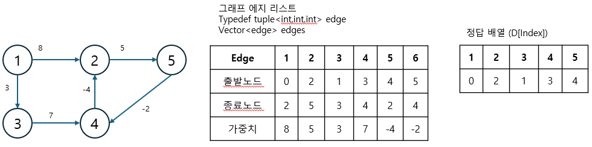

### 2. 모든 에지를 확인해 정답 배열 업데이트

최단 거리 배열에서 업데이트 반복 횟수는 노드 개수 - 1 입니다. 노드 개수가 N이고, 음수 사이클이 없을 때 특정 두 노드의 최단 거리를 구성할 수 있는 에지의 최대 개수는 N - 1이기 때문입니다. 모든 에지 E = (s,e,w)에서 다음 조건을 만족하면 업데이트를 실행합니다. 업데이트 반복 횟수가 K번이라면 해당 시점에 정답 배열의 값은 시작점에서 K개의 에지를 사용했을 때 각 노드에 대한 최단 거리입니다.

> 업데이트 조건과 방법

```
D[s] != ∞이며 D[e] > D[s] + w일 때 D[e] = D[s] + w 로 배열의 값을 업데이트 한다.
```

- 음수 사이클이 없을 때 최대 에지 개수가 나오려면 사항 트리 형태에서 양 도착 노드를 선택해야 합니다.
- 에지의 출발 노드를 s, 종료 노드를 e, 에지의 가중치를 w로 가정했습니다.

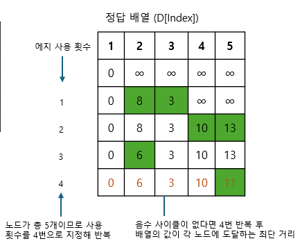

음수 사이클이 없을 때 N - 1 번 에지 사용 횟수를 반복하면 출발 노드와 모든 노드 간의 최단 거리를 알려주는 정답 배열이 완성됩니다. 이렇게 완성 후 마지막으로 이 그래프에 음수 사이클이 존재하는지 확인해야 합니다.

### 3. 음수 사이클 유무 확인하기

음수 사이클 유무를 확인하기 위해 모든 에지를 한번씩 다시 사용해 업데이트되는 노드가 발생하는지 확인합니다. 만약 업데이트되는 노드가 있다면 음수 사이클이 있다는 뜻이 되고, 2단계에서 도출한 정답 배열이 무의미하고 최단 거리를 찾을 수 없는 그래프라는 뜻이 됩니다.

음수 사이클이 존재하면 이 사이클을 무한하게 돌수록 가중치가 계속 감소하므로 최단 거리를 구할 수 없습니다.

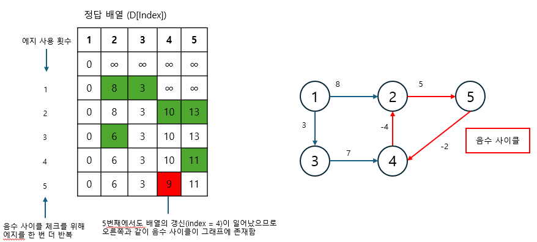

실제 알고리즘 코딩 테스트에서는 벨만-포드 알고리즘을 사용해 최단 거리를 구하는 문제보다 음수 사이클을 판별하는 문제가 더 빈번하게 출제됩니다. 따라서 마지막에 한 번 더 모든 에지를 사용해 업데이트되는 노드가 존재하는지 확인해야 합니다.

---

### $[문제062]$ 타임머신으로 빨리 가기

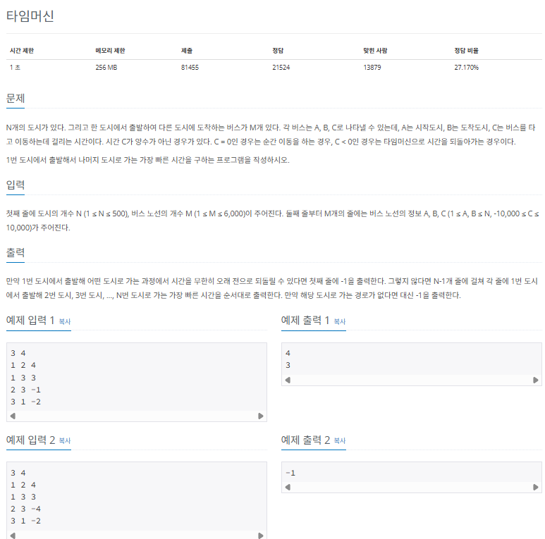

### $[01단계]$ 문제 분석하기

시작점 및 다른 노드와 관련된 최단 거리를 구하는 문제지만, 특이한 점은 에지에 해당하는 이동하는 시간이 양수가 아닌 0 또는 음수가 가능하다는 것입니다. 이렇게 시작점에서 다른 노드와 관련된 최단 거리를 구하는데, 에지가 음수가 가능할 때는 벨만-포드 알고리즘을 사용하면 됩니다.

### $[02단계]$ 손으로 풀어보기

1. 에지 리스트에 에지 데이터를 저장한 후 거리 배열을 다음과 같이 초기화 합니다.

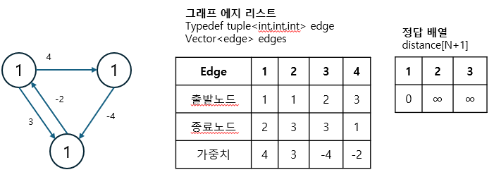

2. 다음 순서에 따라 벨만-포드 알고리즘을 수행합니다.

> 벨만-포드 알고리즘 수행 과정

1. 모든 에지와 관련된 정보를 가져온 후 다음 조건에 따라 거리 배열의 값을 업데이트한다.
   1. 출발 노드가 방문한 적이 없는 노드(출발 노드 거리 == INF)일 때 값을 업데이트하지 않는다.
   2. '출발 노드의 거리 배열값 + 에지 가중치 < 종료 노드의 거리 배열값' 일 때 종료 노드의 거리 배열값을 업데이트 한다.
2. '노드 개수 - 1'번 만큼 1을 반복한다.
3. 음수 사이클 유무를 알기 위해 모든 에지에 관해 다시 한번 1을 수행한다. 이때 한 번이라도 값이 업데이트 되면 음수 사이클이 존재한다고 판단한다.

> 실제로 수행할 때는 에지가 저장된 순서에 따라 동작하므로 거리 배열의 값이 다음과 같이 업데이트됩니다. 이론의 업데이트와는 약간 다르지만, 알고리즘에 영향을 미치진 않습니다. 실제 코드 디버그값과 이론에서의 값이 달라 혼동할 수 있으므로 이번에는 배열을 실제 코드 기준으로 업데이트 해 보겠습니다.

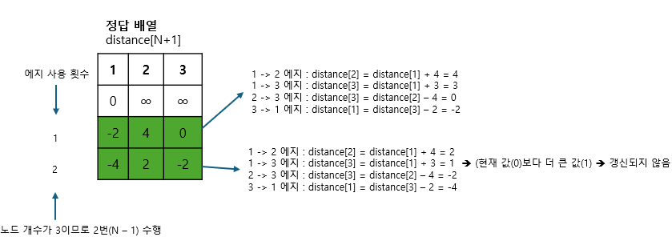

3. 음수 사이클이 존재하면 -1, 존재하지 않으면 거리 배열의 값을 출력합니다. 단, 거리 배열의 값이 INF일 경우에는 -1을 출력합니다.

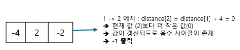

### $[03단계]$ 슈도코드 작성하기

```
edge (에지 정보 표현을 위한 tuple 변수)
edges (에지 정보 저장을 위한 에지 리스트)
mdistance (최단 거리 저장)
V (노드 개수)
E (에지 개수)
최단 거리 배열은 충분히 큰 수로 초기화

for (에지 개수) {
  에지 리스트 배열에 에지 정보 저장
}

// --- 벨만-포드 알고리즘 수행하기
거리 배열에 출발 노드 0으로 초기화

for (노드 개수 - 1만큼 반복) {
  for (에지 개수만큼 반복) {
    현재 데이터 가져오기
    if (출발 노드가 무한대가 아님 && 종료 노드값 < 출발 노드값 + 에지 가중치) {
      업데이트 수행 -> 종료 노드값 = 출발 노드값 + 에지 가중치
    }
  }
}

// 음수 사이클 존재 여부 확인
for (에지 개수만큼 반복) {
  현재 에지 데이터 가져오기
  if (출발 노드가 무한대가 아님 && 종료 노드값 < 출발 노드값 + 에지 가중치) {
    업데이트 가능 -> 음수 사이클 존재
  }
}
// --- 벨만-포드 알고리즘 종료

음수 사이클 미존재 -> 거리 배열 출력 (단, 거리 배열의 값이 무한대일 때 -1출력)
음수 사이클 존재 -> -1 출력
```

### $[04단계]$ 코드 구현하기

```c
#include <iostream>
#include <vector>
#include <limits>
#include <tuple>
using namespace std;

typedef tuple<int, int, int> edge;
static int N, M;
static vector<long> mdistance;
static vector<edge> edges;

int main(int argc, char *argv[]) {
    cin >> N >> M;
    mdistance.resize(N + 1);
    fill(mdistance.begin(), mdistance.end(), LONG_MAX); // 최단 거리 배열 초기화

    for (int i = 0; i < M; i++) {
        int start, end, time;
        cin >> start >> end >> time;
        edges.push_back(make_tuple(start, end, time));
    }

    // --- 벨만-포드 알고리즘 수행
    mdistance[1] = 0;

    // N보다 하나 적은 수만큼 반복
    for (int i = 1; i <= N - 1; i++) {
        for (int j = 0; j < M; j++) {
            edge medge = edges[j];
            int start = get<0>(medge);
            int end = get<1>(medge);
            int time = get<2>(medge);

            // 더 가까운 최단 거리가 있다면 갱신
            if (mdistance[start] != LONG_MAX && mdistance[end] > mdistance[start] + time) {
                mdistance[end] = mdistance[start] + time;
            }
        }
    }

    // 음수 사이클 존재 확인
    bool mCycle = false;
    for (int i = 0; i < M; i++) {
        edge medge = edges[i];
        int start = get<0>(medge);
        int end = get<1>(medge);
        int time = get<2>(medge);

        if (mdistance[start] != LONG_MAX && mdistance[end] > mdistance[start] + time) {
            mCycle = true;
        }
    }
    // --- 벨만-포드 알고리즘 종료

    // 음수 사이클이 없는 경우
    if (!mCycle) {
        for (int i = 2; i <= N; i++) {
            if (mdistance[i] == LONG_MAX)
                cout << -1 << "\n";
            else
                cout << mdistance[i] << "\n";
        }
    }

    // 음수 사이클이 있는 경우
    if (mCycle)
        cout << -1 << "\n";

    return 0;
}
```

---

### $[문제063]$ 세일즈맨의 고민

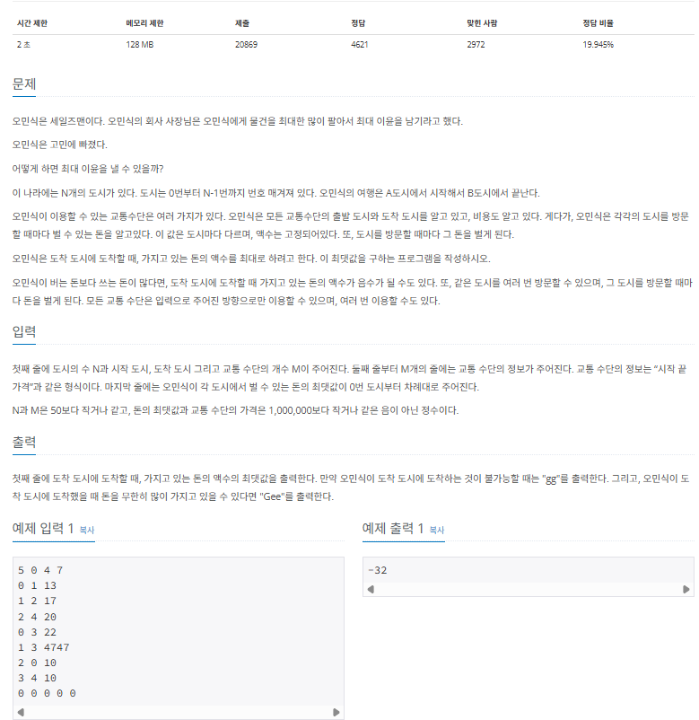

### $[01단계]$ 문제 분석하기

벨만-포드 알고리즘의 원리를 바탕으로 요구 사항에 따라 내부 로직을 바꿔야하는 문제입니다. 기존 벨만-포드는 최단거리를 구하는 알고리즘이지만, 이 문제에서는 도착 도시에 도착할 때 돈의 액수를 최대로 하고 싶기 때문에 업데이트 방식을 반대로 변경해야 합니다. 또한 돈을 무한히 많이 버는 케이스가 있다고 하는 것을 바탕으로 음수 사이클이 아닌 양수 사이클을 찾도록 변경해야 합니다. 그리고 마지막 예외 처리 1개 필요합니다. 바로 다음 그래프와 같이 양수 사이클이 있어도 출발 노드에서 이 양수 사이클을 이용해 도착 도시에 가지 못할 때 입니다.

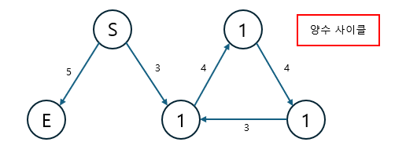

이 부분을 해결하는 방법에는 여러 가지가 있는데, 여기서는 에지의 업데이트를 N - 1번이 아닌 충분히 큰 수 (도시 개수 N의 최대치 = 50)만큼 추가로 돌리면서 업데이트를 수행하도록 로직을 변경하여 해결하겠습니다. 이렇게 변경하는 이유는 에지를 충분히 탐색하면서 양수 사이클에서 도달할 수 있는 모든 노드를 양수 사이클에 연결된 노드로 업데이트 하기 위해서 입니다.

### $[02단계]$ 손으로 풀어보기

1. 에지 리스트에 에지 데이터를 저장하고, 거리 배열값을 초기화합니다. 추가로 각 도시에서 벌 수 있는 돈의 최댓값을 배열 cityMoney에 저장합니다. 최초 시작점에 해당하는 거리 배열 값은 cityMoney[시작점] 값으로 초기화합니다.

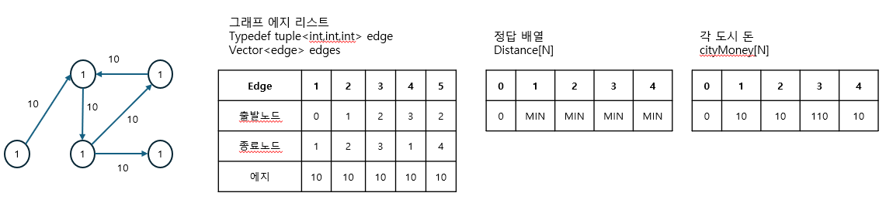

2. 다음 순서에 따라 변형된 벨만-포드 알고리즘을 수행합니다.

> 변형된 벨만-포드 알고리즘

1. 모든 에지와 관련된 정보를 가져와 다음 조건에 따라 거리 배열의 값을 업데이트한다.
   1. 시작 도시가 방문한 적이 없는 도시일 때 (시작 도시 == MIN)으로 업데이트하지 않는다.
   2. 시작 도시가 양수 사이클과 연결된 도시일 때 (도착 도시 == MAX)도착 도시도 양수 사이클과 연결된 도시로 업데이트한다.
   3. '도착 도시값 < 시작 도시값 + 도착도시 수입 - 에지 가중치'일 때 더 많이 벌 수 있는 새로운 경로로 도착한 것이므로 값을 업데이트 한다.
2. 노드보다 충분히 큰 값(N + 50)으로 1을 반복한다.

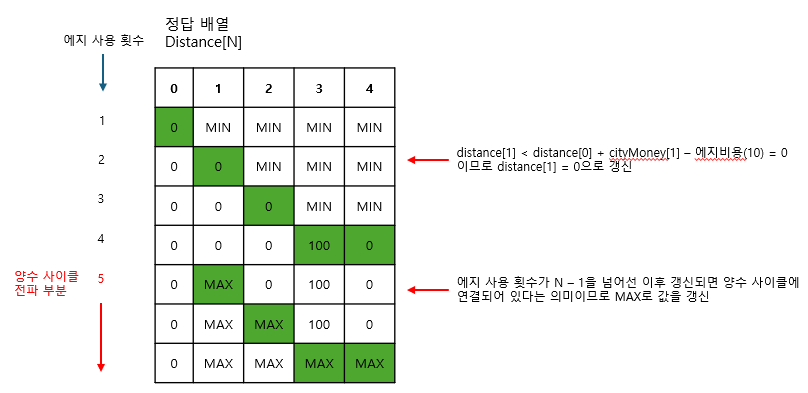

3. 도착 도시의 값에 따라 결과를 출력합니다.

> 결과 출력의 경우의 수

1. 도착 도시의 값이 MIN이고, 도착하지 못할 때 'gg'를 출력한다.
2. 도착도시의 값이 MAX이고, 무한히 많이 벌 수 있을 때 'Gee'를 출력한다.
3. 이외에는 도착 도시의 값을 출력한다.

### $[03단계]$ 슈도코드 작성하기

```
V (노드 개수), E (에지 개수)
sCity (시작도시), e (도착 도시)
Edges (에지 리스트)
cityMoney (각 도시에서 버는 수입 배열)
mdistance (거리 배열)

거리 배열은 충분히 작은 수로 초기화

for (에지 개수) {
  에지 리스트에 에지 정보를 저장
}

// 변형된 벨만-포드 알고리즘 수행하기
mdistance[sCity] = cityMoney[sCity]로 초깃값 설정

// 양수 사이클이 전파되도록 충분히 큰 수로 반복하기
for (노드 개수 + 50) {
  현재 에지 데이터 가져오기
  if (출발 노드가 방문하지 않은 노드 -> 값이 LONG_MIN) continue;

  if (출발 노드가 양수 사이클에 연결된 노드 -> 값이 LONG_MAX)
    종료 노드를 양수 사이클에 연결된 노드로 업데이트 -> 값 = LONG_MAX
  else if (종료 노드값 < 출발 노드값 + 도착 도시에서의 수입 - 에지의 가중치) {
    // 더 많은 수입을 얻는 경로가 새로 발견될 때
    종료 노드값 = 출발 노드값 + 도착 도시에서의 수입 - 에지의 가중치로 업데이트
    if (N - 1 반복 이후 업데이트) {
      이 종료 노드를 양수 사이클 연결 노드로 업데이트
    }
  }
}

// 출력
도착 도시가 LONG_MIN -> 도착 불가 -> 'gg' 출력
도착 도시가 LONG_MAX -> 돈을 무한대로 벌 수 있음 -> 'Gee' 출력
이외의 경우 도착 도시의 값 출력
```

### $[04단계]$ 코드 구현하기

```c
#include <iostream>
#include <vector>
#include <limits>
#include <tuple>
using namespace std;

typedef tuple<int, int, int> edge;
static int N, M, sCity, eCity;
static vector<long> mdistance, cityMoney;
static vector<edge> edges;

int main(int argc, char *argv[]) {
    cin >> N >> sCity >> eCity >> M;
    mdistance.resize(N);
    cityMoney.resize(N);
    fill(mdistance.begin(), mdistance.end(), LONG_MIN); // 최단 거리 배열 초기화

    // 에지 리스트에 데이터 저장
    for (int i = 0; i < M; i++) {
        int start, end, price;
        cin >> start >> end >> price;
        edges.push_back(make_tuple(start, end, price));
    }
    for (int i = 0; i < N; i++) {
        cin >> cityMoney[i];
    }

    // --- 변형된 벨만-포드 알고리즘 수행
    mdistance[sCity] = cityMoney[sCity];

    // 양수 사이클이 전파되도록 충분히 큰 수로 반복하기
    for (int i = 0; i <= N + 50; i++) {
        for (int j = 0; j < M; j++) {
            int start = get<0>(edges[j]);
            int end = get<1>(edges[j]);
            int price = get<2>(edges[j]);

            // 시작노드가 미방문 노드이면 continue;
            if (mdistance[start] == LONG_MIN) continue;

                // 시작 노드가 양수 사이클에 연결된 노드라면 종료 노드도 연결 노드로 갱신
            else if (mdistance[start] == LONG_MAX)
                mdistance[end] = LONG_MAX;

                // 더 많은 돈을 벌 수 있는 새로운 경로를 발견하면 새로운 경로값으로 갱신
            else if (mdistance[end] < mdistance[start] + cityMoney[end] - price) {
                mdistance[end] = mdistance[start] + cityMoney[end] - price;
                // N - 1 반복 이후 갱신되는 종료 노드는 양수 사이클 연결 노드로 변경
                if (i >= N - 1) {
                    mdistance[end] = LONG_MAX;
                }
            }
        }
    }
    // --- 변형된 벨만-포드 알고리즘 종료

    if (mdistance[eCity] == LONG_MIN)
        cout << "gg" << "\n";
    else if (mdistance[eCity] == LONG_MAX)
        cout << "Gee" << "\n";
    else
        cout << mdistance[eCity] << "\n";
    return 0;
}
```
