## 시간 복잡도 활용하기

플로이드-워셜 (floyd-warshall) 알고리즘은 최단 거리를 구하는 알고리즘으로, 주요 특징은 다음과 같습니다.

|             기능              |                                               특징                                               | 시간 복잡도(노드 수:V, 에지 수 :E) |
| :---------------------------: | :----------------------------------------------------------------------------------------------: | :--------------------------------: |
| 모든 노드 간에 최단 경로 탐색 | 1. 음수 가중치 에지가 있어도 수행할 수 있음 <br/> 2. 동적 계획법의 원리를 이용해 알고리즘에 접근 |              $O(V^3)$              |

### 플로이드-워셜의 핵심 이론

플로이드-워셜 알고리즘을 도출하는 가장 핵심적인 원리는 A노드에서 B노드까지 최단 경로를 구했다고 가정했을 때 최단 경로 위에 K 노드가 존재한다면 그것을 이루는 부분 경로 역시 최단 경로라는 것입니다. 다음 그림으로 이해해 볼까요?

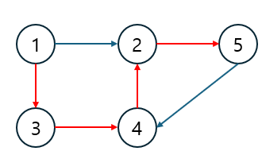

색칠된 에지 경로가 1->5 최단 경로라면 1->4 최단 경로와 4->5 최단 경로 역시 색칠된 에지로 이뤄질 수 밖에 없습니다. 즉, 전체 경로의 최단 경로는 부분 경로의 최단 경로의 조합으로 이뤄진다는 의미가 됩니다. 이 원리로 다음과 같은 점화식을 도출할 수 있습니다.

> 플로이드-워셜 점화식

```
D[S][E] = min(D[S][E], D[S][K] + D[K][E])
```

이 내용을 익혔다면 이제 플로이드-워셜 알고리즘 구현 방법을 자세히 알아보겠습니다.

### 1. 배열을 선언하고 초기화 하기

D[S][E]는 노드 S에서 노드 E까지의 최단 거리를 저장하는 배열이 정의합니다. S와 E의 값이 같은 칸은 0, 다른 칸은 ∞로 초기화 합니다. 여기에서 S == E는 자기 자신에게 가는 데 거리리는 최단 경로 값을 의미하기 때문입니다.

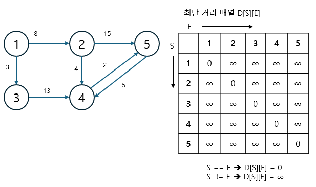

### 2. 최단 거리 배열에 그래프 데이터 저장하기

출발 노드는 S, 도착 노드는 E, 에지의 가중치는 W라고 했을 때 D[S][E] = W로 에지의 정보를 배열에 입력합니다. 이로써 플로이드-워셜 알고리즘은 그래프를 인접 행렬로 표현한다는 것을 할 수 있습니다.

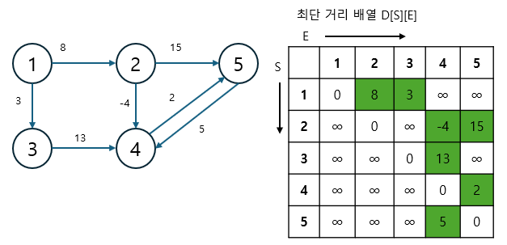

### 3. 점화식으로 배열 업데이트하기

기존에 구했던 점화식을 3중 for문의 형태로 반복하면서 배열의 값을 업데이트합니다.

> 플로이드-워셜 알고리즘 로직

```
N : 노드 개수

for 경유지 K에 관해 (1 ~ N)
  for 출발 노드 S에 관해 (1 ~ N)
    for 도착 노드 E에 관해 (1 ~ N)
      D[S][E] = min(D[S][E], D[S][K] + D[K][E])
```

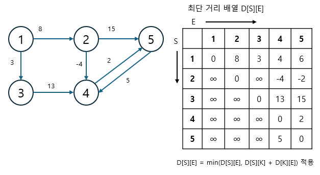

완성된 배열은 모든 노드간의 최단 거리를 알려줍니다. 예를 들어 1번 노드에서 5번 노드까지 가는 최단 거리는 D[1][5] = 6으로 나타낸 다는 것을 알 수 있습니다.

플로이드-워셜 알고리즘은 모든 노드 간의 최단 거리를 확인해 주기 때문에 시간복잡도가 $O(V^3)$으로 빠르지 않은 편입니다. 이에 따라 플로이드-워셜 알고리즘을 사용해야 하는 문제가 나오면 일반적으로 노드 개수의 범위가 다른 그래프에 비해 적게 나타나는 것을 알 수 있습니다.

---

### $[문제064]$ 가장 빠른 버스 노선 구하기

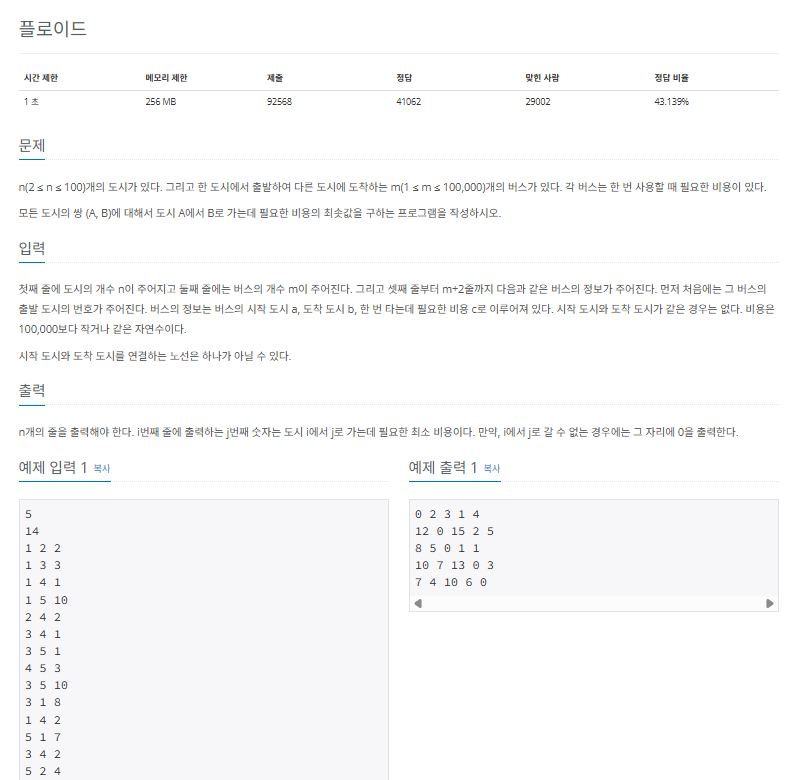

### $[01단계]$ 문제 분석하기

모든 도시의 쌍과 관련된 최솟값을 찾아야 하는 문제입니다. 그래프에서 시작점을 지정하지 않고, 모든 노드와 관련된 최소 경로를 구하는 알고리즘이 바로 플로이드-워셜 알고리즘입니다. 도시의 최대 개수가 100개로 매우 작은 편이므로 $O(V^3)$ 시간 복잡도의 플로이드-워셜 알고리즘을 사용할 수 있습니다.

### $[02단계]$ 손으로 풀어보기

1. 버스 비용 정보를 인접 행렬에 저장하겠습니다. 먼저 인접 행렬을 초기화합니다. 연결 도시가 같으면 (i == j) 0, 아니면 충분히 큰 수로 값을 초기화하면 됩니다. 그리고 주어진 버스 비용 데이터를 인접 행렬에 저장합니다.

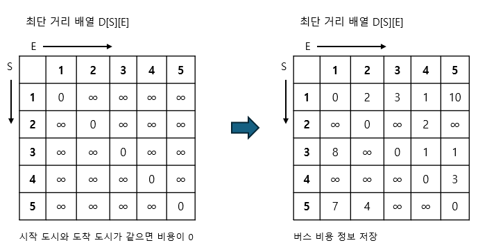

2. 플로이드-워셜 알고리즘을 수행합니다. 다음 점화식을 활용한 3중 for문으로 모든 중간 경로를 탐색합니다.

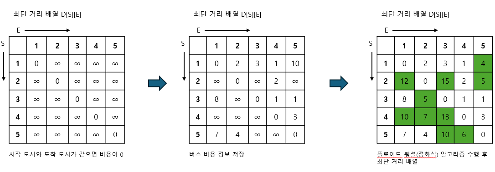

```
min(distance[S][E], distance[S][K] + distance[K][E])
```

3. 알고리즘으로 변경된 인접 행렬을 출력합니다. 인접 행렬 자체가 모든 쌍의 최단 경로를 나타내는 정답 배열입니다. 정답 배열을 그대로 출력하되, 문제의 요구 사항에 따라 도착 도시에 도달하지 못할 때(∞
   )는 0, 아닐 때는 배열의 값을 출력합니다.

### $[03단계]$ 슈도코드 작성하기

```
N (도시 개수), M (노선 개수)
mdistance (노선 데이터를 저장하는 인접 행렬)

// 인접 행렬 초기화
for (i -> N 만큼 반복) {
  for (j -> N 만큼 반복) {
    시작 도시와 종료 도시가 같으면 0, 아니면 충분히 큰 수로 저장하기
  }
}

// 인접 행렬 노선 정보 저장
for (M만큼 반복)
  노선 데이터를 distance 행렬에 저장

// 점화식 알고리즘 수행
for (k -> N 만큼 반복)
  for (i -> N 만큼 반복)
    for (j -> N 만큼 반복)
      distance[i][j] = MIN(distance[i][j], distance[i][k] + distance[k][j])

// 출력
정답 배열 출력하기
-> 만약 정답 배열의 값이 최초 초기화한 충분한 큰 수일 때는 도착할 수 없는 경로로 0을 출력
-> 아니라면 배열의 값을 출력
```

### $[04단계]$ 코드 구현하기

```c
#include <iostream>
using namespace std;

static int N, M;
static long mdistance[101][101];

int main(int argc, char *argv[]) {
    cin >> N >> M;

    // 인접 행렬 초기화
    for (int i = 1; i <= N; i++)
        for (int j = 1; j <= N; j++)
            mdistance[i][j] = i == j ? 0 : 10000001;

    // 노선 정보 저장
    for (int i = 0; i < M; i++) {
        int s, e, v;
        cin >> s >> e >> v;
        if (mdistance[s][e] > v)
            mdistance[s][e] = v;
    }

    // 점화식 알고리즘 수행
    for (int k = 1; k <= N; k++)
        for (int i = 1; i <= N; i++)
            for (int j = 1; j <= N; j++) {
                if (mdistance[i][j] > mdistance[i][k] + mdistance[k][j])
                    mdistance[i][j] = mdistance[i][k] + mdistance[k][j];
            }

    // 출력
    for (int i = 1; i <= N; i++) {
        for (int j = 1; j <= N; j++) {
            if (mdistance[i][j] == 10000001)
                cout << "0 ";
            else
                cout << mdistance[i][j] << " ";
        }
        cout << "\n";
    }

    return 0;
}
```

### $[문제065]$ 경로 찾기

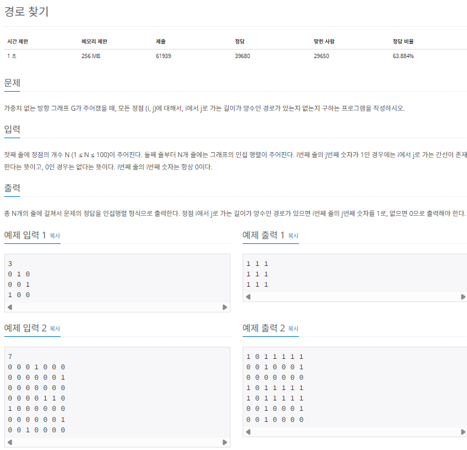

### $[01단계]$ 문제 분석하기

플로이드-워셜 알고리즘을 이해하고 있고, 문제의 요구사항에 따라 적절하게 수정할 수 있는지를 묻는 문제입니다. 모든 노드 쌍에 관해 경로가 있는지를 확인하는 방법은 플로이드-워셜 알고리즘을 수행해 결과 배열 배열을 그대로 출력하면 됩니다. 단, 최단 거리를 구하는 문제가 아니기 때문에 기존 플로이드 워셜 알고리즘에서 최단 거리를 업데이트하는 부분만 조금 수정해 줄 필요하 잇습니다.

### $[02단계]$ 손으로 풀어보기

1. 입력 데이터를 인접 행렬에 저장합니다.

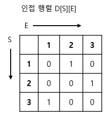

2. 변경된 플로이드-워셜 알고리즘을 수행합니다. S와 E가 모든 중간 경로(K) 중 1개라도 연결돼어 있다면 S와 E는 연결 노드로 저장합니다.

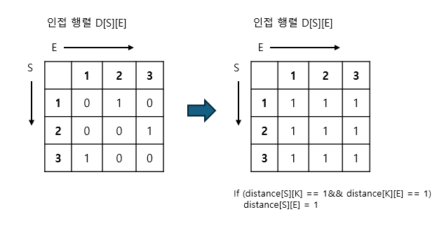

3. 알고리즘으로 변경된 인접 행렬을 출력합니다.

### $[03단계]$ 슈도코드 작성하기

```
N (인접 행렬의 크기)
mdistance (노선 데이터를 저장하는 인접 행렬)

for (i -> N 만큼 반복)
  for (j -> N 만큼 반복)
    인접 행렬 데이터를 distance 행렬에 그대로 저장하기

for (k -> N만큼 반복)
  for (i -> N만큼 반복)
    for (j -> N만큼 반복) {
      // K를 거치는 모든 경로 중 하나라도 연결된 경로가 있다면
      // i 와 j는 연결 노드로 취급
      if (distance[S][K] == 1&& distance[K][E] == 1)
        distance[S][E] = 1
    }

distance 배열 출력
```

### $[04단계]$ 코드 구현하기

```c
#include <complex.h>
#include <iostream>
using namespace std;

static int N;
static long mdistance[101][101];

int main(int argc, char *argv[]) {
    cin >> N;

    // 인접 행렬 초기화
    for (int i = 0; i < N; i++)
        for (int j = 0; j < N; j++) {
            cin >> mdistance[i][j];
        }

    // 플로이드 워셜 알고리즘 수행
    for (int k = 0; k < N; k++)
        for (int i = 0; i < N; i++)
            for (int j = 0; j < N; j++) {
                if (mdistance[i][k] == 1 && mdistance[k][j] == 1)
                    mdistance[i][j] = 1;
            }

    // 출력
    for (int i = 0; i < N; i++) {
        for (int j = 0; j < N; j++)
            cout << mdistance[i][j] << " ";
        cout << "\n";
    }

    return 0;
}
```

### $[문제066]$ 케빈 베이컨의 6단계 법칙

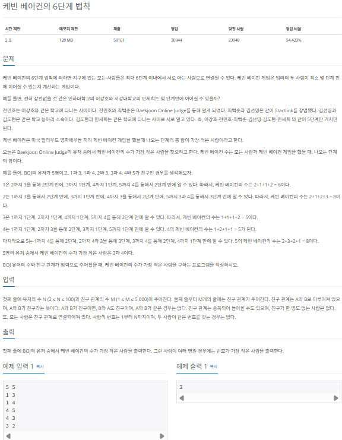

### $[01단계]$ 문제 분석하기

BFS 탐색 알고리즘을 이용해도 해결할 수 있는 문제입니다. 하지만 유저의 최대 수가 100정도로 작기 때문에 플로이드-워셜 알고리즘으로도 해결할 수 있습니다. 이를 위해서는 몇가지 아이디어가 필요합니다. 1번째로 사람들이 직접적인 친구 관계를 맺은 상태를 비용 1로 계산하는 것입니다. 즉, 가중치를 1로 정한 후 인접 행렬에 저장한다는 의미입니다. 또한 플로이드-워셜은 모든 쌍과 관련된 최단 경로이므로 한 row값은 해당 row의 index값이 가리키는 다른 모든 노드와 관련된 최단 경로를 나타낸다고 볼 수 있습니다. 즉, i번째 row의 합이 i번째 사람의 케빈 베이컨의 수가 된다는 뜻입니다.

### $[02단계]$ 손으로 풀어보기

1. 먼저 입력 행렬을 생성한 후, 자기 자신이면 (i == j) 0, 아니면 충분히 큰 수로 인접 행렬의 값을 초기화합니다. 그리고 주어진 친구 관계 정보를 인접 행렬에 저장합니다. i와 j가 친구라면 distance[i][j] = 1, distance[j][i] = 1로 값을 업데이트 하면 됩니다.
2. 다음 점화식을 이용해 플로이드-워셜 알고리즘을 수행하여 3중 for문으로 모든 중간 경로를 탐색합니다.
3. 각 S 행의 합이 케빈 베이컨의 수이며 케빈 베이컨의 수를 비교해 가장 작은 수가 나온 행 번호를 정답으로 출력합니다.

### $[03단계]$ 코드 구현하기

```c
#include <iostream>
#include <limits>
using namespace std;

static int N, M;
static long mdistance[101][101];

int main(int argc, char *argv[]) {
    cin >> N >> M;

    // 인접 행렬 초기화
    for (int i = 1; i <= N; i++)
        for (int j = 1; j <= N; j++) {
            mdistance[i][j] = i == j ? 0 : 10000001;
        }

    // 친구 데이터 저장
    for (int i = 0; i < M; i++) {
        int s,e;
        cin >> s >> e;
        mdistance[s][e] = 1;
        mdistance[e][s] = 1;
    }

    // 플로이드 워셜 알고리즘 수행
    for (int k = 1; k <= N; k++)
    for (int i = 1; i <= N; i++)
    for (int j = 1; j <= N; j++) {
        if (mdistance[i][j] > mdistance[i][k] + mdistance[k][j])
            mdistance[i][j] = mdistance[i][k] + mdistance[k][j];
    }

    int Min = INT_MAX;
    int Answer = -1;

    for (int i = 1; i <= N; i++) {
        int tmp = 0;
        for (int j = 1; j <= N; j++) {
            tmp = tmp + mdistance[i][j];
        }
        // 가장 작은 케빈 베이컨의 수를 지닌 i 찾기
        if (Min > tmp) {
            Min = tmp;
            Answer = i;
        }
    }

    cout << Answer;
    return 0;
}
```
