## 최소 신장 트리

최소 신장 트리 (minimum spanning tree)란 그래프에서 모든 노드를 연결할 때 사용된 에지들의 가중치의 합을 최소로 하는 트리입니다. 주요 특징은 다음과 같습니다.

> 최소 신장 트리의 특징

- 사이클이 포함되면 가중치의 합이 최소가 될 수 없으므로 사이클을 포함하지 않는다.
- N개의 노드가 있으면 최소 신장 트리를 구성하는 에지의 개수는 항상 N - 1개 이다.

### 최소 신장 트리의 핵심 이론

#### 1. 에지 리스트로 그래프를 구현하고 유니온 파인드 배열 초기화하기

최소 신장 트리는 데이터를 노드가 아닌 에지 중심으로 저장하므로 인접 리스트가 아닌 에지 리스트 형태로 저장합니다. 이 리스트는 노드 변수 2개와 가중치 변수로 구성됩니다. 사이클 처리를 위한 유니온 파인드 배열도 함께 초기화합니다. 배열의 인덱스로 해당 자리의 값을 초기화하면 됩니다.

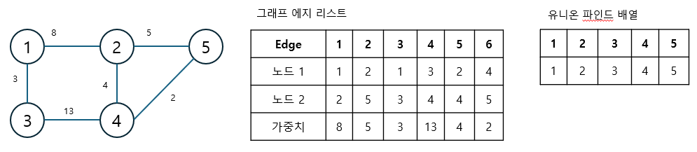

#### 2. 그래프 데이터를 가중치 기준으로 정렬하기

에지 리스트에 담긴 그래프 데이터를 가중치 기준으로 오름차순 정렬합니다.

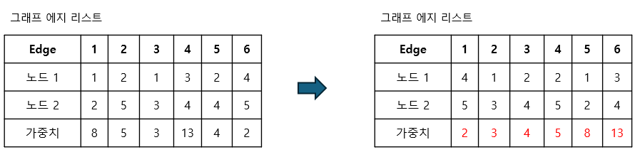

> 에지 리스트의 1개 객체를 구조체 (struct)로 표현하면 operator() 함수를 사용해 높은 자유도로 정렬을 수행할 ㅅ ㅜ있습니다.

#### 3. 가중치가 낮은 에지부터 연결 시도하기

가중치가 낮은 에지부터 순서대로 선택해 연결을 시도합니다. 이때 바로 연결하지 않고 이 에지를 연결했을 때 그래프에 사이클 형성 여부를 find 연산을 이용해 확인한 후 사이클이 형성 되지 않을 때만 union 연산을 이용해 두 노드를 연결합니다.

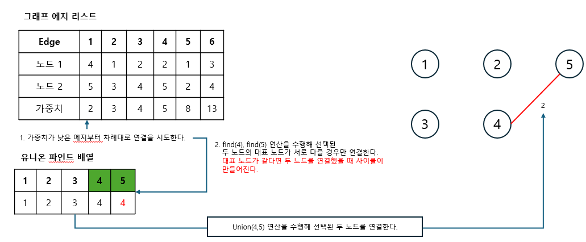

#### 4. 과정 3 반복하기

전체 노드의 개수가 N개이면 연결한 에지의 개수가 N - 1이 될 때 까지 과정 3을 반복합니다.

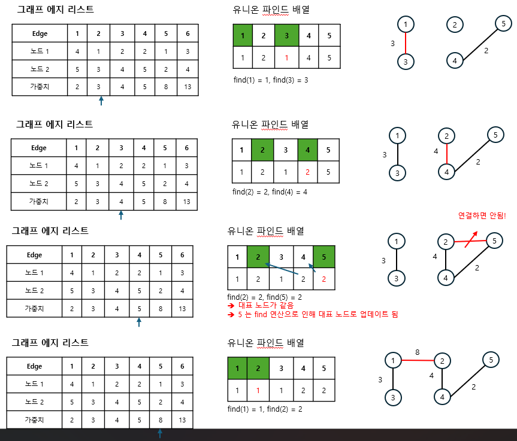

#### 5. 총 에지 비용 출력하기

에지의 개수가 N - 1이 되면 알고리즘을 종료하고 완성된 최소 신장 트리의 총 에지 비용을 출력합니다.

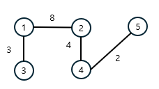

```
총 에지 비용
= 2 + 3 + 4 + 8
= 17
💕총 17 출력
```

최소 싱장 트리는 다른 그래프 알고리즘과는 달리, 에지 리스트 형태를 이용해 데이터를 담는다는 특징이 있습니다. 그 이유는 에지를 기준으로 하는 알고리즘이기 때문입니다. 또한 사이클이 존재하면 안되는 특징을 지니고 있기 때문에 사이클 판별 알고리즘인 유니온 파인드 알고리즘을 내부에 구현해야 합니다.

---

### $[문제067]$ 최소 신장 트리 구하기

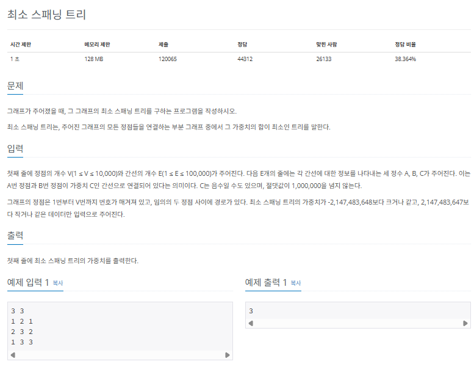

### $[01단계]$ 문제 분석하기

최소 신장 트리를 구하는 가장 기본적인 문제입니다. 문제의 내용 자체가 최소 신장 트리에 관해 설명하고 있기 때문에 앞에서 배운 핵심 이론을 이용하면 이 문제를 해결할 수 있습니다.

### $[02단계]$ 손으로 풀어보기

1. 에지 리스트에 에지 정보를 저장한 후 부모 노드 데이터를 초기화합니다. 최소 신장 트리는 에지 중심의 알고리즘이므로 데이터를 에지 리스트를 활용해 저장해야 합니다.

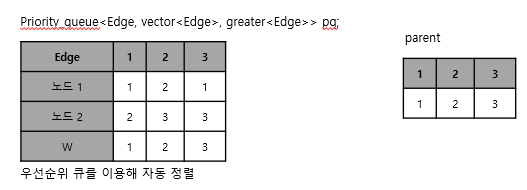

2. 크루스칼 알고리즘을 수행합니다. 현재 미사용 에지 중 가중치가 가장 작은 에지를 선택하고, 이 에지를 연결했을 때 사이클의 발생 여부를 판단합니다. 사이클이 발생함녀 생략하고, 발생하지 않으면 에지값을 더합니다.

> 프림 알고리즘으로도 가능합니다.

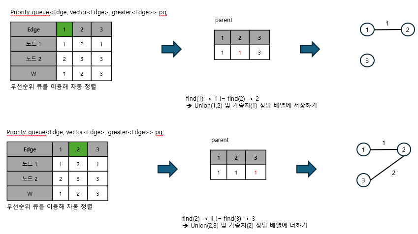

3. 과정 2에서 에지를 더한 횟수가 'V(노드 개수) - 1'이 될 때까지 반복하고, 반복이 끝나면 에지의 가중치를 모두 더한 값을 출력합니다.

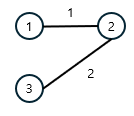

```
V(노드 개수) - 1 = 3 - 1 = 2
=> 에지를 2개 추가했으므로 알고리즘 종료
=> 에지의 가중치 합 출력
=> 3
```

### $[03단계]$ 슈도코드 작성하기

```
N (노드 수), M(에지 수)
parent (대표 노드 저장 배열)
Edge   (에지 정보 저장 struct) // 가중치 기준 오름차순 정렬으로 설정 -> 연산자 오버로딩
pq     (에지 정보를 저장할 우선순위 큐) // 저장 데이터 type 를 struct Edge 로 설정

for (N 만큼 반복)
  parent 배열 초기화 // 자기 자신의 index 값으로 초기화
for (M 만큼 반복)
  queue에 에지 정보 저장

while (사용한 에지 수가 노드 -1이 될 때까지) {
  queue 에서 에지 정보 가져오기
  // 연결해도 사이클이 생기지 않으면
  if (에지 시작점과 끝점의 부모 노드가 다르면) {
    union 연산 수행
    에지의 가중치를 정답 변수에 더하기
    사용 에지 수 1 증가
  }
}

정답 변수 출력

---

// union 연산
union (a,b) {
  a와 b의 대표 노드 찾기
  두 원소의 대표 노드끼리 연결하기
}

// find 연산
find (a) {
  a가 대표 노드면 반환
  아니면 a의 대표 노드 값을 find(parent[a]) 값으로 저장 -> 재귀함수
}
```

### $[04단계]$ 코드 구현하기

```c
#include <iostream>
#include <queue>
using namespace std;

void munion(int a, int b);

int find(int a);

static vector<int> parent;

// 에지 정보 구조체 생성, 가중치 값 기준 오름차순 정렬로 설정
typedef struct Edge {
    int s, e, v;

    bool operator >(const Edge &temp) const {
        return v > temp.v;
    }
} Edge;

int main(int argc, char *argv[]) {
    int N, M;
    cin >> N >> M;
    priority_queue<Edge, vector<Edge>, greater<Edge> > pq; // 오름차순 정렬
    parent.resize(N + 1);

    // parent 배열 초기화
    for (int i = 0; i <= N; i++) {
        parent[i] = i;
    }
    // queue에 에지 정보 저장
    for (int i = 0; i < M; i++) {
        int s, e, v;
        cin >> s >> e >> v;
        pq.push(Edge{s, e, v});
    }

    // --- 최소 신장 트리 알고리즘 실행
    int useEdge = 0;
    int result = 0;

    while (useEdge < N - 1) {
        Edge now = pq.top();
        pq.pop();

        // 같은 부모가 아니라면 -> 연결해도 사이클이 생기지 않는다면
        if (find(now.s) != find(now.e)) {
            munion(now.s, now.e);
            result = result + now.v;
            useEdge++;
        }
    }
    // --- 최소 신장 트리 알고리즘 종료

    cout << result;
    return 0;
}

// union 연산
void munion(int a, int b) {
    a = find(a);
    b = find(b);
    if (a != b)
        parent[b] = a;
}

// find 연산
int find(int a) {
    if (a == parent[a])
        return a;
    else
        return parent[a] = find(parent[a]);
}
```

---

### $[문제068]$ 다리 만들기

> 너무 길어서 링크로 대체

https://www.acmicpc.net/problem/17472

### $[01단계]$ 문제 분석하기

문제 조건에서 데이터의 크기는 매우 작은 편이라 시간 복잡도 제약은 크지 ㅇ낳습니다. 단 몇개의 단계로 나눠 생각해야 할 문제입니다. 먼저 주어진 지도에서 섬으로 표현된 값을 각각의 섬마다 다르게 표현해야 합니다. 그 이후 각 섬의 모든 위치에서 다른 섬으로 연결할 수 있는 에지가 있는지 확인해 에지 리스트를 만듭니다. 이후에는 최소 신장 트리를 적용하면 문제를 해결할 수 있습니다.

### $[02단계]$ 손으로 풀어보기

1. 지도의 정보를 2차원 배열에 저장하고 섬으로 표시된 모든 점에서 BFS를 실행해 섬을 구분합니다. (상하좌우 네방향으로 탐색). 방문한 적이 없고 바다가 아닐때 같은 섬으로 인식합니다.

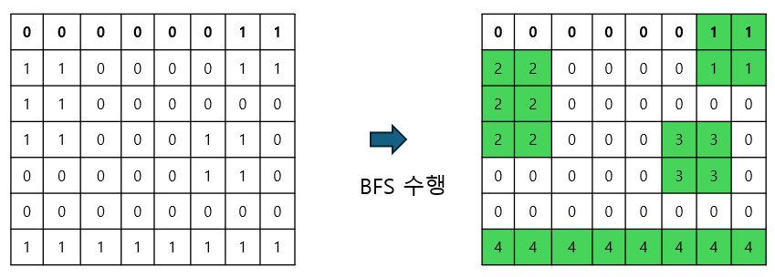

2. 모든 섬에서 상화좌우로 다르를 지어 다른 섬으로 연결할 수 있는지 확인합니다. 연결할 곳이 현재 섬이면 담색 중단 바다라면 담색을 계속 수행합니다. 다른섬을 만났을 때 다리의 길이가 2 이상이면 이 다리를 에지 리스트에 추가합니다.

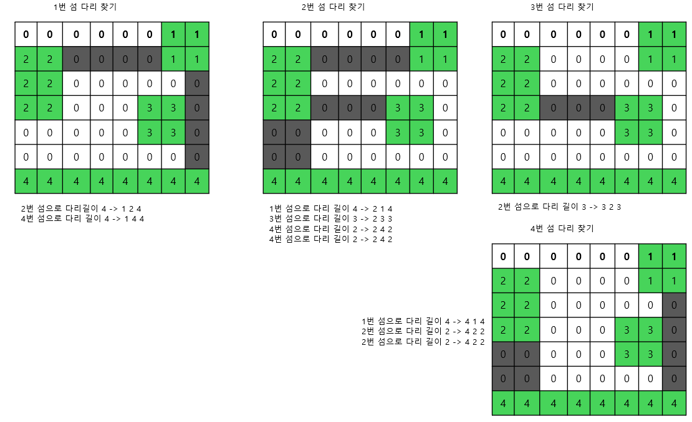

3. 전 단계에서 수집한 모든 에지를 오름차순 정렬해 최소 신장 트리 알고리즘을 수행합니다. 알고리즘이 끝나면 사용한 에지의 합을 출력합니다.

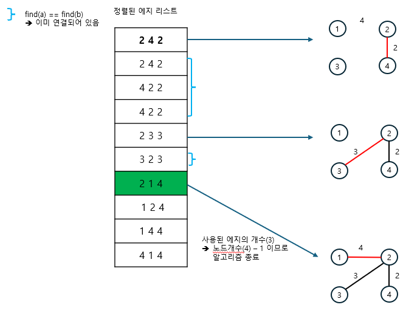

### $[03단계]$ 슈도코드 작성하기

```
dr, dc (4방향 탐색을 위한 상수)
N, M (행렬의 크기)
map (맵 정보 저장 배열)
parent (대표 노드 저장 배열)
visited (BFS 시 방문 여부 저장 배열)

sumlist (모든 섬 정보 저장)
mlist (하나의 섬 정보 저장)
Edge (에지 정보 저장 구조체)        // 가중치 값 기준 오름차순 정렬로 설정
pq (다리 정보를 저장할 우선순위 큐) // 저장 데이터 유형을 구조체 Edge로 설정

// MAP 정보 저장
for (N 만큼 반복)
  for (M 만큼 반복)
    입력 데이터를 map 변수에 저장

// 섬 분리 작업 실행
for (i -> N 만큼 반복)
  for (j -> N 만큼 반복) {
    BFS(i,j) 모든 위치에서 BFS를 실행하여 섬을 분리
    결과를 sumlist 변수에 넣기
  }

// 모든 섬에서 지을 수 있는 다리를 찾고 저장하기
for (i -> sumlist 크기 만큼 반복) {
  now = sumlist에서 섬 정보 추출
  for (j -> now 크기만큼 반복) {
    하나의 섬의 모든 위치에서 만들 수 있는 다리 정보 저장 // 4방향 탐색
    -> 큐에 에지 정보 저장
  }
}

for (섬의 수만큼 반복) {
  parent 배열 초기화 // 자기 자신의 index 값으로 초기화
}

// 최소 신장 트리 알고리즘 수행
while (큐가 빌 때까지) {
  queue 에서 에지 정보 가져오기
  // 연결해도 사이클이 생기지 않으면
  if (에지 시작점과 끝점의 부모 노드가 다르면) {
    union 연산 수행
    에지의 가중치를 정답 변수에 더하기
    사용 에지 수 증가시키기
  }
}

사용한 에지가 섬의 수 -1만큼이면 가중치의 합을 결과로 출력 아니면 -1 출력

---

// union 함수
union (a,b) {
  a와 b의 대표 노드 찾기
  두 원소의 대표 노드끼리 연결하여 주기
}

// find 함수
find (a) {
  a 가 대표 노드면 반환
  아니면 a의 대표 노드 값을 find(parent[a]) 값으로 저장 -> 재귀함수
}

// BFS 함수
BFS (i,j) {
  i,j 위치에서 4방향을 탐색하여 하나의 섬의 영역 저장하기
}
```

### $[04단계]$ 코드 구현하기

```c
#include <iostream>
#include <queue>
using namespace std;

void munion(int a, int b);

int find(int a);

void BFS(int i, int j);

static int dr[] = {-1, 0, 1, 0};
static int dc[] = {0, 1, 0, -1};
static int map[101][101];
static bool visited[101][101] = {false,};
static vector<int> parent;
static int N, M, sNum;
static vector<vector<pair<int, int> > > sumlist;
static vector<pair<int, int> > mlist;

// 에지 정보 구조체 생성, 가중치 값 기준 오름차순 정렬로 설정

typedef struct Edge {
    int s, e, v;

    bool operator >(const Edge &temp) const {
        return v > temp.v;
    }
} Edge;

static priority_queue<Edge, vector<Edge>, greater<Edge> > pq; // 오름차순 정렬

int main(int argc, char *argv[]) {
    cin >> N >> M;

    for (int i = 0; i < N; i++)
        for (int j = 0; j < M; j++) {
            cin >> map[i][j];
        }

    sNum = 1;

    // 각 자리에서 BFS 탐색을 이용하여 섬을 분리
    for (int i = 0; i < N; i++)
        for (int j = 0; j < M; j++) {
            if (map[i][j] != 0 && visited[i][j] != true) {
                BFS(i, j);
                sNum++;
                sumlist.push_back(mlist);
            }
        }

    // 섬의 각 지점에서 만들 수 있는 모든 에지를 저장
    for (int i = 0; i < sumlist.size(); i++) {
        vector<pair<int, int> > now = sumlist[i];

        for (int j = 0; j < now.size(); j++) {
            int r = now[j].first;
            int c = now[j].second;
            int now_S = map[r][c];

            for (int d = 0; d < 4; d++) {
                int tempR = dr[d];
                int tempC = dc[d];
                int blength = 0;

                while (r + tempR >= 0 && r + tempR < N && c + tempC >= 0 && c + tempC < M) {
                    // 같은 섬이면 에지를 만들 수 없음
                    if (map[r + tempR][c + tempC] == now_S) {
                        break;
                    }
                    // 같은 섬이 아니고 바다가 아니면
                    else if (map[r + tempR][c + tempC] != 0) {
                        // 다른 섬 -> 길이가 1 초과일 때 에지로 더하기
                        if (blength > 1) {
                            pq.push(Edge{now_S, map[r + tempR][c + tempC], blength});
                        }
                        break;
                    }
                    // 바다이면 다리 길이 연장하기
                    else {
                        blength++;
                    }
                    if (tempR < 0)
                        tempR--;
                    else if (tempR > 0)
                        tempR++;
                    else if (tempC < 0)
                        tempC--;
                    else if (tempC > 0)
                        tempC++;
                }
            }
        }
    }

    // --- 최소 신장 트리 실행
    parent.resize(sNum);
    for (int i = 0; i < parent.size(); i++)
        parent[i] = i;

    int useEdge = 0;
    int result = 0;

    while (!pq.empty()) {
        Edge now = pq.top();
        pq.pop();
        // 같은 부모가 아니라면 == 연결가능
        if (find(now.s) != find(now.e)) {
            munion(now.s, now.e);
            result = result + now.v;
            useEdge++;
        }
    }
    // --- 최소 신장 트리 종료

    // 배열에서 쉽게 index를 처리하고자 sNum을 1부터 시작하였으므로
    // 현재 sNum의 값이 섬의 개수보다 1 많은 상태임
    // 그러므로 1 작은 수가 아닌 2 작은 수와 사용 에지를 비교함
    if (useEdge == sNum - 2)
        cout << result << "\n";
    else
        cout << -1 << "\n";

    return 0;
}

void munion(int a, int b) {
    a = find(a);
    b = find(b);
    if (a != b)
        parent[b] = a;
}

int find(int a) {
    if (a == parent[a])
        return a;
    else
        return parent[a] = find(parent[a]);
}

void BFS(int i, int j) {
    queue<pair<int, int> > myqueue;
    mlist.clear();
    myqueue.push(make_pair(i, j));
    mlist.push_back(make_pair(i, j));
    visited[i][j] = true;
    map[i][j] = sNum;

    while (!myqueue.empty()) {
        int r = myqueue.front().first;
        int c = myqueue.front().second;
        myqueue.pop();

        // 4방향 검색
        for (int d = 0; d < 4; d++) {
            int tempR = dr[d];
            int tempC = dc[d];
            while (r + tempR >= 0 && r + tempR < N && c + tempC >= 0 && c + tempC < M) {
                if (visited[r + tempR][c + tempC] == false && map[r + tempR][c + tempC] != 0) {
                    int now_i = r + tempR;
                    int now_j = c + tempC;
                    map[now_i][now_j] = sNum;
                    visited[now_i][now_j] = true;
                    mlist.push_back(make_pair(now_i, now_j));
                    myqueue.push(make_pair(now_i, now_j));
                } else {
                    break;
                }
                // 탐색 방향에 섬이 이어져 있으면 계속 탐색
                if (tempR < 0)
                    tempR--;
                else if (tempR > 0)
                    tempR++;
                else if (tempC < 0)
                    tempC--;
                else if (tempC > 0)
                    tempC++;
            }
        }
    }
}
```
